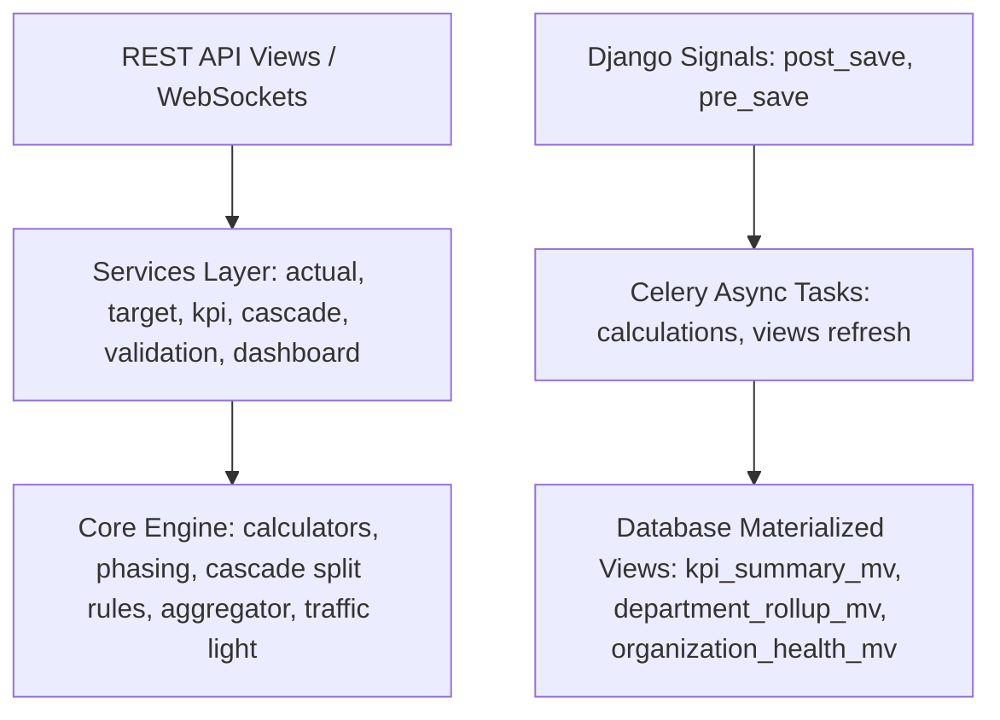

# Falcon KPI Module: Deep-Dive Backend Architecture & Technical Findings

This document outlines the detailed architecture, data flows, core components, and implementation findings of the **KPI Module** in the Falcon backend app. 

---

## 1. Architectural Overview & Data Flow

The KPI module is structured around a **reactive, event-driven, multi-tenant** architecture. It implements a clear separation of concerns across multiple layers:



### Key Data Flows
1. **Target Setup & Phasing**: Target values are defined annually (`AnnualTarget`). If a user splits this target monthly, the `PhasingEngine` executes distribution strategies (Equal Split, Seasonal, or Custom Patterns) to produce `MonthlyPhasing` entries. 
2. **Actual Entry & Validation**: Employees submit their monthly actuals (`MonthlyActual`). When submitted, the status shifts to `PENDING`, triggering a validation flow. Supervisors approve/reject submissions (`ValidationRecord`). Alternatively, `AutoApprovalService` checks if the actual is within a threshold variance (default: 5%) or matches prior approved months to approve automatically.
3. **Reactive Calculation**: Once a monthly actual is `APPROVED`, the signal triggers `calculate_kpi_score_task` (async). The `CalculationOrchestrator` resolves targets, calculates scores via type-specific `BaseCalculator` implementations, logs achievements in `Score`, evaluates the performance against thresholds to assign a `TrafficLight` color, and flags consecutive underperformance (RED count).
4. **Hierarchical Rollup**: Calculated scores are aggregated up the org tree via `HierarchyAggregator`. Individual scores roll up to unit averages, department averages (weighted by unit member counts), and organization averages (weighted by department size). Materialized views are refreshed concurrently (`REFRESH MATERIALIZED VIEW CONCURRENTLY`) to feed high-performance dashboards.

---

## 2. Models & Schema Analysis

All core models inherit from `BaseKPIModel` (which provides a UUID `id`, `tenant_id` for isolation, creation/update datetimes, and actor links) or mix in `SoftDeleteModel` / `TimeStampedModel`.

### A. Core Models
*   **`KPI`** (`kpi_definitions`): Defines the metric.
    *   *KPI Types*: `COUNT`, `PERCENTAGE`, `FINANCIAL`, `MILESTONE`, `TIME`, `IMPACT`.
    *   *Calculation Logic*: `HIGHER_IS_BETTER`, `LOWER_IS_BETTER`.
    *   *Measure Type*: `CUMULATIVE` (YTD) or `NON_CUMULATIVE` (Period Only).
    *   *Attributes*: `unit`, `decimal_places`, `target_min`, `target_max`, `formula` (JSON), `owner` (FK to User), `department` (FK to Department), `is_active`, `activation_date`, `deactivation_date`.
    *   *Index/Constraints*: Unique constraint on `['tenant_id', 'code']`.
*   **`KPIHistory`** (`kpi_history`): Tracks schema changes, snapshots, and reasons for audits.
*   **`KPIWeight`** (`kpi_weights`): Assigns weights (0-100%) to KPIs for specific users. Must sum to 100% per user.
*   **`StrategicLinkage`** & **`KPIDependency`**: Links KPIs to strategic objectives and logs relationships (e.g., driver, outcome, correlated). Check rules prevent circular dependencies via DFS during validation.
*   **`AnnualTarget`** (`kpi_annual_targets`): Yearly numerical goals per KPI per user.
*   **`MonthlyPhasing`** (`kpi_monthly_phasing`): Monthly breakdowns of the annual target. 
*   **`MonthlyActual`** (`kpi_monthly_actuals`): Actual monthly outputs. Status fields: `PENDING`, `APPROVED`, `REJECTED`, `ADJUSTED`. Once `APPROVED`, values are immutable unless updated through `ActualAdjustment` requests.
*   **`Evidence`** (`kpi_evidence`): Holds files (max 10MB; PDF, DOCX, XLS/X, JPG, PNG, TXT) supporting the actual data.
*   **`Score`** (`kpi_scores`): The final calculated performance percentage.
*   **`TrafficLight`** (`kpi_traffic_lights`): Assigns `GREEN` (On Track, >= 90), `YELLOW` (At Risk, >= 50), or `RED` (Off Track, < 50) flags, and tracks `consecutive_red_count`.
*   **`Escalation`** (`kpi_escalations`): Escalates contested or stale validations up the command chain.

### B. Materialized Views (`managed = False`)
To solve dashboard performance bottlenecks, the system uses unmanaged models mapped to Postgres Materialized Views:
1.  **`KPISummary`** (`kpi_summary_mv`): Rolled-up average scores and color distributions per KPI, month, and year.
2.  **`DepartmentRollup`** (`department_rollup_mv`): Aggregated department-level overall scores and color percentages.
3.  **`OrganizationHealth`** (`organization_health_mv`): Global indicators (validation compliance rate, KPI completion rate, health score) per tenant.
4.  **`RefreshTracker`**: Logs when each materialized view was last refreshed, duration, status, and scheduled next refresh.

---

## 3. Custom Managers & Query Optimization

Custom managers inherit from `TenantAwareManager` or `SoftDeleteManager` to automatically inject constraints.

*   **`TenantAwareManager`**: Modifies the base queryset to filter by the current tenant ID. Resolves context dynamically:
    1. Checks `apps.tenant.context.get_current_tenant_id()`.
    2. Falls back to `KPIContextMiddleware.get_current_tenant_id()`.
    3. Falls back to thread properties (`threading.current_thread().current_tenant_id`).
*   **`KPIManager`**: 
    *   `for_user_hierarchy(user)`: Fetches KPIs owned by the user, their direct reports, or managed departments using Django's ORM `Q` queries.
    *   `with_recent_actuals(year, month)`: Prefetches related monthly actuals with a pre-filtered subquery to avoid N+1 queries.
*   **`MonthlyActualManager`**:
    *   `missing_for_period(user_ids, year, month)`: Performs set difference operations to detect users who have not submitted their actuals.
    *   `get_team_performance(manager_id, year, month)`: Grouping query annotating metrics like `total_actual`, `approved_count`, and `pending_count` for direct reports.
*   **`ScoreManager`**:
    *   `calculate_weighted_user_score(user_id, year, month)`: Aggregates average score weighted by the active `KPIWeight` values matching the period.

---

## 4. Core Computation & Evaluation Engine

### A. Calculators (`apps/kpi/engine/calculators.py`)
All calculators inherit from `BaseCalculator` and implement `calculate(actual, target)`.
*   **`NumericCalculator`**: Clamped `[0, 100]` scoring. Calculates `(actual / target) * 100` (for HIGHER_IS_BETTER) or `(target / actual) * 100` (for LOWER_IS_BETTER).
*   **`PercentageCalculator`**: Auto-normalizes fractional percentage inputs (multiplies by 100 if value is > 0 and < 1). Checks `kpi.metadata.get('allow_overachievement')` to decide whether to clamp the score at 100.
*   **`FinancialCalculator`**: Allows scores above 100 to represent financial overachievement. Handles zero actuals/targets gracefully.
*   **`MilestoneCalculator`**: Binary milestone indicator. Returns 100 if `actual >= 1`. If target > 1 and actual < target, returns `(actual / target) * 100`.
*   **`TimeCalculator`**: Measures turnaround time. If `actual <= target` (finished faster/on-time), returns 100. Otherwise, applies a penalty: `penalty = ((actual - target) / target) * 100` and returns `max(0, 100 - penalty)`.
*   **`ImpactCalculator`**: Handles scaling logic. If target <= 10 (e.g., standard NPS or CSR impact score of 1-10), score is `(actual / target) * 100`.

### B. Trend & Risk Predictors (`apps/kpi/engine/traffic_light.py`)
*   **`TrendAnalyzer`**: Calculates moving averages for short-term (3 months) and long-term (6 months) trends. Computes the regression slope:
    $$\text{Slope} = \frac{\sum (x - \bar{x})(y - \bar{y})}{\sum (x - \bar{x})^2}$$
    Categorizes the direction into `IMPROVING`, `DECLINING`, `STABLE`, or `VOLATILE` with a calculated confidence rating.
*   **`RiskPredictor`**: Flagging risk level (`LOW`, `MEDIUM`, `HIGH`) by checking:
    1. Score drops below 50.
    2. Negative trend slope (slope < -5).
    3. Persistent underperformance (3 consecutive months under 50).
    Provides actionable remedial strategies based on risk levels.

---

## 5. Services Layer Design

The services layer exposes domain logic wrapped inside transactions (`transaction.atomic()`):

1.  **`TargetPhaser`**: Leverages `PhasingEngine` to break down an annual target. The engine applies strategies:
    *   *Equal Split*: Annual target / 12. Adds the mathematical difference to the final month to guarantee exact summation.
    *   *Seasonal*: Distributes using weights (defaults to heavy weight in December: 14%, others 7-8%).
    *   *Custom Pattern*: Validates and applies arbitrary monthly distributions.
2.  **`TargetLocker`**: Locks performance cycles to freeze targets for a given year.
3.  **`TargetCascader`**: Coordinates target splitting down the organization hierarchy:
    *   *Equal Split*: Divides parent target among sub-units.
    *   *Weighted by Headcount*: Queries the cost structure `/employment` to split targets proportionally by node headcount.
    *   *Weighted by Budget*: Splits targets proportionally based on cost center budgets.
    *   *Custom Split*: Applies custom weights defined in JSON configs.
    *   *Rollback*: Fully deletes cascaded targets and maps recursively in case of adjustments.
4.  **`ValidationApprover` & `ValidationRejecter`**: Manages supervisors' validation workflow, checking reporting lines before status updates and invalidating dashboard caches.

---

## 6. Asynchronous Tasks & Multi-Tenancy Isolation

Since Falcon is a multi-tenant platform, all background Celery tasks must be isolated. The module accomplishes this via context managers inside `apps/kpi/tasks/`:

```python
# Context isolation implementation pattern
@shared_task(bind=True)
def calculate_kpi_score_task(self, user_id: str, year: int, month: int, force: bool = False):
    from apps.tenant.context import set_current_tenant_id, clear_current_tenant_id
    # ...
    try:
        user = User.objects.get(id=user_id)
        set_current_tenant_id(str(user.tenant_id))  # Isolates the DB connection
        # execute query and calculations safely
    finally:
        clear_current_tenant_id()  # Restores clean state
```

### Key Tasks
*   **`calculate_kpi_score_task`**: Triggers user-specific KPI score calculations.
*   **`calculate_period_scores_task`**: Performs batch tenant-wide score calculations. Uses `CalculationLock` (Redis cache add with TTL) to guarantee calculations for a tenant/period are idempotent.
*   **`refresh_materialized_views_task`**: Executes raw SQL to refresh the materialized views concurrently:
    ```sql
    REFRESH MATERIALIZED VIEW CONCURRENTLY kpi_summary_mv;
    REFRESH MATERIALIZED VIEW CONCURRENTLY department_rollup_mv;
    REFRESH MATERIALIZED VIEW CONCURRENTLY organization_health_mv;
    ```
*   **`precompute_dashboard_cache_task`**: Runs warm-up calculation scripts to load individual, manager, and executive dashboard caches prior to business hours.

---

## 7. Security, API Permissions, & REST Routing

### DRF API Endpoints
The REST layer is fully mapped in `apps/kpi/api/v1/urls.py` using DRF standard routers and nested routers:
*   Nested endpoints: `api/v1/users/<user_id>/kpis/`, `api/v1/users/<user_id>/targets/`, etc.
*   Viewsets implement filtering backends (`DjangoFilterBackend`, `OrderingFilter`, `SearchFilter`) and custom KPI pagination.

### Permission Enforcers (`apps/kpi/api/v1/permissions.py`)
Custom DRF classes implement granular checks:
*   `IsAuthenticatedAndActive`: Baseline validation.
*   `IsManager`: Passes if user is superuser, administrator, executive (CEO/Director), or if `user.get_direct_reports().exists()` returns true.
*   `IsExecutive`: Restricts views to executive roles.
*   `IsDashboardChampion`: Allows dashboard champions to manage and cascade targets.
*   `IsFrameworkAdmin`: Checks for `super_admin` or `client_admin` and enforces tenant matching (`obj.tenant_id == user.tenant_id`).
*   `IsOwnerOrReadOnly`: Restricts modification actions to creator or owner of target/actual records.

---

## 8. WebSockets & Real-Time Performance Pushes

Real-time streaming is achieved using **Django Channels (ASGI)** in `apps/kpi/consumers.py`. 

### Consumer Classes
1.  **`KPIDashboardConsumer`**: 
    *   Subscribes users to groups: `user_{user_id}`, `tenant_{tenant_id}`, and optionally `manager_{user_id}`.
    *   Sends initial dashboard payloads on connection.
    *   Listens for `score_update`, `team_update`, `validation_update`, and `notification` channel layer events to push real-time updates to client browsers.
2.  **`KPIAdminConsumer`**: 
    *   Streams system metrics (recent calculations, failed calculations, pending validations count) to staff/superusers every 10 seconds.
3.  **`KPIAnalyticsConsumer`**: 
    *   Streams high-level organization health score and top department rollups to executives every 30 seconds.
4.  **`KPINotificationConsumer`**:
    *   Streams user-specific alerts from `NotificationPreference` where `is_read=False`.

---

## 9. Django Admin Customizations

To enable tenant administrators to manage items while maintaining strict isolation, the module overrides the default admin behaviors:

*   **`TenantAwareAdmin`**: 
    *   Overrides `get_queryset(request)` to automatically restrict records to the logged-in administrator's `tenant_id`.
    *   Overrides `save_model(request, obj, form, change)` to assign `tenant_id` on creation and track `created_by`/`updated_by`.
*   **Materialized View Registration**: 
    *   `KPISummaryAdmin` and `OrganizationHealthAdmin` are registered as read-only. Methods `has_add_permission`, `has_change_permission`, and `has_delete_permission` are overridden to return `False` to prevent admin schema changes.
