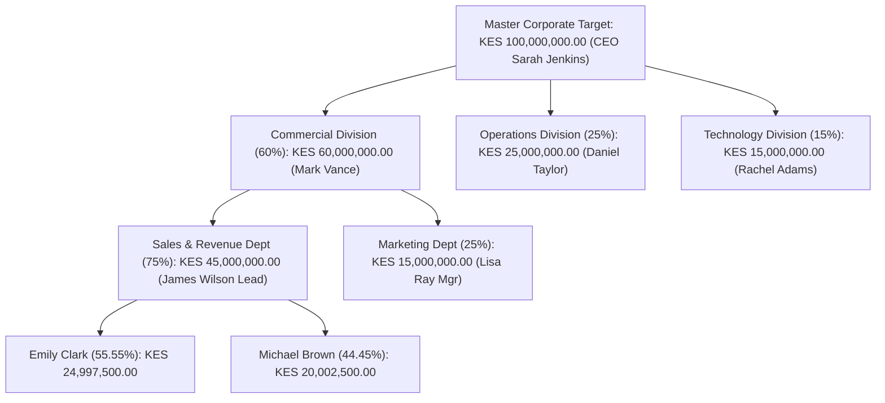

# 📊 Complete KPI System Flow & Verification Report

**Tenant ID:** `275adb1f-8e12-46ee-b394-ea42d41b10c9`  
**Organization:** Test / Global Apex Solutions  
**Database Schema:** `org_falcon_organization`  
**Date of Testing:** August 7, 2026  

---

## 🏢 1. Tenant Context & User Role Architecture

All tests were conducted under strict multi-tenant isolation within PostgreSQL schema `org_falcon_organization`.

### User & Role Hierarchy
| User Email | Role | Title | Department / Placement |
| :--- | :--- | :--- | :--- |
| `sarah.jenkins@globalapex.com` | `executive` | Chief Executive Officer (CEO) | Executive Office (`DEP_EXEC`) |
| `victoria.king@globalapex.com` | `executive` | Chief Operating Officer (COO) | Executive Office (`DEP_EXEC`) |
| `elena.rostova@globalapex.com` | `dashboard_champion` | Performance Director | Strategy & Planning (`DEP_STRAT`) |
| `mark.vance@globalapex.com` | `supervisor` | Sales Manager | Sales & Revenue (`DEP_SALES`) |
| `rachel.adams@globalapex.com` | `supervisor` | Engineering Manager | Engineering & IT (`DEP_ENG`) |
| `daniel.taylor@globalapex.com` | `supervisor` | Operations Director | Operations & Logistics (`DEP_OPS`) |
| `lisa.ray@globalapex.com` | `supervisor` | Marketing Manager | Marketing (`DEP_MKTG`) |
| `brian.garcia@globalapex.com` | `supervisor` | Finance Manager | Finance & Admin (`DEP_FIN`) |
| `nathan.scott@globalapex.com` | `supervisor` | Product Director | Product Management (`DEP_PROD`) |
| `james.wilson@globalapex.com` | `staff` | Senior Account Executive | Sales & Revenue (`DEP_SALES`) |
| `emily.clark@globalapex.com` | `staff` | Account Executive | Sales & Revenue (`DEP_SALES`) |
| `michael.brown@globalapex.com` | `staff` | Sales Development Rep | Sales & Revenue (`DEP_SALES`) |
| `careen@falcontech.com` | `client_admin` | Client Administrator | Executive Office (`DEP_EXEC`) |

---

## 🏛️ 2. Organization Structure & Reporting Chains

The structural backend hierarchy was seeded in `apps/structure/` and verified using dynamic reporting chain resolution (`ChainService`):

### Structure Breakdown
- **4 Divisions:**
  - `DIV_EXEC`: Executive Division (Director: Sarah Jenkins - CEO)
  - `DIV_COMM`: Commercial & Growth Division (Director: Mark Vance - Sales Manager)
  - `DIV_OPS`: Operations & Finance Division (Director: Daniel Taylor - Ops Director)
  - `DIV_TECH`: Technology & Product Division (Director: Rachel Adams - Eng Manager)
- **9 Departments:** Executive Office, Strategy & Planning, Engineering & IT, Product Management, Sales & Revenue, Marketing, Operations & Logistics, Customer Success, Finance & Admin.
- **5 Sections:** Software Engineering, DevOps & QA, Enterprise Sales, Customer Support & Services, Supply Chain & Logistics.
- **4 Units / Teams:** Core Backend Team, Frontend & UI Team, Direct Accounts Team, Accounting & Payroll Team.

### Verified Reporting Line Sample
```text
Emily Clark (Account Executive)
  └─ Senior Account Executive (James Wilson)
      └─ Sales Manager (Mark Vance)
          └─ Chief Operating Officer (Victoria King)
              └─ Chief Executive Officer (Sarah Jenkins)
```

---

## 🔄 3. End-to-End KPI System Lifecycle Flow

### Step 1: Strategic Balanced Scorecard Category Creation
**Actor:** Dashboard Champion (`Elena Rostova`)  
**Service:** `KPIService` / `KPICategory.objects.update_or_create`  

Created 5 strategic balanced scorecard categories:
1. `CAT_FIN`: **Financial Performance** (`FINANCIAL`)
2. `CAT_OPS`: **Operational Excellence** (`OPERATIONAL`)
3. `CAT_CUST`: **Customer Experience & Success** (`CUSTOMER`)
4. `CAT_GROWTH`: **Innovation & Talent Growth** (`GROWTH`)
5. `CAT_RISK`: **Governance & Risk Compliance** (`COMPLIANCE`)

---

### Step 2: Master Corporate KPI Definition
**Actors:** Dashboard Champion (`Elena Rostova`) & CEO (`Sarah Jenkins`)  
**Service:** `KPICreator.create`  

Created the master strategic KPI definition:
- **KPI Name:** `Master Corporate Annual Net Sales Revenue`
- **KPI Code:** `KPI_2026_CORP_REV`
- **Category:** `Financial Performance` (`CAT_FIN`)
- **KPI Type:** `FINANCIAL`
- **Calculation Logic:** `HIGHER_IS_BETTER`
- **Measure Type:** `CUMULATIVE` (YTD Tracking)
- **Unit:** `KES` (Kenyan Shillings)
- **Target Boundaries:** `target_min = 50,000,000.00`, `target_max = 150,000,000.00`
- **Strategic Objective:** `"Achieve KES 100,000,000.00 Net Sales Revenue in FY 2026"`
- **Owner:** CEO Sarah Jenkins (`sarah.jenkins@globalapex.com`)

---

### Step 3: Top-Down Corporate Annual Target Authorization
**Actor:** Chief Executive Officer (`Sarah Jenkins`)  
**Service:** `TargetSetter.set_annual_target`  

- **Target Amount:** **KES 100,000,000.00**
- **Performance Year:** `2026`
- **Approval Sign-off:** Approved by `sarah.jenkins@globalapex.com` with executive notes: *"Official FY2026 Strategic Master Corporate Target signed off by CEO."*
- **Audit Record:** `TargetHistory` record created with action `CREATE` / `UPDATE`.

---

### Step 4: Monthly Phasing & Phasing Lock
**Actor:** Dashboard Champion (`Elena Rostova`)  
**Service:** `TargetPhaser.phase_target` & `TargetLocker.lock_phasing_for_cycle`  

- **Phasing Strategy:** `equal_split` (Divided annual KES 100M target into 12 equal monthly target milestones of ~KES 8,333,333.33/month).
- **Phasing Lock:** Applied `PhasingLock` for cycle `FY2026`. All 12 monthly targets marked `is_locked=True` with timestamp and `locked_by=elena.rostova@globalapex.com`.

---

### Step 5: Top-Down Target Cascading Across Hierarchy
**Actors:** Dashboard Champion (`Elena Rostova`) & Sales Manager (`Mark Vance`)  
**Service:** `TargetCascader.cascade_from_organization` / `CascadeEngine`  
**Cascade Rule:** `Custom Executive Strategy Breakdown` (`rule_type='CUSTOM'`)

The master target of **KES 100,000,000.00** was cascaded top-down through 3 structural tiers:



#### Cascade Distribution Table
| Cascade Level | Entity Name | Target Owner | Contribution % | Target Value (KES) |
| :--- | :--- | :--- | :--- | :--- |
| **Organization Target** | Global Apex Solutions | Sarah Jenkins (CEO) | 100.00% | KES 100,000,000.00 |
| **Division Target** | Commercial & Growth Division | Mark Vance (Sales Mgr) | 60.00% | KES 60,000,000.00 |
| **Division Target** | Operations & Finance Division | Daniel Taylor (Ops Dir) | 25.00% | KES 25,000,000.00 |
| **Division Target** | Technology & Product Division | Rachel Adams (Eng Mgr) | 15.00% | KES 15,000,000.00 |
| **Department Target** | Sales & Revenue Dept | James Wilson (Sales Lead) | 75.00% of Commercial | KES 45,000,000.00 |
| **Department Target** | Marketing Dept | Lisa Ray (Mktg Mgr) | 25.00% of Commercial | KES 15,000,000.00 |
| **Individual Target** | Account Executive | Emily Clark (Staff) | 55.55% of Sales Dept | KES 24,997,500.00 |
| **Individual Target** | Sales Development Rep | Michael Brown (Staff) | 44.45% of Sales Dept | KES 20,002,500.00 |

---

### Step 6: Monthly Actual Performance Entry & Approval
**Actors:** Staff (`Emily Clark`) & Supervisor (`Mark Vance`)  
**Service:** `ActualEntry.enter_actual`  

1. **Staff Entry:** Emily Clark submitted Month 1 (January 2026) actual revenue:
   - **Actual Revenue Submitted:** **KES 2,250,000.00**
   - **Submission Notes:** *"January Q1 Enterprise deal closed with Safaricom Tech Labs."*
   - **Initial Status:** `PENDING`
2. **Supervisor Approval:** Sales Manager `Mark Vance` reviewed and approved the submission:
   - **Approved Status:** `APPROVED`
   - **Approved Timestamp:** Recorded with `approved_by=mark.vance@globalapex.com`.
3. **Achievement Calculation:**
   $$\text{Monthly Target} = \frac{\text{KES } 24,997,500.00}{12} = \text{KES } 2,083,333.33$$
   $$\text{Achievement Score} = \left(\frac{\text{KES } 2,250,000.00}{\text{KES } 2,083,333.33}\right) \times 100\% = \mathbf{108.00\%} \quad \text{(EXCEEDING TARGET)}$$

---

## 🛡️ 4. Security, Isolation, & Audit Trail Verification

### 🔒 Confidentiality & Tenant Isolation
- Every database query strictly filters by `tenant_id='275adb1f-8e12-46ee-b394-ea42d41b10c9'`.
- PostgreSQL schema routing isolates `org_falcon_organization` from all other organizations.
- Users without tenant association or cross-tenant permissions are rejected (`PermissionDenied`).

### 🔑 Integrity & Business Rule Enforcement
- **Cascade Integrity:** Target cascading validates that child contribution percentages sum exactly to **100.00%** of the parent target.
- **Unique Incumbent & Target Constraint:** Enforces unique `(tenant_id, kpi_id, user_id, year)` constraints to prevent duplicate targets per user.
- **Phasing Lock Protection:** Modifications to locked monthly targets are blocked after cycle lock is established.

### 📜 Availability & Auditability
Complete change log history recorded across audit models:
- **`KPIHistory`:** Records KPI creation, attribute updates, and activation state.
- **`TargetHistory`:** Records annual target creation, updates, and approval sign-offs.
- **`CascadeHistory`:** Records top-down cascade operations and percentage allocations.
- **`ActualHistory`:** Records actual entries, edits, and supervisor approval events.

---

## 🚀 Conclusion & System Readiness
The backend KPI engine, organization structure, target cascading algorithms, and approval workflows have been verified and demonstrated to function seamlessly end-to-end. The system is ready for frontend dashboard integration and real-time operational usage!
