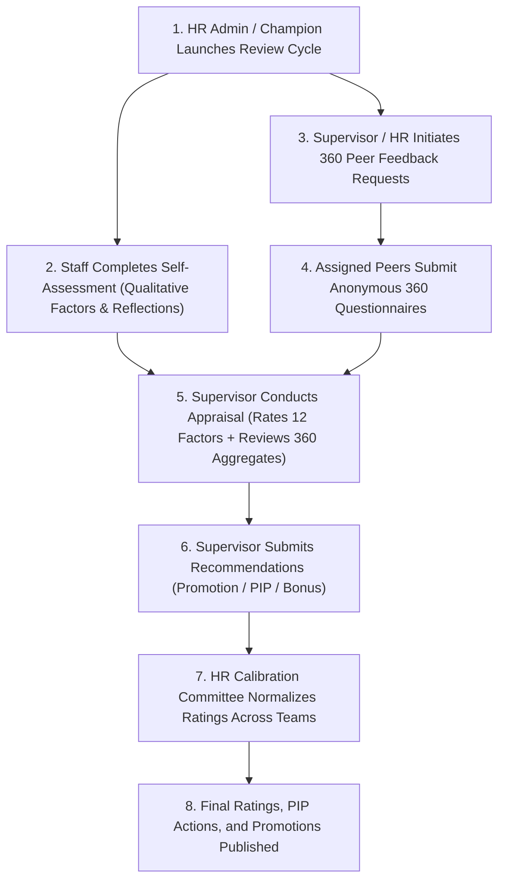

# Falcon Performance Reviews Subsystem: Complete Step-by-Step User & Role Guide

## Overview & Architectural Distinction

In the Falcon Performance Management System, performance evaluation is split into two specialized, complementary subsystems:

1. **The KPI Subsystem (`/kpi`)**: Responsible for defining strategic & operational KPIs, cascading targets (Organization &rarr; Department &rarr; Unit &rarr; Position), capturing actual achievements, and handling monthly/quarterly supervisor approvals of numbers.
2. **The Reviews Subsystem (`/reviews`)**: Dedicated strictly to **Qualitative Performance Appraisals & Behavioral Competencies** (Section III Qualitative Factors, 360 Degree Peer Feedback, Supervisor Qualitative Evaluations, Calibration, PIPs, and Promotions). 

> [!NOTE]
> **Automated Score Integration**: The Reviews Subsystem does not re-grade or evaluate raw KPIs. Instead, the final rating engine automatically imports the pre-approved KPI aggregate score from `/kpi` and combines it with the calibrated qualitative appraisal score (e.g. 70% KPI + 30% Qualitative Review).

---

## 🔄 End-to-End Performance Review Lifecycle

---

## 👥 Detailed Step-by-Step Flow by User Role & Dashboard

---

### 1. 🧑‍💼 Staff / Employee Dashboard (`StaffDashboard`)
*Target Users: Individual Contributors, Technical Staff, Functional Specialists.*

#### Step 1: Complete Self-Assessment
1. **Accessing the Form**:
   - Navigate to **Reviews &rarr; Self-Assessment** from the sidebar navigation.
2. **Section III: Rate Qualitative Performance Factors**:
   - Evaluate your performance across the **12 standardized statements** spanning **4 core competency categories** on a **1–5 Likert Scale** (*1 = Strongly Disagree, 2 = Disagree, 3 = Neutral, 4 = Agree, 5 = Strongly Agree*):
     - **Leadership (4 Factors)**:
       - *Inspire and motivate team members.*
       - *Make strategic decisions under pressure.*
       - *Delegation skills to effectively distribute tasks and responsibilities.*
       - *Set goals and objectives for the department and inspire team achievement.*
     - **Strategic Thinking (3 Factors)**:
       - *Develop and implement strategic plans aligned with organizational goals.*
       - *Anticipate future trends and proactively plan for departmental needs.*
       - *Align resource allocation with strategic priorities.*
     - **Problem Solving (3 Factors)**:
       - *Identify root causes of complex problems.*
       - *Use data and analytical methods to evaluate options.*
       - *Develop innovative solutions to persistent organizational challenges.*
     - **Team Building and Collaboration (2 Factors)**:
       - *Foster trust, psychological safety, and mutual support within the team.*
       - *Resolve conflicts constructively to maintain team harmony and productivity.*
   - Provide optional remarks, evidence, or specific examples for each rated statement.
3. **Section IV: Qualitative Reflections & Development Goals**:
   - **Key Accomplishments**: Highlight major contributions achieved during the cycle period.
   - **Self-Identified Strengths & Improvement Areas**: Reflect on personal capabilities and development areas.
   - **Career Aspirations & Training Requests**: Specify target roles or skill certifications needed.
4. **Draft Saving & Submission**:
   - The form automatically background autosaves in real-time.
   - Click **"Submit Assessment"**. 
   - Upon submission, the record locks into read-only mode and notifies your direct manager/supervisor.

#### Step 2: Provide Assigned 360 Degree Peer Feedback
1. **Accessing**:
   - Navigate to **Reviews &rarr; 360 Feedback &rarr; Assigned to Me**.
2. **Review Pending Requests**:
   - View assigned peer feedback requests requested by supervisors or HR.
3. **Completing Peer Questionnaire**:
   - Click **"Provide Feedback"** (or Edit) on an assigned colleague card.
   - Rate the peer on the **17 behavioral statements** using the **1–4 Frequency Scale**:
     - `1` = *Never / Rarely*
     - `2` = *Sometimes*
     - `3` = *Frequently*
     - `4` = *Consistently / Always*
   - Enter constructive comments on observed strengths and growth opportunities.
   - Click **"Submit Feedback"**. *(Your identity is strictly anonymized in all aggregated reports)*.

---

### 2. 👨‍💼 Manager / Supervisor Dashboard (`SupervisorDashboard`)
*Target Users: Team Leads, Unit Heads, Section Managers, Department Heads.*

#### Step 1: Initiate 360 Degree Peer Feedback
1. **Navigate to**: **Reviews &rarr; 360 Feedback &rarr; Requests**.
2. **Assign Reviewers**:
   - Select direct reports and assign 2–4 relevant peers/collaborators across departments to provide feedback.
   - Specify due dates.

#### Step 2: Conduct Supervisor Appraisal
1. **Review Queue**:
   - Navigate to **Reviews &rarr; Supervisor Reviews &rarr; Review Queue**.
   - Select a direct report whose status is `Ready for Supervisor Review`.
2. **Side-by-Side Qualitative Evaluation**:
   - **Side-by-Side Factor Comparison**: View the employee's self-rating (1–5) side-by-side with your supervisor rating across all 12 Qualitative Competency Factors.
   - **Review 360 Degree Peer Summary**: Inspect anonymized peer spider charts and aggregated feedback to identify blind spots or consensus strengths.
   - **Review Employee Goals & Training Requests**: Read the employee's career progression notes and training needs.
3. **Appraisal Recommendations & Sign-Off**:
   - Enter overall supervisor narrative summary and developmental coaching points.
   - Select appraisal recommendations:
     - 🌟 **Eligible for Promotion** (Select target role and readiness timeline).
     - ⚠️ **Performance Improvement Plan (PIP)** (If performance requires formal intervention).
     - 💰 **Discretionary Bonus Recommendation** (Optional performance percentage).
   - Click **"Submit Appraisal"** to send the completed review to HR for Calibration.

---

### 3. 🛡️ HR Admin / Performance Champion Dashboard (`HRAdmin` / `AdminDashboard`)
*Target Users: HR Directors, Performance Champions, System Administrators.*

#### Step 1: Cycle Management & Library Configuration
1. **Cycle Setup**:
   - Navigate to **Reviews &rarr; Cycles &rarr; Create Cycle**.
   - Define Cycle Name (e.g. *Falcon Annual Review 2026*), Self-Assessment Deadline, Supervisor Appraisal Deadline, and Calibration Date.
   - Configure weights: e.g. **70% KPI Score** (imported from `/kpi`) + **30% Qualitative Review Score** (from `/reviews`).
2. **Competency Factor Libraries**:
   - Manage qualitative categories, factor definitions, and rating scales in **Reviews &rarr; Settings &rarr; Competencies**.

#### Step 2: Committee Calibration & Score Normalization
1. **Calibration Workspace**:
   - Navigate to **Reviews &rarr; Calibration**.
2. **Bell Curve Normalization**:
   - Review appraisal score distributions across departments to eliminate manager bias (overly lenient vs overly harsh supervisors).
   - Adjust final qualitative scores with documented committee justification and audit logs.
3. **Automated Final Rating Generation**:
   - The engine automatically combines the pre-approved KPI aggregate score with the calibrated qualitative score to produce the official **Final Rating**.

#### Step 3: Action Execution (PIPs & Promotions)
1. **Promotions**: In **Reviews &rarr; Promotions**, approve and schedule promotions recommended by supervisors.
2. **Performance Improvement Plans (PIPs)**: In **Reviews &rarr; PIPs**, track action plans, milestone check-ins, and completion outcomes for flagged staff.
3. **Publishing**: Lock the cycle and publish official results to staff and managers.

---

### 4. 👔 Executive Dashboard (`ExecutiveDashboard`)
*Target Users: C-Suite, Managing Directors, Functional VPs.*

1. **Strategic Performance Analytics**:
   - Navigate to **Reviews &rarr; Executive Analytics**.
2. **Executive Insights**:
   - **9-Box Talent Grid**: Distribution of talent across Performance vs Potential.
   - **Departmental Competency Comparison**: Stack-ranked performance and qualitative scorecards by division.
   - **Retention & Risk Indicators**: High-performer promotion readiness vs low-performer intervention rates.

---

### 5. 👁️ Read-Only / Auditor Dashboard
*Target Users: Compliance Officers, External Auditors, Observers.*

- **Audit & Compliance Scope**:
  - Full read-only visibility into historical review cycles, audit logs, completion timestamps, and calibration records for regulatory and organizational compliance.

---

## 📊 Summary Responsibility Matrix

| Subsystem Task | Responsible Role | Module / Screen | Output / Impact |
| :--- | :--- | :--- | :--- |
| **KPI Definition & Actuals Approvals** | Staff & Supervisor | **KPI Module (`/kpi`)** | Pre-approved KPI % score |
| **Qualitative Self-Assessment (12 Factors)** | Staff | **Reviews (`/reviews/self-assessment`)** | Submits to Supervisor Queue |
| **360 Degree Peer Feedback Responses** | Assigned Peers | **Reviews (`/reviews/360-feedback`)** | Anonymized 360 Aggregate Report |
| **Supervisor Qualitative Appraisal** | Supervisor | **Reviews (`/reviews/supervisor-review`)** | Submits to HR Calibration Committee |
| **Rating Normalization & Calibration** | HR / Committee | **Reviews (`/reviews/calibration`)** | Final Combined Performance Rating |
| **PIP Tracking & Promotion Execution** | HR Admin | **Reviews (`/reviews/pip`, `/promotions`)** | Formal HR Career Actions |
