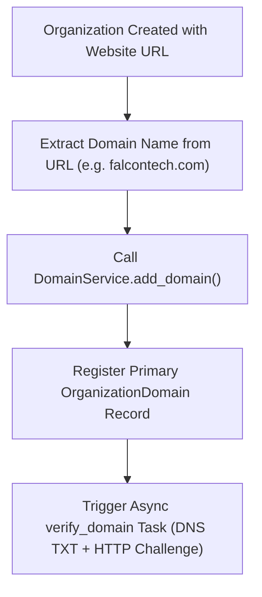

# Tenant Organization Module Documentation (`Docs/Tenant/organization.md`)

## 1. Executive Summary & Core Taxonomy

The **Falcon Organization Module** defines the central tenant entity (`Organization`) around which multi-tenancy, domain mapping, subscription tiers, resource limits, and audit logs are bound.

---

## 2. Model & Manager Structure

- **Model (`Organization`)**:
  - `status`: Enum (`PENDING`, `PROVISIONING`, `ACTIVE`, `SUSPENDED`, `FAILED`, `ARCHIVED`).
  - `slug`: Unique lowercase alphanumeric identifier (`org_<slug>` defines default PG schema name).
  - `website`: Triggers automatic primary domain registration upon creation.
  - `subscription_tier`: Enum (`FREE`, `STANDARD`, `PREMIUM`, `ENTERPRISE`).
  - `metadata`: Stores step-level provisioning state, audit logs, and custom resource limits.

- **Manager (`OrganizationManager`)**:
  - `active_organizations()`, `onboarded()`, `pending_provisioning()`, `failed()`, `suspended()`, `archived()`.
  - `by_slug(slug)`, `by_domain(domain)`, `by_sector(sector_id)`.
  - `lock_for_update(organization_id)`: Selects row for update to prevent concurrent updates.

---

## 3. Website & Automatic Domain Registration Flow



---

## 4. Resource Limits & Quotas Integration

Each organization receives default quota allocations based on `subscription_tier`:
- `USERS`: Max active user seats.
- `STORAGE_MB`: Disk storage allocation.
- `API_CALLS_PER_DAY`: Daily REST API request ceiling.
- `DEPARTMENTS` & `KPIS`: Functional entity caps.

Quotas are monitored continuously by `OrganizationLimitsMiddleware` and background Celery Beat tasks (`check_quota_warnings`, `forecast_resource_exhaustion`).

---

## 5. CIA Triad Security Guarantees

| Security Pillar | Implementation Guarantee |
| :--- | :--- |
| **Confidentiality** | **Audited Metadata & Soft Delete**: Audits all CRUD operations (`record_audit`); soft deletes preserve records while preventing unauthorized access. |
| **Integrity** | **Strict Validation & Domain Anti-Spoofing**: Validates email formats, unique slugs, and domain ownership before binding primary domains to organizations. |
| **Availability** | **Connection Pausing & Lifecycle Controls**: Suspending or archiving an organization immediately pauses connection pools (`pause_connection`), blocking unauthorized traffic instantly. |

---

## 6. Administrative CLI Commands & API Directions

### CLI Management Command (`manage_organizations`)

```bash
# 1. List all active and pending tenant organizations
python manage.py manage_organizations list

# 2. Filter organizations by status (ACTIVE, PENDING, SUSPENDED, FAILED, ARCHIVED)
python manage.py manage_organizations list --status FAILED

# 3. View resource quotas and usage percentages for an organization
python manage.py manage_organizations quota --org-id c732f915-34d1-489d-8551-3c71bf92a372

# 4. Activate an onboarded organization
python manage.py manage_organizations activate --org-id c732f915-34d1-489d-8551-3c71bf92a372

# 5. Suspend an organization (immediately pauses DB connection pool)
python manage.py manage_organizations suspend --org-id c732f915-34d1-489d-8551-3c71bf92a372

# 6. Archive an organization
python manage.py manage_organizations archive --org-id c732f915-34d1-489d-8551-3c71bf92a372
```

### REST API Endpoints (`OrganizationViewSet`)

- `GET /api/v1/tenant/organizations/`: Lists organizations (`IsSuperAdmin`).
- `POST /api/v1/tenant/organizations/`: Creates organization & auto-dispatches provisioning.
- `GET /api/v1/tenant/organizations/{id}/`: Gets organization details.
- `POST /api/v1/tenant/organizations/{id}/onboard/`: Triggers full provisioning.
- `POST /api/v1/tenant/organizations/{id}/activate/`: Activates organization.
- `POST /api/v1/tenant/organizations/{id}/suspend/`: Suspends organization.
- `GET /api/v1/tenant/organizations/{id}/usage_summary/`: Returns resource quota usage percentages.
- `GET /api/v1/tenant/organizations/{id}/provisioning_status/`: Returns step progress.
