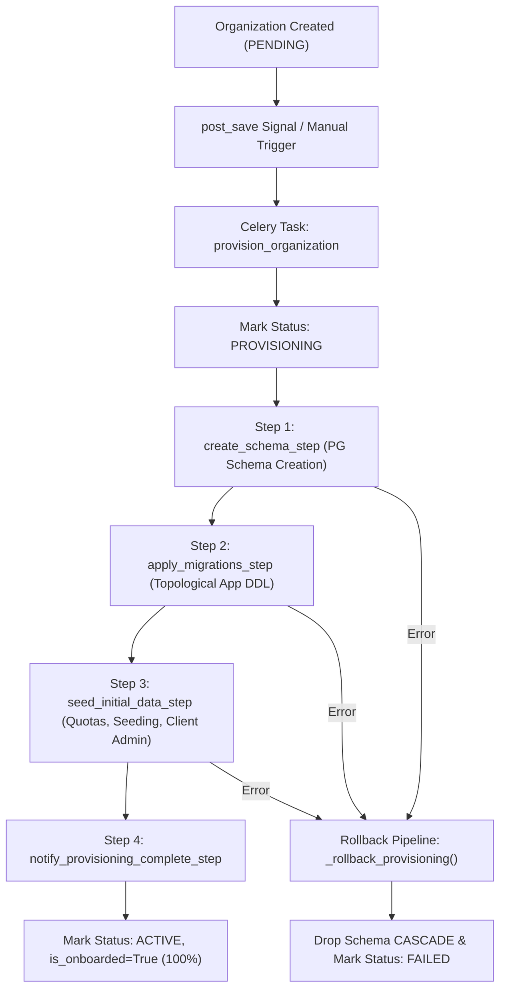

# Tenant Provisioning Module Documentation (`Docs/Tenant/provisioning.md`)

## 1. Executive Summary & Pipeline Architecture

The **Falcon Provisioning Module** orchestrates asynchronous tenant infrastructure creation upon new organization registration. It coordinates schema generation, DDL migrations, tier-based resource quota assignment, default role/rating scale seeding, client admin user creation, and real-time WebSocket progress broadcasts.

---

## 2. Provisioning State Machine



---

## 3. Celery Pipeline & Step Sequence

1. **`create_schema_step` (20%)**:
   - Acquires PostgreSQL advisory lock (`pg_advisory_xact_lock`).
   - Validates schema name format (`org_<sanitized_slug>`).
   - Executes DDL `CREATE SCHEMA IF NOT EXISTS org_...`.

2. **`apply_migrations_step` (40% - 65%)**:
   - Synchronizes `OrganizationMigration` records.
   - Applies tenant app DDL migrations topologically (`kpi`, `reviews`, `dashboard`, `structure`, `reportplt`, `tasks_module`).

3. **`seed_initial_data_step` (75% - 95%)**:
   - **Resource Quotas**: Seeds tier-based limits (`USERS`, `STORAGE_MB`, `API_CALLS_PER_DAY`, `DEPARTMENTS`, `KPIS`, `CONCURRENT_SESSIONS`).
   - **Default Data Seeding**: Populates default system roles, performance review rating scales, and templates.
   - **Client Admin User Setup**: Creates default client admin user under `public` schema with temporary credentials, triggering welcome email dispatch.

4. **`notify_provisioning_complete_step` (100%)**:
   - Marks organization status as `ACTIVE` (`is_onboarded=True`, `onboarded_at=now()`).
   - Broadcasts completion WebSocket event to client subscribers.

---

## 4. CIA Triad Security Guarantees

| Security Pillar | Implementation Guarantee |
| :--- | :--- |
| **Confidentiality** | **Isolated Admin Seeding**: Client Admin users and accounts models are created strictly within global `public` schema, preventing cross-tenant privilege escalation or schema pollution. |
| **Integrity** | **Advisory Locking & Automatic Rollback**: `pg_advisory_xact_lock` prevents concurrent provisioning race conditions. Transient or hard errors trigger automated schema CASCADE teardown and state rollback. |
| **Availability** | **Non-Blocking Celery Pipeline & WebSockets**: Asynchronous Celery task chains prevent HTTP request thread timeouts; `ProvisioningConsumer` pushes live step-by-step progress to admin dashboards. |

---

## 5. Administrative CLI Commands & API Directions

### CLI Management Command (`provision_organizations`)

```bash
# 1. Inspect provisioning pipeline status and progress across all organizations
python manage.py provision_organizations status

# 2. Provision all PENDING organizations
python manage.py provision_organizations provision --all-pending

# 3. Provision a specific organization by UUID
python manage.py provision_organizations provision --org-id c732f915-34d1-489d-8551-3c71bf92a372

# 4. Retry provisioning for all FAILED organizations
python manage.py provision_organizations retry --all-failed

# 5. Retry a specific FAILED organization
python manage.py provision_organizations retry --org-id c732f915-34d1-489d-8551-3c71bf92a372

# 6. Force rollback stuck provisioning (drops schema and resets status to FAILED)
python manage.py provision_organizations rollback --org-id c732f915-34d1-489d-8551-3c71bf92a372
```

### REST API Endpoints (`ProvisioningViewSet`)

- `GET /api/v1/tenant/provisioning/`: Summarizes provisioning states (`IsSuperAdmin`).
- `GET /api/v1/tenant/provisioning/failed/`: Lists organizations in `FAILED` status.
- `GET /api/v1/tenant/provisioning/in-progress/`: Lists active `PROVISIONING` pipelines.
- `GET /api/v1/tenant/provisioning/{id}/status/`: Step-level progress & error details.
- `POST /api/v1/tenant/provisioning/{id}/trigger/`: Manually dispatches async provisioning.
- `POST /api/v1/tenant/provisioning/{id}/retry/`: Resets and retries failed provisioning.
- `POST /api/v1/tenant/provisioning/{id}/rollback/`: Force drops infrastructure and marks `FAILED`.

### WebSocket Channel (`ProvisioningConsumer`)

Frontend clients connect to channel `ws://<domain>/ws/tenant/provisioning/{organization_id}/` to receive real-time JSON events (`provisioning_started`, `provisioning_step`, `provisioning_completed`, `provisioning_failed`).
