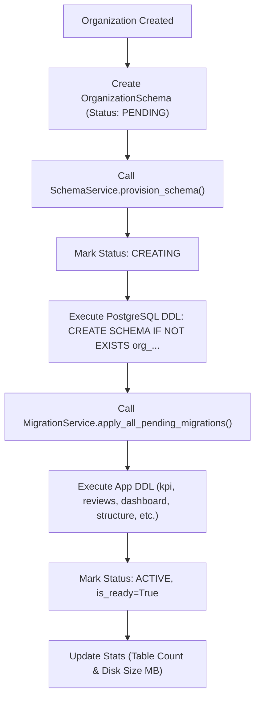

# Tenant Schema Module Documentation (`Docs/Tenant/schema.md`)

## 1. Executive Summary & Architecture Overview

The **Falcon Schema Module** manages PostgreSQL database schema lifecycle and tenant data isolation. Built specifically for high-scale multi-tenant PostgreSQL environments, Falcon provides defense-in-depth isolation using a dual strategy:

1. **Schema-per-Tenant Isolation**: Each organization is assigned a dedicated PostgreSQL schema (`org_<sanitized_id>`).
2. **PostgreSQL Row-Level Security (RLS)**: Enforces row-level access policies directly at the database engine level (`ALTER TABLE ... ENABLE ROW LEVEL SECURITY`), ensuring zero-trust protection even against direct SQL queries.

---

## 2. Model & Manager Taxonomy

- **Model (`OrganizationSchema`)**:
  - `organization`: `OneToOneField` linking to `Organization`.
  - `schema_name`: `CharField(max_length=63, unique=True)` defining PostgreSQL schema identifier.
  - `status`: Enum (`PENDING`, `CREATING`, `ACTIVE`, `MIGRATING`, `FAILED`, `DELETED`).
  - `is_ready`: Boolean flag indicating schema is active and fully migrated.
  - `table_count` & `size_mb`: Real-time database table count and disk consumption.

- **Manager (`SchemaManager`)**:
  - `active_schemas()`: Filters active, ready schemas (`status='ACTIVE'`, `is_ready=True`).
  - `pending()`, `creating()`, `migrating()`, `failed()`, `ready()`, `not_ready()`.
  - `get_primary_schema(organization_id)`: Fetches target organization's primary schema.

---

## 3. Schema Provisioning Lifecycle & Auto-Migration DDL



---

## 4. PostgreSQL Row-Level Security (RLS) Policy Specifications

Falcon applies PostgreSQL RLS policies to every user table inside tenant schemas:

```sql
-- 1. Enable & Force Row Level Security on target tenant table
ALTER TABLE "org_c732f915_34d1_489d_8551_3c71bf92a372"."kpi_kpis" ENABLE ROW LEVEL SECURITY;
ALTER TABLE "org_c732f915_34d1_489d_8551_3c71bf92a372"."kpi_kpis" FORCE ROW LEVEL SECURITY;

-- 2. Create Tenant Isolation RLS Policy
CREATE POLICY "kpi_kpis_tenant_isolation_policy" ON "org_c732f915_34d1_489d_8551_3c71bf92a372"."kpi_kpis"
USING (
    organization_id::text = current_setting('app.current_tenant_id', true)
    OR current_setting('app.current_tenant_id', true) IS NULL 
    OR current_setting('app.current_tenant_id', true) = ''
);
```

---

## 5. CIA Triad Security Guarantees

| Security Pillar | Implementation Guarantee |
| :--- | :--- |
| **Confidentiality** | **Dual Schema + RLS Isolation**: Dedicated PostgreSQL namespace (`org_...`) and database-level RLS policies prevent accidental foreign key reads or ORM leaks. |
| **Integrity** | **Atomic Schema DDL & Advisory Locks**: Transactional advisory locks guarantee schema operations execute atomically without DDL race conditions. |
| **Availability** | **Automated Provisioning & Disk Metrics**: Asynchronous schema setup, live table/size stats monitoring, and non-blocking background tasks ensure high availability. |

---

## 6. Administrative CLI Commands & API Directions

### CLI Management Command (`tenant_schema`)

```bash
# 1. Inspect schema status, table counts, and disk size (MB) across ALL tenants
python manage.py tenant_schema status --all-tenants

# 2. Provision schema AND auto-migrate all tenant tables for all pending organizations
python manage.py tenant_schema provision --all-tenants

# 3. Provision a specific organization schema
python manage.py tenant_schema provision --org-id c732f915-34d1-489d-8551-3c71bf92a372

# 4. Enforce PostgreSQL Row-Level Security (RLS) policies on all tables across ALL schemas
python manage.py tenant_schema enable-rls --all-tenants

# 5. Update table count and disk size stats for a single tenant
python manage.py tenant_schema stats --org-id c732f915-34d1-489d-8551-3c71bf92a372

# 6. Drop schema CASCADE (single organization safety lock)
python manage.py tenant_schema drop --org-id c732f915-34d1-489d-8551-3c71bf92a372
```

### REST API Endpoints (`SchemaViewSet`)

- `GET /api/v1/tenant/schemas/`: Lists organization schemas (`IsAuthenticated`, `CanManageSchema`).
- `POST /api/v1/tenant/schemas/{id}/provision/`: Provisions PostgreSQL schema & applies migrations (`IsSuperAdmin`).
- `POST /api/v1/tenant/schemas/{id}/enable-rls/`: Enables PostgreSQL Row-Level Security (`IsSuperAdmin`).
- `POST /api/v1/tenant/schemas/{id}/update_stats/`: Recalculates table count and disk size in MB.
- `POST /api/v1/tenant/schemas/{id}/drop/`: Drops schema CASCADE (`IsSuperAdmin`).
