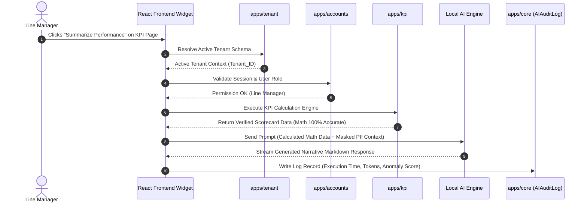

# Integration Requirements Document
## Falcon V2 Self-Hosted AI/ML Engine

| Document Metadata | Details |
| :--- | :--- |
| **System** | Falcon Performance Management System (PMS) V2 |
| **Target Codebase** | `apps/` (Falcon V1 Architecture Services) |
| **Document Type** | App-by-App System Integration Specification |

---

## 1. Overview & Service Architecture

The Falcon V2 AI engine seamlessly integrates into Falcon's existing multi-app architecture (`apps/`). Rather than creating an isolated, disconnected system, the AI engine attaches to the existing business services layer (`apps/*/services/`) across all 8 core Falcon apps.

---

## 2. Integration Mapping Matrix Across Falcon V1 Apps

```
┌─────────────────────────────────────────────────────────────────────────────┐
│                          FALCON V2 AI INTEGRATION HUB                       │
└──────┬──────────┬──────────┬──────────┬──────────┬──────────┬──────────┬────┘
       │          │          │          │          │          │          │
┌──────▼───┐┌─────▼────┐┌────▼─────┐┌───▼──────┐┌──▼───────┐┌─▼────────┐┌▼─────────┐
│ accounts ││ tenant   ││ kpi      ││ reviews  ││reportplt ││structure ││configs   │
└──────────┘└──────────┘└──────────┘└──────────┘└──────────┘└──────────┘└──────────┘
```

---

## 3. Detailed App-by-App Integration Specifications

### 3.1 `apps/accounts` Integration (Authentication & Security Surveillance)
* **Target Services:** `apps/accounts/services/`
* **Integration Points:**
  * **Role Verification:** The AI bridge calls `apps/accounts/services/user_service.py` to fetch user roles, managing permission filters.
  * **Anomaly Engine Hook:** Django signals in `apps/accounts` send login and data retrieval events to `security_watcher.py` for real-time anomaly score evaluation.

### 3.2 `apps/tenant` Integration (Multi-Tenant Isolation & Provisioning)
* **Target Services:** `apps/tenant/services/isolation_service.py`, `organization_service.py`
* **Integration Points:**
  * **Schema Scoping:** The AI router hooks into `IsolationService.get_active_tenant()` to automatically apply `tenant_id` filters to vector lookups.
  * **Provisioning Seeder:** When a new tenant is created via `ProvisioningService`, the system automatically provisions tenant-isolated vector tables and default policy embeddings.

### 3.3 `apps/kpi` Integration (Deterministic Analytics & Scorecard Narratives)
* **Target Services:** `apps/kpi/services/`
* **Integration Points:**
  * **Math Decoupling:** `KpiCalculationService` executes 100% of mathematical formulas (variance, growth rates, weighted score calculations).
  * **Narrative Generator:** Pre-calculated scorecard output dictionary is passed to `FalconAIService.generate_kpi_narrative(calculated_data)` to generate executive commentary.

### 3.4 `apps/reviews` Integration (Appraisal Generation & Feedback Assist)
* **Target Services:** `apps/reviews/services/`
* **Integration Points:**
  * **Review Drafting:** `AppraisalService` calls the AI engine with employee KPI history and self-evaluation text to generate structured manager feedback.
  * **Tone & Bias Checking:** Before saving a review, `ReviewValidationService` uses the AI to check for non-inclusive language or unsubstantiated claims.

### 3.5 `apps/reportplt` Integration (Automated Executive Summary Generation)
* **Target Services:** `apps/reportplt/services/`
* **Integration Points:**
  * **Report Template Injection:** `ReportGenerationService` injects AI-generated executive summaries into PDF/HTML report templates.
  * **Scheduled Digest:** Celery background tasks trigger automated weekly AI summary reports sent to division heads.

### 3.6 `apps/structure` Integration (Organizational Hierarchy Awareness)
* **Target Services:** `apps/structure/services/organization_service.py`
* **Integration Points:**
  * **Hierarchy Resolution:** The AI uses `StructureService.get_reporting_hierarchy(user_id)` to resolve direct reports and manager boundaries for context-aware queries.

### 3.7 `apps/configs` Integration (System & Tenant AI Feature Flags)
* **Target Services:** `apps/configs/services/`
* **Integration Points:**
  * **Feature Toggles:** `ConfigService` controls AI feature availability per tenant (e.g., enable/disable voice STT, adjust LLM temperature settings, set anomaly detection sensitivity).

### 3.8 `apps/billing` Integration (Quota Management & AI Resource Usage Tracking)
* **Target Services:** `apps/billing/services/`
* **Integration Points:**
  * **Resource Metering:** Each AI request logs tokens processed and execution time to `apps/billing` to enforce tenant plan limits (e.g., Standard Tier: 1,000 AI queries/month; Enterprise: Unlimited).

---

## 4. Architectural Sequence: End-to-End Multi-App Flow


