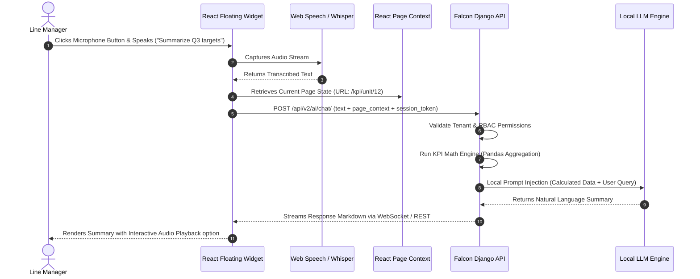
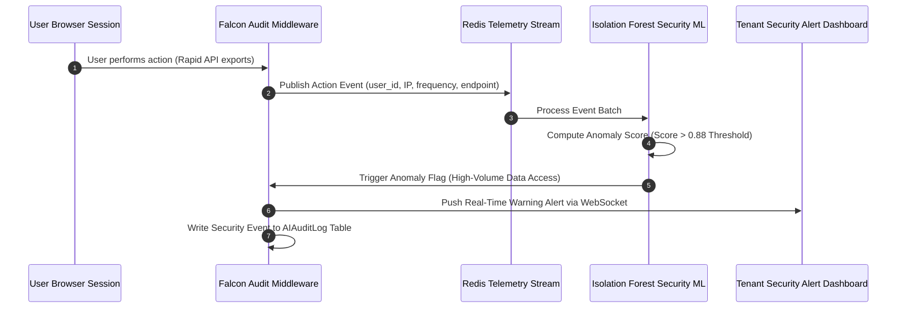

# Use Cases & User Stories
## Falcon V2 Self-Hosted AI/ML Engine

| Document Metadata | Details |
| :--- | :--- |
| **System** | Falcon Performance Management System (PMS) V2 |
| **Document Type** | Interaction Use Cases & User Stories |

---

## 1. User Story Matrix

| Story ID | User Role | As a... | I want to... | So that I can... |
| :--- | :--- | :--- | :--- | :--- |
| **US-01** | Line Manager | Line Manager | Speak a prompt to summarize my team's KPI progress | Avoid manually calculating scorecards during meeting preparation |
| **US-02** | Line Manager | Line Manager | Generate an objective draft for an employee appraisal | Write comprehensive performance feedback grounded in KPI data |
| **US-03** | Tenant Admin | Tenant Admin | Ask the AI about page data I am currently viewing | Get instant context-aware answers without changing screens |
| **US-04** | Security Officer | Security Officer | Receive real-time alerts when anomalous tenant activity is detected | Intercept potential security breaches or data export abuse immediately |
| **US-05** | Employee | Employee | Draft my self-appraisal with AI guidance | Articulate my quarterly accomplishments clearly and professionally |

---

## 2. Detailed Use Cases

### UC-01: Voice-Driven KPI Scorecard Query
* **Primary Actor:** Line Manager / Division Head
* **Preconditions:** User is authenticated and navigating the Falcon React SPA.

---

### UC-02: AI-Assisted Performance Appraisal Generation
* **Primary Actor:** Line Manager
* **Preconditions:** Manager is on the Performance Review detail page (`/reviews/appraisal/104/`).

**Step-by-Step Execution:**
1. Manager clicks the **"AI Review Assist"** button on the review edit form.
2. React `usePageContext` captures the appraisal ID (`104`), employee ID, review period, and self-evaluation text.
3. Django backend fetches verified KPI achievement scores for the appraisal period from `apps/kpi`.
4. PII Anonymizer replaces employee name and specific email references with masked tokens.
5. Local LLM generates an objective narrative draft covering Strengths, Achievements, and Areas for Growth.
6. The frontend renders the generated draft in a side-by-side comparison modal.
7. Manager accepts, edits, or rejects the draft. Upon acceptance, text is inserted into the appraisal form.

---

### UC-03: Real-Time Security Anomaly Detection & Threat Interception
* **Primary Actor:** System Security Watcher (`apps/accounts/security_watcher.py`)
* **Preconditions:** User session active in Falcon system.

