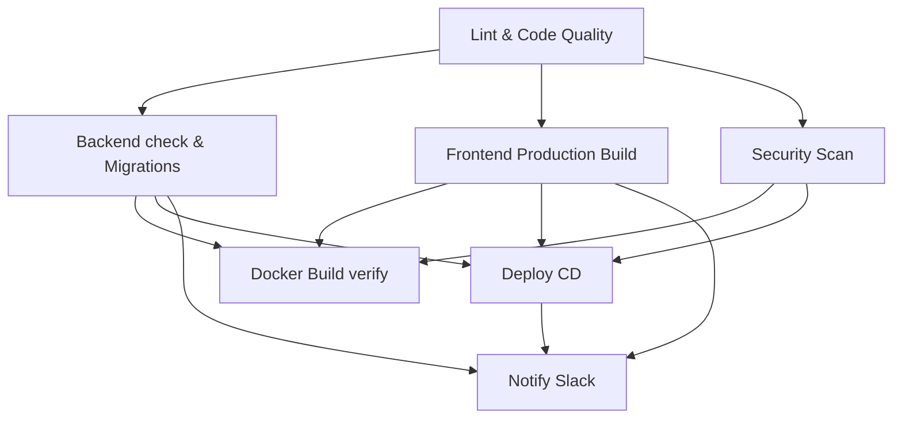

# Falcon PMS — CI/CD Pipeline Explanation

This document provides a comprehensive explanation of the `.github/workflows/ci-cd.yml` workflow file. It outlines how Continuous Integration (CI) and Continuous Deployment (CD) are configured for Falcon PMS using GitHub Actions.

---

## 1. Metadata and Triggers (Lines 5 - 21)

```yaml
name: CI/CD Pipeline

on:
  push:
    branches: [main, develop, staging]
    paths-ignore:
      - 'Docs/**'
      - 'docs/**'
      - '**/*.md'
      - '.github/**/*.md'
  pull_request:
    branches: [main, develop, staging]
  workflow_dispatch:
```

### Explanation:
*   **`name`**: The name of the pipeline as it appears in the GitHub Actions tab.
*   **`on.push` / `on.pull_request`**: The workflow is automatically triggered when code is pushed or a pull request is opened targeting `main` (production), `develop` (development), or `staging` (staging) branches.
*   **`paths-ignore`**: Prevents unnecessary pipeline runs when only documentation (`Docs/` or `.md` files) has changed.
*   **`workflow_dispatch`**: Allows developers to manually run the pipeline from the GitHub UI with one click.
*   **`concurrency`**: Groups runs by branch. If a new commit is pushed while a previous build for the same branch is running, the previous run is cancelled (`cancel-in-progress: true`), saving GitHub Action runner minutes.

---

## 2. Environment Variables (Lines 23 - 35)

```yaml
env:
  PYTHON_VERSION: '3.11'
  NODE_VERSION: '20'
  DJANGO_SETTINGS_MODULE: config.settings.test
  DB_NAME: test_db
  ...
```

### Explanation:
Global configurations shared across jobs. It specifies:
*   **Versions**: Python 3.11 and Node.js 20.
*   **Django Settings**: Sets `DJANGO_SETTINGS_MODULE` to `config.settings.test` to ensure Django loads the test configuration (isolated settings, database, mock external services).
*   **PostgreSQL credentials**: Credentials used by both the Django steps and the PostgreSQL service container.

---

## 3. Pipeline Jobs (Line 36 onwards)

The workflow consists of several parallel and sequential **jobs**.



### Job 1: `lint` (Lines 38 - 74)
Runs code style checks on both backend and frontend to ensure code compliance.
*   **`runs-on: ubuntu-latest`**: Executed on a fresh Ubuntu virtual machine hosted by GitHub.
*   **Python Setup & Cache**: Sets up Python 3.11 and caches pip packages linked to `requirements/development.txt` to speed up future runs.
*   **Flake8**: Lints the python code. `--max-line-length=120` prevents long-line warnings, and `|| true` prevents minor style violations from failing the build immediately (can be removed to enforce hard linting).
*   **isort**: Checks the import ordering style.
*   **Node Setup & Cache**: Sets up Node.js 20 and caches `npm` modules linked to `frontend/package-lock.json`.
*   **npm ci**: Performs a clean, reproducible installation of frontend dependencies.
*   **ESLint**: Runs ESLint rules on JS/JSX frontend code.

---

### Job 2: `backend` (Lines 76 - 126)
Ensures backend databases and settings checks pass.
*   **`needs: [lint]`**: Runs only *after* the `lint` job passes successfully.
*   **`services`**: Spins up dynamic secondary container services within the VM:
    *   **`postgres:14-alpine`**: Database container with custom healthcheck `pg_isready` verifying Postgres is fully operational before executing backend commands.
    *   **`redis:7-alpine`**: Redis caching broker instance.
*   **Steps**:
    1.  **`migrate --noinput`**: Validates database schema migrations apply cleanly to Postgres.
    2.  **`check`**: Triggers Django's system check framework (validates URLs, settings, and models).
    3.  **`makemigrations --check --dry-run`**: Verifies if there are any uncreated migration files. Prevents developer oversight where a model changed, but the migration file was not committed.

---

### Job 3: `frontend-build` (Lines 128 - 157)
Validates that the React frontend compiles successfully.
*   **`needs: [lint]`**: Runs only *after* the `lint` job passes.
*   **Vite environment configuration**: Injects `VITE_API_URL` and `VITE_WS_URL` env parameters to point React routes to target backend APIs.
*   **`npm run build`**: Compiles assets via Vite into a production-optimized `/dist` bundle.
*   **`upload-artifact`**: Saves the compiled `/dist` directory as a zip file on GitHub. This artifact is kept for 7 days and can be used in downstream deployment steps.

---

### Job 4: `security` (Lines 159 - 197)
Scans the code for vulnerabilities before production.
*   **Bandit (Python)**: Analyzes Python source files (`apps/`, `config/`) for common security issues (e.g. SQL injection hazards, hardcoded passwords, unsafe imports). Results are output to `bandit-report.json`.
*   **npm audit (Frontend)**: Runs a dependency vulnerability scan on frontend libraries. Results are output to `npm-audit-report.json`.
*   **`upload-artifact`**: Saves both reports as `security-reports` for developer auditing.

---

### Job 5: `docker` (Lines 199 - 229)
Verifies that containerization configurations remain fully functional.
*   **`if` branch guard**: Runs ONLY on pushes to `main` or `staging` branches.
*   **`docker/build-push-action@v6`**: Builds both `Dockerfile.production` (backend) and `Dockerfile` (frontend) locally to ensure the container layers assemble without build errors. Does not push to registry (runs validation only).

---

### Job 6: `deploy` (CD) (Lines 231 - 302)
Handles the continuous delivery release process.
*   **`environment`**: Dynamically maps to the staging or production GitHub environment based on the branch (`staging` -> `staging` environment; `main` -> `production` environment).
*   **Docker Hub Push**: Logins to Docker Hub and pushes tags: `latest` and `${{ github.sha }}` (commit hash for strict versioning).
*   **Appleboy SSH Action**: Opens a secure SSH channel to the target host and runs:
    ```bash
    set -e
    cd /opt/falcon-pms
    docker compose pull                          # Pulls latest pushed images
    docker compose up -d --force-recreate        # Restarts containers cleanly
    docker compose exec -T backend python manage.py migrate --noinput # Run DB migrations in-container
    docker system prune -f                        # Clean up old unused docker layers
    ```

---

### Job 7: `notify` (Lines 304 - 325)
*   **`if: always()`**: Runs regardless of whether preceding jobs succeeded or failed.
*   **Slack Integration**: Uses a webhook to post build and deploy outcomes directly to your engineering Slack channel.
