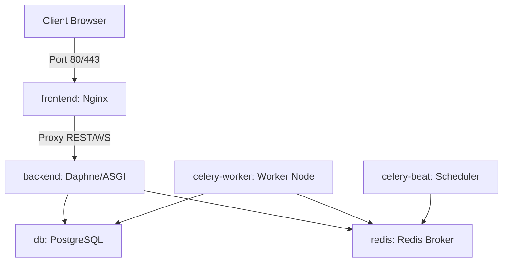

# Falcon PMS — Production Docker Deployment

This document describes the production containerization strategy for Falcon PMS using the new `docker-compose.prod.yml` and production `Dockerfiles`.

---

## 1. Container Topology Overview

The system is split into six distinct, interconnected service containers:



### Key Production Design Rules:
*   **Decoupled Architecture**: Stateless microservices (API, web front, celery worker, celery scheduler) can scale horizontally, while DB and Redis preserve state.
*   **Static Isolation**: Backend routes compile and output static assets directly to shared volumes (`falcon-static-vol` and `falcon-media-vol`), allowing Nginx or Cloud storage to bypass Django entirely for rendering asset folders.
*   **Isolated networks**: All services connect over a private bridge network (`falcon-prod-net`). Only the Nginx frontend exposes open external ports (`80/443`) for public routing.

---

## 2. Explanation of the Services

### 1. `frontend` (React + Nginx)
*   **Build**: Uses `./frontend/Dockerfile` in multi-stage compilation mode.
*   **Stage 1 (node:20-alpine)**: Installs npm modules and compiles standard JS/JSX assets using Vite into optimized build chunks in `/app/dist`.
*   **Stage 2 (nginx:1.25-alpine)**: Copies the built React app into Nginx's default directory (`/usr/share/nginx/html`) and configures Nginx configurations for reverse routing.
*   **Port binding**: Publicly exposes port `80` (HTTP) and `443` (HTTPS) to serve web assets.

### 2. `backend` (Django Daphne / ASGI)
*   **Build**: Uses `Dockerfile.production` utilizing ASGI-based `daphne` server.
*   **ASGI Daphne**: Uvicorn/Daphne enables full-duplex asynchronous WebSockets (`/ws`) alongside standard Django API REST requests (`/api/v1`).
*   **Isolation**: Runs as a secure non-root OS user (`falcon`) on port `8000`. Does not expose ports externally; Nginx routes client traffic to it privately.

### 3. `celery-worker` (Background Job Executor)
*   **Build**: Shares the backend production image context.
*   **Command**: `celery -A config worker --loglevel=info`
*   **Logic**: Listens to the Redis broker queue for resource-intensive, asynchronous jobs (e.g. bulk tenant uploads, audit consolidation, billing invoices, reports export). It executes them in the background, keeping Django response threads instantaneous and lightweight.

### 4. `celery-beat` (Scheduled Tasks Cron)
*   **Command**: `celery -A config beat --loglevel=info`
*   **Rules**: Triggers scheduled tasks at designated intervals (e.g. daily subscription billing checks, system health status logging). Caches schedule parameters locally. **Must always run as a single-replica worker to prevent duplicative tasks.**

### 5. `db` (PostgreSQL 15 Database)
*   **Persistence**: Mounts `falcon-db-data` to `/var/lib/postgresql/data` ensuring DB records survive container restarts or server rebuilds.
*   **Healthchecks**: Uses standard `pg_isready` query monitoring DB state. Backend containers hold loading until this healthcheck passes.

### 6. `redis` (Redis 7 caching & celery broker)
*   **Volume**: Mounts local volume `falcon-redis-data` for data persistence.
*   **Dual Use**: Operates as both the high-performance memory cache for API lookups and the message broker queue for Celery.

---

## 3. Production Deployment Commands

1.  **Build production containers**:
    ```bash
    docker compose -f docker-compose.prod.yml build --no-cache
    ```
2.  **Spin up all services in background**:
    ```bash
    docker compose -f docker-compose.prod.yml up -d
    ```
3.  **Run Django Database migrations inside backend**:
    ```bash
    docker compose -f docker-compose.prod.yml exec backend python manage.py migrate --noinput
    ```
4.  **Collect static assets inside backend**:
    ```bash
    docker compose -f docker-compose.prod.yml exec backend python manage.py collectstatic --noinput
    ```
5.  **Shutdown all services**:
    ```bash
    docker compose -f docker-compose.prod.yml down
    ```
