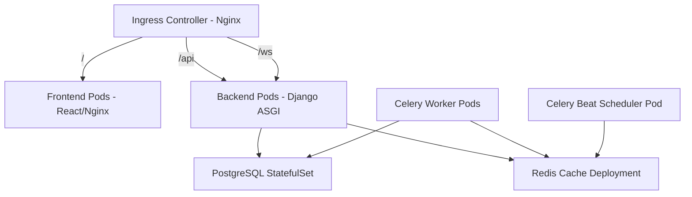

# Falcon PMS — Kubernetes Configurations & Architecture

This document provides complete production-grade Kubernetes manifest files for Falcon PMS and explains how each component integrates into a cluster.

---

## 1. Cluster Architecture Overview



For high availability and multi-tenant scaling, the system is split into:
1.  **Stateful workloads** (Postgres, Redis) — using `StatefulSet` with dedicated `PersistentVolumeClaims` to secure storage.
2.  **Stateless workloads** (Django API, Celery Workers, Frontend Nginx) — using `Deployments` with Horizontal Pod Autoscaling (HPA).
3.  **Ingress Routing** — using an Nginx Ingress Controller with SSL automatic termination.

---

## 2. Namespace & Configuration (`namespace-config.yaml`)

Defines the environment namespace and shared configurations.

```yaml
apiVersion: v1
kind: Namespace
metadata:
  name: falcon-pms
---
apiVersion: v1
kind: ConfigMap
metadata:
  name: falcon-config
  namespace: falcon-pms
data:
  DJANGO_ENV: "production"
  DJANGO_SETTINGS_MODULE: "config.settings.production"
  DB_HOST: "postgres-service"
  DB_PORT: "5432"
  DB_NAME: "falcon_pms"
  CELERY_BROKER_URL: "redis://redis-service:6379/0"
  CELERY_RESULT_BACKEND: "redis://redis-service:6379/0"
  VITE_API_URL: "https://falcon-pms.com/api/v1"
```

---

## 3. Database Layer (`postgres-statefulset.yaml`)

We use a `StatefulSet` instead of a standard `Deployment` for PostgreSQL to guarantee stable network identifiers and persistent disk bindings.

```yaml
apiVersion: v1
kind: Service
metadata:
  name: postgres-service
  namespace: falcon-pms
spec:
  ports:
    - port: 5432
  selector:
    app: postgres
  clusterIP: None
---
apiVersion: apps/v1
kind: StatefulSet
metadata:
  name: postgres
  namespace: falcon-pms
spec:
  serviceName: "postgres-service"
  replicas: 1
  selector:
    matchLabels:
      app: postgres
  template:
    metadata:
      labels:
        app: postgres
    spec:
      containers:
        - name: postgres
          image: postgres:15-alpine
          ports:
            - containerPort: 5432
              name: dbport
          env:
            - name: POSTGRES_DB
              value: "falcon_pms"
            - name: POSTGRES_USER
              value: "postgres"
            - name: POSTGRES_PASSWORD
              valueFrom:
                secretKeyRef:
                  name: falcon-secrets
                  key: postgres-password
          volumeMounts:
            - name: db-data
              mountPath: /var/lib/postgresql/data
  volumeClaimTemplates:
    - metadata:
        name: db-data
      spec:
        accessModes: [ "ReadWriteOnce" ]
        resources:
          requests:
            storage: 20Gi
```

---

## 4. Redis Cache & Broker (`redis-deployment.yaml`)

```yaml
apiVersion: v1
kind: Service
metadata:
  name: redis-service
  namespace: falcon-pms
spec:
  ports:
    - port: 6379
  selector:
    app: redis
---
apiVersion: apps/v1
kind: Deployment
metadata:
  name: redis
  namespace: falcon-pms
spec:
  replicas: 1
  selector:
    matchLabels:
      app: redis
  template:
    metadata:
      labels:
        app: redis
    spec:
      containers:
        - name: redis
          image: redis:7-alpine
          ports:
            - containerPort: 6379
```

---

## 5. Backend Django Service (`backend-deployment.yaml`)

Runs the Django ASGI application inside Daphne/Uvicorn to process both standard REST APIs and WebSocket traffic.

```yaml
apiVersion: v1
kind: Service
metadata:
  name: backend-service
  namespace: falcon-pms
spec:
  ports:
    - port: 8000
      targetPort: 8000
  selector:
    app: backend
---
apiVersion: apps/v1
kind: Deployment
metadata:
  name: backend
  namespace: falcon-pms
spec:
  replicas: 2
  selector:
    matchLabels:
      app: backend
  template:
    metadata:
      labels:
        app: backend
    spec:
      containers:
        - name: backend
          image: your-dockerhub-username/falcon-pms-backend:latest
          ports:
            - containerPort: 8000
          envFrom:
            - configMapRef:
                name: falcon-config
          env:
            - name: DJANGO_SECRET_KEY
              valueFrom:
                secretKeyRef:
                  name: falcon-secrets
                  key: django-secret-key
            - name: DB_PASSWORD
              valueFrom:
                secretKeyRef:
                  name: falcon-secrets
                  key: postgres-password
          readinessProbe:
            httpGet:
              path: /api/v1/health/
              port: 8000
            initialDelaySeconds: 15
            periodSeconds: 10
          livenessProbe:
            httpGet:
              path: /api/v1/health/
              port: 8000
            initialDelaySeconds: 20
            periodSeconds: 15
```

---

## 6. Celery Workers (`celery-deployment.yaml`)

Two deployments: one for executing tasks (autoscaling is useful here), and one single-replica deployment for the cron-scheduler (Celery Beat).

```yaml
apiVersion: apps/v1
kind: Deployment
metadata:
  name: celery-worker
  namespace: falcon-pms
spec:
  replicas: 2
  selector:
    matchLabels:
      app: celery-worker
  template:
    metadata:
      labels:
        app: celery-worker
    spec:
      containers:
        - name: worker
          image: your-dockerhub-username/falcon-pms-backend:latest
          command: ["celery", "-A", "config", "worker", "--loglevel=info"]
          envFrom:
            - configMapRef:
                name: falcon-config
          env:
            - name: DB_PASSWORD
              valueFrom:
                secretKeyRef:
                  name: falcon-secrets
                  key: postgres-password
---
apiVersion: apps/v1
kind: Deployment
metadata:
  name: celery-beat
  namespace: falcon-pms
spec:
  replicas: 1 # Must ALWAYS be exactly 1 to avoid duplicate scheduled tasks
  strategy:
    type: Recreate
  selector:
    matchLabels:
      app: celery-beat
  template:
    metadata:
      labels:
        app: celery-beat
    spec:
      containers:
        - name: beat
          image: your-dockerhub-username/falcon-pms-backend:latest
          command: ["celery", "-A", "config", "beat", "--loglevel=info"]
          envFrom:
            - configMapRef:
                name: falcon-config
          env:
            - name: DB_PASSWORD
              valueFrom:
                secretKeyRef:
                  name: falcon-secrets
                  key: postgres-password
```

---

## 7. Frontend Deployment (`frontend-deployment.yaml`)

```yaml
apiVersion: v1
kind: Service
metadata:
  name: frontend-service
  namespace: falcon-pms
spec:
  ports:
    - port: 80
      targetPort: 80
  selector:
    app: frontend
---
apiVersion: apps/v1
kind: Deployment
metadata:
  name: frontend
  namespace: falcon-pms
spec:
  replicas: 2
  selector:
    matchLabels:
      app: frontend
  template:
    metadata:
      labels:
        app: frontend
    spec:
      containers:
        - name: frontend
          image: your-dockerhub-username/falcon-pms-frontend:latest
          ports:
            - containerPort: 80
```

---

## 8. Ingress Routing (`ingress.yaml`)

Handles DNS mapping, SSL termination (via Let's Encrypt), and routes traffic between React (frontend) and Django (backend APIs / WebSockets).

```yaml
apiVersion: networking.k8s.io/v1
kind: Ingress
metadata:
  name: falcon-ingress
  namespace: falcon-pms
  annotations:
    kubernetes.io/ingress.class: nginx
    cert-manager.io/cluster-issuer: letsencrypt-prod
    nginx.ingress.kubernetes.io/proxy-read-timeout: "3600"
    nginx.ingress.kubernetes.io/proxy-send-timeout: "3600"
spec:
  tls:
    - hosts:
        - falcon-pms.com
      secretName: falcon-tls-secret
  rules:
    - host: falcon-pms.com
      http:
        paths:
          - path: /api/v1
            pathType: Prefix
            backend:
              service:
                name: backend-service
                port:
                  number: 8000
          - path: /ws
            pathType: Prefix
            backend:
              service:
                name: backend-service
                port:
                  number: 8000
          - path: /
            pathType: Prefix
            backend:
              service:
                name: frontend-service
                port:
                  number: 80
```
