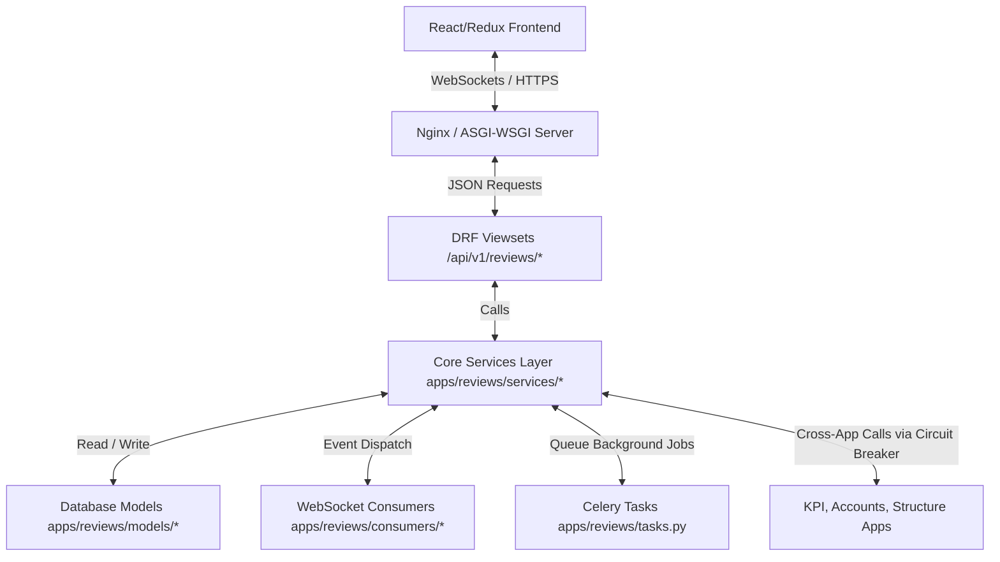
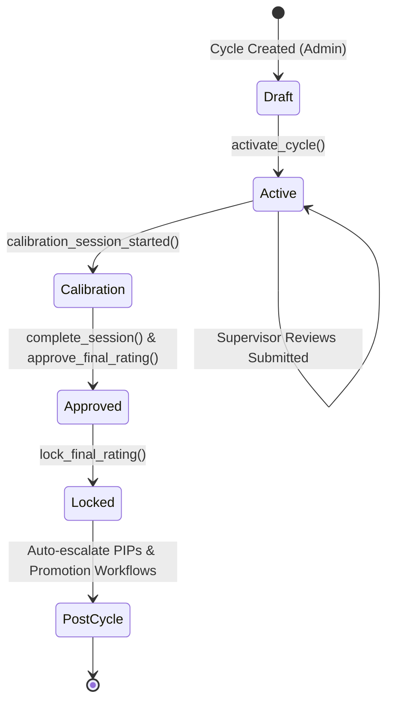
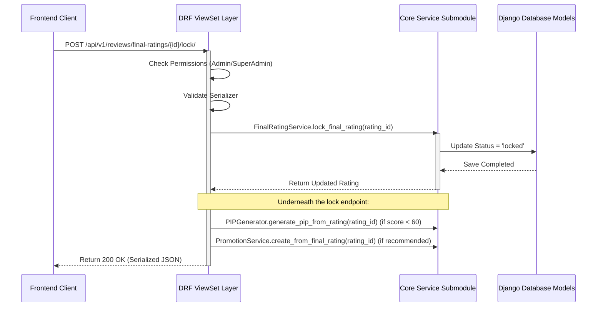

# Falcon PMS Reviews App: Core Services and Architecture Guide

This comprehensive guide details the inner workings, workflows, business logic, and code structures of the **Falcon PMS Reviews App**. It serves as a technical walkthrough of how the backend architecture—composed of Django REST Framework (DRF) viewsets, core service submodules, asynchronous Celery tasks, and real-time Channels (WebSockets)—handles the end-to-end performance review cycle.

---

## Table of Contents
1. [System Architecture & Data Flows](#1-system-architecture--data-flows)
2. [End-to-End Review Cycle State Machine](#2-end-to-end-review-cycle-state-machine)
3. [Deep-Dive: The 18 Services Submodules](#3-deep-dive-the-18-services-submodules)
   - [3.1 Aggregation](#31-aggregation)
   - [3.2 Analytics](#32-analytics)
   - [3.3 Assessment](#33-assessment)
   - [3.4 Audit](#34-audit)
   - [3.5 Availability](#35-availability)
   - [3.6 Calibration](#36-calibration)
   - [3.7 Cycle](#37-cycle)
   - [3.8 Dashboard](#38-dashboard)
   - [3.9 Feedback](#39-feedback)
   - [3.10 Notification](#310-notification)
   - [3.11 PIP (Performance Improvement Plan)](#311-pip-performance-improvement-plan)
   - [3.12 Promotion](#312-promotion)
   - [3.13 Rating](#313-rating)
   - [3.14 Realtime](#314-realtime)
   - [3.15 Reporting](#315-reporting)
   - [3.16 Security](#316-security)
   - [3.17 Settings](#317-settings)
   - [3.18 Sync](#318-sync)
   - [3.19 Tasks (Celery Background Workers)](#319-tasks-celery-background-workers)
4. [API Views and Service Interfacing](#4-api-views-and-service-interfacing)

---

## 1. System Architecture & Data Flows

The Reviews App is a tenant-isolated, modular application designed with a strict separation of concerns.

---

## 2. End-to-End Review Cycle State Machine

A performance review cycle moves through a series of structured steps, managed by the state machine inside [CycleService](file:///d:/Falcon/apps/reviews/services/cycle/cycle_service.py):

1. **Cycle Creation (Draft)**: HR Admin configures weightings (KPIs vs. Competencies), timelines, rating scales, and included departments.
2. **Cycle Activation (Active/Submitted)**: `CycleService.activate_cycle()` automatically provisions draft `SelfAssessment` objects for all eligible employees.
3. **Assessment Phase**: Employees submit self-appraisals; peers submit anonymous 360 feedback; managers complete supervisor reviews.
4. **Calibration Phase**: Managers and HR review rating distributions, adjust outliers, and resolve grading bias.
5. **Approval & Locking**: Ratings are approved and locked, sealing the scores with security hashes.
6. **Post-Cycle Outcomes**: Underperforming employees are routed to PIPs; top performers generate promotion pipelines.

---

## 3. Deep-Dive: The 18 Services Submodules

All core business flows are stored under the [services/](file:///d:/Falcon/apps/reviews/services/) directory.

---

### 3.1 Aggregation
Responsible for computing statistical aggregates and fetching scores across application borders.
* **Core Files**:
  * [competency_aggregator.py](file:///d:/Falcon/apps/reviews/services/aggregation/competency_aggregator.py)
  * [kpi_aggregator.py](file:///d:/Falcon/apps/reviews/services/aggregation/kpi_aggregator.py)
* **Key Logic**:
  * `CompetencyAggregator.get_combined_ratings()` merges raw employee self-ratings and supervisor ratings into a single comparative list, calculating the performance `gap` for each competency.
  * `CompetencyAggregator.calculate_competency_averages()` aggregates supervisor scores to compute averages at the cycle or department level.
  * `KPIAggregator` imports `ScoreAggregator` from the `apps.kpi` module to query user performance metrics for the designated cycle dates. It falls back gracefully to `None` if the KPI app is disabled.

---

### 3.2 Analytics
Caches, calculates, and exposes deep analytical widgets for company, department, and employee performance.
* **Core Files**:
  * [analytics_service.py](file:///d:/Falcon/apps/reviews/services/analytics/analytics_service.py)
  * [insight_service.py](file:///d:/Falcon/apps/reviews/services/analytics/insight_service.py)
  * [predictive_service.py](file:///d:/Falcon/apps/reviews/services/analytics/predictive_service.py)
  * [export_service.py](file:///d:/Falcon/apps/reviews/services/analytics/export_service.py)
  * [report_service.py](file:///d:/Falcon/apps/reviews/services/analytics/report_service.py)
* **Key Logic**:
  * `AnalyticsService` generates company-wide statistics (average scores, standard deviation, rating distribution curves), utilizing Django caching (`django.core.cache`) to limit database hits.
  * `InsightService` scans historical metrics to produce warning or positive highlights (e.g., flagging a significant performance drop compared to the previous cycle or identifying departments with low promotion rates).
  * `PredictiveService` assesses **flight risk** using four key variables: time since last promotion, rating trajectories over the last 3 cycles, active PIP flags, and low peer feedback scores.

---

### 3.3 Assessment
Orchestrates the submission states and evaluations for individual appraisal components.
* **Core Files**:
  * [self_assessment_service.py](file:///d:/Falcon/apps/reviews/services/assessment/self_assessment_service.py)
  * [supervisor_review_service.py](file:///d:/Falcon/apps/reviews/services/assessment/supervisor_review_service.py)
  * [final_rating_service.py](file:///d:/Falcon/apps/reviews/services/assessment/final_rating_service.py)
* **Key Logic**:
  * `FinalRatingService` compiles the employee’s final rating. It grabs the KPI score (via `KPIAggregator`), raw competency averages (via `CompetencyAggregator`), runs them through `ScoreCalculator` weights, applies coefficient modifiers, normalizes the score to rating scale levels, and signs the record.

---

### 3.4 Audit
Provides immutable historical tracing of performance appraisals.
* **Core Files**:
  * [audit_service.py](file:///d:/Falcon/apps/reviews/services/audit/audit_service.py)
* **Key Logic**:
  * `AuditService.log_event()` creates entries in `AuditLog` containing the IP address, user agent, actor ID, target object content types, and a JSON block of field changes.
  * Interacts with [review_audit_middleware.py](file:///d:/Falcon/apps/reviews/middleware/review_audit_middleware.py) to capture requests and trace updates.

---

### 3.5 Availability
Protects the reviews application from cascading failures due to external dependencies.
* **Core Files**:
  * [circuit_breaker.py](file:///d:/Falcon/apps/reviews/services/availability/circuit_breaker.py)
* **Key Logic**:
  * Implements `CircuitBreaker`. If calls to `apps.structure`, `apps.accounts`, or `apps.kpi` fail repeatedly, the breaker opens, stopping requests for a cooldown window (`reset_seconds`) and returning a safe fallback value (such as a 0 count or `None` average).

---

### 3.6 Calibration
Standardizes scoring variations between lenient and strict managers.
* **Core Files**:
  * [calibration_service.py](file:///d:/Falcon/apps/reviews/services/calibration/calibration_service.py)
  * [outlier_detector.py](file:///d:/Falcon/apps/reviews/services/calibration/outlier_detector.py)
* **Key Logic**:
  * `CalibrationService.add_rating_adjustment()` modifies a `FinalRating` score inside an active calibration session. It tracks before and after values, registers a `CalibrationRating` record, and updates the rating status to `calibrated`.
  * `OutlierDetector` uses statistical functions (`mean`, `stdev`) to pinpoint employee ratings that deviate beyond a standard z-score threshold (e.g., 1.5 deviations from the department average). It also identifies "inconsistent managers" whose team scoring averages deviate too far from the overall company average.

---

### 3.7 Cycle
Manages the lifetime and timeline of review periods.
* **Core Files**:
  * [cycle_service.py](file:///d:/Falcon/apps/reviews/services/cycle/cycle_service.py)
* **Key Logic**:
  * `CycleService.activate_cycle()` checks if the start date has passed, updates status to `submitted` (active), provisions self-assessments, and fires notifications.
  * `CycleService.get_cycle_progress()` calculates real-time completion percentages of self-assessments, supervisor reviews, and locked ratings.

---

### 3.8 Dashboard
Aggregates role-based performance widgets for staff, supervisors, executives, and administrators.
* **Core Files**:
  * [staff_dashboard.py](file:///d:/Falcon/apps/reviews/services/dashboard/staff_dashboard.py)
  * [supervisor_dashboard.py](file:///d:/Falcon/apps/reviews/services/dashboard/supervisor_dashboard.py)
  * [executive_dashboard.py](file:///d:/Falcon/apps/reviews/services/dashboard/executive_dashboard.py)
  * [admin_dashboard.py](file:///d:/Falcon/apps/reviews/services/dashboard/admin_dashboard.py)
* **Key Logic**:
  * `StaffDashboardService` maps out a staff member's active tasks, pending 360 feedback inputs, draft self-assessments, active PIP action counts, and upcoming deadlines.
  * Admin and executive dashboards aggregate company metrics, department rankings, system health metrics, and calibration tasks.

---

### 3.9 Feedback
Manages the creation, reminders, and summaries of 360 feedback requests.
* **Core Files**:
  * [feedback_service.py](file:///d:/Falcon/apps/reviews/services/feedback/feedback_service.py)
  * [summary_service.py](file:///d:/Falcon/apps/reviews/services/feedback/summary_service.py)
* **Key Logic**:
  * `FeedbackService` controls requesting feedback from peers, direct reports, or external participants, verifying limits on request counts.
  * `SummaryService.generate_summary()` aggregates feedback text and scores, generating a compiled summary report while maintaining anonymity (if configured).

---

### 3.10 Notification
Orchestrates multi-channel notifications (in-app messages, emails, and WebSocket alerts).
* **Core Files**:
  * [notification_service.py](file:///d:/Falcon/apps/reviews/services/notification/notification_service.py)
* **Key Logic**:
  * Dispatches communications for events like cycle launches, feedback reminders, calibration invites, and PIP creation.
  * Seamlessly interfaces with localized messaging systems and triggers WebSocket alerts for instant frontend UI notifications.

---

### 3.11 PIP (Performance Improvement Plan)
Handles structured performance improvement plans for underperforming employees.
* **Core Files**:
  * [pip_service.py](file:///d:/Falcon/apps/reviews/services/pip/pip_service.py)
  * [pip_generator.py](file:///d:/Falcon/apps/reviews/services/pip/pip_generator.py)
  * [pip_tracker.py](file:///d:/Falcon/apps/reviews/services/pip/pip_tracker.py)
* **Key Logic**:
  * `PIPService` allows managers and HR to establish goals, action items, severity classifications, and timelines.
  * `PIPGenerator` automatically generates a draft PIP for employees when their finalized rating score falls below the designated threshold (e.g., 60%).
  * `PIPTracker` evaluates due dates, flags overdue items, escalates severity on missed milestones, and handles closure states (success, extension, or termination routing).

---

### 3.12 Promotion
Tracks promotion workflows generated from performance reviews.
* **Core Files**:
  * [promotion_service.py](file:///d:/Falcon/apps/reviews/services/promotion/promotion_service.py)
* **Key Logic**:
  * `PromotionService` converts positive review ratings with promotion recommendations into active HR cases.
  * Manages approval hierarchies (pending, approved, rejected, completed), records proposed salaries, and maps actual promotion target dates.

---

### 3.13 Rating
The mathematical engine that computes, applies modifiers, and converts scores.
* **Core Files**:
  * [score_calculator.py](file:///d:/Falcon/apps/reviews/services/rating/score_calculator.py)
  * [coefficient_applicator.py](file:///d:/Falcon/apps/reviews/services/rating/coefficient_applicator.py)
  * [rating_converter.py](file:///d:/Falcon/apps/reviews/services/rating/rating_converter.py)
* **Key Logic**:
  * `ScoreCalculator.calculate_weighted_score()` computes overall scores using defined weights (e.g., 70% KPIs, 30% Competencies). If components are missing, it adjusts the scale mathematically to total 100%.
  * `CoefficientApplicator` checks for individual, position, or department multipliers in `Coefficient` models, scaling the raw performance score up or down (capped at 100.0%).
  * `RatingConverter` translates decimal percentage scores into the correct label, color, and tier defined by the cycle's `RatingScale`.

---

### 3.14 Realtime
Pushes events directly to connected clients using django-channels.
* **Core Files**:
  * [event_broadcaster.py](file:///d:/Falcon/apps/reviews/services/realtime/event_broadcaster.py)
* **Key Logic**:
  * Integrates DRF viewset updates with ASGI Channel Layers.
  * `ReviewsEventBroadcaster._group_send()` transmits events (such as `review_submitted`, `review_approved`, and `metrics_updated`) to target groups like `review_status_{cycle_id}` or `employee_{user_id}`.

---

### 3.15 Reporting
Structures document generation for cycles, PIPs, and calibration results.
* **Core Files**:
  * [review_summary_service.py](file:///d:/Falcon/apps/reviews/services/reporting/review_summary_service.py)   
  * [organization_report_service.py](file:///d:/Falcon/apps/reviews/services/reporting/organization_report_service.py)
  * [pip_report_service.py](file:///d:/Falcon/apps/reviews/services/reporting/pip_report_service.py)
  * [calibration_report_service.py](file:///d:/Falcon/apps/reviews/services/reporting/calibration_report_service.py)
* **Key Logic**:
  * Generates raw report contexts that can be formatted as tables or exported as documents.
  * Compiles employee review history summaries, department-by-department comparisons, active PIP milestones, and calibration adjustment records.

---

### 3.16 Security
Implements security controls aligned with the CIA Triad (Confidentiality, Integrity, Availability).
* **Core Files**:
  * [field_encryption.py](file:///d:/Falcon/apps/reviews/services/security/field_encryption.py)
  * [integrity.py](file:///d:/Falcon/apps/reviews/services/security/integrity.py)
* **Key Logic**:
  * **Confidentiality**: `ReviewFieldEncryptionService` automatically encrypts manager narrative text fields (like `improvement_areas` and `justification`) before saving them to the database using AES encryption via `BackupEncryptionService`. Text is decrypted on the fly for authorized serializers.
  * **Integrity**: `IntegrityService` protects final scores from direct database tampering. It computes a SHA-256 hash from sensitive columns (`final_score`, `kpi_score`, `competency_score`, `updated_at`, `id`) and stores it in the `integrity_checksum` column. The service verifies the checksum when ratings are loaded, logging alerts on any mismatches.

---

### 3.17 Settings
Manages tenant-specific configuration flags.
* **Core Files**:
  * [reviews_settings_service.py](file:///d:/Falcon/apps/reviews/services/settings/reviews_settings_service.py)
* **Key Logic**:
  * Configures review parameters such as whether self-assessments are required, default PIP durations, WebSocket triggers, and audit log rules.

---

### 3.18 Sync
Listens for changes in external applications to trigger reviews recalculations.
* **Core Files**:
  * [dependency_sync.py](file:///d:/Falcon/apps/reviews/services/sync/dependency_sync.py)
  * [resource_sync.py](file:///d:/Falcon/apps/reviews/services/sync/resource_sync.py)
* **Key Logic**:
  * `ReviewsDependencySyncService` reacts when a department, user, or KPI score is updated.
  * When user KPI scores are updated, `on_kpi_score_changed()` triggers `FinalRatingService.recalculate_kpi_component()` to update open final ratings automatically.

---

### 3.19 Tasks (Celery Background Workers)
Executes scheduled routines and resource-intensive processes in background worker queues.
* **Core Files**:
  * [tasks.py](file:///d:/Falcon/apps/reviews/tasks.py)
  * [retry.py](file:///d:/Falcon/apps/reviews/services/tasks/retry.py)
* **Key Tasks**:
  * `check_cycle_deadlines`: A daily cron task that checks cycles and dispatches email reminders to users with pending assessments or reviews.
  * `close_expired_cycles`: Checks for active cycles past their end dates and automatically transitions them to `completed`, initiating final score calculations.
  * `finalize_company_appraisals_chunked_task`: Utilizes a chunked execution pattern (e.g., batches of 100) to safely finalize ratings in larger organizations without timing out.
  * `auto_escalate_pip`: Runs daily to review active PIP milestones, auto-escalating severity or triggering notifications on missed items.

---

## 4. API Views and Service Interfacing

The viewsets in [api/v1/views/](file:///d:/Falcon/apps/reviews/api/v1/views/) bridge the HTTP/JSON interface to the core services layer.

### Primary ViewSet Interface Map:

* **CycleViewSet** ([cycle_views.py](file:///d:/Falcon/apps/reviews/api/v1/views/cycle_views.py))
  * Actions: `activate`, `complete`, `progress`, `archive`.
  * Calls: `CycleService.activate_cycle()`, `CycleService.close_cycle()`, `CycleService.get_cycle_progress()`.
* **SelfAssessmentViewSet** ([self_assessment_views.py](file:///d:/Falcon/apps/reviews/api/v1/views/self_assessment_views.py))
  * Actions: `submit`, `save_draft`.
  * Calls: `SelfAssessmentService.submit_assessment()`.
* **SupervisorReviewViewSet** ([supervisor_review_views.py](file:///d:/Falcon/apps/reviews/api/v1/views/supervisor_review_views.py))
  * Actions: `submit`, `approve`, `reject`, `compare`.
  * Calls: `SupervisorReviewService` and `CompetencyAggregator.get_gap_analysis()`.
* **CalibrationSessionViewSet** ([calibration_views.py](file:///d:/Falcon/apps/reviews/api/v1/views/calibration_views.py))
  * Actions: `start`, `complete`, `add_rating_adjustment`, `outliers`.
  * Calls: `CalibrationService.start_session()`, `CalibrationService.add_rating_adjustment()`, `OutlierDetector.find_outliers()`.
* **FinalRatingViewSet** ([final_rating_views.py](file:///d:/Falcon/apps/reviews/api/v1/views/final_rating_views.py))
  * Actions: `approve`, `lock`, `recalculate`, `generate_pip`.
  * Calls: `FinalRatingService.approve_final_rating()`, `FinalRatingService.lock_final_rating()`, `PIPGenerator.generate_pip_from_rating()`.
* **PIPViewSet** ([pip_views.py](file:///d:/Falcon/apps/reviews/api/v1/views/pip_views.py))
  * Actions: `start`, `complete`, `extend`.
  * Calls: `PIPService.create_pip()`, `PIPService.complete_pip()`, `PIPTracker`.
* **PromotionRecommendationViewSet** ([promotion_views.py](file:///d:/Falcon/apps/reviews/api/v1/views/promotion_views.py))
  * Actions: `approve`, `reject`, `complete`.
  * Calls: `PromotionService.approve_promotion()`, `PromotionService.reject_promotion()`, `PromotionService.mark_completed()`.
