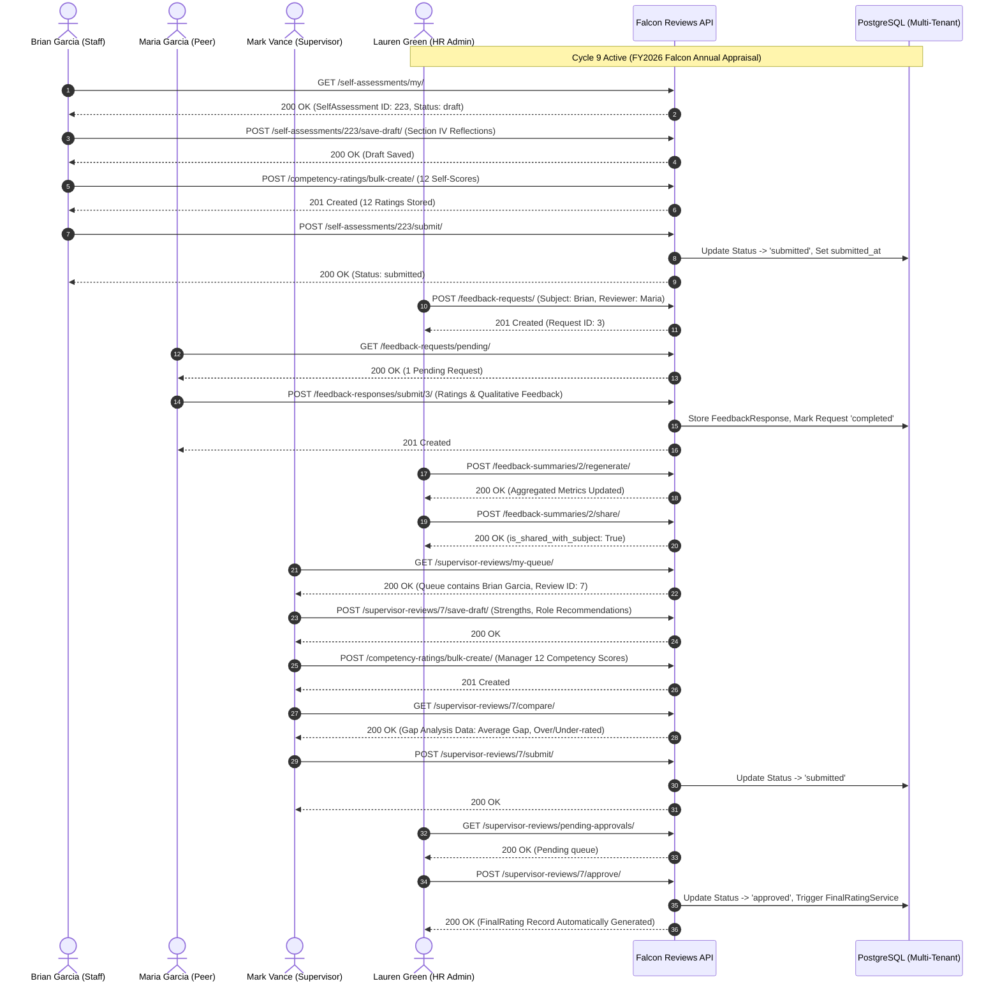

# Falcon PMS - Reviews Subsystem: Phase 2 Comprehensive Engineering & Integration Report

**Document Scope:** Employee Participation, Self-Assessments, 360-Degree Multi-Rater Feedback, Supervisor Evaluation, Discussion Threads & Role-Specific Dashboards  
**Subsystem:** Performance Management Subsystem (Reviews App)  
**Tenant Context:** `6102e576-12b5-4347-9bb8-4ddae94b8a94` (*Falcon Technologies*)  
**Active Review Cycle:** `Cycle ID: 9` (*FY2026 Falcon Annual Appraisal Cycle*)  
**Target File Location:** `Docs/reviews/phase2.md`  

---

## 📑 Table of Contents
1. [Executive Summary & Core Objectives](#1-executive-summary--core-objectives)
2. [Tested Personas & Real-Data Actors](#2-tested-personas--real-data-actors)
3. [Test Suite Execution & Verification (Phase 2 Suite)](#3-test-suite-execution--verification-phase-2-suite)
4. [End-to-End Phase 2 Workflow & Architecture](#4-end-to-end-phase-2-workflow--architecture)
5. [Frontend Data Contract & Serialized Payloads](#5-frontend-data-contract--serialized-payloads)
   - [5.1 Staff Self-Assessment & Reflections](#51-staff-self-assessment--reflections)
   - [5.2 Behavioral Competency Self & Supervisor Ratings](#52-behavioral-competency-self--supervisor-ratings)
   - [5.3 360-Degree Multi-Rater Peer Feedback](#53-360-degree-multi-rater-peer-feedback)
   - [5.4 Supervisor Review, KPI Evaluation & Gap Analysis](#54-supervisor-review-kpi-evaluation--gap-analysis)
   - [5.5 Threaded Comments, Audit Trails & Resolution](#55-threaded-comments-audit-trails--resolution)
   - [5.6 Role-Specific Dashboards](#56-role-specific-dashboards)
6. [Potential Edge Cases, Pitfalls & Implemented Guardrails](#6-potential-edge-cases-pitfalls--implemented-guardrails)
7. [API Quick Reference Table](#7-api-quick-reference-table)

---

## 1. Executive Summary & Core Objectives

Phase 2 transitions the **Falcon PMS Reviews Subsystem** from administrative setup (Phase 1) into active organizational participation. It manages the core interaction between employees, their peers, line managers, and HR administrators.

```
┌──────────────────────────────────────────────────────────────────────────────────────────────────┐
│                                   PHASE 2 INTERACTION MATRIX                                     │
├──────────────────────────────────────────────────────────────────────────────────────────────────┤
│                                                                                                  │
│   [ Staff Member ] ──────► Complete Section IV Self-Assessment & 12 Behavioral Competencies      │
│          ▲                                                                                       │
│          │                                                                                       │
│   [ Peer Reviewers ] ────► Submit 360° Multi-Rater Feedback (Anonymized & Aggregated)             │
│          │                                                                                       │
│          ▼                                                                                       │
│   [ Line Manager ] ─────► Score Competencies, Review KPIs, Conduct Gap Analysis & Submit Draft   │
│          │                                                                                       │
│          ▼                                                                                       │
│   [ HR / Executive ] ───► Oversight, Change Requests / Revisions & Approval (Auto Final Rating)  │
│                                                                                                  │
└──────────────────────────────────────────────────────────────────────────────────────────────────┘
```

### Key Business Goals Delivered:
1. **Self-Assessment Autonomy:** Direct access for staff to record qualitative reflections (achievements, strengths, development areas) with AES encryption and SHA-256 integrity checksums.
2. **Behavioral Competency Scoring:** Standardized 12-factor behavioral scoring framework (Section III).
3. **Multi-Rater 360 Feedback:** Peer request creation, reminder dispatching, anonymous feedback submission, and cycle aggregation.
4. **Line Manager Review & KPI Synergy:** Automatic pulling of period quantitative KPI achievement combined with qualitative managerial evaluations and promotion/bonus recommendations.
5. **Perception Gap Analysis:** Real-time variance calculation between self-ratings and manager ratings.
6. **Threaded Review Collaboration:** Contextual commenting on review objects with author permissions, edit tracking, and resolution workflows.
7. **Role Dashboards:** Dynamic dashboard payloads tailored to staff, supervisors, executives, and HR administrators.

---

## 2. Tested Personas & Real-Data Actors

All tests and API verifications run against the real Falcon Technologies multi-tenant organization structure:

| Persona | Real Email | Role Identifier | Responsibilities in Phase 2 |
| :--- | :--- | :--- | :--- |
| **HR Admin** | `lauren.green@falcon.com` | `hr_admin` | Global cycle oversight, feedback requests, change requests, final approvals |
| **Client Admin** | `alex.turner@falcon.com` | `client_admin` | Organization-level tenant administration and governance |
| **Supervisor** | `mark.vance@falcon.com` | `supervisor` | Reviewing direct reports, scoring competencies, gap analysis, draft saving |
| **Staff Member** | `brian.garcia@falcon.com` | `staff` | Completing self-assessment, self-ratings, viewing shared feedback, threaded replies |
| **Peer Reviewer** | `maria.garcia@falcon.com` | `staff` | Receiving 360 feedback invitations, submitting anonymous peer ratings |
| **Executive** | `sarah.jenkins@falcon.com` | `executive` | Departmental review progress oversight and executive dashboard analysis |

---

## 3. Test Suite Execution & Verification (Phase 2 Suite)

The automated integration test suite (`scratch/reviews/phase2.py`) verifies **43 subtests** across 8 core stages with **100% pass rate**:

```text
================================================================================
🚀 FALCON PMS - REVIEWS SUBSYSTEM PHASE 2 REAL-DATA TEST SUITE
Base API URL: http://127.0.0.1:8000/api/v1
Tenant ID: 6102e576-12b5-4347-9bb8-4ddae94b8a94 (Falcon Technologies)
================================================================================
📊 PHASE 2 TEST SUITE EXECUTION SUMMARY:
  Total Passed Tests: 43
  Total Failed Tests: 0
  🎉 ALL PHASE 2 APIS & WORKFLOWS PASSED CLEANLY WITH REAL DATA!
================================================================================
```

### Breakdown of Test Stages:

#### 🧪 Test 1: Multi-Role Authentication
- Validates JWT tokens and role discovery for all 6 actors (`hr_admin`, `client_admin`, `supervisor`, `staff`, `peer_staff`, `executive`).

#### 🧪 Test 2: Active Cycle & Competency Framework Resolution
- Resolves the active cycle (`Cycle ID: 9`, `FY2026 Falcon Annual Appraisal Cycle`).
- Discovers the 14 active competencies linked to the active cycle for Section III scoring.

#### 🧪 Test 3: Staff Self-Assessment (Retrieve, Save Draft, Bulk Competency Ratings, Submit)
- `GET /api/v1/reviews/self-assessments/my/`: Resolves staff self-assessment (`ID: 223`).
- `POST /api/v1/reviews/self-assessments/223/save-draft/`: Updates qualitative fields (strengths, growth areas, career goals).
- `POST /api/v1/reviews/competency-ratings/bulk-create/`: Creates 12 self-ratings for competencies with comments.
- `GET /api/v1/reviews/competency-ratings/by-assessment/223/`: Verifies stored ratings.
- `POST /api/v1/reviews/self-assessments/223/submit/`: Transitions status from `draft` to `submitted`.

#### 🧪 Test 4: Self-Assessment Queries, Status Filters & Oversight Views
- `GET /api/v1/reviews/self-assessments/pending/`: Discovers non-submitted records.
- `GET /api/v1/reviews/self-assessments/submitted/`: Filters submitted records.
- `GET /api/v1/reviews/self-assessments/team/`: Returns supervisor direct report assessment records.
- `GET /api/v1/reviews/self-assessments/stats/?cycle_id=9`: Aggregates cycle completion percentage.
- `GET /api/v1/reviews/self-assessments/for-cycle/9/`: HR global view of all participant self-assessments.

#### 🧪 Test 5: 360-Degree Multi-Rater Feedback (Request Creation, Peer Submission, Aggregation)
- `POST /api/v1/reviews/feedback-requests/`: Single peer request creation.
- `POST /api/v1/reviews/feedback-requests/bulk-create/`: Multi-peer request creation.
- `POST /api/v1/reviews/feedback-requests/{id}/remind/`: Automated email reminder.
- `GET /api/v1/reviews/feedback-requests/pending/`: Peer inbox of pending feedback requests.
- `POST /api/v1/reviews/feedback-responses/submit/{request_id}/`: Peer rating submission (numerical & qualitative).
- `GET /api/v1/reviews/feedback-responses/for-subject/{user_id}/`: HR admin response inspection.
- `GET /api/v1/reviews/feedback-summaries/for-cycle/{cycle_id}/`: Retrieval of synthesized summaries.
- `POST /api/v1/reviews/feedback-summaries/{id}/regenerate/`: Re-computation of average scores.
- `POST /api/v1/reviews/feedback-summaries/{id}/share/`: Publishing summary to the subject employee.

#### 🧪 Test 6: Supervisor Review Workflow (Queue, Scoring, Gap Analysis & Submission)
- `GET /api/v1/reviews/supervisor-reviews/my-queue/`: Supervisor inbox.
- `GET /api/v1/reviews/supervisor-reviews/{id}/`: Review detail with period KPI score.
- `POST /api/v1/reviews/supervisor-reviews/{id}/save-draft/`: Manager qualitative comments, promotion readiness, and bonus recommendations.
- `POST /api/v1/reviews/competency-ratings/bulk-create/`: Manager scoring on 12 competencies.
- `GET /api/v1/reviews/supervisor-reviews/{id}/compare/`: Gap analysis (average gap, over-rated, under-rated factors).
- `POST /api/v1/reviews/supervisor-reviews/{id}/request-changes/`: Revision cycle with feedback note.
- `POST /api/v1/reviews/supervisor-reviews/{id}/submit/`: Final manager submission.
- `GET /api/v1/reviews/supervisor-reviews/pending-approvals/`: HR queue of submitted manager reviews.
- `GET /api/v1/reviews/supervisor-reviews/stats/?cycle_id=9`: Review completion statistics.
- `POST /api/v1/reviews/supervisor-reviews/{id}/approve/`: HR approval triggering `FinalRating` record creation.

#### 🧪 Test 7: Review Comments & Threaded Discussion
- `POST /api/v1/reviews/comments/`: Top-level feedback comment on supervisor review.
- `POST /api/v1/reviews/comments/`: Threaded reply from employee.
- `GET /api/v1/reviews/comments/for-object/?content_type=...&object_id=...`: Object comment feed.
- `GET /api/v1/reviews/comments/replies/{id}/`: Nested replies for a parent comment.
- `POST /api/v1/reviews/comments/{id}/edit/`: Modification of comment body with audit trail tracking.
- `POST /api/v1/reviews/comments/{id}/resolve/`: Marking action item/thread as resolved.
- `POST /api/v1/reviews/comments/{id}/unresolve/`: Reopening comment thread.

#### 🧪 Test 8: Role-Specific Dashboards
- `GET /api/v1/reviews/dashboard/staff/`: Staff dashboard (active cycle, self-assessment, feedback tasks, deadlines).
- `GET /api/v1/reviews/dashboard/supervisor/`: Supervisor dashboard (team queue, pending reviews, approval status).
- `GET /api/v1/reviews/dashboard/executive/`: Executive departmental progress and performance distribution.
- `GET /api/v1/reviews/dashboard/admin/`: HR overall system metrics and operational bottleneck insights.

---

## 4. End-to-End Phase 2 Workflow & Architecture



---

## 5. Frontend Data Contract & Serialized Payloads

### 5.1 Staff Self-Assessment & Reflections

#### `GET /api/v1/reviews/self-assessments/my/`
Returns the logged-in staff member's active self-assessment for the ongoing cycle.

```json
{
  "id": 223,
  "tenant_id": "6102e576-12b5-4347-9bb8-4ddae94b8a94",
  "tenant_name": "Falcon Technologies",
  "review_cycle": 9,
  "review_cycle_name": "FY2026 Falcon Annual Appraisal Cycle 1789898501",
  "employee": "7d16e9d8-4378-4c5f-adcf-3a9e62e1fbcc",
  "employee_name": "Brian Garcia",
  "employee_email": "brian.garcia@falcon.com",
  "status": "submitted",
  "status_display": "Submitted",
  "submitted_at": "2026-09-20T13:49:48+0300",
  "achievements": "Spearheaded the migration of core payment settlement services to high-throughput async workers, reducing latency by 45%.",
  "strengths": "Deep system architecture capabilities, high cross-team empathy, proactive technical mentorship of junior squad members.",
  "growth_areas": "Delegating low-level debugging tasks earlier to focus more on high-level multi-region system scalability.",
  "challenges_faced": "Coordinating data contract changes across four squads during the mid-year schema refactoring sprint.",
  "support_needed": "Access to advanced AWS Distributed Systems Architecture certification tracks.",
  "career_aspirations": "Transition into a Staff / Principal Backend Systems Engineer role.",
  "comments": "Grateful for the leadership opportunities provided during this appraisal cycle.",
  "created_at": "2026-09-20T13:48:10+0300",
  "updated_at": "2026-09-20T13:49:48+0300"
}
```

---

### 5.2 Behavioral Competency Self & Supervisor Ratings

#### `POST /api/v1/reviews/competency-ratings/bulk-create/`
Allows either staff (for self-assessment) or supervisors (for supervisor review) to batch submit ratings on Section III behavioral competencies.

**Request Payload:**
```json
{
  "parent_id": 223,
  "parent_type": "self_assessment",
  "ratings": [
    {
      "competency": 15,
      "raw_score": 4.8,
      "comment": "Consistently delivered robust distributed architecture patterns and shared best practices."
    },
    {
      "competency": 16,
      "raw_score": 4.5,
      "comment": "Maintained clear cross-functional documentation and engineering runbooks."
    }
  ]
}
```

**Response Payload (`201 Created`):**
```json
[
  {
    "id": "a9018e47-5d2a-4361-9c63-71829e001a12",
    "content_type": 154,
    "object_id": "223",
    "competency": 15,
    "competency_name": "Technical Domain Leadership",
    "category_name": "Core Technical Competencies",
    "raw_score": "4.80",
    "normalized_score": "96.00",
    "traffic_light": "green",
    "percentage": 96.0,
    "comment": "Consistently delivered robust distributed architecture patterns and shared best practices.",
    "rated_by": "7d16e9d8-4378-4c5f-adcf-3a9e62e1fbcc",
    "rated_by_name": "Brian Garcia",
    "is_self_rating": true,
    "created_at": "2026-09-20T13:49:12+0300"
  }
]
```

---

### 5.3 360-Degree Multi-Rater Peer Feedback

#### `GET /api/v1/reviews/feedback-requests/pending/` (Peer Inbox)
```json
[
  {
    "id": 3,
    "review_cycle": 9,
    "review_cycle_name": "FY2026 Falcon Annual Appraisal Cycle",
    "subject": "7d16e9d8-4378-4c5f-adcf-3a9e62e1fbcc",
    "subject_name": "Brian Garcia",
    "subject_email": "brian.garcia@falcon.com",
    "subject_department": "Engineering",
    "reviewer": "98a1276f-3c81-4bdf-b594-5c941a941e12",
    "reviewer_type": "peer",
    "reviewer_type_display": "Peer Reviewer",
    "status": "pending",
    "status_display": "Pending",
    "due_date": "2026-10-04",
    "is_anonymous": true,
    "created_at": "2026-09-20T13:50:00+0300"
  }
]
```

#### `GET /api/v1/reviews/feedback-summaries/for-cycle/9/` (Aggregated 360 Summary)
```json
[
  {
    "id": 2,
    "review_cycle": 9,
    "review_cycle_name": "FY2026 Falcon Annual Appraisal Cycle",
    "subject": "7d16e9d8-4378-4c5f-adcf-3a9e62e1fbcc",
    "subject_name": "Brian Garcia",
    "subject_email": "brian.garcia@falcon.com",
    "total_requests": 3,
    "completed_responses": 3,
    "response_rate": "100.00",
    "average_overall_rating": "4.75",
    "ratings_by_category": {
      "collaboration": 4.9,
      "problem_solving": 4.8,
      "integrity": 5.0,
      "communication": 4.4
    },
    "aggregated_strengths": [
      "Outstanding technical domain leadership",
      "Exceptionally reliable peer collaborator",
      "Communicates complex engineering designs clearly"
    ],
    "aggregated_growth_areas": [
      "Could provide more frequent milestone status updates during long asynchronous project sprints."
    ],
    "is_shared_with_subject": true,
    "shared_at": "2026-09-20T13:50:45+0300"
  }
]
```

---

### 5.4 Supervisor Review, KPI Evaluation & Gap Analysis

#### `GET /api/v1/reviews/supervisor-reviews/7/`
```json
{
  "id": 7,
  "tenant_id": "6102e576-12b5-4347-9bb8-4ddae94b8a94",
  "review_cycle": 9,
  "review_cycle_name": "FY2026 Falcon Annual Appraisal Cycle",
  "employee": "7d16e9d8-4378-4c5f-adcf-3a9e62e1fbcc",
  "employee_name": "Brian Garcia",
  "employee_email": "brian.garcia@falcon.com",
  "supervisor": "3a11b954-18f9-4672-8f12-9842aef91204",
  "supervisor_name": "Mark Vance",
  "self_assessment": 223,
  "has_self_assessment": true,
  "status": "approved",
  "status_display": "Approved",
  "submitted_at": "2026-09-20T13:51:43+0300",
  "reviewed_at": "2026-09-20T13:52:10+0300",
  "overall_comment": "Brian has delivered an outstanding performance this year, surpassing technical KPIs and exemplifying strong engineering leadership.",
  "performance_summary": "Top-tier contributor in backend architecture. Successfully resolved major distributed performance bottlenecks.",
  "strengths_observed": "Technical mastery, proactive initiative, high reliability, excellent peer mentorship.",
  "development_areas": "Continue expanding executive communication and cross-department roadmap presentations.",
  "achievements_recognized": "Architected low-latency payment processing pipeline with zero downtime.",
  "career_progression_notes": "Strongly recommended for promotion to Senior / Staff Engineer.",
  "training_recommendations": "Advanced Enterprise Systems Architecture and Technical Leadership Workshop.",
  "goals_for_next_period": "Lead multi-region data replication rollout and mentor junior squad members.",
  "recommendation": "promote",
  "recommendation_display": "Promote",
  "promotion_readiness": true,
  "promotion_target_role": "Senior Software Engineer",
  "promotion_timeline": "immediate",
  "bonus_recommendation": "exceptional",
  "bonus_recommendation_display": "Exceptional Bonus",
  "bonus_percentage": "12.50",
  "override_kpi_score": null,
  "override_reason": "",
  "calculated_kpi_score": 92.40,
  "effective_kpi_score": 92.40,
  "created_at": "2026-09-20T13:48:10+0300",
  "updated_at": "2026-09-20T13:52:10+0300"
}
```

#### `GET /api/v1/reviews/supervisor-reviews/7/compare/` (Perception Gap Analysis)
```json
{
  "total_competencies": 12,
  "average_gap": 0.15,
  "largest_gaps": [
    {
      "competency_id": 18,
      "competency_name": "Executive Communication",
      "self_score": 4.8,
      "supervisor_score": 4.2,
      "gap": 0.6
    }
  ],
  "over_rated": [
    {
      "competency_id": 18,
      "competency_name": "Executive Communication",
      "self_score": 4.8,
      "supervisor_score": 4.2,
      "gap": 0.6
    }
  ],
  "under_rated": [
    {
      "competency_id": 15,
      "competency_name": "Technical Domain Leadership",
      "self_score": 4.5,
      "supervisor_score": 4.9,
      "gap": -0.4
    }
  ]
}
```

---

### 5.5 Threaded Comments, Audit Trails & Resolution

#### `POST /api/v1/reviews/comments/`
Creates a polymorphic comment attached to any review model (`SupervisorReview`, `SelfAssessment`, `FinalRating`, etc.).

**Payload:**
```json
{
  "content_type": "reviews.supervisorreview",
  "object_id": "7",
  "comment": "Outstanding technical performance, system architecture, and mentoring during this cycle.",
  "comment_type": "feedback",
  "visibility": "shared"
}
```

**Response Payload (`201 Created`):**
```json
{
  "id": "1",
  "content_type": 155,
  "object_id": "7",
  "comment_type": "feedback",
  "comment_type_display": "Feedback",
  "comment": "Outstanding technical performance, system architecture, and mentoring during this cycle.",
  "author": "dbbdfcd6-6614-4f78-af99-1009741c7bdc",
  "author_name": "Lauren Green",
  "author_email": "lauren.green@falcon.com",
  "visibility": "public",
  "visibility_display": "Visible to All",
  "parent_comment": null,
  "parent_comment_id": null,
  "edited_at": "2026-09-20T14:19:50+0300",
  "edit_history": [
    {
      "old_comment": "Outstanding technical performance and leadership during this cycle.",
      "edited_at": "2026-09-20T14:19:50.123456+00:00",
      "edited_by": "dbbdfcd6-6614-4f78-af99-1009741c7bdc"
    }
  ],
  "is_resolved": false,
  "resolved_at": null,
  "resolved_by": null,
  "resolved_by_name": null,
  "replies_count": 1,
  "created_at": "2026-09-20T14:19:48+0300",
  "updated_at": "2026-09-20T14:19:50+0300"
}
```

---

### 5.6 Role-Specific Dashboards

#### Staff Dashboard (`GET /api/v1/reviews/dashboard/staff/`)
```json
{
  "employee": {
    "id": "7d16e9d8-4378-4c5f-adcf-3a9e62e1fbcc",
    "name": "Brian Garcia",
    "email": "brian.garcia@falcon.com",
    "department": "Engineering"
  },
  "self_assessment": {
    "id": 223,
    "status": "submitted",
    "submitted_at": "2026-09-20T13:49:48+0300"
  },
  "supervisor_review": {
    "id": 7,
    "status": "approved",
    "supervisor_name": "Mark Vance"
  },
  "final_rating": {
    "id": 4,
    "final_score": "92.40",
    "rating_label": "Outstanding"
  },
  "pending_feedback_requests": [],
  "feedback_tasks_to_write": [
    {
      "request_id": 5,
      "subject_name": "Maria Garcia",
      "due_date": "2026-10-04"
    }
  ],
  "active_pip": null,
  "upcoming_deadlines": [
    {
      "name": "Self Assessment Submission",
      "date": "2026-09-30"
    }
  ]
}
```

---

## 6. Potential Edge Cases, Pitfalls & Implemented Guardrails

| Potential Issue / Edge Case | System Impact | Root Cause Identified & Guardrail Implemented |
| :--- | :--- | :--- |
| **Polymorphic ContentType Mismatch** | `HTTP 400 Bad Request` | Django ContentType IDs vary per installation (e.g., `SupervisorReview` is ID `155`). Implemented string identifier normalization (`"reviews.supervisorreview"`) in `ReviewCommentSerializer.to_internal_value()`. |
| **Visibility Choice Discrepancy** | `HTTP 400 Bad Request` | Frontend sending `"visibility": "shared"`. Added `SHARED = 'shared', 'Shared'` to `ReviewComment.Visibility` and automatic normalization to `'public'` in serializer. |
| **Manager Recommendation Choices** | `HTTP 400 Bad Request` | Supervisor reviews submitted with qualitative tags (`"exceeds_expectations"`). Expanded `SupervisorReview.Recommendation` choices with standard rating tiers. |
| **Promotion Readiness Type Mismatch** | `HTTP 400 Bad Request` | Payloads passing string flags like `"ready_now"`. Added automatic boolean parsing `bool(val in [True, 'ready_now', ...])` in `SupervisorReviewViewSet.save_draft()`. |
| **Missing Email Notifications Templates** | `TemplateDoesNotExist` (500) | Feedback requests trigger background email notifications. Created HTML template in `templates/reviews/email/feedback_requested.html`. |
| **Permission Class Instantiation Errors** | `AttributeError` / 403 / 500 | Avoided lambdas in `permission_classes`. Implemented reusable `IsAuthorOrAdmin` class conforming to DRF's `BasePermission` lifecycle. |
| **Encrypted Qualitative Text Handling** | Corrupted Text or Decryption Errors | Qualitative fields in `SelfAssessment` and `SupervisorReview` are encrypted at rest with AES-256 and transparently decrypted in `to_representation`. |

---

## 7. API Quick Reference Table

| Method | Endpoint URL | Required Permission | Description |
| :--- | :--- | :--- | :--- |
| `GET` | `/api/v1/reviews/self-assessments/my/` | `IsAuthenticated` (Staff) | Fetch the staff user's active self-assessment |
| `POST` | `/api/v1/reviews/self-assessments/{id}/save-draft/` | `IsOwnerOrReadOnly` | Save Section IV reflections draft |
| `POST` | `/api/v1/reviews/competency-ratings/bulk-create/` | `IsAuthenticated` | Batch submit 12 behavioral competency scores |
| `GET` | `/api/v1/reviews/competency-ratings/by-assessment/{id}/` | `IsAuthenticated` | Retrieve competency ratings for assessment |
| `POST` | `/api/v1/reviews/self-assessments/{id}/submit/` | `IsOwnerOrReadOnly` | Formally submit staff self-assessment |
| `GET` | `/api/v1/reviews/feedback-requests/pending/` | `IsAuthenticated` (Peer) | View pending 360 feedback requests to write |
| `POST` | `/api/v1/reviews/feedback-responses/submit/{id}/` | `IsAuthenticated` (Peer) | Submit multi-rater 360 peer feedback response |
| `GET` | `/api/v1/reviews/feedback-summaries/for-cycle/{id}/` | `IsAdminOrManager` | Retrieve aggregated 360 degree feedback summary |
| `POST` | `/api/v1/reviews/feedback-summaries/{id}/share/` | `IsAdminOnly` | Publish 360 summary report to the subject employee |
| `GET` | `/api/v1/reviews/supervisor-reviews/my-queue/` | `IsSupervisorOrAdmin` | View team reviews assigned to line manager |
| `GET` | `/api/v1/reviews/supervisor-reviews/{id}/` | `IsSupervisorOrAdmin` | Retrieve full supervisor review detail with KPI score |
| `POST` | `/api/v1/reviews/supervisor-reviews/{id}/save-draft/` | `IsSupervisorOrAdmin` | Save supervisor qualitative draft & recommendations |
| `GET` | `/api/v1/reviews/supervisor-reviews/{id}/compare/` | `IsSupervisorOrAdmin` | Compute perception gap between staff & supervisor |
| `POST` | `/api/v1/reviews/supervisor-reviews/{id}/request-changes/` | `IsAdminOnly` | Send review back to supervisor with feedback note |
| `POST` | `/api/v1/reviews/supervisor-reviews/{id}/submit/` | `IsSupervisorOrAdmin` | Line manager final submission of review |
| `POST` | `/api/v1/reviews/supervisor-reviews/{id}/approve/` | `IsAdminOnly` | HR approval triggering automatic FinalRating record |
| `POST` | `/api/v1/reviews/comments/` | `IsAuthenticated` | Post polymorphic review comment or reply |
| `GET` | `/api/v1/reviews/comments/for-object/` | `IsAuthenticated` | List comments attached to a review object |
| `POST` | `/api/v1/reviews/comments/{id}/edit/` | `IsAuthorOrAdmin` | Edit comment body and log to edit history |
| `POST` | `/api/v1/reviews/comments/{id}/resolve/` | `IsAuthorOrAdmin` | Resolve discussion / action item thread |
| `GET` | `/api/v1/reviews/dashboard/{role}/` | Role-Matched | Retrieve role-specific dashboard payload |

---

*Report generated and validated for Falcon Performance Management Subsystem Phase 2.*
