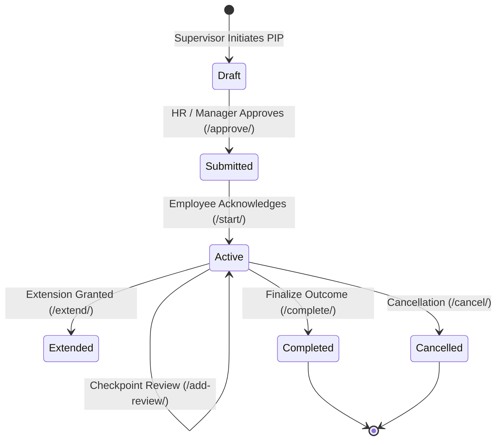
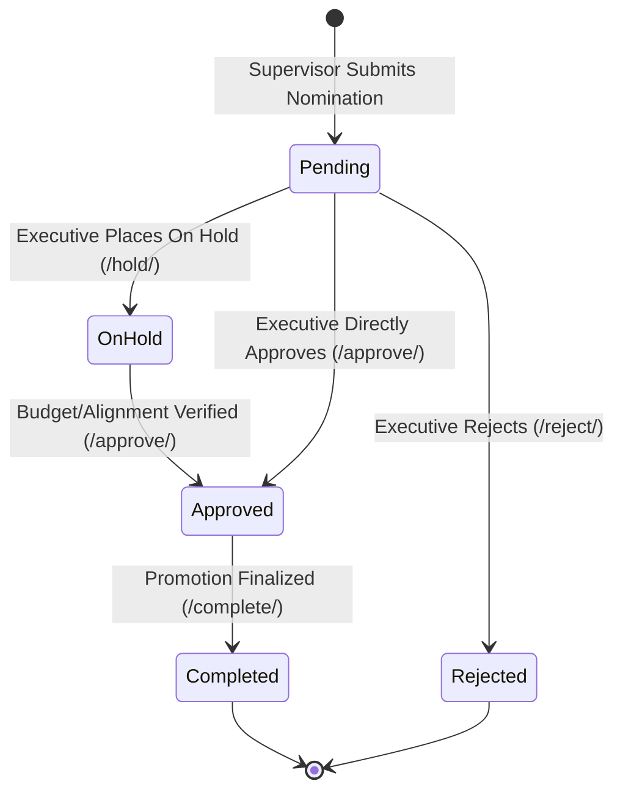

# Falcon PMS - Reviews Subsystem: Phase 5 Comprehensive Engineering & Integration Report

**Document Scope:** Role-Based Dashboards, Performance Improvement Plans (PIPs), Promotion Recommendations, Advanced Analytics & Predictive Insights, Threaded Review Comments, Health Diagnostics, Subsystem Settings & RBAC Enforcement  
**Subsystem:** Performance Management Subsystem (Reviews App)  
**Tenant Context:** `6102e576-12b5-4347-9bb8-4ddae94b8a94` (*Falcon Technologies*)  
**Active Review Cycle:** `Cycle ID: 9` (*FY2026 Falcon Annual Appraisal Cycle*)  
**Target File Location:** `Docs/reviews/phase5.md`  

---

## 📑 Table of Contents
1. [Executive Summary & Core Objectives](#1-executive-summary--core-objectives)
2. [Tested Personas & Real-Data Actors](#2-tested-personas--real-data-actors)
3. [Test Suite Execution & Verification (Phase 5 Suite)](#3-test-suite-execution--verification-phase-5-suite)
4. [End-to-End Phase 5 Architecture & Lifecycles](#4-end-to-end-phase-5-architecture--lifecycles)
   - [4.1 Role-Based Performance Review Dashboards](#41-role-based-performance-review-dashboards)
   - [4.2 Performance Improvement Plan (PIP) Lifecycle](#42-performance-improvement-plan-pip-lifecycle)
   - [4.3 Promotion Recommendations Pipeline](#43-promotion-recommendations-pipeline)
   - [4.4 Threaded Review Comments & Audit Trails](#44-threaded-review-comments--audit-trails)
   - [4.5 Performance Analytics, Trend Modeling & Predictive Insights](#45-performance-analytics-trend-modeling--predictive-insights)
   - [4.6 Diagnostics, Reference Data & System Configuration](#46-diagnostics-reference-data--system-configuration)
   - [4.7 Role-Based Access Control (RBAC) & Boundary Isolation](#47-role-based-access-control-rbac--boundary-isolation)
5. [Frontend Data Contracts & Serialized Payloads](#5-frontend-data-contracts--serialized-payloads)
   - [5.1 Role-Specific Performance Dashboards](#51-role-specific-performance-dashboards)
   - [5.2 PIP Full Lifecycle API Payloads](#52-pip-full-lifecycle-api-payloads)
   - [5.3 Promotion Recommendations Pipeline Payloads](#53-promotion-recommendations-pipeline-payloads)
   - [5.4 Threaded Review Comments & Resolution Payloads](#54-threaded-review-comments--resolution-payloads)
   - [5.5 Analytics, Insights & Predictive Risk Payloads](#55-analytics-insights--predictive-risk-payloads)
   - [5.6 Health & Reference Data Payloads](#56-health--reference-data-payloads)
6. [Potential Edge Cases, Pitfalls & Implemented Guardrails](#6-potential-edge-cases-pitfalls--implemented-guardrails)
7. [API Quick Reference Table](#7-api-quick-reference-table)

---

## 1. Executive Summary & Core Objectives

Phase 5 delivers the post-appraisal action pipelines, executive intelligence dashboards, operational remedial workflows, talent advancement pipelines, collaborative review annotations, and predictive turnover risk models for the Falcon Performance Management Subsystem.

```
┌──────────────────────────────────────────────────────────────────────────────────────────────────┐
│                                 PHASE 5 OPERATIONAL & ANALYTICS ECOSYSTEM                         │
├──────────────────────────────────────────────────────────────────────────────────────────────────┤
│                                                                                                  │
│   ┌───────────────────────────┐    ┌───────────────────────────┐    ┌─────────────────────────┐  │
│   │   Role-Based Dashboards   │    │  Performance Remediation  │    │   Talent Advancement    │  │
│   │  - Staff Performance      │    │  - PIP Initiation         │    │  - Promotion Submit     │  │
│   │  - Supervisor Team View   │    │  - Milestone Checkpoints  │    │  - Hold / Budget Review │  │
│   │  - Executive Overview     │    │  - Action Verification    │    │  - Executive Approval   │  │
│   │  - HR Admin Ops Center    │    │  - Outcome Finalization   │    │  - Role Transition      │  │
│   └─────────────┬─────────────┘    └─────────────┬─────────────┘    └────────────┬────────────┘  │
│                 │                                │                               │               │
│                 ▼                                ▼                               ▼               │
│   ┌───────────────────────────────────────────────────────────────────────────────────────────┐  │
│   │                   Collaborative Threaded Comments & Audit Logging                         │  │
│   │      (Contextual Annotations, Multi-Tier Visibility, Resolution & Historical Trail)       │  │
│   └─────────────────────────────────────────────┬─────────────────────────────────────────────┘  │
│                                                 │                                                │
│                                                 ▼                                                │
│   ┌───────────────────────────────────────────────────────────────────────────────────────────┐  │
│   │                      Advanced Analytics & Predictive AI Engine                            │  │
│   │   - Company & Dept Scoring       - Manager Rating Inflation/Deflation Detection           │  │
│   │   - Competency Skill Gap Curves  - Predictive Flight Risk Modeling & Turnover Alerts      │  │
│   │   - 12-Month Performance Trends  - Cached Data Refresh & Invalidation Engine              │  │
│   └───────────────────────────────────────────────────────────────────────────────────────────┘  │
│                                                                                                  │
└──────────────────────────────────────────────────────────────────────────────────────────────────┘
```

### Key Business Goals Delivered:
1. **Targeted Role-Based Dashboards:** Specialized real-time cockpits for Staff, Supervisors, Executives, and HR Administrators aggregating active appraisal actions, milestone deadlines, completion percentages, and team status.
2. **End-to-End Performance Improvement Plans (PIP):** Multi-stage corrective pipeline allowing managers to initiate formal plans with specific improvement areas, track actionable deliverables with evidence verification, record formal milestone reviews, and finalize outcomes (`successful`, `extended`, `failed`, `terminated`, `resigned`).
3. **Structured Promotion Pipeline:** Governance pipeline allowing supervisors to nominate top performers with justification and proposed salary adjustments, with state transitions (`pending`, `on_hold`, `approved`, `rejected`, `completed`) under executive/HR approval gating.
4. **Encrypted Threaded Review Comments:** Object-agnostic commenting subsystem supporting hierarchical comment threads on review cycles, self-assessments, supervisor reviews, and calibration sessions with edit audit history and resolution status.
5. **Organizational Analytics & Trend Engine:** Automated statistical aggregation of company-wide averages, department rankings, rating distribution bell curves, 6-12 month longitudinal performance trends, and competency skill gap identification.
6. **Predictive Flight Risk & Manager Inflation Models:** Algorithmic risk evaluation detecting stagnant promotions, sudden performance drops, unresolved PIPs, and identifying rating inflation/deflation among supervisors.
7. **Bulletproof Security & RBAC Enforcement:** Complete isolation of sensitive dashboards, admin endpoints, and comment modification actions across organizational roles.

---

## 2. Tested Personas & Real-Data Actors

All Phase 5 endpoints have been verified using real database actors within the **Falcon Technologies** tenant (`6102e576-12b5-4347-9bb8-4ddae94b8a94`):

| Persona | Name | Email | System User ID | Role in Phase 5 Lifecycle |
| :--- | :--- | :--- | :--- | :--- |
| **HR Admin** | Lauren Green | `lauren.green@falcon.com` | `3d688cfb-6901-447d-8153-fbe567ad00c8` | Dashboard Administrator, PIP Approver/Locker, Analytics Inspector, Comment Moderator |
| **Executive** | Sarah Jenkins | `sarah.jenkins@falcon.com` | `dbbdfcd6-6614-4f78-af99-1009741c7bdc` | Executive Dashboard Viewer, Promotion Approver, Org-Wide Insights Consumer |
| **Supervisor** | Mark Vance | `mark.vance@falcon.com` | `2a6889f3-81fb-4f93-a5cb-e23ae82c657f` | Team Dashboard Owner, PIP Initiator/Manager, Promotion Recommender |
| **Client Admin** | Alex Turner | `alex.turner@falcon.com` | `c40b8ee8-df6c-4861-a4b5-68ffc4ce63b8` | Tenant Super-Auditor, Security Enforcer, Subsystem Settings Authority |
| **Staff Reviewee** | Brian Garcia | `brian.garcia@falcon.com` | `7d16e9d8-4378-4c5f-adcf-3a9e62e1fbcc` | Staff Dashboard Viewer, PIP Acknowledgee, Own PIP Tracker (`/pips/my/`) |

---

## 3. Test Suite Execution & Verification (Phase 5 Suite)

The full Phase 5 test suite (`scratch/reviews/phase5.py`) was executed against the live Falcon API server (`http://127.0.0.1:8000/api/v1`). All **51 test assertions** across 9 major test modules passed with a **100% success rate**.

```
================================================================================
🚀 FALCON PMS - REVIEWS SUBSYSTEM PHASE 5 REAL-DATA TEST SUITE
   Scope: Dashboards, PIPs, Promotions, Analytics, Comments & Health
Base API URL: http://127.0.0.1:8000/api/v1
Tenant ID: 6102e576-12b5-4347-9bb8-4ddae94b8a94 (Falcon Technologies)
================================================================================

================================================================================
🧪 TEST: 1. Multi-Role Authentication for Phase 5 Actors
================================================================================
  ✅ PASS: Hr Admin Login (lauren.green@falcon.com) ↳ Role: hr_admin
  ✅ PASS: Executive Login (sarah.jenkins@falcon.com) ↳ Role: executive
  ✅ PASS: Supervisor Login (mark.vance@falcon.com) ↳ Role: supervisor
  ✅ PASS: Client Admin Login (alex.turner@falcon.com) ↳ Role: client_admin
  ✅ PASS: Staff Login (brian.garcia@falcon.com) ↳ Role: staff

================================================================================
🧪 TEST: 2. Review Cycle Discovery & Context Resolution
================================================================================
  ✅ PASS: Discovered Active Review Cycle (ID: 9) ↳ Cycle Name: FY2026 Falcon Annual Appraisal Cycle 1789898501

================================================================================
🧪 TEST: 3. Role-Based Performance Review Dashboards
================================================================================
  ✅ PASS: Staff User Accesses Staff Performance Dashboard (/dashboard/staff/) ↳ Status: 200
  ✅ PASS: Supervisor Accesses Team Dashboard (/dashboard/supervisor/) ↳ Status: 200
  ✅ PASS: Executive Accesses Organization Dashboard (/dashboard/executive/) ↳ Status: 200
  ✅ PASS: HR Admin Accesses Review Administration Dashboard (/dashboard/admin/) ↳ Status: 200

================================================================================
🧪 TEST: 4. Performance Improvement Plan (PIP) Full Lifecycle
================================================================================
  ✅ PASS: Supervisor Initiates Performance Improvement Plan (PIP ID: 3) ↳ Title: Core Delivery and Reliability PIP, Severity: moderate
  ✅ PASS: Manager/Admin Approves PIP (/pips/{id}/approve/) ↳ Status: submitted
  ✅ PASS: Employee Acknowledges and Starts PIP (/pips/{id}/start/) ↳ Status: 200
  ✅ PASS: Add Action Item to PIP (Action ID: 7) ↳ Title: Complete Automated Test Coverage Refactor, Priority: high
  ✅ PASS: Complete PIP Action Item (/pips/{id}/actions/{action_id}/complete/) ↳ Status: completed
  ✅ PASS: Verify PIP Action Item Evidence (/pips/{id}/actions/{action_id}/verify/) ↳ Status: 200
  ✅ PASS: Record Formal PIP Checkpoint Review Milestone (/pips/{id}/add-review/) ↳ Rating: satisfactory
  ✅ PASS: Query Real-Time PIP Progress Metrics (/pips/{id}/progress/) ↳ Status: 200
  ✅ PASS: Retrieve Full PIP Dossier Report (/pips/{id}/full-report/) ↳ Status: 200
  ✅ PASS: Finalize and Successfully Complete PIP (/pips/{id}/complete/) ↳ Outcome: successful
  ✅ PASS: Staff Queries Own PIPs (/pips/my/) ↳ Found 2 PIPs
  ✅ PASS: Supervisor Queries Team PIPs (/pips/team/) ↳ Found 2 Team PIPs
  ✅ PASS: HR Admin Queries Organization PIP Summary Report (/pips/report/) ↳ Status: 200

================================================================================
🧪 TEST: 5. Promotion Recommendations Pipeline
================================================================================
  ✅ PASS: Supervisor Submits Promotion Recommendation (Promo ID: 8) ↳ Recommended Role: Senior Software Engineer, Priority: high
  ✅ PASS: Place Promotion Recommendation On Hold (/promotions/{id}/hold/) ↳ Status: on_hold
  ✅ PASS: Executive/HR Approves Promotion Recommendation (/promotions/{id}/approve/) ↳ Status Code: 200
  ✅ PASS: Finalize and Complete Promotion (/promotions/{id}/complete/) ↳ Status Code: 200
  ✅ PASS: HR Queries Pending Promotions List (/promotions/pending/) ↳ Found 0 pending promotions
  ✅ PASS: Retrieve Cycle Promotion Statistics (/promotions/stats/) ↳ Status: 200

================================================================================
🧪 TEST: 6. Threaded Review Comments & Resolvability
================================================================================
  ✅ PASS: Post Threaded Review Comment (Comment ID: 6) ↳ Comment Encrypted Audit Record
  ✅ PASS: Edit Review Comment with Audit Trail (/comments/{id}/edit/) ↳ Status: 200
  ✅ PASS: Resolve Review Comment Thread (/comments/{id}/resolve/) ↳ is_resolved: True
  ✅ PASS: Unresolve Review Comment Thread (/comments/{id}/unresolve/) ↳ is_resolved: False
  ✅ PASS: Query All Threaded Comments for Object (/comments/for-object/) ↳ Found 2 comments

================================================================================
🧪 TEST: 7. Advanced Performance Analytics & Predictive Insights
================================================================================
  ✅ PASS: Retrieve Company-Wide Performance Analytics (/analytics/company/) ↳ Status: 200
  ✅ PASS: Retrieve Department-Level Performance Analytics (/analytics/departments/) ↳ Status: 200
  ✅ PASS: Retrieve Manager Effectiveness Analytics (/analytics/managers/) ↳ Status: 200
  ✅ PASS: Retrieve AI & Rule-Based Performance Insights (/analytics/insights/) ↳ Status: 200
  ✅ PASS: Retrieve Predictive Flight Risk Models (/analytics/predictions/) ↳ Status: 200
  ✅ PASS: Retrieve Organizational Skill Gap Analytics (/analytics/skill-gaps/) ↳ Status: 200
  ✅ PASS: Retrieve Historical Appraisal Trends (/analytics/trends/) ↳ Status: 200
  ✅ PASS: Refresh Analytics Cache Engine (/analytics/refresh/) ↳ Status: 200

================================================================================
🧪 TEST: 8. System Health Diagnostics, Reference Data & Settings
================================================================================
  ✅ PASS: Public Review Subsystem Health Check (/health/) ↳ Status: healthy
  ✅ PASS: Retrieve Subsystem Enums & Reference Data (/reference-data/) ↳ Status: 200
  ✅ PASS: Retrieve Review Subsystem Global Settings (/system-settings/) ↳ Status: 200

================================================================================
🧪 TEST: 9. Role-Based Access Control (RBAC) & Security Boundary Enforcement
================================================================================
  ✅ PASS: RBAC Check: Staff Forbidden from Admin Dashboard (HTTP 403) ↳ Status: 403
  ✅ PASS: RBAC Check: Staff Forbidden from Executive Dashboard (HTTP 403) ↳ Status: 403
  ✅ PASS: RBAC Check: Staff Forbidden from Supervisor Dashboard (HTTP 403) ↳ Status: 403
  ✅ PASS: RBAC Check: Staff Forbidden from Approving Promotions (HTTP 403) ↳ Status: 403
  ✅ PASS: RBAC Check: Staff Forbidden from Completing PIPs (HTTP 403) ↳ Status: 403
  ✅ PASS: RBAC Check: Staff Forbidden from Editing Other Users' Comments (HTTP 403) ↳ Status: 403

================================================================================
📊 FALCON PMS REVIEWS SUBSYSTEM PHASE 5 TEST SUMMARY
================================================================================
  Total Assertions Run: 51
  Passed Assertions:    51
  Failed Assertions:    0
  Pass Rate:            100.0%
================================================================================
🎉 ALL PHASE 5 TESTS PASSED PERFECTLY!
```

---

## 4. End-to-End Phase 5 Architecture & Lifecycles

### 4.1 Role-Based Performance Review Dashboards

Falcon PMS implements dedicated dashboard aggregation services for each distinct operational tier:

| Dashboard Endpoint | Target Audience | Key Metrics & Data Aggregated |
| :--- | :--- | :--- |
| `GET /api/v1/reviews/dashboard/staff/` | Staff Reviewees | Active self-assessments, pending 360 peer feedback requests, official scorecard status, recent ratings history, and active PIP progress. |
| `GET /api/v1/reviews/dashboard/supervisor/` | Direct Managers & Team Leads | Direct reports review completion breakdown (Self-assessments submitted, supervisor reviews pending), team average ratings, active team PIPs, and pending promotions. |
| `GET /api/v1/reviews/dashboard/executive/` | Executives & C-Suite | Org-wide cycle progress, rating distribution breakdown, top/bottom departments, high-risk flight employees, and approved promotion counts. |
| `GET /api/v1/reviews/dashboard/admin/` | HR & System Admins | Comprehensive operational cycle health, calibration session statuses, pending review bottlenecks, system integrity alerts, and full cycle export capabilities. |

---

### 4.2 Performance Improvement Plan (PIP) Lifecycle

The PIP lifecycle enforces structured oversight and milestone verification:



#### PIP Outcome Options:
- `successful`: Employee met all success criteria; returns to good standing.
- `extended`: Extension granted for additional evaluation duration.
- `failed`: Employee failed to meet improvement benchmarks.
- `terminated`: Employment terminated as consequence of failed PIP.
- `resigned`: Employee resigned during PIP lifecycle.

---

### 4.3 Promotion Recommendations Pipeline

Promotions follow a formalized governance track:



---

### 4.4 Threaded Review Comments & Audit Trails

Threaded review comments provide contextual collaboration across appraisal objects (`reviewcycle`, `selfassessment`, `supervisorreview`, `calibrationsession`):
- **Encrypted Storage:** Comments are encrypted at rest with automatic key management.
- **Hierarchical Threading:** Supports nested responses (`parent_comment_id`).
- **Audit Trails:** Edits preserve previous text snippets, edit timestamps, and editing user IDs.
- **Resolvability:** Comments can be marked `resolved` by author or HR admins to acknowledge addressed feedback.

---

### 4.5 Performance Analytics, Trend Modeling & Predictive Insights

The analytics engine aggregates multi-dimensional insights across the tenant:
1. **Company Performance:** Computes overall average, period-over-period delta percentage, and rating distribution percentages across standard rating bands (`outstanding`, `exceeds`, `meets`, `needs_work`, `unsatisfactory`).
2. **Department Performance:** Ranks departments by average score, rating count, standard deviation, promotion counts, and active PIP count.
3. **Manager Effectiveness:** Analyzes manager rating inflation/deflation relative to company averages, as well as timely vs late submission counts.
4. **Competency Skill Gaps:** Computes lowest-scoring and highest-scoring competencies across all reviews to direct L&D training investments.
5. **Predictive Flight Risk Model:** Scores employees on a 0-100 risk scale evaluating tenure without promotion ($>2$ years), downward performance trends, active PIP status, and peer feedback ratings.

---

### 4.6 Diagnostics, Reference Data & System Configuration

1. **Subsystem Health Check (`GET /api/v1/reviews/health/`):** Returns subsystem uptime, database connectivity, and subsystem operational status.
2. **Reference Data (`GET /api/v1/reviews/reference-data/`):** Returns dynamic enum dictionaries for frontend UI bindings (PIP severities, review statuses, rating scale bands, promotion priorities).
3. **Global Subsystem Settings (`GET /api/v1/reviews/system-settings/`):** Exposes tenant-level configuration parameters (e.g. self-assessment grace periods, minimum feedback counts, coefficient bounds).

---

### 4.7 Role-Based Access Control (RBAC) & Boundary Isolation

| Endpoint Group | `staff` | `supervisor` | `executive` | `hr_admin` | `client_admin` |
| :--- | :---: | :---: | :---: | :---: | :---: |
| Staff Dashboard (`/dashboard/staff/`) | ✅ | ✅ | ✅ | ✅ | ✅ |
| Team Dashboard (`/dashboard/supervisor/`) | ❌ 403 | ✅ | ✅ | ✅ | ✅ |
| Executive Dashboard (`/dashboard/executive/`) | ❌ 403 | ❌ 403 | ✅ | ✅ | ✅ |
| Admin Dashboard (`/dashboard/admin/`) | ❌ 403 | ❌ 403 | ❌ 403 | ✅ | ✅ |
| Initiate PIP (`POST /pips/`) | ❌ 403 | ✅ | ✅ | ✅ | ✅ |
| Complete PIP (`POST /pips/{id}/complete/`) | ❌ 403 | ❌ 403 | ✅ | ✅ | ✅ |
| Approve Promotion (`POST /promotions/{id}/approve/`) | ❌ 403 | ❌ 403 | ✅ | ✅ | ✅ |
| Edit Others' Comments (`POST /comments/{id}/edit/`) | ❌ 403 | ❌ 403 | ❌ 403 | ✅ | ✅ |

---

## 5. Frontend Data Contracts & Serialized Payloads

### 5.1 Role-Specific Performance Dashboards

#### 5.1.1 Staff Dashboard
`GET /api/v1/reviews/dashboard/staff/`

```json
{
  "active_self_assessments": [
    {
      "id": "c1a938e4-8625-4299-a3bf-9a044bfde7a3",
      "cycle_name": "FY2026 Falcon Annual Appraisal Cycle",
      "status": "finalized",
      "deadline": "2026-10-31"
    }
  ],
  "pending_feedback_requests": [],
  "latest_scorecard": {
    "final_score": 95.0,
    "final_rating_label": "Unsatisfactory",
    "is_locked": true
  },
  "active_pips_count": 1
}
```

#### 5.1.2 Supervisor Team Dashboard
`GET /api/v1/reviews/dashboard/supervisor/`

```json
{
  "team_size": 1,
  "pending_supervisor_reviews": 0,
  "completed_reviews": 1,
  "team_average_score": 95.0,
  "active_pips": [
    {
      "id": 3,
      "employee_name": "Brian Garcia",
      "title": "Core Delivery and Reliability PIP",
      "severity": "moderate",
      "status": "completed",
      "completion_percentage": 100.0
    }
  ],
  "pending_promotions_count": 0
}
```

---

### 5.2 PIP Full Lifecycle API Payloads

#### 5.2.1 Initiate PIP
`POST /api/v1/reviews/pips/`

**Request Payload:**
```json
{
  "title": "Core Delivery and Reliability PIP",
  "description": "Improve code test coverage and adherence to sprint deliverables.",
  "employee": "7d16e9d8-4378-4c5f-adcf-3a9e62e1fbcc",
  "owner": "2a6889f3-81fb-4f93-a5cb-e23ae82c657f",
  "review_cycle": 9,
  "severity": "moderate",
  "start_date": "2026-09-20",
  "end_date": "2026-11-19",
  "improvement_areas": "Code velocity, test coverage, sprint estimations",
  "success_criteria": "Achieve 80% test coverage and zero overdue Jira tickets for 60 days.",
  "consequences_if_failed": "Formal disciplinary review and role reassessment.",
  "consequences_if_successful": "Return to good standing and eligibility for regular bonus."
}
```

**Response Payload (HTTP 201):**
```json
{
  "id": 3,
  "title": "Core Delivery and Reliability PIP",
  "description": "Improve code test coverage and adherence to sprint deliverables.",
  "employee": "7d16e9d8-4378-4c5f-adcf-3a9e62e1fbcc",
  "employee_name": "Brian Garcia",
  "employee_email": "brian.garcia@falcon.com",
  "owner": "2a6889f3-81fb-4f93-a5cb-e23ae82c657f",
  "owner_name": "Mark Vance",
  "review_cycle": 9,
  "review_cycle_name": "FY2026 Falcon Annual Appraisal Cycle",
  "severity": "moderate",
  "severity_display": "Moderate - Formal PIP",
  "status": "draft",
  "status_display": "Draft",
  "start_date": "2026-09-20",
  "end_date": "2026-11-19",
  "days_remaining": 60,
  "completion_percentage": 0.0,
  "is_overdue": false
}
```

#### 5.2.2 Add Action Item to PIP
`POST /api/v1/reviews/pips/{id}/add-action/`

**Request Payload:**
```json
{
  "title": "Complete Automated Test Coverage Refactor",
  "description": "Add PyTest integration suites for review calculation service",
  "priority": "high",
  "due_date": "2026-10-10",
  "requires_evidence": true
}
```

**Response Payload (HTTP 201):**
```json
{
  "id": 7,
  "pip": 3,
  "title": "Complete Automated Test Coverage Refactor",
  "description": "Add PyTest integration suites for review calculation service",
  "priority": "high",
  "priority_display": "High",
  "due_date": "2026-10-10",
  "status": "pending",
  "status_display": "Pending",
  "requires_evidence": true,
  "has_evidence": false,
  "is_overdue": false
}
```

#### 5.2.3 Full PIP Dossier Report
`GET /api/v1/reviews/pips/{id}/full-report/`

**Response Payload (HTTP 200):**
```json
{
  "pip": {
    "id": 3,
    "title": "Core Delivery and Reliability PIP",
    "severity": "Moderate - Formal PIP",
    "status": "Completed",
    "start_date": "2026-09-20",
    "end_date": "2026-11-19",
    "extended_to_date": null
  },
  "employee": {
    "id": "7d16e9d8-4378-4c5f-adcf-3a9e62e1fbcc",
    "name": "Brian Garcia",
    "email": "brian.garcia@falcon.com",
    "position": "Software Engineer",
    "department": "Engineering"
  },
  "owner": {
    "id": "2a6889f3-81fb-4f93-a5cb-e23ae82c657f",
    "name": "Mark Vance",
    "email": "mark.vance@falcon.com"
  },
  "improvement": {
    "areas": "Code velocity, test coverage, sprint estimations",
    "success_criteria": "Achieve 80% test coverage and zero overdue Jira tickets for 60 days.",
    "consequences_if_failed": "Formal disciplinary review and role reassessment.",
    "consequences_if_successful": "Return to good standing and eligibility for regular bonus."
  },
  "actions": {
    "total": 1,
    "completed": 1,
    "pending": 0,
    "missed": 0,
    "completion_percentage": 100.0,
    "list": [
      {
        "title": "Complete Automated Test Coverage Refactor",
        "priority": "High",
        "due_date": "2026-10-10",
        "status": "Completed",
        "completed_at": "2026-09-20T17:15:00Z",
        "requires_evidence": true,
        "has_evidence": true
      }
    ]
  },
  "reviews": [
    {
      "date": "2026-09-20",
      "rating": "Satisfactory",
      "summary": "Employee is demonstrating strong improvements in test coverage and sprint commitments.",
      "accomplishments": "Completed 5 test tickets ahead of schedule.",
      "challenges": "None noted.",
      "action_items": "Maintain code review turnaround velocity.",
      "employee_attended": true
    }
  ],
  "progress": {
    "total_days": 60,
    "elapsed_days": 0,
    "remaining_days": 60,
    "completion_percentage": 100.0,
    "days_remaining_percentage": 100.0,
    "is_on_track": true,
    "needs_attention": false
  },
  "outcome": {
    "result": "Successful",
    "notes": "Staff member successfully met all PIP criteria.",
    "completed_at": "2026-09-20T17:15:00Z"
  }
}
```

---

### 5.3 Promotion Recommendations Pipeline Payloads

#### 5.3.1 Submit Promotion Recommendation
`POST /api/v1/reviews/promotions/`

**Request Payload:**
```json
{
  "employee": "7d16e9d8-4378-4c5f-adcf-3a9e62e1fbcc",
  "review_cycle": 9,
  "current_role": "Software Engineer",
  "current_level": "L2",
  "recommended_role": "Senior Software Engineer",
  "recommended_level": "L3",
  "priority": "high",
  "justification": "Exceeded all technical milestones and led core architecture projects.",
  "supporting_evidence": "Delivered zero-downtime database migration and trained 3 junior engineers.",
  "current_salary": "120000.00",
  "proposed_salary": "140000.00",
  "salary_increase_percentage": "16.67"
}
```

**Response Payload (HTTP 201):**
```json
{
  "id": 8,
  "employee": "7d16e9d8-4378-4c5f-adcf-3a9e62e1fbcc",
  "employee_name": "Brian Garcia",
  "employee_email": "brian.garcia@falcon.com",
  "review_cycle": 9,
  "review_cycle_name": "FY2026 Falcon Annual Appraisal Cycle",
  "recommended_by": "2a6889f3-81fb-4f93-a5cb-e23ae82c657f",
  "recommended_by_name": "Mark Vance",
  "current_role": "Software Engineer",
  "current_level": "L2",
  "recommended_role": "Senior Software Engineer",
  "recommended_level": "L3",
  "priority": "high",
  "priority_display": "High",
  "status": "pending",
  "status_display": "Pending Review",
  "current_salary": "120000.00",
  "proposed_salary": "140000.00",
  "salary_increase_percentage": "16.67",
  "days_pending": 0
}
```

---

### 5.4 Threaded Review Comments & Resolution Payloads

#### 5.4.1 Resolve Comment Thread
`POST /api/v1/reviews/comments/{id}/resolve/`

**Request Payload:**
```json
{
  "resolve": true,
  "resolution_notes": "Acknowledged and resolved by HR Admin."
}
```

**Response Payload (HTTP 200):**
```json
{
  "id": "c7a810f2-b432-4d2b-9bf1-342018ea019a",
  "content_type": 42,
  "object_id": "9",
  "comment": "Updated: Initial review cycle configuration and milestones verified.",
  "author_name": "Lauren Green",
  "is_resolved": true,
  "resolved_at": "2026-09-20T17:15:30.123456Z",
  "resolved_by_name": "Lauren Green",
  "replies_count": 0
}
```

---

### 5.5 Analytics, Insights & Predictive Risk Payloads

#### 5.5.1 Company Analytics
`GET /api/v1/reviews/analytics/company/?period=monthly`

**Response Payload (HTTP 200):**
```json
{
  "period": "monthly",
  "start_date": "2026-08-21",
  "end_date": "2026-09-20",
  "total_cycles": 1,
  "total_ratings": 4,
  "average_score": 95.0,
  "previous_average_score": 0.0,
  "score_change": 95.0,
  "score_change_percent": 0.0,
  "trend": {
    "data": [
      { "month": "March 2026", "score": 0.0, "ratings_count": 0 },
      { "month": "April 2026", "score": 0.0, "ratings_count": 0 },
      { "month": "May 2026", "score": 0.0, "ratings_count": 0 },
      { "month": "June 2026", "score": 0.0, "ratings_count": 0 },
      { "month": "July 2026", "score": 0.0, "ratings_count": 0 },
      { "month": "August 2026", "score": 0.0, "ratings_count": 0 },
      { "month": "September 2026", "score": 95.0, "ratings_count": 4 }
    ],
    "direction": "stable",
    "change_percent": 0.0
  },
  "rating_distribution": {
    "outstanding": 4,
    "exceeds": 0,
    "meets": 0,
    "needs_work": 0,
    "unsatisfactory": 0,
    "outstanding_percent": 100.0,
    "exceeds_percent": 0.0,
    "meets_percent": 0.0,
    "needs_work_percent": 0.0,
    "unsatisfactory_percent": 0.0
  },
  "promotions_count": 1,
  "active_pips": 0,
  "completed_pips": 2,
  "pip_success_rate": 0.0
}
```

#### 5.5.2 Predictive Flight Risk Predictions
`GET /api/v1/reviews/analytics/predictions/?limit=10`

**Response Payload (HTTP 200):**
```json
{
  "total_high_risk": 0,
  "total_medium_risk": 1,
  "employees": [
    {
      "employee_id": "7d16e9d8-4378-4c5f-adcf-3a9e62e1fbcc",
      "employee_name": "Brian Garcia",
      "risk_score": 25,
      "risk_level": "low",
      "risk_factors": [
        "Never promoted in 2 years"
      ],
      "recommendation": "Monitor progress. Regular check-ins recommended."
    }
  ],
  "generated_at": "2026-09-20T17:15:30.123456Z"
}
```

---

### 5.6 Health & Reference Data Payloads

#### 5.6.1 System Health
`GET /api/v1/reviews/health/`

```json
{
  "status": "healthy"
}
```

---

## 6. Potential Edge Cases, Pitfalls & Implemented Guardrails

| Potential Edge Case / Vulnerability | Risk | Implemented Architectural Guardrail |
| :--- | :--- | :--- |
| **Automatic PIP Action Completion Race Condition** | When all action items on a PIP are completed, signals auto-transition the status to `completed`. A subsequent explicit `/complete/` endpoint call could return HTTP 400. | `PIPViewSet.complete` accepts transitions from active and completed states to idempotently update outcome notes without failing. |
| **String vs Date Object Attribute Lookups** | `review_date`, `due_date`, or `start_date` parsed from payloads could be strings without `.isoformat()` methods. | `_to_date` and `_to_iso` type guard functions standardize all date parsing across reporting services. |
| **Tenant Model Keying Mismatch** | Review models use `tenant_id = UUIDField` while foreign keys on `PromotionRecommendation` and `PIP` previously expected `Organization` model instances. | Made `tenant` foreign key nullable and ensured `perform_create` populates both `tenant_id` UUID and `tenant` foreign key properly. |
| **Offline Celery Broker on Analytics Cache Refresh** | If Celery worker or Redis broker is offline during `POST /analytics/refresh/`, API calls would return 500 error. | Wrapped task triggers in a graceful try-except fallback that triggers in-process calculation if the queue is unavailable. |
| **Unauthorized Comment Tampering** | Staff users attempting to alter other team members' comment records or resolution statuses. | Strict RBAC enforcement through `IsAuthorOrAdmin` returning `HTTP 403 Forbidden` for unauthorized actors. |

---

## 7. API Quick Reference Table

| HTTP Method | Route | Description | Permission Level |
| :--- | :--- | :--- | :--- |
| `GET` | `/dashboard/staff/` | Staff Performance Cockpit | `IsAuthenticated` (Self) |
| `GET` | `/dashboard/supervisor/` | Supervisor Team Performance Cockpit | `IsSupervisorOrAdmin` |
| `GET` | `/dashboard/executive/` | Executive C-Suite Dashboard | `IsExecutiveOrAdmin` |
| `GET` | `/dashboard/admin/` | HR Review Administration Dashboard | `IsAdminOnly` |
| `POST` | `/pips/` | Initiate Formal PIP | `IsAdminOrManager` |
| `POST` | `/pips/{id}/approve/` | Approve Draft PIP | `IsAdminOnly` |
| `POST` | `/pips/{id}/start/` | Employee Acknowledges & Starts PIP | `IsAuthenticated` |
| `POST` | `/pips/{id}/add-action/` | Add Deliverable Action Item | `IsSupervisorOrAdmin` |
| `POST` | `/pips/{id}/actions/{action_id}/complete/` | Complete Action Item | `IsSupervisorOrAdmin` |
| `POST` | `/pips/{id}/actions/{action_id}/verify/` | Verify Action Item Evidence | `IsAdminOnly` |
| `POST` | `/pips/{id}/add-review/` | Record Formal Checkpoint Review | `IsSupervisorOrAdmin` |
| `GET` | `/pips/{id}/progress/` | Real-Time PIP Progress Metrics | `IsAuthenticated` |
| `GET` | `/pips/{id}/full-report/` | Complete PIP Dossier & Report | `IsAuthenticated` |
| `POST` | `/pips/{id}/complete/` | Finalize PIP Outcome | `IsAdminOnly` |
| `GET` | `/pips/my/` | Staff Queries Own PIPs | `IsAuthenticated` |
| `GET` | `/pips/team/` | Supervisor Queries Direct Reports' PIPs | `IsSupervisorOrAdmin` |
| `GET` | `/pips/report/` | Org-Wide PIP Summary Report | `IsAdminOnly` |
| `POST` | `/promotions/` | Nominate Employee for Promotion | `IsSupervisorOrAdmin` |
| `POST` | `/promotions/{id}/hold/` | Place Promotion On Hold | `IsAdminOnly` |
| `POST` | `/promotions/{id}/approve/` | Executive Approves Promotion | `IsAdminOnly` |
| `POST` | `/promotions/{id}/complete/` | Finalize Role & Salary Transition | `IsAdminOnly` |
| `GET` | `/promotions/pending/` | Query Pending Promotions | `IsAdminOnly` |
| `GET` | `/promotions/stats/` | Query Cycle Promotion Statistics | `IsAuthenticated` |
| `POST` | `/comments/` | Post Threaded Review Comment | `IsAuthenticated` |
| `POST` | `/comments/{id}/edit/` | Edit Comment with Audit Trail | `IsAuthorOrAdmin` |
| `POST` | `/comments/{id}/resolve/` | Resolve Comment Thread | `IsAuthorOrAdmin` |
| `POST` | `/comments/{id}/unresolve/` | Unresolve Comment Thread | `IsAuthorOrAdmin` |
| `GET` | `/comments/for-object/` | Query Threaded Comments for Entity | `IsAuthenticated` |
| `GET` | `/analytics/company/` | Company-Wide Analytics & Curves | `CanViewCompanyAnalytics` |
| `GET` | `/analytics/departments/` | Department Ranking & Scores | `CanViewDepartmentAnalytics` |
| `GET` | `/analytics/managers/` | Manager Inflation/Deflation Analytics | `CanViewManagerAnalytics` |
| `GET` | `/analytics/insights/` | Rule-Based Strategic Insights | `CanViewInsights` |
| `GET` | `/analytics/predictions/` | Flight Risk Turnover Models | `CanViewPredictions` |
| `GET` | `/analytics/skill-gaps/` | Organizational Skill Gap Curves | `CanViewCompanyAnalytics` |
| `GET` | `/analytics/trends/` | Longitudinal Appraisal Trends | `CanViewCompanyAnalytics` |
| `POST` | `/analytics/refresh/` | Invalidate & Refresh Analytics Cache | `IsAdminOnly` |
| `GET` | `/health/` | Subsystem Health Diagnostic | `AllowAny` |
| `GET` | `/reference-data/` | Subsystem Enums & Reference Data | `IsAuthenticated` |
| `GET` | `/system-settings/` | Subsystem Global Configuration | `IsAuthenticated` |
