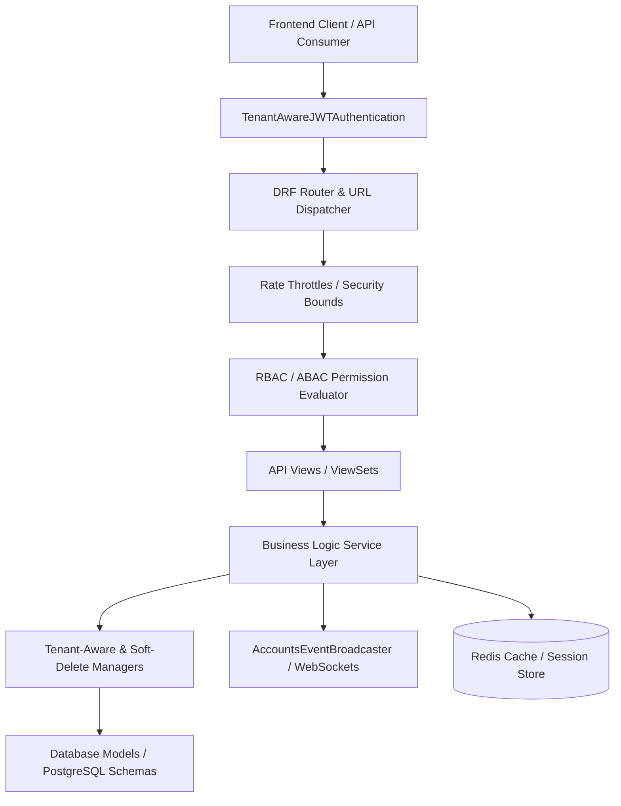
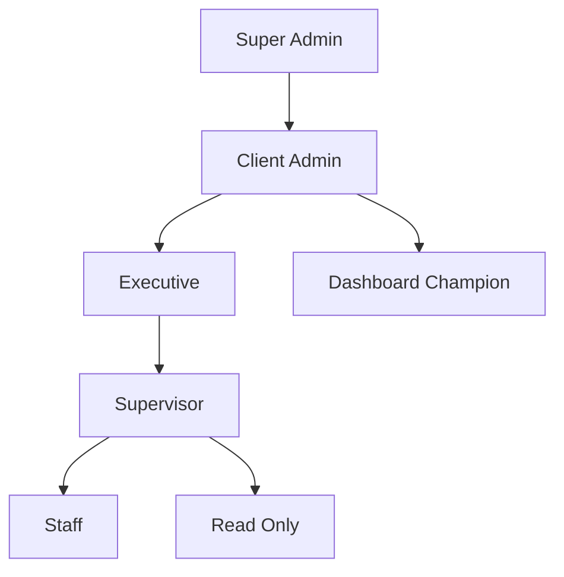
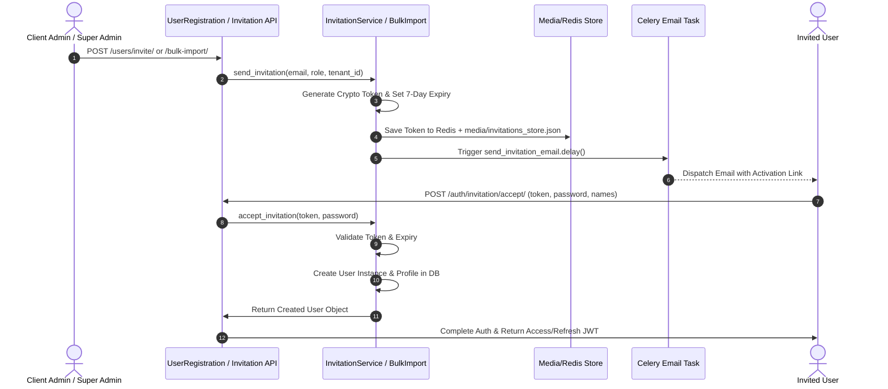
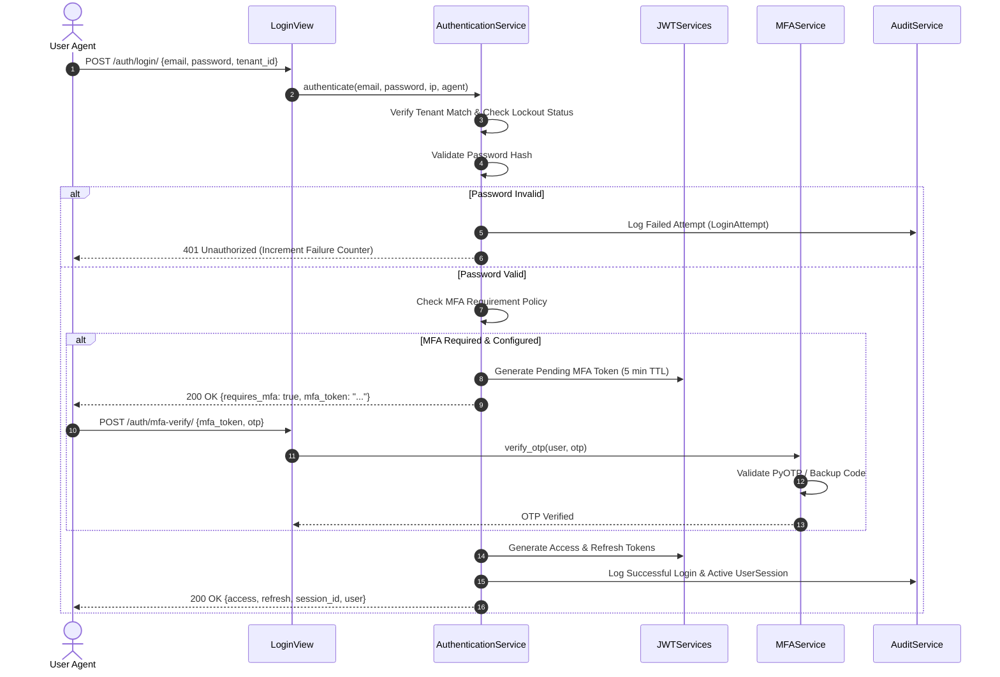

# Falcon Enterprise System — Accounts Subsystem Architecture & System Flow Specification

> **Document Version**: 1.0.0  
> **Target Subsystem**: `apps/accounts` (User Management, Multi-Tenancy Authentication, RBAC/ABAC Authorization, MFA, Audit, Profiles, Policy & Reporting)  
> **Classification**: Technical & Operational Architecture Specification  

---

## 1. Subsystem Architecture Overview

The **Accounts Subsystem** (`apps/accounts`) serves as the foundational identity, authentication, security, and access control engine for the Falcon Enterprise platform. Built on Django REST Framework (DRF) with multi-tenant schema isolation, it provides production-grade security, enterprise single sign-on (SSO), hierarchical Role-Based Access Control (RBAC), multi-factor authentication (MFA), comprehensive session tracking, audit logging, and reporting.



### 1.1 Architectural Layers

1. **Models Layer (`models/`)**: Defines database schemas extending custom base classes (`UUIDModel`, `TimestampModel`, `SoftDeleteModel`, `TenantAwareModel`, `AuditModel`). Includes `User`, `Role`, `Permission`, `Profile`, `UserPreference`, `TenantPreference`, `UserSession`, `SessionBlacklist`, `MFADevice`, `MFABackupCode`, `MFAAuditLog`, `LoginAttempt`, `AuditLog`, and `AccountsSystemSettings`.
2. **Managers Layer (`managers/`)**: Intercepts database queries to enforce multi-tenancy (`TenantAwareManager` injecting thread-local `tenant_id`) and soft-delete filters (`SoftDeleteManager`). Provides recursive Common Table Expression (CTE) queries for organizational management chains.
3. **Services Layer (`services/`)**: Encapsulates all domain business logic across 9 sub-packages (`auth`, `authorization`, `policy`, `profile`, `realtime`, `registration`, `sso`, `audit`, `reports`). Views delegate all state changes to these services.
4. **API / Serialization / Permissions Layer (`api/v1/`)**:
   - **Authentication**: Custom `TenantAwareJWTAuthentication` executing user lookups in PostgreSQL `public` schema.
   - **Serializers**: Data translation, payload validation, dynamic field filtering (`DynamicFieldsModelSerializer`), and password strength verification.
   - **Permissions**: Granular check classes (`IsSuperAdmin`, `IsClientAdmin`, `CanAccessUser`, `CanManageUser`, `CanAssignRole`, `HasPermission`).
   - **Throttles**: Scope-based rate limiters (`LoginRateThrottle`, `MFARateThrottle`, `TenantRateThrottle`, `SensitiveEndpointThrottle`).
   - **Views**: REST ViewSets & APIViews exposing clean endpoints for administrative and user actions.
5. **Real-time Event Broadcaster (`services/realtime/`)**: Dispatches async WebSocket signals via Django Channels to notify clients of revoked sessions, account lockouts, role updates, and policy shifts.

---

## 2. Multi-Tenancy Architecture & Schema Isolation

Falcon utilizes a **hybrid multi-tenant database strategy**:
- **Shared Database with Schema-per-Tenant**: System-wide metadata, core user definitions, and tenant definitions reside in the `public` schema. Operational tenant data resides in dedicated PostgreSQL tenant schemas (e.g., `org_falcon_technologies`).
- **Thread-Local Context**: Active tenant ID is stored in thread-local storage via `apps.tenant.context.get_current_tenant_id()`.
- **Database Search Path Dynamic Resolution**:
  ```python
  # TenantAwareJWTAuthentication mechanism
  with connection.cursor() as cursor:
      cursor.execute("SHOW search_path")
      original_search_path = cursor.fetchone()[0]
      cursor.execute('SET search_path TO "public"')
      try:
          user = User.objects.get(id=user_id)
      finally:
          cursor.execute(f"SET search_path TO {original_search_path}")
  ```

> [!IMPORTANT]
> Because `apps.accounts` models exist in both `public` and tenant schemas, `TenantAwareJWTAuthentication` explicitly switches execution context to the `public` schema during JWT validation. This guarantees that user authentication lookups never fail with `User Not Found (401)` when tenant schemas are active.

---

## 3. Super Admin vs Client Admin Architecture & Distinction Matrix

The accounts app strictly separates **Platform Operations (Super Admin)** from **Organization Operations (Client Admin)**.

| Feature / Responsibility | Super Admin (`super_admin`) | Client Admin (`client_admin`) |
| :--- | :--- | :--- |
| **Schema & Tenant Scope** | Global access across all tenant schemas & `public` schema. | Scoped strictly to their assigned `tenant_id` organization. |
| **Organization Management** | Creates, suspends, activates, and configures tenants (`Organization`). | Manages branding, settings, and feature toggles within their assigned tenant. |
| **User Management Scope** | Can create, view, edit, impersonate, and delete users across **any** tenant. | Can invite, onboard, edit, deactivate, and delete users within **their tenant only**. |
| **Role Assignment Power** | Can assign any role including `super_admin` and `client_admin`. | Can assign roles up to `executive`, `supervisor`, `staff`, `read_only`. **Cannot** assign `super_admin` or `client_admin`. |
| **System Initializations** | Can execute `/init-system-roles` and `/init-permissions` triggers. | Cannot initialize system roles or global permissions. |
| **System Policy vs Tenant Policy** | Manages global `AccountsSystemSettings` and platform defaults. | Manages tenant-specific `TenantPreference` overrides & MFA required roles. |
| **User Impersonation** | Can issue JWT tokens to impersonate any user for debugging/support. | **Disabled**. Client admins cannot impersonate other users. |
| **Bulk User Import/Export** | Can bulk import/export CSV across any target `tenant_id`. | Can bulk import/export CSV for their own tenant members only. |
| **MFA Administrative Resets** | Can reset MFA and clear devices for any user in the system. | Can reset MFA and clear devices for users in **their tenant only**. |

---

## 4. User Role Mapping & Action Matrix (RBAC + ABAC)

The system supports **7 system roles** combined with **5 permission scope levels** (`global`, `tenant`, `department`, `team`, `self`).



### 4.1 Detailed Role Action Mapping

```
Legend:  [✓ Allowed]   [P Partial / Scope Restricted]   [✗ Forbidden]
```

| Subsystem Module & Action | Super Admin | Client Admin | Executive | Supervisor | Staff | Champion | Read-Only |
| :--- | :---: | :---: | :---: | :---: | :---: | :---: | :---: |
| **1. AUTHENTICATION & SESSIONS** | | | | | | | |
| Login / Logout / Refresh | ✓ | ✓ | ✓ | ✓ | ✓ | ✓ | ✓ |
| View Own Active Sessions | ✓ | ✓ | ✓ | ✓ | ✓ | ✓ | ✓ |
| Terminate Own Sessions | ✓ | ✓ | ✓ | ✓ | ✓ | ✓ | ✓ |
| Terminate Tenant Member Session | ✓ | ✓ | ✗ | ✗ | ✗ | ✗ | ✗ |
| Terminate Any Global Session | ✓ | ✗ | ✗ | ✗ | ✗ | ✗ | ✗ |
| **2. MFA & SECURITY** | | | | | | | |
| Setup TOTP / Verify / Backup Codes | ✓ | ✓ | ✓ | ✓ | ✓ | ✓ | ✓ |
| Request Step-Up Auth Verification | ✓ | ✓ | ✓ | ✓ | ✓ | ✓ | ✓ |
| Reset MFA for Tenant Users | ✓ | ✓ | ✗ | ✗ | ✗ | ✗ | ✗ |
| Reset MFA for Any System User | ✓ | ✗ | ✗ | ✗ | ✗ | ✗ | ✗ |
| Configure Tenant MFA Policy | ✓ | ✓ | ✗ | ✗ | ✗ | ✗ | ✗ |
| **3. USER MANAGEMENT** | | | | | | | |
| View User Directory | Global | Tenant | Tenant | Team | Self | Tenant | Tenant (RO) |
| Create / Onboard New Users | Any Tenant | Own Tenant | Own Tenant | ✗ | ✗ | ✗ | ✗ |
| Invite Users via Email | Any Tenant | Own Tenant | Own Tenant | ✗ | ✗ | ✗ | ✗ |
| Assign User Roles | All Roles | Sub-Roles | Staff/Sub | Staff/RO | ✗ | ✗ | ✗ |
| Activate / Deactivate User | ✓ | ✓ | ✗ | ✗ | ✗ | ✗ | ✗ |
| Unlock Locked User Account | ✓ | ✓ | ✗ | ✗ | ✗ | ✗ | ✗ |
| User Impersonation | ✓ | ✗ | ✗ | ✗ | ✗ | ✗ | ✗ |
| Bulk CSV Import / Export | Any Tenant | Own Tenant | ✗ | ✗ | ✗ | ✗ | ✗ |
| View Team Tree & Reporting Chain | Global | Tenant | Tenant | Direct Team | Self Chain | Tenant | Tenant |
| **4. PROFILES & PREFERENCES** | | | | | | | |
| View Profiles | Global | Tenant | Tenant | Team | Self | Tenant | Tenant |
| Edit Profile Info & Avatar | Any | Own/Tenant | Self | Self | Self | Self | Self |
| Manage Skills & Certifications | Any | Own/Tenant | Self | Self | Self | Self | Self |
| Edit User UI Preferences | Self | Self | Self | Self | Self | Self | Self |
| Edit Tenant Branding / Colors | ✓ | ✓ | ✗ | ✗ | ✗ | ✗ | ✗ |
| **5. ROLES & PERMISSIONS ADMIN** | | | | | | | |
| View Roles & Permissions List | ✓ | ✓ | ✓ | ✓ | ✓ | ✓ | ✓ |
| Create Custom Tenant Roles | ✓ | ✗ | ✗ | ✗ | ✗ | ✗ | ✗ |
| Modify Role Permissions | ✓ | ✗ | ✗ | ✗ | ✗ | ✗ | ✗ |
| Initialize System Roles & Perms | ✓ | ✗ | ✗ | ✗ | ✗ | ✗ | ✗ |
| **6. AUDIT & REPORTING** | | | | | | | |
| View Own Audit Trail | ✓ | ✓ | ✓ | ✓ | ✓ | ✓ | ✓ |
| View Tenant Security & Audit Logs | ✓ | ✓ | ✓ | ✓ | ✗ | ✗ | ✗ |
| Export Audit Logs (JSON/CSV) | ✓ | ✓ | ✓ | ✗ | ✗ | ✗ | ✗ |
| Generate Compliance & Anomaly Reports | ✓ | ✓ | ✓ | ✗ | ✗ | ✗ | ✗ |
| Generate System PDF/XLSX Reports | ✓ | ✓ | ✓ | ✗ | ✗ | ✗ | ✗ |
| **7. SYSTEM & TENANT POLICY** | | | | | | | |
| View System Policy Settings | ✓ | ✓ | ✗ | ✗ | ✗ | ✗ | ✗ |
| Edit Platform Global Policy | ✓ | ✗ | ✗ | ✗ | ✗ | ✗ | ✗ |
| Trigger Global Tenant Policy Sync | ✓ | ✗ | ✗ | ✗ | ✗ | ✗ | ✗ |

---

## 5. End-to-End System Flows & Service Execution Logic

### 5.1 Registration & Onboarding System Flow



#### Detailed Execution Steps:
1. **Initiation**: Client Admin invites user via UI (`InvitationSerializer`) or bulk CSV (`BulkUserImportService`).
2. **Password Defaults**: Depending on tenant policy (`PasswordService`), default password mode is chosen:
   - `invite_only`: Password disabled (`set_unusable_password()`); user sets password on token activation.
   - `generated_credentials`: Temporary random password generated and emailed.
   - `tenant_default`: Fixed default password set with `password_change_required = True`.
3. **Invitation Verification**: `InvitationAcceptView` validates token against Redis/JSON persistent store, creates user, verifies email, assigns specified role, logs `user.registered` event in `AuditLog`, and issues initial JWT tokens.

---

### 5.2 Multi-Tenant Authentication & MFA Workflow



#### Security Safeguards in Authentication:
- **Lockout Threshold**: 5 consecutive failed attempts trigger account lockout for 15 minutes (`LoginAttempt`).
- **MFA Enforcers**: Enforced if user explicitly enabled TOTP or if tenant policy requires MFA for user's role (`AccountsPolicyService.user_requires_mfa()`).
- **Step-Up Authentication**: Sensitive actions (e.g., password change, MFA deletion, billing modifications) require re-verifying a 6-digit TOTP within a 5-minute window (`StepUpAuthenticationService`).

---

### 5.3 User Management, Hierarchy & Role Assignment Engine

#### Organizational Management Chain Execution
`UserManager` uses PostgreSQL Common Table Expressions (CTEs) to resolve managerial trees dynamically:
```sql
WITH RECURSIVE management_chain AS (
    SELECT id, manager_id, email, role, 1 as depth
    FROM accounts_user WHERE id = %s
    UNION ALL
    SELECT u.id, u.manager_id, u.email, u.role, mc.depth + 1
    FROM accounts_user u
    INNER JOIN management_chain mc ON u.id = mc.manager_id
)
SELECT * FROM management_chain ORDER BY depth;
```
- **Direct Reports**: `user.get_direct_reports()` retrieves immediate subordinates.
- **Full Team Subtree**: `user.get_team_members()` retrieves recursively all direct and indirect reports.
- **Reporting Chain**: `UserManager().get_reporting_chain(user_id)` returns line managers up to executive level.

#### Role Assignment Safeguards (`CanAssignRole`):
1. `super_admin`: Can assign any role in the system.
2. `client_admin`: Can assign `executive`, `supervisor`, `staff`, `dashboard_champion`, `read_only`. Cannot assign `super_admin` or `client_admin`.
3. `executive`: Can assign `supervisor`, `staff`, `read_only`.
4. `supervisor`: Can assign `staff`, `read_only`.
5. `staff` / `read_only`: Cannot assign roles.

---

### 5.4 Profile, Avatar & Skill Matrix Engine

- **Profile Initialization**: Automatically created upon user registration or on-demand via `ProfileViewSet.my_profile`.
- **Avatar Storage & Processing (`AvatarService`)**:
  - Validates file type (JPEG/PNG/WEBP) and file size (< 5MB).
  - Uses Pillow (PIL) to crop, square, and scale avatars down to standard $300 \times 300\text{ px}$ thumbnails.
  - Deletes old avatar files from disk storage upon upload or deletion to prevent storage bloat.
- **Skill & Certification Matrix**:
  - `skills`: Stored as structured JSON array `[{ "name": "Python", "level": "expert", "years_experience": 5 }]`. Supports exact skill search and level filtering (`skills__contains`).
  - `certifications`: Stored as JSON array `[{ "name": "AWS Solutions Architect", "issuer": "Amazon", "issued_date": "2025-01-01" }]`.

---

### 5.5 Audit, Policy & Reporting Engine

#### 1. Real-Time Audit Logging (`AuditService`)
Tracks all CRUD operations, authentication events, and policy edits. Automatically records:
- Operating user, tenant ID, IP address, User-Agent, request method & path.
- Content Type & Object ID being modified.
- **JSON Field Diffs**: Computes exact `old_value` vs `new_value` deltas for security compliance.

#### 2. Policy Resolution Hierarchy (`AccountsPolicyService`)
Resolves effective tenant policies by merging 3 layers with Redis caching:
$$\text{Effective Policy} = \text{Platform Defaults} \;\oplus\; \text{AccountsSystemSettings} \;\oplus\; \text{TenantPreference}$$

```
Level 1: System Base Defaults (Hardcoded in constants)
Level 2: Global System Settings (AccountsSystemSettings Singleton)
Level 3: Tenant Preference Overrides (TenantPreference per client_id)
```

#### 3. Reporting Engine (`ReportService`)
Provides structured analytics and document exports for administrative review:
- **User Directory & Distribution Reports**: Breakdown by roles, departments, active status, and join dates.
- **Audit Trail & Security Reports**: Detailed chronological logs, login failure maps, and anomaly alerts.
- **Multi-Format Generators**:
  - **CSV**: Native streamed text/csv responses.
  - **XLSX**: Rich spreadsheet formatting via `OpenPyXL` / `XlsxWriter` with header styling and auto-column width.
  - **PDF**: Enterprise report layouts generated dynamically via `ReportLab`.

---

## 6. End-to-End API Endpoint Reference Map

```
/api/v1/
├── auth/
│   ├── login/                        [POST]  Public login endpoint
│   ├── logout/                       [POST]  Invalidate current/all sessions
│   ├── refresh/                      [POST]  Refresh access JWT token
│   ├── me/                           [GET]   Get authenticated user summary
│   ├── me/change-password/           [POST]  Change password (requires old pass)
│   ├── password-reset/               [POST]  Request password reset email
│   ├── password-reset/confirm/       [POST]  Confirm password reset with token
│   ├── invitations/                  [GET/POST] List/send tenant invitations
│   └── invitation/accept/            [POST]  Accept invitation & create account
├── users/                            [REST]  User ViewSet (CRUD, activate, deactivate, unlock)
│   ├── {id}/assign-role/             [POST]  Assign role to user
│   ├── {id}/team/                    [GET]   Get direct reports for user
│   ├── {id}/reporting-chain/         [GET]   Get manager hierarchy
│   ├── me/team/                      [GET]   Get current user's team
│   ├── me/reporting-chain/           [GET]   Get current user's reporting chain
│   ├── bulk-import/                  [POST]  Import users via CSV file
│   └── bulk-export/                  [GET]   Export tenant users to CSV
├── profiles/                         [REST]  Profile ViewSet
│   ├── my/                           [GET/PATCH] Get/update current user profile
│   ├── {id}/avatar/                  [POST/DELETE] Upload/delete profile picture
│   ├── {id}/skills/                  [POST/PUT/DELETE] Manage user skills
│   └── {id}/certifications/          [POST/DELETE] Manage user certifications
├── roles/                            [REST]  Role ViewSet (system & custom roles)
│   ├── assignable/                   [GET]   Get roles assignable by current user
│   ├── system/                       [GET]   Get system roles list
│   └── {id}/permissions/             [GET/POST] View/assign role permissions
├── permissions/                      [REST]  Permission ViewSet
│   ├── by-category/{category}/       [GET]   Filter permissions by module category
│   └── by-level/{level}/             [GET]   Filter permissions by scope level
├── sessions/                         [REST]  User Session ViewSet
│   ├── current/                      [GET]   Get active session details
│   ├── active/                       [GET]   List user's active sessions
│   ├── tenant-active/                [GET]   List all active sessions in tenant
│   ├── {id}/terminate/               [POST]  Terminate specific session
│   └── terminate-all/                [POST]  Terminate all sessions except active
├── mfa/
│   ├── devices/                      [REST]  MFA Device ViewSet (setup, verify, delete)
│   │   ├── setup-totp/               [POST]  Initiate TOTP setup (returns QR URI)
│   │   ├── verify-totp-setup/        [POST]  Confirm TOTP setup with initial OTP
│   │   ├── verify-backup/            [POST]  Verify single-use backup code
│   │   ├── generate-backup-codes/    [POST]  Generate new backup codes
│   │   ├── status/                   [GET]   Get overall MFA configuration status
│   │   └── disable/                  [POST]  Disable user MFA
│   └── audit-logs/                   [REST]  MFA Audit Logs & Analytics
├── preferences/
│   ├── users/                        [REST/my] User UI & notification preferences
│   └── tenants/                      [REST/my-tenant] Tenant branding & feature toggles
├── security/
│   ├── login-attempts/               [REST]  View failed/successful login attempts
│   ├── policy/                       [GET]   View tenant security policy
│   ├── lockout-summary/              [GET]   Get 15m/24h security failure statistics
│   └── mfa/policy/                   [GET/PATCH] Configure tenant MFA required roles
├── audit-logs/                       [REST]  Audit Log ViewSet
│   ├── user-summary/                 [GET]   Get current user activity summary
│   ├── tenant-summary/               [GET]   Get tenant-wide activity summary
│   ├── security-events/              [GET]   Get high-severity security events
│   ├── export/                       [POST]  Export audit logs (JSON/CSV)
│   └── compliance-report/            [GET]   Generate regulatory compliance report
├── reports/                          [REST]  Reporting ViewSet
│   ├── user-directory/               [GET]   Export User Directory (PDF/XLSX/CSV)
│   ├── role-distribution/            [GET]   Export Role Distribution Report
│   ├── department-distribution/      [GET]   Export Department Distribution Report
│   ├── inactive-users/               [GET]   Export Inactive Users Report
│   ├── audit-trail/                  [GET]   Export Detailed Audit Trail
│   └── compliance-summary/           [GET]   Export Compliance Summary
└── admin/                            [REST]  Super Admin Console ViewSets
    ├── users/                        [REST]  Global User Administration & Impersonation
    │   ├── {id}/impersonate/         [POST]  Issue token to impersonate user
    │   ├── {id}/force-password-reset/[POST]  Force password reset email
    │   └── {id}/map-to-organization/ [POST]  Move user to different tenant
    ├── tenants/                      [REST]  Global Tenant Management
    │   ├── {id}/suspend/             [POST]  Suspend tenant organization
    │   ├── {id}/activate/            [POST]  Activate tenant organization
    │   └── create-with-admin/        [POST]  Provision tenant & admin in one call
    ├── roles/init-system-roles/      [POST]  Seed initial system roles
    ├── permissions/init-permissions/ [POST]  Seed predefined system permissions
    └── system/                       [GET]   System Health, DB/Cache status, Clear Cache
```

---

## 7. Production Readiness Checklist & Verification Guidelines

To verify that the accounts subsystem is **100% production-ready**:

1. **Multi-Tenancy Verification**:
   - Verify PostgreSQL `search_path` switches to `public` during user authentication lookups (`TenantAwareJWTAuthentication`).
   - Confirm cross-tenant data leakage is impossible by verifying that `TenantAwareManager` and `BaseModelViewset.get_queryset()` filter by `tenant_id`.

2. **Security & Rate Limiting**:
   - Verify login rate limits (`LoginRateThrottle`), MFA rate limits (`MFARateThrottle`), and bulk operation rate limits (`BulkOperationThrottle`).
   - Confirm account lockout triggers after 5 failed attempts (`LoginAttempt`).
   - Verify step-up authentication requirement for sensitive actions.

3. **Session & Real-time Integration**:
   - Verify session termination invalidates SimpleJWT token JTIs via `SessionBlacklist`.
   - Confirm WebSocket events (`AccountsEventBroadcaster`) broadcast upon session revocation, user deactivation, or role modification.

4. **Data Privacy & Audit Compliance**:
   - Verify soft-deletion is enforced for users and roles (`is_deleted=True`).
   - Confirm sensitive fields (`_secret`, `password`) are never exposed in REST serializer outputs.
   - Confirm all administrative updates compute JSON diffs (`old_value` vs `new_value`) in `AuditLog`.

---
*End of Accounts Subsystem System Flow Specification.*
