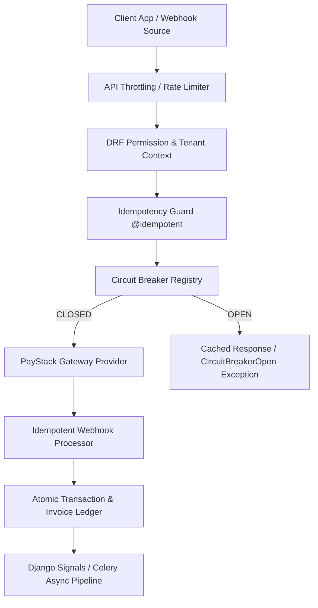
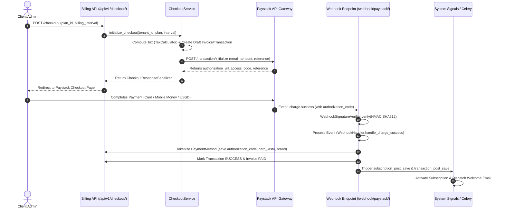
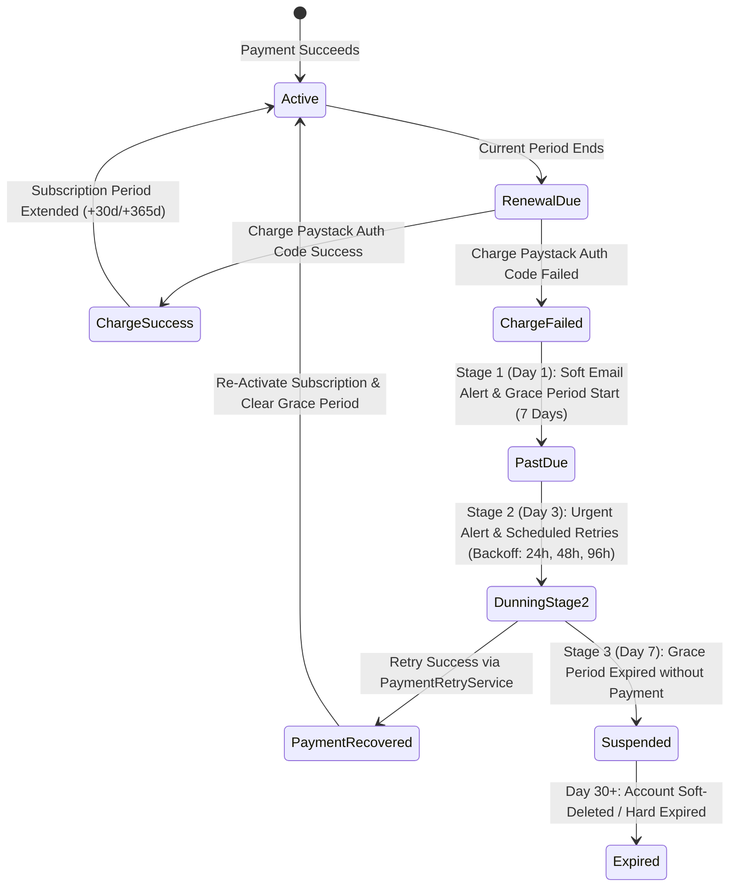
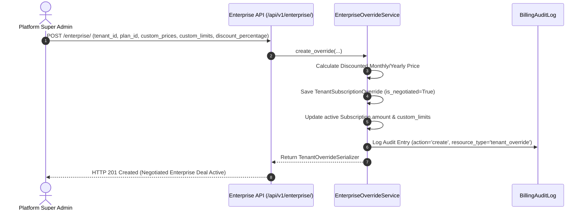
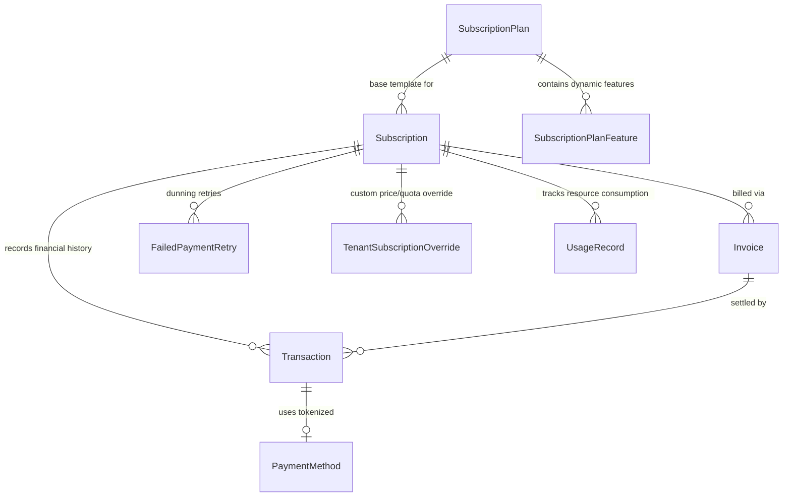

# Falcon Enterprise PMS - Billing System Architecture & End-to-End Flow Analysis

## Executive Overview
The **Billing App (`apps/billing/`)** in the **Falcon Enterprise Performance Management System (PMS)** is an enterprise-grade, multi-country, multi-tenant billing, subscription, and financial transaction processing engine. Built specifically for pan-African enterprise SaaS deployment, the billing system integrates with **Paystack** for card, bank transfer, USSD, and mobile money payments, enforces dynamic multi-country VAT tax engine regulations, handles enterprise negotiated pricing overrides, and protects external gateway operations via a cache-backed **Circuit Breaker** state machine.

---

## 1. Core Architectural Concepts & Resiliency Patterns

### A. Circuit Breaker Resiliency Pattern
To protect the system from cascading network or payment gateway outages, external calls to payment providers (Paystack) are wrapped inside a Redis/cache-backed `CircuitBreaker`:
* **States**:
  * `CLOSED`: Gateway operating normally; requests pass through.
  * `OPEN`: Activated when gateway failure threshold (e.g., 5 consecutive errors) is exceeded within the monitoring window. Rejects calls immediately without hitting Paystack.
  * `HALF_OPEN`: Entered after `timeout_seconds` (default: $60\text{s}$) expire. Allows a trial probe request; if successful, resets to `CLOSED`, else returns to `OPEN`.

### B. Idempotency Engine
* **`@idempotent` Decorator**: Prevents double-charging during network retries or duplicate POST submissions using Redis cache keys with configurable TTLs.
* **Webhook Idempotency Key**: Generated from Paystack Event ID and Event Type (`idempotency_key = generate_idempotency_key(event_id, event_type)`). Duplicate webhooks return `200 OK` instantly without re-processing state changes.

### C. Multi-Country VAT Tax Calculation Engine
Configured via singleton `BillingSystemSettings`, the tax calculation engine dynamically applies regional VAT rates based on the tenant's country ISO code:
* **Kenya (`KE`)**: 16.0% VAT
* **Nigeria (`NG`)**: 7.5% VAT
* **Ghana (`GH`)**: 12.5% VAT
* **South Africa (`ZA`)**: 15.0% VAT
* **Ivory Coast (`CI`)**: 18.0% TVA
* **Fallback / Default**: 16.0% VAT

---

## 2. Multi-Tenant Role & Action Matrix

The billing module enforces strict role-based authorization rules mapped to tenant isolation guards:

| Feature / Action | Unauthenticated | Staff / Supervisor | Executive | Dashboard Champion | Client Admin | Super Admin (Platform Owner) |
| :--- | :---: | :---: | :---: | :---: | :---: | :---: |
| **View Public Subscription Plans** | ✅ | ✅ | ✅ | ✅ | ✅ | ✅ |
| **View Tenant Subscription & Invoices** | ❌ | ❌ | ✅ | ✅ | ✅ | ✅ (All Tenants) |
| **Download PDF Invoices** | ❌ | ❌ | ✅ | ✅ | ✅ | ✅ |
| **Initialize Checkout / Pay Invoices** | ❌ | ❌ | ❌ | ❌ | ✅ | ✅ |
| **Upgrade / Downgrade Plan** | ❌ | ❌ | ❌ | ✅ | ✅ | ✅ |
| **Cancel / Renew Subscription** | ❌ | ❌ | ❌ | ✅ | ✅ | ✅ |
| **Manage Saved Payment Methods** | ❌ | ❌ | ❌ | ❌ | ✅ | ✅ |
| **View Financial Analytics & MRR** | ❌ | ❌ | ✅ | ❌ | ✅ | ✅ (Platform Total) |
| **Configure Enterprise Overrides** | ❌ | ❌ | ❌ | ❌ | ❌ | ✅ |
| **Manage Public System Plans** | ❌ | ❌ | ❌ | ❌ | ❌ | ✅ |
| **Initiate Payment Refund** | ❌ | ❌ | ❌ | ❌ | ❌ | ✅ |
| **Configure Global Tax & Dunning Settings** | ❌ | ❌ | ❌ | ❌ | ❌ | ✅ |
| **Retry Failed Webhook Events** | ❌ | ❌ | ❌ | ❌ | ❌ | ✅ |

---

## 3. Detailed Workflow Maps

### Workflow 1: Initial Subscription Onboarding & Paystack Tokenization

### Workflow 2: Automated Dunning & Grace Period Recovery

### Workflow 3: Enterprise Negotiated Override Creation

---

## 4. Comprehensive Data Models & Relationships

1. **`SubscriptionPlan`**: Canonical plan repository (`trial`, `basic`, `professional`, `enterprise`). Stores base prices in cents, interval (`monthly`/`yearly`), Paystack plan codes, and resource caps (`max_users`, `max_kpis`, `max_departments`, `max_storage_mb`).
2. **`SubscriptionPlanFeature`**: Dynamic key-value feature matrix attached to plans (`typed_value`, `feature_type`, `is_core_feature`).
3. **`Subscription`**: Active tenant subscription state tracking status (`trialing`, `active`, `past_due`, `cancelled`, `expired`), trial end date, billing period start/end, Paystack subscription code & authorization code, and `grace_period_ends_at`.
4. **`TenantSubscriptionOverride`**: Stores custom pricing negotiated for Enterprise clients (custom monthly/yearly prices, custom feature flags, discount percentage, approved by user UUID).
5. **`UsageRecord`**: Tracks real-time resource consumption per tenant (`users`, `kpis`, `api_calls`, `storage`, `departments`), enforcing soft warnings ($100\%$) and hard limit blocks ($110\%$).
6. **`Invoice`**: Legal financial document ledger (`FALCON-YYYYMM-000001`) storing line items JSON, tax rate, subtotal, tax amount, total amount, status (`draft`, `pending`, `paid`, `overdue`, `cancelled`, `refunded`), and ReportLab PDF URL.
7. **`PaymentMethod`**: Tokenized Paystack authorizations (`card`, `bank`, `ussd`, `mobile_money`). Stores reusable authorization codes, card brand, last 4 digits, and expiry dates without storing raw PCI-DSS sensitive data.
8. **`Transaction`**: Financial ledger entries tracking Paystack payment references, transaction types (`subscription`, `one_time`, `renewal`, `upgrade`, `refund`), and status (`pending`, `success`, `failed`, `refunded`).
9. **`FailedPaymentRetry`**: Automated dunning engine retry queue storing scheduled retry timestamps, attempt counts, and exponential backoff calculations.
10. **`BillingAuditLog`**: Comprehensive audit log storing before/after JSON diffs, client IP, user agent, action type, and user role.
11. **`WebhookEventLog`**: Incoming Paystack webhook execution log with HMAC SHA512 signature verification flag, idempotency key, raw payload, status (`pending`, `processed`, `failed`, `duplicate`), and retry counter.
12. **`BillingSystemSettings`**: Singleton system configuration for global tax rates by ISO country, grace period defaults, and dunning window definitions.

---

## 5. API Reference Summary

The billing API is versioned under `/api/v1/billing/` and exposes the following endpoint routes:

| HTTP Method | Endpoint Path | Description | Access Level / Throttling |
| :--- | :--- | :--- | :--- |
| `GET` | `/api/v1/billing/plans/public/` | List public subscription plans | Public / `20/hr` Anon |
| `GET` | `/api/v1/billing/plans/comparison/` | Feature comparison matrix | Public / `20/hr` Anon |
| `POST` | `/api/v1/billing/checkout/` | Initialize Paystack checkout session | Client Admin / `10/hr` |
| `GET` | `/api/v1/billing/checkout/verify/` | Verify Paystack payment reference | Authenticated / `30/min` |
| `GET` | `/api/v1/billing/subscriptions/current/` | View current tenant subscription | Client Admin / Executive / Champion |
| `POST` | `/api/v1/billing/subscriptions/<uuid:pk>/upgrade/<uuid:new_plan_id>/` | Upgrade tenant subscription | Client Admin / Champion / `3/hr` |
| `POST` | `/api/v1/billing/subscriptions/<uuid:pk>/downgrade/<uuid:new_plan_id>/` | Downgrade tenant subscription | Client Admin / Champion / `3/hr` |
| `POST` | `/api/v1/billing/subscriptions/<uuid:pk>/cancel/` | Cancel subscription at period end | Client Admin / Champion / `3/hr` |
| `GET` | `/api/v1/billing/invoices/` | List tenant invoices | Authenticated Tenant Users |
| `GET` | `/api/v1/billing/invoices/<uuid:pk>/download/` | Download PDF invoice | Authenticated Tenant Users / `30/min` |
| `GET` | `/api/v1/billing/payment-methods/` | List saved payment methods | Client Admin |
| `POST` | `/api/v1/billing/payment-methods/<uuid:pk>/set-default/` | Set primary payment method | Client Admin / `10/hr` |
| `GET` | `/api/v1/billing/analytics/summary/` | View tenant MRR & spending summary | Client Admin / Executive |
| `GET` | `/api/v1/billing/usage/summary/` | View current quota usage | Authenticated Tenant Users |
| `POST` | `/api/v1/billing/webhook/paystack/` | Paystack Webhook Receiver | Public (HMAC Verified) / `100/min` |
| `GET` | `/api/v1/billing/system-settings/` | View/Edit global billing settings | Super Admin Only |
| `POST` | `/api/v1/billing/enterprise/` | Create enterprise custom override | Super Admin Only |
| `POST` | `/api/v1/billing/transactions/<uuid:pk>/refund/` | Issue Paystack refund | Super Admin Only |

---

## 6. Asynchronous Tasks & Signals Map

### Celery Background Tasks (`apps/billing/tasks.py`)
1. **`process_due_renewals`**: Scans subscriptions due for auto-renewal and executes tokenized Paystack charges via authorization codes.
2. **`process_expired_trials`**: Transitions expired 14-day trial subscriptions to active (if payment method attached) or expired status.
3. **`process_dunning_workflow`**: Escalates payment failures through the 3 dunning stages ($1\text{d}$, $3\text{d}$, $7\text{d}$).
4. **`send_renewal_reminders`**: Dispatches renewal warning emails at $30, 14, 7, 3, \text{ and } 1$ days prior to expiration.
5. **`apply_pending_plan_changes`**: Executes scheduled period-end plan upgrades/downgrades.
6. **`generate_invoice_pdf` & `store_invoice_pdf`**: Render PDF files asynchronously via ReportLab and save them to media storage.
7. **`process_webhook` & `retry_failed_webhooks`**: Processes queued webhook events with exponential retry backoff.
8. **`cleanup_expired_webhooks`**: Housekeeping task deleting webhook logs older than 90 days.

### Django Signal Receivers (`apps/billing/signals.py`)
* **`subscription_post_save`**: Logs audit trails, sends welcome emails on activation, and fires trial/expiration reminders.
* **`transaction_post_save`**: On `status=='success'`, automatically activates `past_due` subscriptions, marks associated invoices `paid`, and sends payment receipt emails.
* **`invoice_post_save`**: Generates unique invoice numbers (`FALCON-YYYYMM-XXXXXX`), logs creation audit records, and triggers background PDF generation.
* **`webhook_post_save`**: Triggers background webhook processing tasks and alerts platform admins on failure.
* **`usage_record_post_save`**: Checks soft ($100\%$) and hard ($110\%$) quota thresholds and dispatches admin/tenant alert emails.
* **`tenant_override_post_save`**: Dynamically updates active subscription pricing when a super admin approves an enterprise custom deal.
