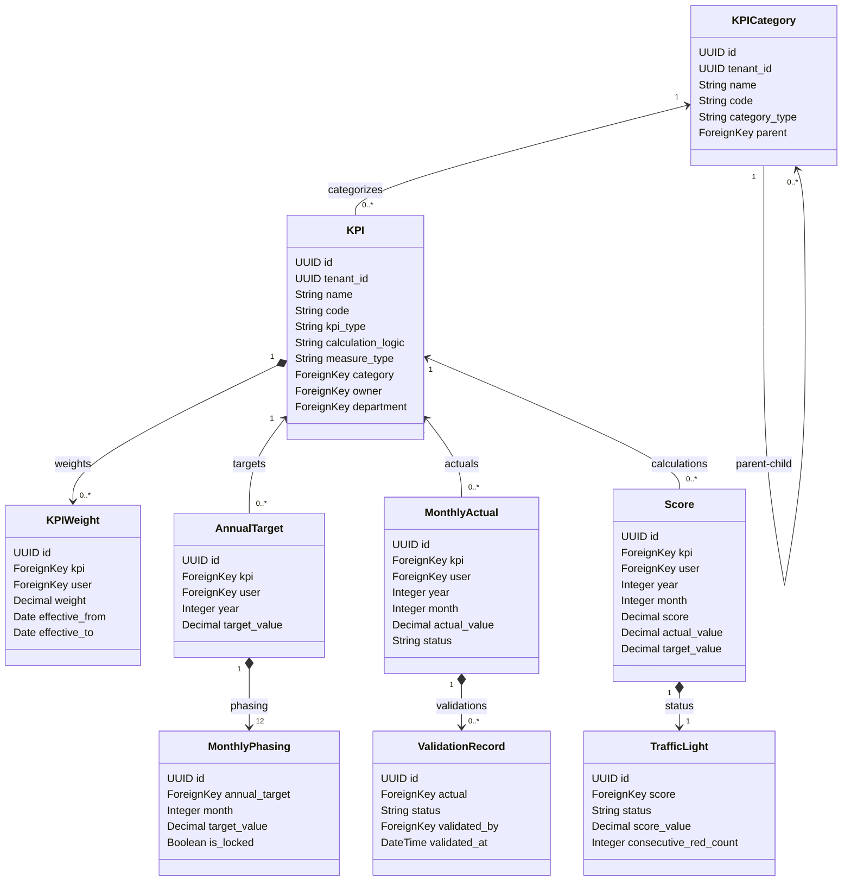

# KPI Application Operational Flow Analysis

This document provides a comprehensive technical analysis of the KPI application in the **Falcon** platform (`apps/kpi/`). It describes the architecture patterns, database schemas, calculation engines, business services, background tasks, real-time communication layers, and API layouts.

---

## 1. Architectural Blueprint & Design Patterns

The KPI application is designed to support multi-tenant, bottom-up performance management with real-time feedback. Key architectural design principles include:

1. **Multi-Tenancy Isolation**: Database tables are partitioned by a `tenant_id` field. Security and visibility are enforced transparently at the database level using a custom Django manager ([TenantAwareManager](file:///c:/Users/Dazlah%20Administrator/Desktop/Forward/Falcon/apps/kpi/managers/base.py#L38)) and request context middleware.
2. **Bottom-Up Performance Aggregation**: Score rollup cascades upward through a corporate hierarchy:
   $$\text{Individual KPI Scores} \xrightarrow{\text{Weighted Avg}} \text{Individual Total Score} \xrightarrow{\text{Averaged}} \text{Unit (Team) Score} \xrightarrow{\text{Size-Weighted Avg}} \text{Department Score} \xrightarrow{\text{Size-Weighted Avg}} \text{Organization Health}$$
3. **Decoupled Engines**: Mathematical formula evaluations, cascade splits, target phasing, and color status thresholds are handled by specialized classes under `apps/kpi/engine/` rather than inline in Django models or views.
4. **Asynchronous Computation**: Computationally intensive tasks, such as periodic organization rollups, validation reminders, and bulk imports, are delegated to Celery background tasks under `apps/kpi/tasks/`.
5. **Real-Time Data Streaming**: Score updates, actual data submissions, and notifications are streamed to active users via WebSockets using Django Channels and Redis under `apps/kpi/consumers.py`.
6. **Materialized Analytics Views**: In-memory caching and PostgreSQL Materialized Views are utilized for department rollups and organization health scores to avoid real-time calculation bottlenecks during dashboard renders.

---

## 2. Models & Database Schema (`models/`)

The database layer consists of multiple tables mapped in [apps/kpi/models/__init__.py](file:///c:/Users/Dazlah%20Administrator/Desktop/Forward/Falcon/apps/kpi/models/__init__.py) that support definitions, targets, actual entries, validations, calculations, and audit logs.



### Core Data Models
* **[KPI](file:///c:/Users/Dazlah%20Administrator/Desktop/Forward/Falcon/apps/kpi/models/definition.py#L9)**: Stores core KPI definitions (code, type, calculation logic, measurement category). Unique on `tenant_id` + `code`.
* **[KPICategory](file:///c:/Users/Dazlah%20Administrator/Desktop/Forward/Falcon/apps/kpi/models/framework.py#L5)**: Self-referential taxonomy that maps KPIs to strategic frameworks (e.g., BSC Category Types: FINANCIAL, CUSTOMER, INTERNAL, GROWTH).
* **[KPIWeight](file:///c:/Users/Dazlah%20Administrator/Desktop/Forward/Falcon/apps/kpi/models/definition.py#L99)**: Defines the percentage weight of a KPI for a specific user within a time-effective period. The weights for a user's assigned active KPIs must sum to 100%.
* **[StrategicLinkage](file:///c:/Users/Dazlah%20Administrator/Desktop/Forward/Falcon/apps/kpi/models/definition.py#L122)**: Links a KPI definition to organizational strategic objectives.
* **[KPIDependency](file:///c:/Users/Dazlah%20Administrator/Desktop/Forward/Falcon/apps/kpi/models/definition.py#L142)**: Maps dependency impact factors and directional correlation between two KPIs (e.g., leading indicator affects lagging outcome).

### Target & Phasing Models
* **[AnnualTarget](file:///c:/Users/Dazlah%20Administrator/Desktop/Forward/Falcon/apps/kpi/models/target.py#L8)**: Stores a user's target value for a KPI for a specific calendar year.
* **[MonthlyPhasing](file:///c:/Users/Dazlah%20Administrator/Desktop/Forward/Falcon/apps/kpi/models/target.py#L32)**: Distributes the annual target value into 12 monthly targets. It tracks locked states (`is_locked`) which restrict targets from modification after performance cycles begin.
* **[PhasingLock](file:///c:/Users/Dazlah%20Administrator/Desktop/Forward/Falcon/apps/kpi/models/target.py#L61)**: Tenant-wide performance cycle lock that prevents changes to phasing for an entire fiscal year.
* **[TargetHistory](file:///c:/Users/Dazlah%20Administrator/Desktop/Forward/Falcon/apps/kpi/models/target.py#L74)**: Audits all creation, update, phasing, and adjustment modifications to targets.

### Actual Entries & Validations Models
* **[MonthlyActual](file:///c:/Users/Dazlah%20Administrator/Desktop/Forward/Falcon/apps/kpi/models/actual.py#L10)**: The core entry point for performance reports. Represents a reported KPI actual value submitted by a user for a given year and month. Can be PENDING, APPROVED, REJECTED, or ADJUSTED.
* **[ActualAdjustment](file:///c:/Users/Dazlah%20Administrator/Desktop/Forward/Falcon/apps/kpi/models/actual.py#L83)**: A formal request to modify an approved monthly actual value. Approved adjustments copy values over, update the parent status to ADJUSTED, and audit old values.
* **[Evidence](file:///c:/Users/Dazlah%20Administrator/Desktop/Forward/Falcon/apps/kpi/models/actual.py#L119)**: Stores supporting uploads (documents, images, or links) for auditing monthly actual submissions.
* **[ValidationRecord](file:///c:/Users/Dazlah%20Administrator/Desktop/Forward/Falcon/apps/kpi/models/validation.py#L7)**: Tracks supervisor validation outcomes (approval or rejection) with a signature and timestamp.
* **[ValidationComment](file:///c:/Users/Dazlah%20Administrator/Desktop/Forward/Falcon/apps/kpi/models/validation.py#L30)**: Supervisor-employee messaging thread during review cycles. Supports a private state (`is_private`) hidden from the subordinate.
* **[RejectionReason](file:///c:/Users/Dazlah%20Administrator/Desktop/Forward/Falcon/apps/kpi/models/validation.py#L43)**: Standardized reasons for rejection (e.g. DATA_QUALITY, MISSING_EVIDENCE).
* **[Escalation](file:///c:/Users/Dazlah%20Administrator/Desktop/Forward/Falcon/apps/kpi/models/validation.py#L64)**: Resolves validation disputes by elevating review decisions to higher managerial nodes.

### Performance Analytics Models
* **[Score](file:///c:/Users/Dazlah%20Administrator/Desktop/Forward/Falcon/apps/kpi/models/calculation.py#L8)**: The computed performance achievement percentage for a single user, KPI, year, and month.
* **[AggregatedScore](file:///c:/Users/Dazlah%20Administrator/Desktop/Forward/Falcon/apps/kpi/models/calculation.py#L31)**: Holds rolled-up scores calculated at INDIVIDUAL, TEAM, DEPARTMENT, and ORGANIZATION levels.
* **[TrafficLight](file:///c:/Users/Dazlah%20Administrator/Desktop/Forward/Falcon/apps/kpi/models/calculation.py#L58)**: Determines whether a score is GREEN (>=90%), YELLOW (>=50%), or RED (<50%). Also tracks consecutive red periods to flag critical alerts.
* **[Trend](file:///c:/Users/Dazlah%20Administrator/Desktop/Forward/Falcon/apps/kpi/models/calculation.py#L84)**: Tracks direction trajectories (IMPROVING, DECLINING, STABLE, VOLATILE) and changes using linear regression slope analysis.
* **[CalculationLog](file:///c:/Users/Dazlah%20Administrator/Desktop/Forward/Falcon/apps/kpi/models/calculation.py#L107)**: System execution audit logs for scores, aggregates, traffic lights, and cascades.

### Analytical Materialized Views (Read-Only)
* **[KPISummary](file:///c:/Users/Dazlah%20Administrator/Desktop/Forward/Falcon/apps/kpi/models/analytics.py#L7)**, **[DepartmentRollup](file:///c:/Users/Dazlah%20Administrator/Desktop/Forward/Falcon/apps/kpi/models/analytics.py#L25)**, **[OrganizationHealth](file:///c:/Users/Dazlah%20Administrator/Desktop/Forward/Falcon/apps/kpi/models/analytics.py#L44)**: Unmanaged models mapped to database materialized views for high-performance aggregations. Refreshed via periodic Celery tasks.

---

## 3. Database Managers & Tenant Isolation (`managers/`)

Database queries are routed through custom managers configured in [apps/kpi/managers/base.py](file:///c:/Users/Dazlah%20Administrator/Desktop/Forward/Falcon/apps/kpi/managers/base.py):

* **[TenantAwareManager](file:///c:/Users/Dazlah%20Administrator/Desktop/Forward/Falcon/apps/kpi/managers/base.py#L38)**: Automatically intercepts `get_queryset()` to inject `tenant_id` filters. The current tenant ID is extracted from thread-local variables, request cookies, or context middlewares.
* **[SoftDeleteManager](file:///c:/Users/Dazlah%20Administrator/Desktop/Forward/Falcon/apps/kpi/managers/base.py#L80)**: Extends `TenantAwareManager` to automatically filter out soft-deleted items (`is_deleted=False`).
* **[BulkOperationManager](file:///c:/Users/Dazlah%20Administrator/Desktop/Forward/Falcon/apps/kpi/managers/base.py#L98)**: Provides bulletproof, batch-sliced wrapper utilities `bulk_create_safe` and `bulk_update_safe` to handle large datasets safely in transactional chunks.
* **[KPIManager](file:///c:/Users/Dazlah%20Administrator/Desktop/Forward/Falcon/apps/kpi/managers/kpi.py#L6)**: Evaluates user hierarchies (`for_user_hierarchy`) to filter KPIs owned by a user, their direct reports, or managed departments.
* **[ScoreManager](file:///c:/Users/Dazlah%20Administrator/Desktop/Forward/Falcon/apps/kpi/managers/score.py#L7)**: Includes analytic queries for top/bottom performers, score distribution ranges, and weighted score sums for individual dashboards.

---

## 4. Calculation & Business Engines (`engine/`)

The computation engine performs the mathematical heavy lifting, separating business rules from API layers.

### Score Calculation Flow

```
User Actual Submitted & Approved
         │
         ▼
Trigger Score Calculation Task
         │
         ▼
Acquire Redis Lock (calc_lock:tenant:year:month)
         │
         ▼
Fetch Active KPI Weights for User
         │
         ▼
Get Monthly Target (Locked) & Monthly Actual (Approved)
         │
         ▼
Select Matching Type Calculator (Numeric, Percentage, Financial, Milestone, Time, Impact)
         │
         ▼
Apply Logic (HIGHER_IS_BETTER or LOWER_IS_BETTER)
         │
         ▼
Save Score -> Calculate Traffic Light -> Update Aggregations -> Trigger WS Broadcast
```

* **[CalculationOrchestrator](file:///c:/Users/Dazlah%20Administrator/Desktop/Forward/Falcon/apps/kpi/engine/orchestrator.py#L14)**:
  Handles lock acquisition via Redis, fetches KPI lists, evaluates targets/actuals, and dispatches records to respective calculators. It also logs transaction logs via `CalculationLog`.
* **[BaseCalculator](file:///c:/Users/Dazlah%20Administrator/Desktop/Forward/Falcon/apps/kpi/engine/calculators.py#L6)**:
  Validates inputs, handles zero division guards, applies decimal precision rounding, and clamps scores between $0\%$ and $100\%$ (unless overachievement is allowed).
* **Calculators**:
  * **[NumericCalculator](file:///c:/Users/Dazlah%20Administrator/Desktop/Forward/Falcon/apps/kpi/engine/calculators.py#L23)**: Standard number division.
  * **[PercentageCalculator](file:///c:/Users/Dazlah%20Administrator/Desktop/Forward/Falcon/apps/kpi/engine/calculators.py#L32)**: Normalizes factors (multiplies decimals by 100) and checks metadata configuration overrides like `allow_overachievement`.
  * **[FinancialCalculator](file:///c:/Users/Dazlah%20Administrator/Desktop/Forward/Falcon/apps/kpi/engine/calculators.py#L53)**: Explicitly allows scores exceeding $100\%$ for overachievement.
  * **[MilestoneCalculator](file:///c:/Users/Dazlah%20Administrator/Desktop/Forward/Falcon/apps/kpi/engine/calculators.py#L69)**: Milestone checklist values. Returns $100\%$ on completion ($value \ge 1$) or splits fractional targets.
  * **[TimeCalculator](file:///c:/Users/Dazlah%20Administrator/Desktop/Forward/Falcon/apps/kpi/engine/calculators.py#L80)**: Penalizes overshoot times:
    $$\text{Score} = 100 - \left( \frac{\text{Actual} - \text{Target}}{\text{Target}} \times 100 \right)$$
  * **[ImpactCalculator](file:///c:/Users/Dazlah%20Administrator/Desktop/Forward/Falcon/apps/kpi/engine/calculators.py#L91)**: Handles impact matrices on varying scales.
* **Formulas Strategy**:
  Defines specific formula classes like [HigherIsBetterFormula](file:///c:/Users/Dazlah%20Administrator/Desktop/Forward/Falcon/apps/kpi/engine/formulas.py#L4), [LowerIsBetterFormula](file:///c:/Users/Dazlah%20Administrator/Desktop/Forward/Falcon/apps/kpi/engine/formulas.py#L19), and [WeightedAverageFormula](file:///c:/Users/Dazlah%20Administrator/Desktop/Forward/Falcon/apps/kpi/engine/formulas.py#L61). Handles Cumulative YTD vs Non-Cumulative period inputs.

### Hierarchical Aggregator Engine (`aggregator.py`)
Provides bottom-up computation of organization scores under [HierarchyAggregator](file:///c:/Users/Dazlah%20Administrator/Desktop/Forward/Falcon/apps/kpi/engine/aggregator.py#L349):
1. **[IndividualAggregator](file:///c:/Users/Dazlah%20Administrator/Desktop/Forward/Falcon/apps/kpi/engine/aggregator.py#L9)**: Evaluates weighted scores based on active user-specific weight setups:
   $$\text{Aggregated Individual Score} = \frac{\sum (\text{KPI Score} \times \text{KPI Weight})}{\sum \text{KPI Weight}}$$
2. **[UnitAggregator](file:///c:/Users/Dazlah%20Administrator/Desktop/Forward/Falcon/apps/kpi/engine/aggregator.py#L76)**: Resolves unit membership via `Employment` records and computes a simple mathematical average of member scores.
3. **[DepartmentAggregator](file:///c:/Users/Dazlah%20Administrator/Desktop/Forward/Falcon/apps/kpi/engine/aggregator.py#L167)**: Rolls up Unit scores. It weights each Unit's score by its active headcount (`member_count`). Falls back to direct individual averages if no sub-units exist.
4. **[OrganizationAggregator](file:///c:/Users/Dazlah%20Administrator/Desktop/Forward/Falcon/apps/kpi/engine/aggregator.py#L235)**: Evaluates the entire tenant score by rolling up Department aggregates, weighted by department headcounts.

### Phasing & Cascade Engines
* **[PhasingEngine](file:///c:/Users/Dazlah%20Administrator/Desktop/Forward/Falcon/apps/kpi/engine/phasing/engine.py#L10)**: Breaks down annual targets into monthly phases using chosen strategies:
  * `equal_split`: Annual target divided equally by 12.
  * `seasonal`: Distributes targets using weight coefficients defined per month.
  * `custom_pattern`: Applies user-specified numeric arrays (exactly 12 values).
* **[CascadeEngine](file:///c:/Users/Dazlah%20Administrator/Desktop/Forward/Falcon/apps/kpi/engine/cascade/engine.py#L10)**: Propagates strategic targets down corporate nodes (e.g., Organization -> Department -> Individual) utilizing split rules:
  * `EQUAL_SPLIT`: Targets split equally.
  * `WEIGHTED`: Distributed based on target headcount weights.
  * `WEIGHTED_BY_BUDGET`: Distributed proportionally by sub-budgets.
  * `CUSTOM`: Specific target splits.
  Logs maps in `CascadeMap` and actions in `CascadeHistory` to enable rolling back cascades.

---

## 5. Services Layer (`services/`)

The services layer manages data validation, workflow permissions, cache invalidation, and dashboard operations.

* **[KPICreator](file:///c:/Users/Dazlah%20Administrator/Desktop/Forward/Falcon/apps/kpi/services/kpi.py#L21) & KPIUpdater**: Handle validation rules (code syntax, name lengths, target range constraints) during creation, log changes to `KPIHistory`, and handle caching invalidations.
* **[KPIValidator](file:///c:/Users/Dazlah%20Administrator/Desktop/Forward/Falcon/apps/kpi/services/kpi.py#L222)**: Performs key system integrity checks:
  1. *Completeness*: Ensures required fields are populated.
  2. *Weights Sum*: Ensures weights sum to exactly 100%.
  3. *Circular Dependency*: Detects cyclic references in indicators using depth-first search (DFS).
  4. *Measurement Period*: Checks if period falls within activation/deactivation dates.
* **[ActualEntry](file:///c:/Users/Dazlah%20Administrator/Desktop/Forward/Falcon/apps/kpi/services/actual.py#L21) & ActualAdjustmentService**: Enforce data entry validation. Approved actual entries cannot be edited directly; users must request modifications via `ActualAdjustment` requests.
* **[ValidationApprover](file:///c:/Users/Dazlah%20Administrator/Desktop/Forward/Falcon/apps/kpi/services/validation.py#L16) & ValidationRejecter**: Enforce supervisor verification rules. Batch approvals verify manager boundaries against direct reports.
* **[AutoApprovalService](file:///c:/Users/Dazlah%20Administrator/Desktop/Forward/Falcon/apps/kpi/services/validation.py#L403)**: Automatically approves actuals if they fall within a configurable variance threshold (e.g., <=5% variance from target value) or if all prior months have been approved.
* **[TargetSetter](file:///c:/Users/Dazlah%20Administrator/Desktop/Forward/Falcon/apps/kpi/services/target.py#L18) & [TargetPhaser](file:///c:/Users/Dazlah%20Administrator/Desktop/Forward/Falcon/apps/kpi/services/target.py#L94)**: Manage target creation and monthly splits while enforcing cycle locks.
* **[TargetCascader](file:///c:/Users/Dazlah%20Administrator/Desktop/Forward/Falcon/apps/kpi/services/cascade.py#L16)**: Manages target hierarchy relationships, calculates contribution mappings, and supports rollbacks.
* **Dashboards**:
  * **[IndividualDashboard](file:///c:/Users/Dazlah%20Administrator/Desktop/Forward/Falcon/apps/kpi/services/dashboard.py#L17)**: Renders individual scores, targets, actuals, and recent submission logs.
  * **[ManagerDashboard](file:///c:/Users/Dazlah%20Administrator/Desktop/Forward/Falcon/apps/kpi/services/dashboard.py#L83)**: Summarizes team average scores, pending validation queues, missing submission lists, and direct reports' performance details.
  * **[ExecutiveDashboard](file:///c:/Users/Dazlah%20Administrator/Desktop/Forward/Falcon/apps/kpi/services/dashboard.py#L154)**: Displays high-level summaries (overall organization score, red KPI counts, validation compliance rates, and department rankings).
* **NotificationTrigger**: Dispatches email alerts and in-app notifications while respecting configured quiet hours.
* **RedAlertService**: Triggers critical alerts when a KPI score remains RED for consecutive periods (defined by `RED_ALERT_THRESHOLD`).

---

## 6. Real-time Event Streaming (`consumers.py` & WebSockets)

Real-time communication is powered by Django Channels WebSockets in [apps/kpi/consumers.py](file:///c:/Users/Dazlah%20Administrator/Desktop/Forward/Falcon/apps/kpi/consumers.py):

* **`KPIDashboardConsumer`**: Manages real-time data synchronization for dashboards. Subscribes users to group streams (`user_{id}`, `tenant_{id}`, and `manager_{id}`) to push live score and validation changes without page reloads.
* **`KPIAdminConsumer`**: Streams server health stats, processing calculations, and missing validations to system administrators every 10 seconds.
* **`KPITeamConsumer`**: Subscribes managers to direct report updates, streaming team aggregates and validation events.
* **`KPIExecutiveConsumer`**: Streams high-level organizational analytics and red KPI breach alerts to executive dashboard views.
* **`KPINotificationConsumer`**: Manages live, in-app notification alerts for validation outcomes, target assignments, and system messages.

---

## 7. Event Signals & Background Tasks

### Event Signals (`signals.py`)
[apps/kpi/signals.py](file:///c:/Users/Dazlah%20Administrator/Desktop/Forward/Falcon/apps/kpi/signals.py) coordinates side effects when database records change:

| Trigger Model | Database Event | Action / Side Effect |
| :--- | :--- | :--- |
| **KPI** | `post_save` / `post_delete` | Invalidates cache; triggers tenant data sync; triggers score recalculation for assigned users if a KPI is deactivated. |
| **KPIWeight** | `post_save` / `post_delete` | Invalidates dashboard cache; triggers score recalculations; checks if weights sum to 100% (triggers alerts on validation failure). |
| **AnnualTarget** | `post_save` | Invalidates target caches; schedules Celery score rollups if approved. |
| **MonthlyPhasing**| `post_save` | Clears target caches; triggers score recalculations. |
| **MonthlyActual** | `post_save` / `post_delete` | If APPROVED: triggers score recalculation and red alert checks. If PENDING: dispatches supervisor notifications. Broadcasts WebSocket events. |
| **ActualAdjustment**| `post_save` | Dispatches approval request alerts; triggers score recalculation if approved. |
| **ValidationRecord**| `post_save` | Sends validation status notifications; triggers background refreshes for materialized view statistics. |
| **Score** | `post_save` | Triggers traffic light evaluation; schedules organizational score updates; updates and caches performance trends; broadcasts score updates over WebSockets. |

### Background Tasks (`tasks/`)
Long-running and automated processes are registered as Celery tasks:
* **`calculate_kpi_score_task`**: Executes individual score updates for a given period.
* **`calculate_period_scores_task`**: Triggers batch calculations for all users in a tenant. Uses `CalculationLock` to prevent concurrent runs for the same period.
* **`update_aggregated_scores_task`**: Updates aggregates at unit, department, and organization levels, then clears aggregate caches.
* **`send_missing_data_reminders_task`**: Scans missing actuals for a period and emails reminders on the configured day of the month (`MISSING_DATA_DAY`).
* **`refresh_materialized_views_task`**: Refreshes analytical views (`kpi_summary_mv`, etc.) in the background when validation records are updated.

---

## 8. REST API Interface (`api/v1/`)

The API layout in [apps/kpi/api/v1/urls.py](file:///c:/Users/Dazlah%20Administrator/Desktop/Forward/Falcon/apps/kpi/api/v1/urls.py) exposes REST endpoints.

### API Routing Architecture
* **Standard Viewsets**:
  Registered with `DefaultRouter` for CRUD operations on categories, targets, actuals, validations, cascade rules, and scores.
* **Nested Routers**:
  Implemented using `rest_framework_nested` to provide context-specific endpoints:
  * `/api/users/<user_id>/kpis/` (User KPIs)
  * `/api/users/<user_id>/targets/` (User Targets)
  * `/api/users/<user_id>/scores/` (User Scores)
  * `/api/users/<user_id>/actuals/` (User Actuals)

### Permissions System (`permissions.py`)
Enforces role-based access control (RBAC) across API views:
* `IsManager`: Grants access if a user has active direct reports, or is an admin/executive.
* `IsExecutive`: Restricts access to CEOs, Directors, and Super Admins.
* `CanCascadeTargets`: Restricts target cascade triggers to Dashboard Champions and Admins.
* `IsTenantMember`: Restricts data access to members of the requested tenant.
* `IsOwnerOrReadOnly`: Restricts modification actions (PUT/PATCH/DELETE) to the record owner.

### Throttles & Rate Limits (`throttles.py`)
Protects computation-heavy endpoints from abuse:
* `CalculationThrottle`: Limits score calculation requests (`10/hour`).
* `RecalculationThrottle`: Limits score recalculation requests (`20/hour`).
* `BulkUploadThrottle`: Limits CSV uploads (`5/minute`).
* `ExportThrottle`: Limits spreadsheet/PDF report downloads (`10/hour`).
* `DashboardThrottle`: Limits dashboard refresh requests (`100/minute`).
* `TenantCalculationThrottle`: Limits concurrent calculations per tenant (`50/hour`).
