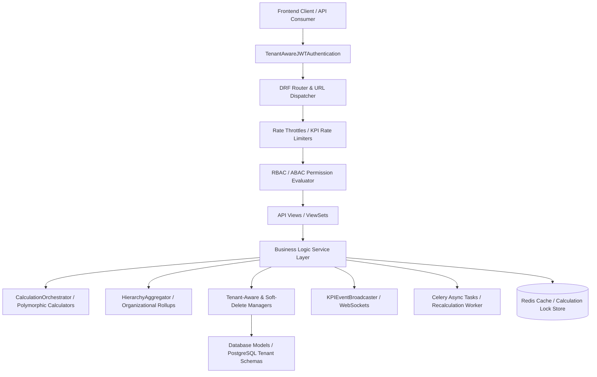
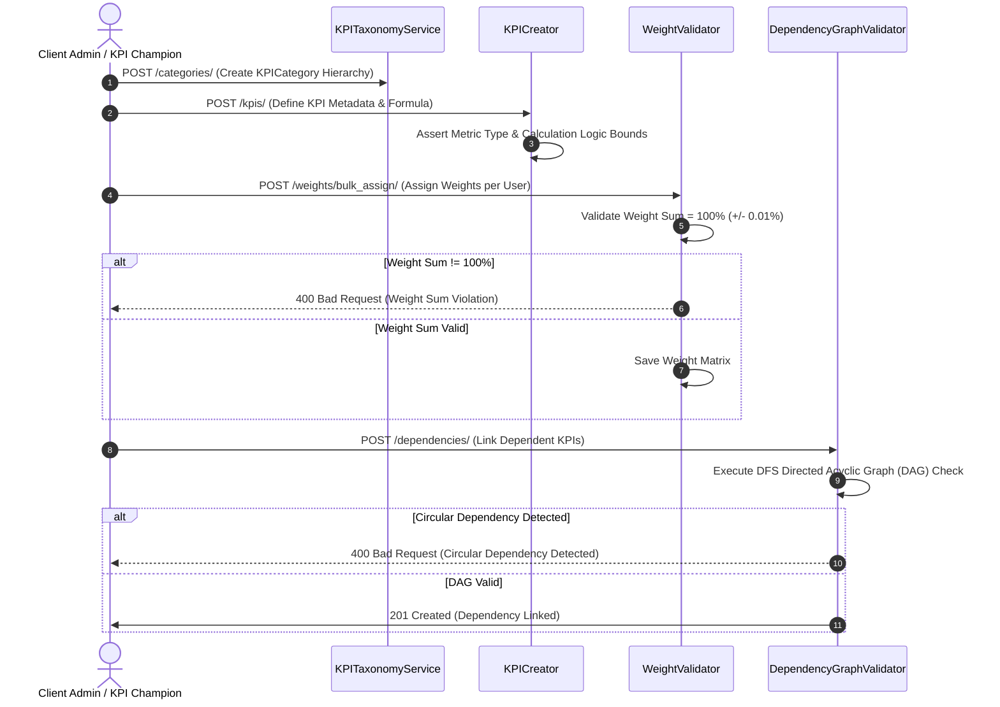
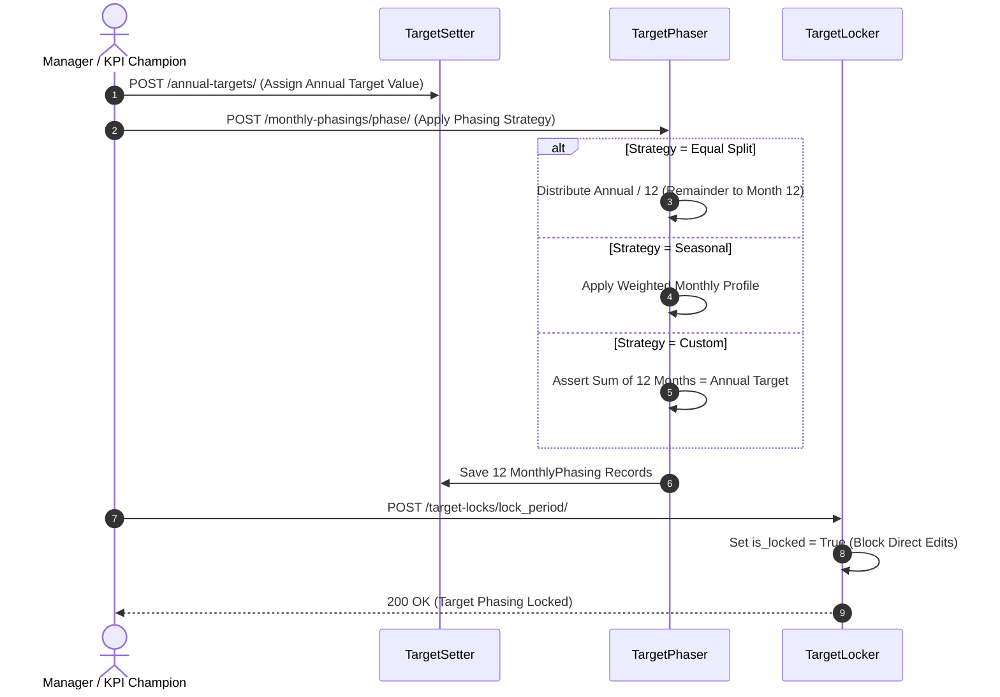
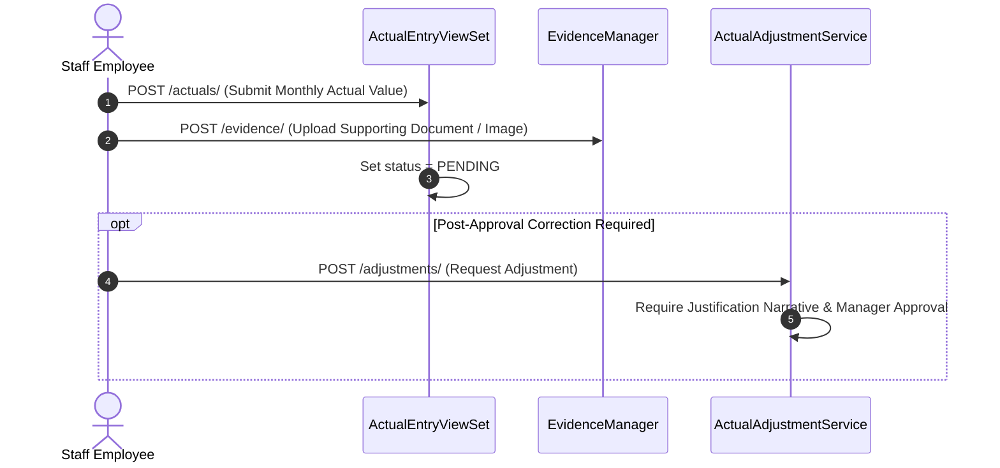
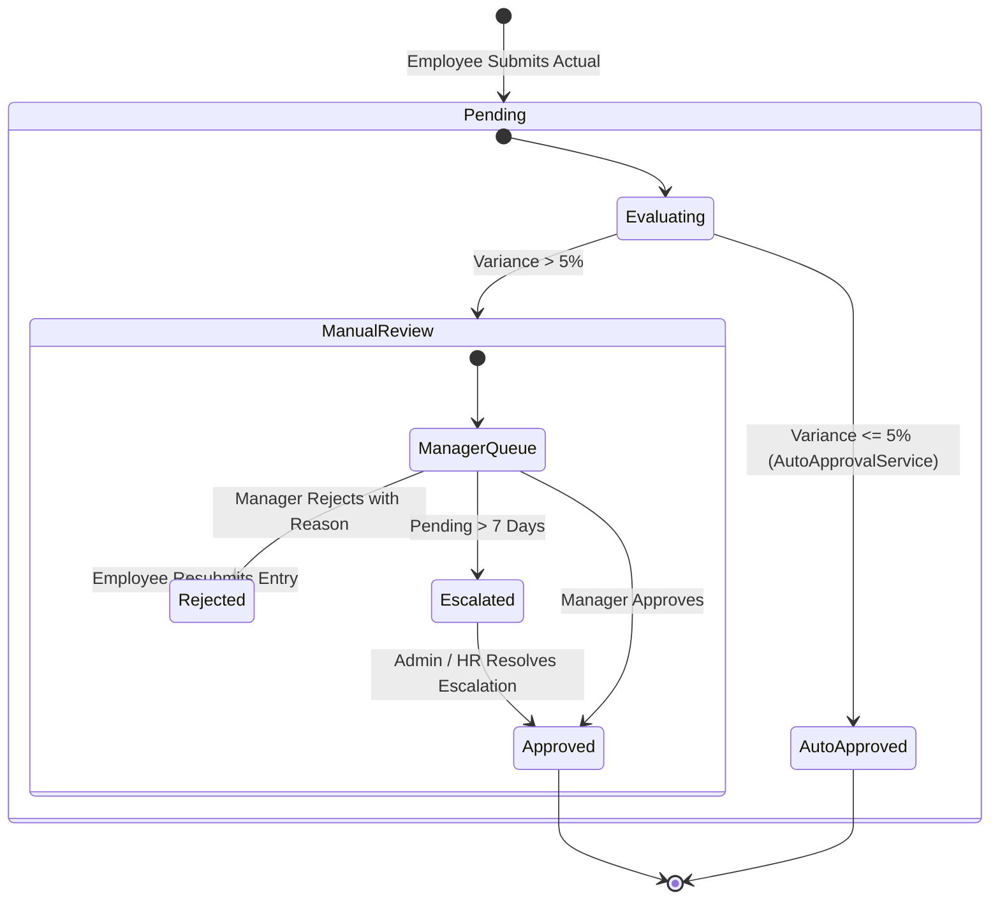

# Falcon Enterprise System — KPI Subsystem Architecture & System Flow Specification

> **Document Version**: 1.0.0  
> **Target Subsystem**: `apps/kpi` (Indicator Definitions, Category Trees, Strategy Linkage, Weight Allocation, Annual Target Setting, Monthly Phasing, Target Cascading, Monthly Actual Data Submission, Evidence Attachment, Supervisor Validation & Escalation, Polymorphic Calculation Engine, RAG Traffic Light Evaluation, Hierarchical Rollups, Real-Time Event Broadcasting)  
> **Classification**: Technical & Operational Architecture Specification  

---

## 1. Subsystem Architecture Overview

The **KPI Subsystem** (`apps/kpi`) serves as the core quantitative performance management engine for the Falcon Enterprise platform. Designed on Django REST Framework (DRF) with multi-tenant schema isolation, it orchestrates the entire Key Performance Indicator lifecycle: indicator taxonomy definition, corporate strategy alignment, annual target setting, 12-month target phasing, top-down target cascading, monthly actual data submissions with digital evidence, multi-tier supervisor validation, mathematical score calculations, Red/Yellow/Green (RAG) traffic light evaluations, multi-tier hierarchical rollups, real-time WebSocket event broadcasting, and automated background calculation tasks.



### 1.1 Architectural Layers

1. **Models Layer (`models/`)**: Defines database schemas extending custom base classes (`UUIDModel`, `TimestampModel`, `SoftDeleteModel`, `TenantAwareModel`, `AuditModel`). Includes `KPICategory`, `KPI`, `KPIWeight`, `KPIDependency`, `AnnualTarget`, `MonthlyPhasing`, `TargetLock`, `TargetCascade`, `CascadeHistory`, `ActualEntry`, `Evidence`, `ActualAdjustment`, `ValidationRecord`, `RejectionReason`, `Escalation`, `CalculationRun`, `PeriodScore`, `OrganizationalScore`, and `KPISystemSettings`.
2. **Managers Layer (`managers/`)**: Intercepts database queries to enforce tenant isolation (`TenantAwareManager` injecting thread-local `tenant_id`) and soft-delete exclusions (`SoftDeleteManager`). Provides custom aggregators for monthly actual status filtering and RAG counts.
3. **Services Layer (`services/`)**: Encapsulates all domain business logic across 8 specialized sub-packages:
   - **`definition/`**: `KPICreator`, `KPITaxonomyService`, `WeightValidator`, `DependencyGraphValidator`.
   - **`target/`**: `TargetSetter`, `TargetPhaser` (Phasing Strategies: Equal, Seasonal, Custom), `TargetLocker`.
   - **`cascade/`**: `TargetCascader` (Split Strategies: Equal, Weighted, Budget, Custom), `CascadeRollbackService`.
   - **`actual/`**: `ActualEntryService`, `EvidenceManager`, `ActualAdjustmentService`.
   - **`validation/`**: `ValidationApprover`, `ValidationRejecter`, `AutoApprovalService`, `EscalationService`.
   - **`calculation/`**: `CalculationOrchestrator`, Polymorphic Calculators (`Numeric`, `Percentage`, `Financial`, `Milestone`, `Time`, `Impact`), `RAGScoreEvaluator`, `TrendAnalyzer`.
   - **`analytics/`**: `HierarchyAggregator` (`Individual`, `Unit`, `Department`, `Organization`), `KPIDashboardService`.
   - **`realtime/`**: `KPIEventBroadcaster` (WebSocket channel push) & Celery async task dispatchers.
4. **API / Serialization / Permissions Layer (`api/v1/`)**:
   - **Serializers**: Payload validation, weight sum assertions ($100\% \pm 0.01\%$), target phasing distribution checks, and evidence file uploads.
   - **Permissions**: Granular check classes (`IsSuperAdmin`, `IsClientAdmin`, `IsKPIChampion`, `IsKPIManager`, `IsKPIOwner`, `CanValidateActual`).
   - **Throttles**: Scope-based rate limiters (`KPIAPIThrottle`, `BulkUploadThrottle`, `CalculationTriggerThrottle`).
   - **Views**: REST ViewSets and APIViews implementing single and bulk endpoints.
5. **Real-time Event Broadcaster (`services/realtime/`)**: Dispatches live WebSocket messages via Django Channels to update interactive dashboard counters and team progress views in real-time.

---

## 2. Multi-Tenancy Architecture & Schema Isolation

The KPI subsystem operates within Falcon's **hybrid multi-tenant database strategy**:
- **Tenant Scope Enforcement**: Every model inherits from `BaseKPIModel`, enforcing a mandatory `tenant_id` UUID field.
- **Dynamic PostgreSQL Schema Switching**: `BaseKpiViewset.initial()` automatically resolves `tenant_id` from the context or current user and executes:
  ```sql
  SET search_path TO "<tenant_schema_name>", public;
  ```
- **Isolation Enforcer**:
  - `super_admin` / `platform_admin`: Bypasses tenant filtering on querysets and can perform global operational monitoring.
  - `client_admin` / `executive` / `kpi_champion` / `manager` / `staff`: Strictly scoped by `tenant_id`. Cross-tenant data leakage is prevented via `IsolationEnforcer`.

---

## 3. Super Admin vs Client Admin vs Champion Role Distinction Matrix

The KPI app enforces strict functional separation across administrative and operational roles:

| Feature / Responsibility | Super Admin (`super_admin`) | Client Admin (`client_admin`) | KPI Champion (`kpi_champion`) | Executive (`executive`) | Manager (`supervisor`) | Staff (`staff`) |
| :--- | :---: | :---: | :---: | :---: | :---: | :---: |
| **Schema & Tenant Scope** | Global system-wide | Assigned `tenant_id` | Assigned `tenant_id` | Assigned `tenant_id` | Direct Team Scope | Personal Scope |
| **KPI Definitions & Taxonomy** | Full CRUD (Any Tenant) | Full CRUD (Tenant) | Full CRUD (Tenant) | Read Only | Read Only | View Assigned |
| **Target Setting & Phasing** | Full Access | Full Access | Full Access & Cascading | View Org Targets | Team Target Phasing | View Own Targets |
| **Target Cycle Locking** | Lock/Unlock Any | Lock/Unlock Tenant | Lock/Unlock Tenant | View Only | View Only | View Only |
| **Monthly Actual Submissions** | Full Access | Manage Any Actual | View Tenant Actuals | View Org Actuals | View Team Actuals | Submit Own |
| **Actual Validations & Approvals** | Override Approve | Override Approve | Monitor Validations | View Approvals | Approve/Reject Team | Resubmit Rejected |
| **Calculation Triggers** | Trigger System-wide | Trigger Tenant-wide | Trigger Tenant-wide | Trigger Org Rollup | Trigger Team Rollup | View Personal Score |
| **Audit & Rollbacks** | Full Access | Full Tenant Access | Full Tenant Access | View Only | View Team History | View Own History |
| **Dashboard Access** | All Dashboards | Tenant Dashboards | Champion Dashboard | Executive Dashboard | Manager Dashboard | Individual Dashboard|

---

## 4. Comprehensive User Role Mapping & Action Matrix (RBAC + ABAC)

```
Legend:  [✓ Allowed]   [P Partial / Scope Restricted]   [✗ Forbidden]
```

| Subsystem Module & Action | Super Admin | Client Admin | KPI Champion | Executive | Manager | Staff | Read-Only |
| :--- | :---: | :---: | :---: | :---: | :---: | :---: | :---: |
| **1. KPI DEFINITIONS & TAXONOMY** | | | | | | | |
| Create / Edit / Delete KPI | Any Tenant | Own Tenant | Own Tenant | ✗ | ✗ | ✗ | ✗ |
| Manage Categories & Category Trees | Any Tenant | Own Tenant | Own Tenant | ✗ | ✗ | ✗ | ✗ |
| Bulk CSV KPI Import / Export | Any Tenant | Own Tenant | Own Tenant | ✗ | ✗ | ✗ | ✗ |
| Activate / Deactivate KPI | ✓ | ✓ | ✓ | ✗ | ✗ | ✗ | ✗ |
| Configure Weight Matrix | Any User | Tenant Users | Tenant Users | ✗ | Direct Team | ✗ | ✗ |
| Validate Weight Totals ($100\%$) | ✓ | ✓ | ✓ | ✓ | ✓ | ✗ | ✗ |
| Set KPI Dependencies (DAG Check) | Any Tenant | Own Tenant | Own Tenant | ✗ | ✗ | ✗ | ✗ |
| **2. TARGET SETTING & PHASING** | | | | | | | |
| Set Annual Targets | Any User | Tenant Users | Tenant Users | Org Level | Direct Team | ✗ | ✗ |
| Phase Target (Equal/Seasonal/Custom) | Any User | Tenant Users | Tenant Users | ✗ | Direct Team | ✗ | ✗ |
| Lock Monthly Target Phasing | ✓ | ✓ | ✓ | ✗ | ✗ | ✗ | ✗ |
| **3. TARGET CASCADING** | | | | | | | |
| Execute Top-Down Target Cascade | Any Tenant | Own Tenant | Own Tenant | Org Scope | ✗ | ✗ | ✗ |
| Select Split Strategy (Equal/Weight/Budget)| ✓ | ✓ | ✓ | ✗ | ✗ | ✗ | ✗ |
| Execute Atomic Cascade Rollback | ✓ | ✓ | ✓ | ✗ | ✗ | ✗ | ✗ |
| View Cascade Tree History | Global | Tenant | Tenant | Org Scope | Team Scope | Self Scope | Tenant (RO) |
| **4. ACTUAL DATA SUBMISSIONS & EVIDENCE** | | | | | | | |
| Enter Monthly Actual Performance | Any User | Tenant Users | Tenant Users | ✗ | Direct Team | Own Assigned | ✗ |
| Attach Digital Evidence Files | Any User | Tenant Users | Tenant Users | ✗ | Direct Team | Own Actuals | ✗ |
| Request Post-Approval Adjustment | Any User | Tenant Users | Tenant Users | ✗ | Direct Team | Own Actuals | ✗ |
| View Submission History & Audit | Global | Tenant | Tenant | Org Scope | Team Scope | Own History | Tenant (RO) |
| **5. VALIDATION & APPROVAL WORKFLOW** | | | | | | | |
| Approve Monthly Actual Submission | Override | Override | View/Monitor | View | Direct Reports | ✗ | ✗ |
| Reject Submission with Reason | Override | Override | View/Monitor | View | Direct Reports | ✗ | ✗ |
| Auto-Approval Policy Threshold ($\le 5\%$) | Manage | Manage | Manage | View | View | ✗ | ✗ |
| Escalate Unresolved Submission | Override | Override | Override | View | Escalate Up | ✗ | ✗ |
| Resubmit Rejected Actual | Any User | Tenant Users | ✗ | ✗ | Direct Team | Own Actuals | ✗ |
| **6. CALCULATIONS & RAG EVALUATION** | | | | | | | |
| Trigger Calculation Run | System-wide | Tenant-wide | Tenant-wide | Org Scope | Team Scope | ✗ | ✗ |
| View RAG Score (Red/Yellow/Green) | Global | Tenant | Tenant | Department | Team | Personal Score | Tenant (RO) |
| View Red Streak & Risk Trend | Global | Tenant | Tenant | Department | Team | Personal Trend | Tenant (RO) |
| Recalculate Period Scores | System-wide | Tenant-wide | Tenant-wide | ✗ | Team Scope | ✗ | ✗ |
| **7. HIERARCHICAL ROLLUPS & DASHBOARDS** | | | | | | | |
| Individual Dashboard View | Any User | Tenant Users | Tenant Users | View Self | View Self | Personal Only | ✗ |
| Manager Dashboard View | Any Manager | Tenant Managers | Tenant Managers | Department | Direct Team | ✗ | ✗ |
| Executive Dashboard View | Any Tenant | Own Tenant | Own Tenant | Department | ✗ | ✗ | ✗ |
| Champion Dashboard View | Any Tenant | Own Tenant | Own Tenant | ✗ | ✗ | ✗ | ✗ |
| **8. REPORTS & EXPORTS** | | | | | | | |
| Export System Reports (PDF/XLSX/CSV) | Global | Tenant | Tenant | Department | Team | Personal | Tenant (RO) |
| Configure KPI Subsystem Settings | Global | Read Only | Read Only | Read Only | ✗ | ✗ | ✗ |

---

## 5. End-to-End System Flows & Service Execution Logic

### 5.1 Indicator Definition, Category Taxonomy & Weight Allocation Flow



#### Detailed Execution Steps:
1. **Category Tree Building**: Framework admins construct multi-level category trees (`KPICategory`) supporting parent-child hierarchy navigation.
2. **KPI Definition & Formula Assignment**: `KPICreator` provisions indicator records defining metric types (`COUNT`, `PERCENTAGE`, `FINANCIAL`, `MILESTONE`, `TIME`, `IMPACT`), direction (`HIGHER_IS_BETTER`, `LOWER_IS_BETTER`), measurement type (`CUMULATIVE`, `NON_CUMULATIVE`), and dynamic JSON scoring formulas.
3. **Weight Allocation & Matrix Assertion (`WeightValidator`)**:
   - Every employee's assigned KPI matrix must sum to exactly $100\%$ ($\sum W_i = 100\% \pm 0.01\%$).
   - Rejects partial weight allocations to guarantee score calculation integrity.
4. **Dependency Graph Validation (`DependencyGraphValidator`)**:
   - Uses Depth-First Search (DFS) traversal to detect and block circular dependencies across calculated KPIs ($A \rightarrow B \rightarrow C \rightarrow A$).

---

### 5.2 Target Setting, Monthly Phasing & Period Locking Flow



#### Phasing Strategies (`TargetPhaser`):
1. **Equal Split Strategy**: Divides annual target equally into 12 monthly targets ($T_{\text{monthly}} = T_{\text{annual}} / 12$), applying floating-point remainder corrections to Month 12.
2. **Seasonal Strategy**: Applies custom monthly percentage weights (e.g., Q4 retail peak: Jan-Sep $5\%/\text{mo}$, Oct-Dec $18.33\%/\text{mo}$).
3. **Custom Pattern Strategy**: Accepts 12 explicit monthly values, enforcing $\sum_{m=1}^{12} T_m = T_{\text{annual}}$.

#### Target Locking (`TargetLocker`):
- Locks monthly targets (`is_locked = True`) prior to period execution. Once locked, targets cannot be altered without administrative unlock authorization.

---

### 5.3 Top-Down Target Cascading & Tree Rollback Engine

```mermaid
graph TD
    CorpTarget[Organization Target] --> SplitEngine{TargetCascader Split Strategy}
    SplitEngine -->|EQUAL_SPLIT| Div1[Division 1 Target]
    SplitEngine -->|WEIGHTED| Div2[Division 2 Target (Headcount Weighted)]
    SplitEngine -->|WEIGHTED_BY_BUDGET| Div3[Division 3 Target (Budget Weighted)]
    
    Div1 --> Dept1[Department 1 Target]
    Dept1 --> Sec1[Section 1 Target]
    Sec1 --> Unit1[Unit 1 Target]
    Unit1 --> Ind1[Individual Employee Target]
    
    CorpTarget -.-> AuditLog[(CascadeHistory & Rollback Snapshot)]
```

#### Cascade Allocation Strategies (`TargetCascader`):
- **Organigram Hierarchy**: Cascades targets down through organigram levels:
  $$\text{Organization} \longrightarrow \text{Division} \longrightarrow \text{Department} \longrightarrow \text{Section} \longrightarrow \text{Unit} \longrightarrow \text{Individual}$$
- **Split Strategies**:
  - `EQUAL_SPLIT`: Divides target value equally among child nodes.
  - `WEIGHTED`: Divides target value proportionally based on headcount (`Employment` records).
  - `WEIGHTED_BY_BUDGET`: Divides target value based on cost center budgets (`CostCenter`).
  - `CUSTOM`: Applies user-defined custom percentage distributions.
- **Atomic Rollback (`CascadeRollbackService`)**: Creates an immutable snapshot in `CascadeHistory` before execution. If cascading errors occur or targets are revoked, an atomic rollback restores the entire tree.

---

### 5.4 Monthly Actual Data Submission, Evidence & Adjustment Flow



#### Data Submission Rules:
- **Actual Entry**: Staff enter monthly values (`value`, `entry_date`, `notes`).
- **Digital Evidence Attachment (`EvidenceManager`)**: Supports `DOCUMENT`, `IMAGE`, `LINK`, and `NOTE` evidence types with file size and MIME-type verification.
- **Status Lifecycle**: `PENDING` $\rightarrow$ `APPROVED` or `REJECTED` or `ADJUSTED`.
- **Post-Approval Adjustments (`ActualAdjustmentService`)**: Approved actuals are locked against direct editing; modifications require a formal `ActualAdjustment` request subject to supervisor approval.

---

### 5.5 Multi-Tier Supervisor Validation, Auto-Approval & Escalation Workflow



#### Validation & Escalation Logic:
1. **Auto-Approval Engine (`AutoApprovalService`)**:
   - Automatically approves entries if the actual variance $|A - T| / T \le 5\%$ or if the employee has 3 consecutive months of clean approved entries.
2. **Manual Supervisor Approval / Rejection**:
   - Supervisors review entries in `pending_summary`.
   - Rejections mandate a structured `RejectionReason` (e.g., *Insufficient Evidence*, *Incorrect Figure*, *Wrong Period*).
3. **Resubmission**: Employee modifies the entry and resubmits (`ValidationResubmission`), clearing previous rejection flags.
4. **Escalation Service (`EscalationService`)**:
   - If an entry remains unvalidated for $> 7$ days, it automatically escalates to the supervisor's manager (`Escalation`).

---

### 5.6 Mathematical Calculation Engine, Polymorphic Formulas & RAG Evaluation

$$\text{KPI Score} = \text{PolymorphicCalculator}(\text{Actual}, \text{Target}, \text{Direction})$$

#### Polymorphic Score Calculators (`CalculationOrchestrator`):

1. **Numeric Calculator (`NumericCalculator`)**:
   - `HIGHER_IS_BETTER`: $\text{Score} = \left(\frac{\text{Actual}}{\text{Target}}\right) \times 100$
   - `LOWER_IS_BETTER`: $\text{Score} = \left(\frac{\text{Target}}{\text{Actual}}\right) \times 100$
2. **Percentage Calculator (`PercentageCalculator`)**: Normalizes scale and respects score caps ($0\% - 150\%$).
3. **Financial Calculator (`FinancialCalculator`)**: Computes revenue/profit variance without arbitrary clamping.
4. **Milestone Calculator (`MilestoneCalculator`)**: Binary evaluation ($0\%$ for incomplete, $100\%$ for milestone achieved).
5. **Time Calculator (`TimeCalculator`)**: Applies linear penalty decay for completion delays beyond deadline target.

#### RAG Traffic Light Evaluation (`RAGScoreEvaluator`):
- 🟢 **GREEN**: $\text{Score} \ge 90\%$
- 🟡 **YELLOW**: $50\% \le \text{Score} < 90\%$
- 🔴 **RED**: $\text{Score} < 50\%$

#### Red Streak & Trend Analysis (`TrendAnalyzer`):
- Tracks `consecutive_red_count`. Three consecutive red months trigger automated notifications.
- Computes linear regression slope across 6 months to classify trends: `IMPROVING`, `DECLINING`, `STABLE`, `VOLATILE`.

---

### 5.7 Multi-Tier Hierarchical Rollup Engine

```mermaid
graph TD
    IndScore[Individual Score = Sum(KPI_Score * Weight)] --> UnitRollup[Unit Score = Headcount Avg of Member Scores]
    UnitRollup --> DeptRollup[Department Score = Headcount Weighted Unit Scores]
    DeptRollup --> OrgRollup[Organization Health Score = Corporate Weighted Dept Scores]
    OrgRollup --> RiskEval{Corporate Risk Rating}
    RiskEval -->|Score >= 85%| LowRisk[LOW RISK]
    RiskEval -->|65% <= Score < 85%| MedRisk[MEDIUM RISK]
    RiskEval -->|Score < 65%| HighRisk[HIGH RISK]
```

#### Rollup Aggregation Layers (`HierarchyAggregator`):
1. **`IndividualAggregator`**: $\text{User Score} = \sum_{i=1}^n (\text{KPI Score}_i \times \text{Weight}_i)$
2. **`UnitAggregator`**: Headcount-weighted average of member employee scores.
3. **`DepartmentAggregator`**: Headcount-weighted average of child unit scores.
4. **`OrganizationAggregator`**: Organization-wide health score and corporate risk assessment (`LOW`, `MEDIUM`, `HIGH`).

---

### 5.8 Analytics, Multi-Role Dashboards, Realtime WebSockets & Celery Async Tasks

1. **Multi-Role Dashboards (`KPIDashboardService`)**:
   - `IndividualDashboardView`: Personal KPI scores, RAG breakdown, and recent activity log.
   - `ManagerDashboardView`: Team average score, member RAG distribution, and pending validation queue.
   - `ExecutiveDashboardView`: Organization health score, red KPI percentage, and department rankings.
   - `ChampionDashboardView`: Tenant compliance rate, submission rates, and red streak alerts.
2. **Realtime WebSocket Broadcasting (`KPIEventBroadcaster`)**:
   - Pushes live updates (`score_update`, `validation_update`, `team_update`, `red_alert_update`) over Django Channels.
3. **Background Celery Tasks**:
   - `calculate_period_scores_task`: Asynchronous periodic calculation runs.
   - `process_bulk_upload_task`: Background processing of large CSV KPI/Target uploads.
   - `generate_custom_report_task`: Asynchronous PDF/Excel report rendering.

---

## 6. End-to-End API Endpoint Reference Map

```
/api/v1/kpis/
├── health/                                   [GET]   Health check endpoint
├── reference-data/                           [GET]   Reference data lookup (users, units, positions)
├── system-settings/                          [GET/PATCH] KPI subsystem configuration settings
│   └── reset/                                [POST]  Reset settings to platform defaults
├── categories/                               [REST]  KPI Category ViewSet (CRUD, tree, activate)
│   ├── tree/                                 [GET]   Get category hierarchical tree
│   ├── active/                               [GET]   List active categories
│   ├── {id}/activate/                        [POST]  Activate category
│   └── {id}/deactivate/                      [POST]  Deactivate category
├── kpis/                                     [REST]  KPI Definition ViewSet (CRUD, bulk import)
│   ├── active/                               [GET]   List active KPI indicators
│   ├── by-category/{category_id}/            [GET]   List KPIs by category
│   ├── bulk_upload/                          [POST]  Import KPIs via CSV file
│   ├── {id}/activate/                        [POST]  Activate KPI indicator
│   └── {id}/deactivate/                      [POST]  Deactivate KPI indicator
├── weights/                                  [REST]  KPI Weight Allocation ViewSet
│   ├── my/                                   [GET]   Get authenticated user KPI weight matrix
│   ├── validate_matrix/                      [POST]  Assert user weight sum equals 100%
│   ├── bulk_assign/                          [POST]  Bulk assign weights to employee
│   └── by-user/{user_id}/                    [GET]   List weights for specific user
├── dependencies/                             [REST]  KPI Dependency ViewSet
│   ├── graph/                                [GET]   Get complete dependency graph
│   └── check_circular/                       [POST]  Validate DAG graph against circular links
├── annual-targets/                           [REST]  Annual Target ViewSet
│   ├── by-year/{year}/                       [GET]   List annual targets by year
│   └── for-kpi/{kpi_id}/                     [GET]   List annual targets for KPI
├── monthly-phasings/                         [REST]  Monthly Phasing ViewSet
│   ├── phase/                                [POST]  Apply phasing strategy (Equal/Seasonal/Custom)
│   ├── by-target/{target_id}/                [GET]   List 12 monthly phased targets
│   └── lock/                                 [POST]  Lock monthly phasing period
├── target-locks/                             [REST]  Target Lock ViewSet
│   ├── status/                               [GET]   Get period locking status
│   ├── lock_period/                          [POST]  Lock target phasing period
│   └── unlock_period/                        [POST]  Unlock target phasing period
├── cascades/                                 [REST]  Target Cascade ViewSet
│   ├── execute/                              [POST]  Execute top-down target cascade
│   ├── rollback/                             [POST]  Execute atomic cascade rollback
│   └── tree/{cascade_id}/                    [GET]   Get target cascade hierarchy tree
├── actuals/                                  [REST]  Monthly Actual Entry ViewSet
│   ├── my/                                   [GET]   Get authenticated user actual entries
│   ├── pending_summary/                      [GET]   Get manager pending validation list
│   ├── for-period/                           [POST]  Filter actual entries by period
│   ├── {id}/submit/                          [POST]  Submit actual entry for supervisor approval
│   ├── {id}/approve/                         [POST]  Approve actual entry
│   ├── {id}/reject/                          [POST]  Reject actual entry with reason
│   └── {id}/resubmit/                        [POST]  Resubmit rejected actual entry
├── evidence/                                 [REST]  Digital Evidence ViewSet
│   └── for-actual/{actual_id}/               [GET]   List digital evidence for actual entry
├── adjustments/                              [REST]  Actual Adjustment ViewSet
│   ├── pending/                              [GET]   List pending adjustment requests
│   ├── {id}/approve/                         [POST]  Approve post-approval actual adjustment
│   └── {id}/reject/                          [POST]  Reject actual adjustment request
├── validations/                              [REST]  Validation Record Read-Only ViewSet
│   └── history/{actual_id}/                  [GET]   Get validation audit history for actual
├── calculations/                             [REST]  Calculation ViewSet
│   ├── trigger/                              [POST]  Trigger period score calculation run
│   ├── period_scores/                        [GET]   Get calculated period scores
│   ├── org_scores/                           [GET]   Get aggregated organizational scores
│   └── status/{run_id}/                      [GET]   Get calculation run progress status
├── dashboard/
│   ├── individual/                           [GET]   Individual employee personal dashboard
│   ├── manager/                              [GET]   Manager team oversight dashboard
│   ├── executive/                            [GET]   Executive org health dashboard
│   └── champion/                             [GET]   KPI Champion compliance dashboard
└── export/                                   [REST]  Report Export ViewSet
    ├── pdf/                                  [POST]  Export subsystem PDF report
    ├── excel/                                [POST]  Export subsystem Excel report
    └── csv/                                  [POST]  Export raw data CSV report
```

---

## 7. Production Readiness Checklist & Verification Guidelines

To verify that the KPI subsystem is **100% production-ready**:

1. **Multi-Tenancy Verification**:
   - Confirm `BaseKpiViewset.initial()` executes `SET search_path TO "<tenant_schema>", public;`.
   - Verify that cross-tenant access to `KPI`, `AnnualTarget`, `ActualEntry`, or `PeriodScore` returns `404 Not Found` or `403 Forbidden`.

2. **Weight & Dependency Integrity**:
   - Verify that `WeightValidator` rejects any user KPI matrix where $\sum W_i \neq 100\% \pm 0.01\%$.
   - Confirm that `DependencyGraphValidator` blocks circular KPI dependencies ($A \rightarrow B \rightarrow A$) using DFS graph inspection.

3. **Calculation & RAG Accuracy**:
   - Verify that `NumericCalculator`, `PercentageCalculator`, `FinancialCalculator`, `MilestoneCalculator`, and `TimeCalculator` execute exact math formulas without rounding errors.
   - Confirm RAG boundaries: Green ($\ge 90\%$), Yellow ($50-89\%$), Red ($< 50\%$).

4. **Cascade Rollback Safety**:
   - Confirm that `CascadeRollbackService` safely reverts organigram target splits using immutable `CascadeHistory` snapshots.

5. **Asynchronous Execution & WebSockets**:
   - Confirm that background calculation runs execute via Celery (`calculate_period_scores_task`) under Redis distributed lock (`calc_lock:<tenant_id>:<year>:<month>`).
   - Verify real-time event distribution over WebSockets (`KPIEventBroadcaster`).

---
*End of KPI Subsystem System Flow Specification.*
