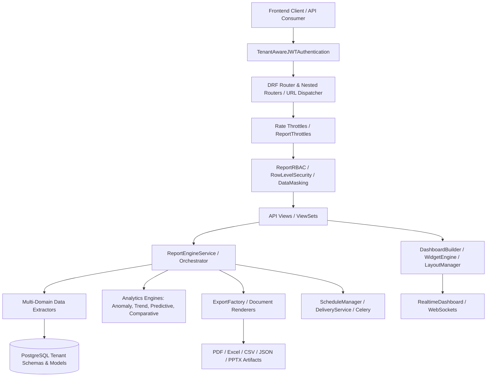
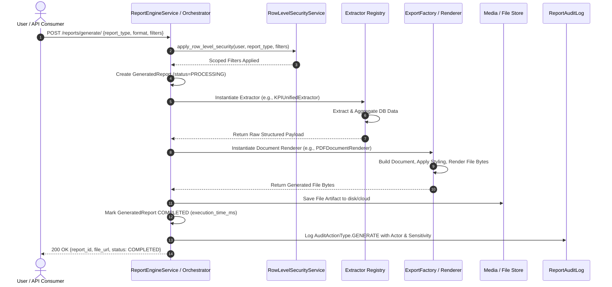
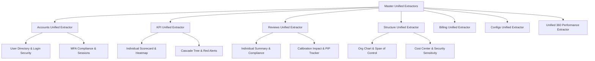
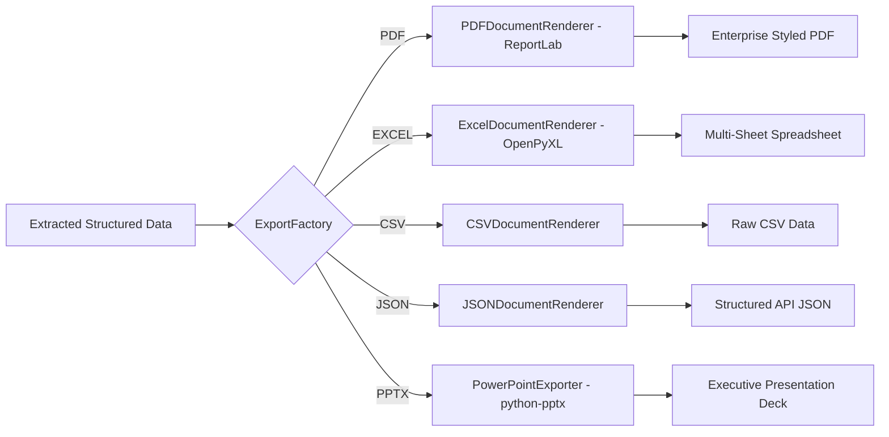
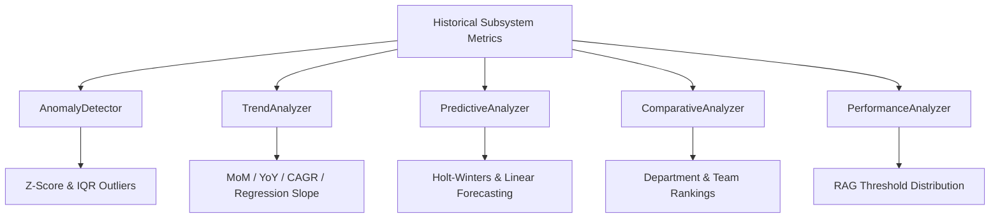
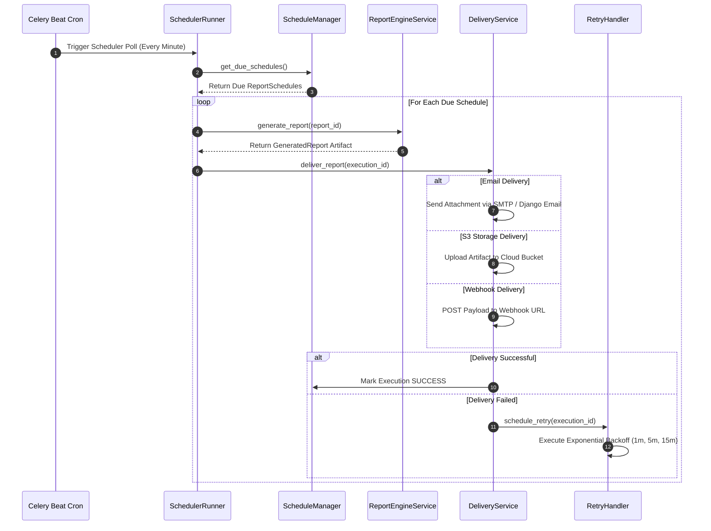

# Falcon Enterprise System — ReportPLT Subsystem Architecture & System Flow Specification

> **Document Version**: 1.0.0  
> **Target Subsystem**: `apps/reportplt` (Reporting Platform, Multi-Domain Data Extraction, Document Rendering & Export Engine, Interactive Dashboards & Widget Engine, Analytics & Anomaly Detection, Predictive Forecasting, Scheduled Delivery & Retry Pipeline, Security & Data Masking)  
> **Classification**: Technical & Operational Architecture Specification  

---

## 1. Subsystem Architecture Overview

The **Reporting Platform Subsystem** (`apps/reportplt`) serves as the centralized reporting, business intelligence, analytics, document generation, and data distribution engine for the Falcon Enterprise platform. Designed on Django REST Framework (DRF) with multi-tenant schema isolation, it extracts real operational data across all system modules (`accounts`, `structure`, `kpi`, `reviews`, `billing`, `configs`, `tenant`), applies statistical and predictive analytics, builds interactive dashboards, renders documents in multiple formats (PDF, Excel, CSV, JSON, PowerPoint), schedules automated email/webhook deliveries, and enforces strict Row-Level Security (RLS) and PII data masking.



### 1.1 Architectural Layers

1. **Models Layer (`models/`)**: Defines database schemas extending base classes (`UUIDModel`, `TimestampModel`, `SoftDeleteModel`, `TenantAwareModel`, `AuditModel`). Includes `ReportTemplate`, `GeneratedReport`, `ReportSchedule`, `ReportExecution`, `ReportExport`, `ReportDashboard`, `ReportWidget`, `ReportFilter`, `ReportShare`, `ReportAuditLog`, and `ReportSystemSettings`.
2. **Services Layer (`services/`)**: Encapsulates all domain business logic across 10 specialized sub-packages:
   - **`orchestrator.py`**: `ReportEngineService` (main execution pipeline linking extractors and renderers).
   - **`extraction/`**: `BaseDataExtractor`, 60+ domain extractors (`KPIDataExtractor`, `ReviewsDataExtractor`, `StructureDataExtractor`, `AccountsDataExtractor`, `BillingDataExtractor`, `ConfigsUnifiedExtractor`, `TenantHealthDataExtractor`, `UnifiedPerformanceExtractor`).
   - **`analytics/`**: `AnomalyDetector` (Z-score, IQR, trend anomalies), `ComparativeAnalyzer`, `PerformanceAnalyzer`, `PredictiveAnalyzer` (Linear, Moving Average, Holt-Winters), `TrendAnalyzer` (MoM, YoY, CAGR, regression).
   - **`rendering/` & `export/`**: `ExportFactory`, `PDFDocumentRenderer` (ReportLab), `ExcelDocumentRenderer` (OpenPyXL), `CSVDocumentRenderer`, `JSONDocumentRenderer`, `PowerPointExporter` (python-pptx).
   - **`dashboard/`**: `DashboardBuilder`, `LayoutManager` (grid layout, auto/compact layout), `WidgetEngine` (18 widget types), `WidgetDataFetcher`, `RealtimeDashboard` (WebSocket push).
   - **`filters/`**: `FilterEngine`, `DateFilterService`, `HierarchicalFilterService`, `SavedFilterService`.
   - **`generation/`**: `ReportGenerator`, `QueryBuilder`, `DataAggregator`, `PivotBuilder`, `ChartRenderer`.
   - **`scheduler/`**: `ScheduleManager`, `SchedulerRunner`, `DeliveryService` (Email, S3, Webhook, Slack), `RetryHandler`.
   - **`security/`**: `ReportRBAC`, `RowLevelSecurityService`, `DataMaskingService` (PII/financial masking), `ExportSecurityService`.
   - **`templates/`**: `TemplateManager`, `PrebuiltTemplateService`.
3. **API / Serialization / Permissions Layer (`api/v1/`)**:
   - **Serializers**: Payload validation, filter schemas, dashboard layouts, widget configs, export formats, schedule definitions.
   - **Permissions**: Granular check classes (`CanViewReport`, `CanGenerateReport`, `CanManageSchedules`, `CanAccessDashboards`, `CanViewSensitiveData`, `ReportRBAC`).
   - **Throttles**: Scope-based rate limiters (`ReportGenerationThrottle`, `ExportThrottle`, `AnalyticsThrottle`).
   - **Views**: 12 primary ViewSets (`ReportViewSet`, `TemplateViewSet`, `ScheduleViewSet`, `ExecutionViewSet`, `ExportViewSet`, `DashboardViewSet`, `WidgetViewSet`, `FilterViewSet`, `ShareViewSet`, `AuditViewSet`, `AnalyticsViewSet`, `ReportingViewSet`).
4. **Real-time Event & Delivery Layer (`services/dashboard/realtime_dashboard.py` & `services/scheduler/delivery_service.py`)**: Dispatches live WebSocket widget updates over Django Channels and delivers scheduled reports via Celery background tasks.

---

## 2. Multi-Tenancy Architecture & Schema Isolation

The ReportPLT subsystem operates strictly within Falcon's **hybrid multi-tenant database pattern**:
- **Extractor Scoping**: Every extractor inherits from `BaseDataExtractor` and filters all queries by `tenant_id`:
  ```python
  class BaseDataExtractor(ABC):
      def __init__(self, tenant_id: str, filters: Dict[str, Any] = None):
          self.tenant_id = str(tenant_id)
          self.filters = filters or {}
  ```
- **Row-Level Security (`RowLevelSecurityService`)**: Filters report queries dynamically based on user role, assigned department, and tenant ID.
- **Cross-Tenant Guarding**: ViewSets check user `tenant_id` on all CRUD and execution endpoints to block unauthorized cross-tenant data leakage.

---

## 3. Super Admin vs Client Admin vs Executive Distinction Matrix

The ReportPLT app enforces strict functional separation across administrative and operational roles:

| Feature / Action | Super Admin (`super_admin`) | Client Admin (`client_admin`) | Executive (`executive`) | KPI Champion (`dashboard_champion`) | Supervisor (`supervisor`) | Staff (`staff`) |
| :--- | :---: | :---: | :---: | :---: | :---: | :---: |
| **Manage System Templates** | Full CRUD | View Prebuilt | View Prebuilt | View Prebuilt | View Prebuilt | View Prebuilt |
| **Generate Subsystem Reports** | All Subsystems | Tenant Subsystems | Tenant Subsystems | KPI & Reviews | Team Scope | Self Scope |
| **Create & Manage Dashboards** | All Types | Public/System/Shared | Shared/Personal | Champion/Personal | Shared/Personal | Personal Only |
| **Schedule Automated Reports** | All Destinations | Email/S3/Webhook | Email/S3 | Email/S3 | Email Only | ✗ |
| **View Unmasked PII / Financial Data** | Unmasked | Unmasked | Role Masked | Role Masked | Masked | Masked |
| **Bypass Row-Level Security (RLS)** | Full Bypass | Tenant Scope | Department Scope | Department Scope | Team Scope | Self Scope |
| **Access System Health & Audit Logs** | Global Audit | Tenant Audit | ✗ | ✗ | ✗ | ✗ |
| **Force Recalculate / Export All** | ✓ | ✓ | ✗ | ✗ | ✗ | ✗ |

---

## 4. Comprehensive User Role Mapping & Action Matrix (RBAC + ABAC)

```
Legend:  [✓ Allowed]   [P Partial / Scope Restricted]   [✗ Forbidden]
```

| Subsystem Module & Action | Super Admin | Client Admin | Executive | Champion | Supervisor | Staff | Read-Only |
| :--- | :---: | :---: | :---: | :---: | :---: | :---: | :---: |
| **1. REPORT GENERATION** | | | | | | | |
| Generate On-Demand Report | Any Tenant | Tenant Scope | Tenant Scope | Module Scope | Team Scope | Self Scope | ✗ |
| Select Export Format (PDF/XLSX/CSV/JSON/PPTX)| All Formats | All Formats | All Formats | All Formats | PDF/XLSX/CSV | PDF/XLSX | ✗ |
| View Generated Report History | Global | Tenant | Tenant | Module Scope | Team Scope | Self Scope | Tenant (RO) |
| Download Report File Artifact | ✓ | ✓ | ✓ | ✓ | Team Scope | Self Scope | ✗ |
| Soft Delete / Purge Generated Report | ✓ | ✓ | ✗ | ✗ | ✗ | ✗ | ✗ |
| **2. TEMPLATE MANAGEMENT** | | | | | | | |
| Create / Edit Custom Report Template | Any Tenant | Own Tenant | ✗ | ✗ | ✗ | ✗ | ✗ |
| Duplicate Existing Template | ✓ | ✓ | ✓ | ✓ | ✗ | ✗ | ✗ |
| Mark Template as System Default | ✓ | ✗ | ✗ | ✗ | ✗ | ✗ | ✗ |
| Set Template Sensitivity Level | ✓ | ✓ | ✗ | ✗ | ✗ | ✗ | ✗ |
| **3. DASHBOARDS & WIDGETS** | | | | | | | |
| Create Custom Dashboard | System/Shared | Public/Shared | Shared/Personal| Shared/Personal| Personal Only | Personal Only | ✗ |
| Add / Configure Widgets (18 Types) | All Widgets | All Widgets | All Widgets | Module Widgets | Team Widgets | Self Widgets | ✗ |
| Auto-Layout / Compact Grid Layout | ✓ | ✓ | ✓ | ✓ | Personal | Personal | ✗ |
| Share Dashboard (Roles/Users/Depts) | Any Tenant | Own Tenant | Own Tenant | Own Tenant | ✗ | ✗ | ✗ |
| Publish Dashboard to Organization | ✓ | ✓ | ✗ | ✗ | ✗ | ✗ | ✗ |
| Subscribe to Real-Time WS Updates | ✓ | ✓ | ✓ | ✓ | ✓ | ✓ | ✓ |
| **4. REPORT SCHEDULING & DELIVERY** | | | | | | | |
| Create Cron / Interval Schedule | Any Destination| Tenant Scope | Tenant Scope | Module Scope | Email Only | ✗ | ✗ |
| Configure Delivery Channels (Email/S3/Webhook)| All Channels | All Channels | Email/S3 | Email/S3 | Email Only | ✗ | ✗ |
| Trigger Manual Execution Run | ✓ | ✓ | ✓ | ✓ | Team Scope | ✗ | ✗ |
| Retry Failed Deliveries | ✓ | ✓ | ✗ | ✗ | ✗ | ✗ | ✗ |
| View Execution Audit Logs | Global | Tenant | Tenant | Module Scope | Team Scope | ✗ | ✗ |
| **5. SECURITY & DATA MASKING** | | | | | | | |
| View Unmasked Sensitive Data (PII/Salary) | Unmasked | Unmasked | Masked | Masked | Masked | Masked | Masked |
| Configure Row-Level Security Rules | Global | Tenant | ✗ | ✗ | ✗ | ✗ | ✗ |
| View Report Access Audit Trail | Global | Tenant | Department | ✗ | ✗ | ✗ | ✗ |
| Export Security Incident Logs | ✓ | ✓ | ✗ | ✗ | ✗ | ✗ | ✗ |
| **6. ANALYTICS & FORECASTING** | | | | | | | |
| Run Anomaly Detection (Z-score/IQR) | Global | Tenant | Department | Department | Team Scope | ✗ | ✗ |
| Run Predictive Forecast (Holt-Winters/Linear)| Global | Tenant | Department | Department | ✗ | ✗ | ✗ |
| Run Comparative Department Analysis | Global | Tenant | Department | ✗ | ✗ | ✗ | ✗ |
| Run Trend & Regression Analysis | Global | Tenant | Department | Module Scope | Team Scope | Self Scope | Tenant (RO) |

---

## 5. End-to-End System Flows & Service Execution Logic

### 5.1 Report Generation Lifecycle & Orchestrator Workflow



#### Detailed Execution Steps:
1. **Initiation**: User or scheduled background task triggers report generation (`POST /reports/generate/`).
2. **Security & RLS Evaluation**: `RowLevelSecurityService` inspects user role and department to inject mandatory SQL/ORM filters (`tenant_id`, `department_id`, `user_id`).
3. **Data Extraction (`ReportEngineService.EXTRACTORS`)**:
   - `ReportEngineService` resolves the registered extractor for the target `report_type` (e.g., `accounts_user_directory` $\rightarrow$ `AccountsUserDirectoryExtractor`).
   - The extractor executes real database queries, aggregates metrics, and returns structured data DTOs.
4. **Rendering & Export (`ReportEngineService.RENDERERS`)**:
   - Resolved document renderer formats headers, tables, charts, and summary KPI cards.
   - Outputs binary file payload (`bytes`).
5. **Storage & Audit Logging**:
   - File saved to `media/reports/` and `mark_completed()` updates record status, execution time in milliseconds, and file size.
   - An immutable `ReportAuditLog` entry is written (`AuditActionType.GENERATE`).

---

### 5.2 Multi-Domain Extraction Engine

The platform includes **60+ specialized data extractors** across 7 core domain groups:



1. **`accounts` Domain**: `AccountsUserDirectoryExtractor`, `AccountsLoginSecurityExtractor`, `AccountsMFAComplianceExtractor`, `AccountsAuditTrailExtractor`, `AccountsRolePermissionAuditExtractor`, `AccountsSessionActivityExtractor`, `AccountsPasswordHygieneExtractor`, `AccountsSecurityAnomaliesExtractor`.
2. **`kpi` Domain**: `KPIIndividualScorecardExtractor`, `KPIDepartmentalHeatmapExtractor`, `KPICascadeTreeExtractor`, `KPIRedAlertsExtractor`, `KPIValidationComplianceExtractor`.
3. **`reviews` Domain**: `ReviewsIndividualSummaryExtractor`, `ReviewsCycleComplianceExtractor`, `ReviewsOrganizationPerformanceExtractor`, `ReviewsCalibrationImpactExtractor`, `ReviewsPIPTrackerExtractor`.
4. **`structure` Domain**: `StructureOrgChartExtractor`, `StructureSpanOfControlExtractor`, `StructureInterimDelegationExtractor`, `StructureCostCenterAllocationExtractor`, `StructureSecuritySensitivityExtractor`.
5. **`billing` Domain**: `BillingSubscriptionSummaryExtractor`, `BillingRevenueFinancialExtractor`, `BillingPaymentTransactionsExtractor`, `BillingUsageQuotaAuditExtractor`, `BillingDunningRecoveryExtractor`.
6. **`configs` Domain**: `ConfigsBackupExtractor`, `ConfigsDRExtractor`, `ConfigsHealthExtractor`, `ConfigsMaintenanceExtractor`, `ConfigsSecurityExtractor`.
7. **Unified Performance 360**: `UnifiedPerformanceExtractor` (combines KPI execution scores and 360 review ratings into a single employee talent matrix).

---

### 5.3 Document Rendering & Export Engine

`ExportFactory` dynamically resolves document renderers based on the target format:

$$\text{ExportFormat} \in \{\text{PDF}, \text{EXCEL}, \text{CSV}, \text{JSON}, \text{PPTX}\}$$



- **PDF Document Renderer (`PDFDocumentRenderer`)**: Generates print-ready vector PDF documents using ReportLab with cover page, executive summary cards, dynamic data tables, page numbering, and header/footer branding.
- **Excel Document Renderer (`ExcelDocumentRenderer`)**: Uses OpenPyXL to build multi-tab workbooks with styled header rows, auto-column width sizing, zebra striping, currency formatting, and formula summary rows.
- **PowerPoint Exporter (`PowerPointExporter`)**: Generates multi-slide C-Suite presentation decks using `python-pptx`, complete with metric callout boxes and bar/pie chart slides.

---

### 5.4 Analytics, Trend Analysis, Anomaly & Predictive Forecasting Engine

The platform provides 5 statistical analytics engines:



1. **Anomaly Detector (`AnomalyDetector`)**:
   - Calculates rolling mean and standard deviation:
     $$Z = \frac{x - \mu}{\sigma}$$
   - Identifies statistical outliers where $|Z| > 2.0$ (Medium/High) or $|Z| > 3.0$ (Critical).
   - Computes Interquartile Range (IQR) bounds ($Q_1 - 1.5 \text{IQR}, Q_3 + 1.5 \text{IQR}$) to detect extreme operational anomalies.
2. **Trend Analyzer (`TrendAnalyzer`)**:
   - Calculates Month-over-Month (MoM) growth, Year-over-Year (YoY) growth, and Compound Annual Growth Rate (CAGR):
     $$\text{CAGR} = \left(\frac{\text{End Value}}{\text{Start Value}}\right)^{\frac{1}{n}} - 1$$
   - Computes linear regression slope to evaluate trend direction (`UPWARD`, `DOWNWARD`, `STABLE`, `VOLATILE`).
3. **Predictive Analyzer (`PredictiveAnalyzer`)**:
   - Executes linear regression, exponential smoothing ($\alpha = 0.3$), and triple-exponential Holt-Winters forecasting for seasonal data.
   - Calculates $95\%$ confidence intervals ($\pm 1.96 \sigma$).
4. **Comparative Analyzer (`ComparativeAnalyzer`)**:
   - Computes cross-departmental and cross-team variance, standard deviation, and comparative performance matrix.

---

### 5.5 Interactive Dashboard, Widget Engine & Real-Time Broadcast

```mermaid
graph TD
    Dashboard[ReportDashboard] --> Layout[LayoutManager]
    Layout --> Grid[12-Column Responsive Grid]
    Dashboard --> Widgets[ReportWidget Worklist]
    Widgets --> Engine[WidgetEngine]
    Engine --> Fetcher[WidgetDataFetcher]
    Fetcher --> Data[Subsystem Data Models]
    Engine --> Renderer[Widget Renderers (18 Types)]
    Renderer --> Output[Structured Widget Payload]
    Output --> Realtime[RealtimeDashboard WS Push]
```

#### Widget Engine (`WidgetEngine` & `WidgetDataFetcher`):
Supports **18 widget types**: `KPI`, `CHART`, `TABLE`, `HEATMAP`, `TREND`, `GAUGE`, `PIE`, `BAR`, `LINE`, `AREA`, `SCATTER`, `MAP`, `LIST`, `SUMMARY`, `MISSION`, `PIP`, `COMPLIANCE`, `CUSTOM`.

#### Grid Layout Manager (`LayoutManager`):
- Controls 12-column responsive layout grids.
- Provides `auto_layout()` (automatic grid placement) and `compact_layout()` (vertical gap compaction).

#### Real-Time Broadcast (`RealtimeDashboard`):
- Pushes live widget updates over Django Channels WebSocket groups (`dashboard_<dashboard_id>`).

---

### 5.6 Scheduled Delivery, Retry Pipeline & Distribution Engine



#### Delivery Channels (`DeliveryService`):
- **Email**: Sends rendered report files as email attachments.
- **S3 Cloud**: Uploads report artifacts to AWS S3 / GCS cloud buckets.
- **Webhook**: Posts report metadata and download links to external API webhooks.
- **Slack / Teams**: Posts notifications with report summary metrics to messaging channels.

---

### 5.7 Security, Data Masking & Row-Level Security (RLS)

1. **Report RBAC (`ReportRBAC`)**: Evaluates granular user permissions before granting view, edit, execute, or export access to reports and dashboards.
2. **Data Masking Service (`DataMaskingService`)**:
   - Automatically masks PII and sensitive financial fields for non-admin roles:
     - Email: `j***n@example.com`
     - Phone: `+254 **** **123`
     - Salary / Amount: `KES ***,***.00`
3. **Export Security (`ExportSecurityService`)**:
   - Scans export payloads for sensitive keyword violations.
   - Enforces watermark overlays on confidential PDF downloads.

---

## 6. End-to-End API Endpoint Reference Map

```
/api/v1/reportplt/
├── reports/                                  [REST]  Report ViewSet (CRUD, generate, clone, download)
│   ├── generate/                             [POST]  Trigger on-demand report generation
│   ├── history/                              [GET]   List generated report history
│   ├── {id}/download/                        [GET]   Download generated report file artifact
│   ├── {id}/schedules/                       [GET/POST] Nested: Report schedules
│   ├── {id}/executions/                      [GET]   Nested: Report execution history
│   ├── {id}/exports/                         [GET/POST] Nested: Report exports
│   ├── {id}/shares/                          [GET/POST] Nested: Report shares
│   └── {id}/audits/                          [GET]   Nested: Report audit trail
├── templates/                                [REST]  Template ViewSet (CRUD, duplicate, set default)
│   ├── prebuilt/                             [GET]   List prebuilt system templates
│   ├── active/                               [GET]   List active report templates
│   ├── {id}/duplicate/                       [POST]  Duplicate report template
│   └── {id}/set_default/                     [POST]  Set template as default
├── schedules/                                [REST]  Schedule ViewSet (CRUD, activate, pause, run now)
│   ├── due/                                  [GET]   List schedules currently due for execution
│   ├── {id}/activate/                        [POST]  Activate paused schedule
│   ├── {id}/pause/                           [POST]  Pause active schedule
│   ├── {id}/run_now/                         [POST]  Trigger manual schedule execution run
│   └── {id}/executions/                      [GET]   Nested: Schedule execution history
├── executions/                               [REST]  Execution ViewSet (Read-Only history & retry)
│   ├── recent/                               [GET]   List recent execution runs
│   ├── failed/                               [GET]   List failed execution runs
│   └── {id}/retry/                           [POST]  Retry failed execution delivery
├── exports/                                  [REST]  Export ViewSet (CRUD, supported formats)
│   ├── supported_formats/                    [GET]   List supported export formats
│   └── export_direct/                        [POST]  Direct dataset export to bytes
├── dashboards/                               [REST]  Dashboard ViewSet (CRUD, layout, publish, share)
│   ├── my_dashboards/                        [GET]   List user owned dashboards
│   ├── shared/                               [GET]   List shared dashboards
│   ├── default/                              [GET]   Get user default dashboard
│   ├── {id}/set_default/                     [POST]  Set dashboard as default
│   ├── {id}/share/                           [POST]  Share dashboard with roles/users/depts
│   ├── {id}/unshare/                         [POST]  Unshare dashboard
│   ├── {id}/publish/                         [POST]  Publish dashboard to organization
│   ├── {id}/unpublish/                       [POST]  Unpublish dashboard
│   ├── {id}/duplicate/                       [POST]  Duplicate dashboard with widgets
│   ├── {id}/auto_layout/                     [POST]  Apply auto-grid layout
│   ├── {id}/compact_layout/                  [POST]  Apply compact grid layout
│   ├── {id}/widgets/                         [GET/POST] Nested: Dashboard widgets
│   ├── {id}/shares/                          [GET/POST] Nested: Dashboard shares
│   └── {id}/audits/                          [GET]   Nested: Dashboard audit trail
├── widgets/                                  [REST]  Widget ViewSet (CRUD, render, data fetch)
│   ├── {id}/render/                          [GET]   Render widget data payload
│   ├── {id}/position/                        [PATCH] Update widget grid position
│   └── {id}/size/                            [PATCH] Update widget grid size
├── filters/                                  [REST]  Filter ViewSet (CRUD, saved filters, validate)
│   ├── saved/                                [GET]   List saved user filters
│   └── validate/                             [POST]  Validate filter JSON schema
├── shares/                                   [REST]  Share ViewSet (CRUD, revoked shares)
│   └── {id}/revoke/                          [POST]  Revoke share access
├── audits/                                   [REST]  Audit Log Read-Only ViewSet
│   ├── security_events/                      [GET]   List security & data access audit events
│   └── user_activity/                        [GET]   List user activity audit summary
├── analytics/                                [REST]  Analytics APIViewSet (Statistical & Predictive)
│   ├── anomalies/                            [POST]  Run anomaly detection (Z-score/IQR)
│   ├── trend/                                [POST]  Run trend & regression analysis
│   ├── forecast/                             [POST]  Run predictive forecasting (Holt-Winters/Linear)
│   └── comparative/                          [POST]  Run comparative department/team analysis
└── reporting/                                [REST]  Reporting ViewSet (Master Platform Aggregations)
    ├── kpi_summary/                          [GET]   Get master KPI performance summary
    ├── reviews_summary/                      [GET]   Get master reviews appraisal summary
    ├── accounts_summary/                     [GET]   Get master accounts security summary
    ├── billing_summary/                      [GET]   Get master billing financial summary
    ├── structure_summary/                    [GET]   Get master org chart structure summary
    ├── configs_summary/                      [GET]   Get master system configs health summary
    └── unified_360/                          [GET]   Get unified 360 organization health report
```

---

## 7. Production Readiness Checklist & Verification Guidelines

To verify that the ReportPLT subsystem is **100% production-ready**:

1. **Multi-Tenancy Verification**:
   - Confirm that all 60+ data extractors inherit from `BaseDataExtractor` and enforce `tenant_id` query filtering.
   - Verify that cross-tenant access to `GeneratedReport`, `ReportDashboard`, `ReportSchedule`, or `ReportExport` returns `404 Not Found` or `403 Forbidden`.

2. **Rendering & Export Integrity**:
   - Verify that `PDFDocumentRenderer` generates valid vector PDF byte streams without truncation or syntax errors.
   - Verify that `ExcelDocumentRenderer` builds valid OpenPyXL workbooks with dynamic column formatting.
   - Confirm `PowerPointExporter` generates slide decks with chart callout shapes.

3. **Analytics & Statistical Calculation Accuracy**:
   - Verify `AnomalyDetector` Z-score and IQR bounds match theoretical statistical distributions.
   - Verify `TrendAnalyzer` CAGR and linear regression slope outputs.
   - Confirm `PredictiveAnalyzer` Holt-Winters forecasting computes valid $95\%$ confidence intervals.

4. **Security & Data Masking**:
   - Verify `DataMaskingService` obscures PII (email, phone) and salary/amount fields for non-admin roles.
   - Confirm `ReportRBAC` blocks unauthorized report creation, editing, or downloading.

5. **Asynchronous Execution & WebSockets**:
   - Verify scheduled report execution runs via Celery (`SchedulerRunner`) with automatic exponential backoff retries (`RetryHandler`).
   - Confirm real-time widget updates broadcast over WebSockets (`RealtimeDashboard`).

---
*End of ReportPLT Subsystem System Flow Specification.*
