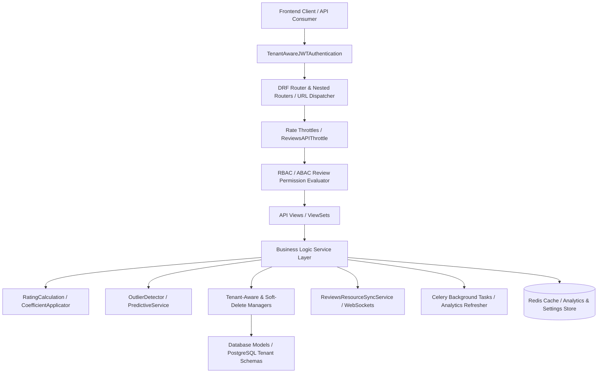
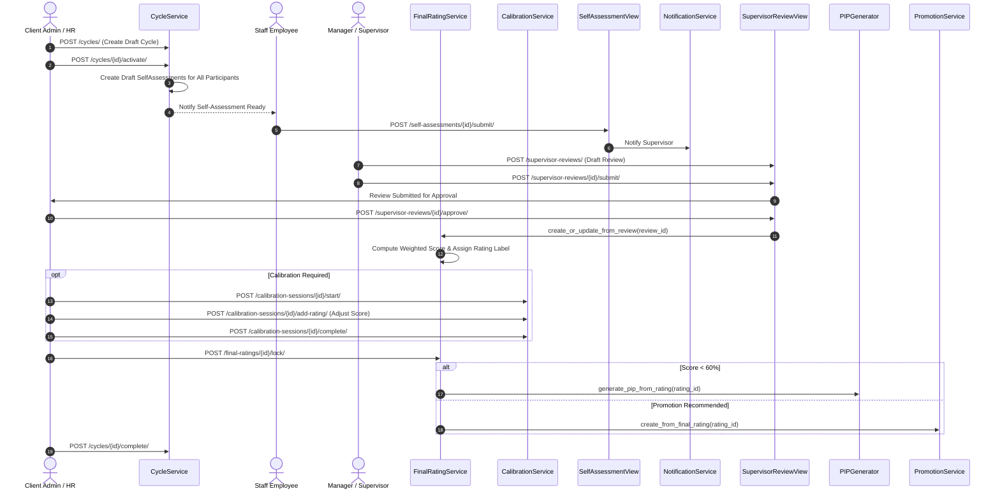
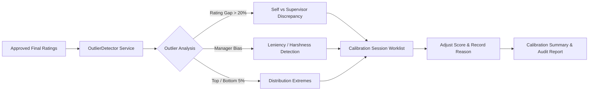
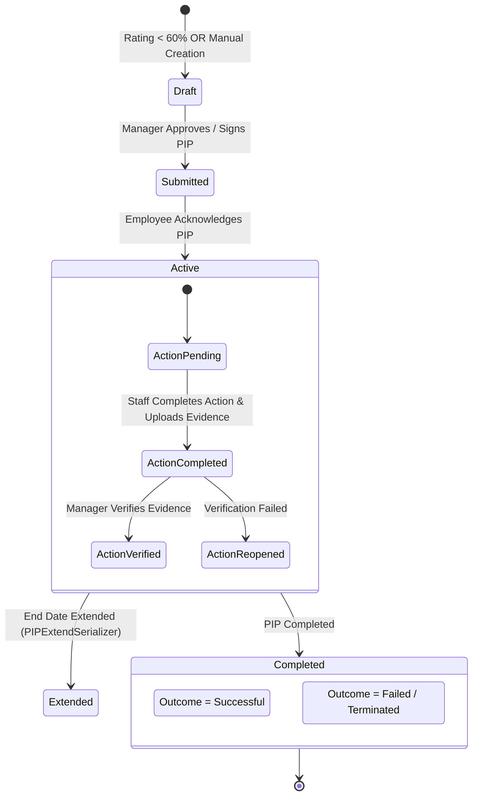
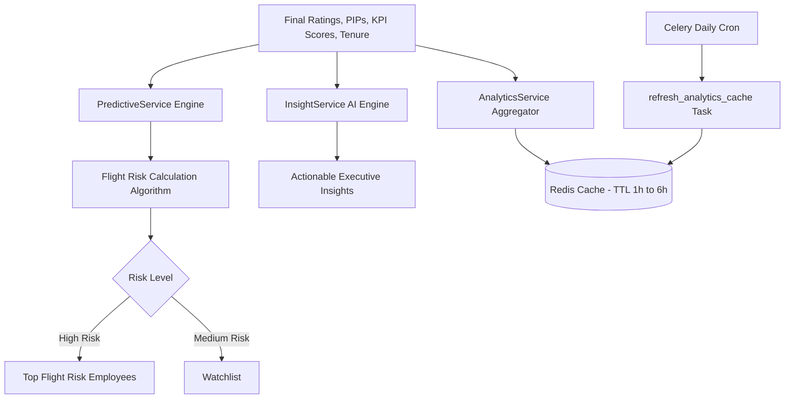

# Falcon Enterprise System — Reviews Subsystem Architecture & System Flow Specification

> **Document Version**: 1.0.0  
> **Target Subsystem**: `apps/reviews` (Performance Review Cycles, Self-Assessments, Supervisor Reviews, Final Ratings & Scoring Engine, 360-Degree Feedback, Calibration Sessions & Outlier Detection, Performance Improvement Plans (PIP), Promotion Recommendations, Executive Analytics & Predictive Flight Risk, System Settings)  
> **Classification**: Technical & Operational Architecture Specification  

---

## 1. Subsystem Architecture Overview

The **Reviews Subsystem** (`apps/reviews`) serves as the core performance management, evaluation, calibration, and talent analytics engine for the Falcon Enterprise platform. Designed on Django REST Framework (DRF) with multi-tenant schema isolation, it orchestrates multi-stage performance cycles, weighted evaluation models, automated rating calculations, interactive calibration sessions, structured Performance Improvement Plans (PIP), 360-degree feedback loops, and predictive flight-risk analytics.



### 1.1 Architectural Layers

1. **Models Layer (`models/`)**: Defines database entities extending base classes (`UUIDModel`, `TimestampModel`, `SoftDeleteModel`, `TenantAwareModel`, `AuditModel`). Includes `ReviewCycle`, `SelfAssessment`, `SupervisorReview`, `FinalRating`, `RatingScale`, `CompetencyCategory`, `Competency`, `CompetencyRating`, `CalibrationSession`, `CalibrationRating`, `CalibrationComment`, `PIP`, `PIPAction`, `PIPReview`, `FeedbackRequest`, `FeedbackResponse`, `FeedbackSummary`, `PromotionRecommendation`, `Coefficient`, `ReviewComment`, `ReviewTemplate`, and `ReviewsSystemSettings`.
2. **Managers Layer (`managers/`)**: Intercepts database queries to enforce multi-tenant isolation (`TenantAwareManager` injecting thread-local `tenant_id`) and soft-delete exclusions (`SoftDeleteManager`). Provides custom querysets for status-driven cycle filtering and score aggregations.
3. **Services Layer (`services/`)**: Encapsulates all domain business logic across 12 specialized sub-packages:
   - **`assessment/`**: `SelfAssessmentService`, `SupervisorReviewService`, `FinalRatingService`.
   - **`cycle/`**: `CycleService` (cycle state machine, participant resolution, reminder triggers).
   - **`calibration/`**: `CalibrationService`, `OutlierDetector`.
   - **`pip/`**: `PIPService`, `PIPGenerator`, `PIPTracker`.
   - **`feedback/`**: `FeedbackService`, `SummaryService`.
   - **`analytics/`**: `AnalyticsService`, `InsightService`, `PredictiveService`.
   - **`promotion/`**: `PromotionService`.
   - **`rating/`**: `CoefficientApplicator`, `RatingCalculator`.
   - **`reporting/`**: `ReviewSummaryService`, `PIPReportService`, `CalibrationReportService`.
   - **`notification/`**: `NotificationService` (email & WebSocket alerts).
   - **`settings/`**: `ReviewsSettingsService` (dynamic policy & configuration cache).
   - **`sync/`**: `ReviewsResourceSyncService` (real-time channel broadcast & live metrics).
4. **API / Serialization / Permissions Layer (`api/v1/`)**:
   - **Serializers**: Payload validation, score range enforcement, date-order assertions, nested relational serializations, and export data structures.
   - **Permissions**: Granular check classes (`CanViewReview`, `CanEditReview`, `CanApproveReview`, `CanSubmitSelfAssessment`, `CanConductSupervisorReview`, `CanViewFinalRating`, `CanViewTeamReviews`, `CanViewCompanyAnalytics`, `CanViewPredictions`, `CanFacilitateCalibration`, `IsAdminOnly`, `IsAdminOrManager`).
   - **Throttles**: Scope-based rate limiters (`ReviewsAPIThrottle`, `AnalyticsThrottle`, `ReviewSubmissionThrottle`, `CalibrationActionThrottle`, `PIPCreationThrottle`, `BulkReviewOperationThrottle`).
   - **Views**: 22 primary DRF ViewSets and APIViews implementing single and nested REST endpoints.
5. **Real-time Event & Sync Layer (`services/sync/`)**: Dispatches live WebSocket messages via Django Channels to update interactive dashboard counters and calibration session scoreboards in real-time.

---

## 2. Multi-Tenancy Architecture & Schema Isolation

The Reviews subsystem operates strictly within Falcon's **hybrid multi-tenant database pattern**:
- **Tenant Context**: All operational evaluation data (`ReviewCycle`, `SelfAssessment`, `FinalRating`, `PIP`, etc.) contains a `tenant_id` UUID field and inherits from `TenantAwareModel`.
- **Automatic Scoping**: Querysets are automatically filtered by `tenant_id` at the base ViewSet level:
  ```python
  class BaseReviewViewSet(viewsets.ModelViewSet):
      def get_queryset(self):
          queryset = super().get_queryset()
          tenant_id = getattr(self.request.user, 'tenant_id', None)
          if tenant_id and hasattr(queryset.model, 'tenant_id'):
              queryset = queryset.filter(tenant_id=tenant_id)
          elif tenant_id and hasattr(queryset.model, 'employee') and hasattr(queryset.model.employee, 'tenant_id'):
              queryset = queryset.filter(employee__tenant_id=tenant_id)
          return queryset
  ```
- **Cross-Tenant Guarding**: All action endpoints explicitly assert `tenant_id` equivalence. Admin functions (such as system settings updates or global cycle triggers) check user role permissions before executing tenant-wide queries.

---

## 3. Role Distinction & Access Control Matrix

The reviews app implements a strict hierarchy dividing **Platform Administrators**, **Tenant Admins/HR**, **Supervisors/Managers**, and **Staff Employees**.

| Feature / Action | Super Admin (`super_admin`) | Client Admin / HR (`client_admin`) | Executive (`executive`) | Supervisor (`supervisor`) | Staff (`staff`) | Read-Only (`read_only`) |
| :--- | :---: | :---: | :---: | :---: | :---: | :---: |
| **Manage Review Cycles** (Create/Activate/Complete/Archive) | ✓ | ✓ | View Only | View Only | View Active | View Only |
| **Configure Templates & Rating Scales** | ✓ | ✓ | ✗ | ✗ | ✗ | ✗ |
| **Manage Coefficients & Weights** | ✓ | ✓ | ✗ | ✗ | ✗ | ✗ |
| **Submit Own Self-Assessment** | ✓ | ✓ | ✓ | ✓ | ✓ | ✗ |
| **Conduct Supervisor Reviews** | All Users | All Tenant Users | Direct & Indirect Team | Direct Reports Only | ✗ | ✗ |
| **Approve / Reject Supervisor Reviews** | ✓ | ✓ | ✗ | ✗ | ✗ | ✗ |
| **Calibrate Ratings & Adjust Scores** | ✓ | ✓ | Facilitate/View | View Team | ✗ | ✗ |
| **Lock / Finalize Ratings** | ✓ | ✓ | ✗ | ✗ | ✗ | ✗ |
| **Initiate & Manage PIPs** | ✓ | ✓ | Direct Team | Direct Reports | View Own | ✗ |
| **Verify PIP Actions & Evidence** | ✓ | ✓ | Direct Team | Direct Reports | Complete Own | ✗ |
| **Approve / Reject Promotions** | ✓ | ✓ | ✗ | Recommend | ✗ | ✗ |
| **Request & Submit 360 Feedback** | ✓ | ✓ | Direct Team | Direct Team | Submit Assigned | ✗ |
| **Access Predictive Analytics & Flight Risk** | ✓ | ✓ | ✗ | ✗ | ✗ | ✗ |
| **Access Department / Company Analytics** | ✓ | ✓ | Department Scope | Team Scope | ✗ | ✗ |
| **Manage Subsystem System Settings** | ✓ | Read Only | ✗ | ✗ | ✗ | ✗ |

---

## 4. Comprehensive User Role Mapping & Action Matrix (RBAC + ABAC)

```
Legend:  [✓ Allowed]   [P Partial / Scope Restricted]   [✗ Forbidden]
```

| Subsystem Module & Action | Super Admin | Client Admin | Executive | Supervisor | Staff | Read-Only |
| :--- | :---: | :---: | :---: | :---: | :---: | :---: |
| **1. REVIEW CYCLES** | | | | | | |
| Create / Edit / Delete Cycle | ✓ | ✓ | ✗ | ✗ | ✗ | ✗ |
| Activate / Freeze / Complete Cycle | ✓ | ✓ | ✗ | ✗ | ✗ | ✗ |
| Extend Cycle End Date | ✓ | ✓ | ✗ | ✗ | ✗ | ✗ |
| Send Self & Supervisor Reminders | ✓ | ✓ | ✗ | ✗ | ✗ | ✗ |
| View Cycle Progress & Stats | Global | Tenant | Department | Team | Active Cycle | Tenant (RO) |
| **2. SELF-ASSESSMENTS** | | | | | | |
| View Own Self-Assessment | ✓ | ✓ | ✓ | ✓ | ✓ | ✗ |
| Save Draft / Edit Own Self-Assessment | ✓ | ✓ | ✓ | ✓ | ✓ | ✗ |
| Submit Self-Assessment (before deadline) | ✓ | ✓ | ✓ | ✓ | ✓ | ✗ |
| Reset Self-Assessment to Draft | ✓ | ✓ | ✗ | ✗ | Own Draft | ✗ |
| View Team Self-Assessments | Global | Tenant | Department | Direct Reports | ✗ | ✗ |
| **3. SUPERVISOR REVIEWS** | | | | | | |
| Create / Draft Supervisor Review | Any User | Tenant Users | Direct Team | Direct Reports | ✗ | ✗ |
| Submit Supervisor Review | Any User | Tenant Users | Direct Team | Direct Reports | ✗ | ✗ |
| Approve / Reject Supervisor Review | ✓ | ✓ | ✗ | ✗ | ✗ | ✗ |
| Request Changes on Review | ✓ | ✓ | ✗ | ✗ | ✗ | ✗ |
| View Comparison Gap (Self vs Supervisor) | ✓ | ✓ | Direct Team | Direct Reports | ✗ | ✗ |
| **4. FINAL RATINGS & SCORING** | | | | | | |
| Calculate / Recalculate Final Score | ✓ | ✓ | ✗ | ✗ | ✗ | ✗ |
| Approve Final Rating | ✓ | ✓ | ✗ | ✗ | ✗ | ✗ |
| Calibrate Score (Manual Adjustment) | ✓ | ✓ | ✗ | ✗ | ✗ | ✗ |
| Lock Rating (Triggers PIP/Promotion) | ✓ | ✓ | ✗ | ✗ | ✗ | ✗ |
| View Final Ratings & Distribution | Global | Tenant | Department | Direct Team | Own Rating | Tenant (RO) |
| Export Final Ratings (CSV/XLSX) | ✓ | ✓ | ✗ | ✗ | ✗ | ✗ |
| **5. CALIBRATION SESSIONS** | | | | | | |
| Create / Schedule Calibration Session | ✓ | ✓ | ✗ | ✗ | ✗ | ✗ |
| Start / Complete / Cancel Session | ✓ | ✓ | ✗ | ✗ | ✗ | ✗ |
| Adjust Rating in Live Session | ✓ | ✓ | ✗ | ✗ | ✗ | ✗ |
| Post Session Discussion Comments | Facilitator | Facilitator | Participant | Participant | ✗ | ✗ |
| View Outliers & Calibration Recs | ✓ | ✓ | Department | ✗ | ✗ | ✗ |
| **6. PERFORMANCE IMPROVEMENT PLANS (PIP)** | | | | | | |
| Create PIP (Manual or Auto-Generated) | ✓ | ✓ | Direct Team | Direct Reports | ✗ | ✗ |
| Approve / Start / Extend PIP | ✓ | ✓ | ✗ | ✗ | ✗ | ✗ |
| Add & Complete Action Items | Manager | Manager | Manager | Manager | Complete Own | ✗ |
| Verify Action Item Evidence | Manager | Manager | Manager | Manager | ✗ | ✗ |
| Complete PIP (Successful/Failed/Terminated)| ✓ | ✓ | ✗ | ✗ | ✗ | ✗ |
| View PIP Progress & Reports | Global | Tenant | Department | Direct Reports | Own PIP | ✗ |
| **7. 360-DEGREE FEEDBACK** | | | | | | |
| Request 360 Feedback / Bulk Request | ✓ | ✓ | Direct Team | Direct Reports | ✗ | ✗ |
| Submit Feedback Response | ✓ | ✓ | ✓ | ✓ | Assigned | ✗ |
| View Feedback Summary | HR | HR | Shared Summary | Shared Summary | Shared Summary| ✗ |
| Share Summary with Employee | ✓ | ✓ | ✗ | ✗ | ✗ | ✗ |
| **8. PROMOTIONS & COEFFICIENTS** | | | | | | |
| Create Promotion Recommendation | Supervisor | Supervisor | Supervisor | Supervisor | ✗ | ✗ |
| Approve / Reject / Hold Promotion | ✓ | ✓ | ✗ | ✗ | ✗ | ✗ |
| Manage Coefficients (Dept/Pos/User) | ✓ | ✓ | ✗ | ✗ | ✗ | ✗ |
| **9. ANALYTICS & PREDICTIONS** | | | | | | |
| View Company Analytics & Trends | ✓ | ✓ | ✗ | ✗ | ✗ | ✗ |
| View Predictive Flight Risk | ✓ | ✓ | ✗ | ✗ | ✗ | ✗ |
| View Skill Gap Analysis | ✓ | ✓ | Department | ✗ | ✗ | ✗ |
| Force Refresh Analytics Cache | ✓ | ✓ | ✗ | ✗ | ✗ | ✗ |

---

## 5. End-to-End System Flows & Service Execution Logic

### 5.1 Performance Review Cycle Lifecycle & Assessment Workflow



#### Detailed Execution Steps:
1. **Cycle Creation & Activation**:
   - Client Admin creates a `ReviewCycle` defining start date, end date, self-assessment deadline, supervisor review deadline, evaluation weights, and included departments.
   - Calling `/activate/` changes cycle status from `draft` to `submitted` (active), triggering `CycleService.create_self_assessments_for_cycle(cycle)` which bulk-creates `SelfAssessment` records for all eligible employees.
2. **Self-Assessment Submission**:
   - Employees complete rating scores, strengths, areas for improvement, goals, and training requests.
   - On `/submit/`, deadline validation is asserted (`now() <= self_assessment_deadline`), status changes to `submitted`, and `NotificationService` alerts the direct supervisor.
3. **Supervisor Review & Approval**:
   - Supervisors write performance summaries, recognized achievements, progression notes, and rate competencies.
   - Upon supervisor `/submit/`, review enters `submitted` status. Admin/HR reviews the draft and calls `/approve/`.
   - Approval invokes `FinalRatingService.create_or_update_from_review(review_id)` to calculate the overall rating.

---

### 5.2 Dynamic Score Calculation, Weighting & Coefficient Application Engine

The final performance score is calculated dynamically by `FinalRatingService` and `RatingCalculator` using the following multi-factor formula:

$$\text{Raw Score} = (W_{\text{KPI}} \times S_{\text{KPI}}) + (W_{\text{Comp}} \times S_{\text{Comp}}) + (W_{\text{Mission}} \times S_{\text{Mission}}) + (W_{\text{Task}} \times S_{\text{Task}})$$

Where:
- $W_{\text{KPI}}, W_{\text{Comp}}, W_{\text{Mission}}, W_{\text{Task}}$ are weight percentages defined on the `ReviewCycle` ($\sum W = 100\%$).
- $S_{\text{KPI}}$ is the KPI score (fetched from `apps.kpi` or overridden by supervisor).
- $S_{\text{Comp}}$ is the normalized average competency rating ($0 - 100\%$).

#### Coefficient Adjustment:
If active department, position, or user-level `Coefficient` records exist, `CoefficientApplicator` applies scaling:

$$\text{Score}_{\text{Adjusted}} = \text{Raw Score} \times \text{Value}_{\text{Coefficient}}$$

#### Calibration Adjustment & Final Rating Label:
If calibrated during a calibration session:

$$\text{Final Score} = \text{Score}_{\text{Adjusted}} + \Delta_{\text{Calibration}}$$

`FinalScore` is then mapped against active `RatingScale` threshold bands to assign `final_rating_label` (e.g., *Exceeds Expectations*, *Meets Expectations*, *Needs Improvement*) and `final_rating_color`.

---

### 5.3 Calibration Session, Outlier Detection & Rating Distribution Engine



#### Outlier Detection Logic (`OutlierDetector`):
1. **Self-Supervisor Rating Gap**: Flags evaluations where $|S_{\text{Self}} - S_{\text{Supervisor}}| > 20\%$.
2. **Manager Inflation / Deflation**: Calculates manager average evaluation rating across all direct reports. If manager average deviates from company mean by $> 1.5 \sigma$ (standard deviation), manager reviews are flagged for leniency or harshness bias.
3. **Forced Distribution Validation**: Compares tenant rating distribution against target distribution curves (e.g., $10\%$ Exceptional, $70\%$ Proficient, $20\%$ Developing).

#### Calibration Execution (`CalibrationSessionViewSet`):
- Facilitators conduct live sessions using `/add-rating/` to modify scores.
- Every adjustment creates a permanent `CalibrationRating` audit record tracking `before_score`, `after_score`, `adjusted_by`, and `adjustment_reason`.
- Participants post discussion notes via `/add-comment/`.

---

### 5.4 Performance Improvement Plan (PIP) Lifecycle & Action Verification Engine



#### Automated PIP Generation (`PIPGenerator`):
- When a `FinalRating` is locked with `final_score < 60%`, `PIPGenerator.generate_pip_from_rating(rating_id)` automatically provisions a new `PIP` with severity `high`, default 60-day duration, and auto-generated improvement objectives based on low-scoring competencies and KPIs.

#### PIP Action Verification (`PIPActionViewSet`):
- Each action item can specify `requires_evidence = True`.
- When staff calls `/actions/{id}/complete/`, they provide progress notes and evidence links.
- Supervisors must explicitly call `/actions/{id}/verify/` to confirm evidence.

---

### 5.5 360-Degree Feedback & Summary Aggregation Engine

1. **Feedback Requests**: Supervisors or HR create `FeedbackRequest` entries specifying `subject`, `reviewer`, `reviewer_type` (`peer`, `subordinate`, `manager`, `client`, `other`), and `due_date`. Bulk requests are created via `/bulk_create/`.
2. **Anonymization & Submission**: Reviewers submit responses (`FeedbackResponse`). If `is_anonymous = True`, identity fields are stripped from standard manager responses.
3. **Automated Summary Generation (`SummaryService`)**:
   - When all required requests for a subject reach `submitted` status, `SummaryService.generate_summary(cycle_id, subject_id)` computes quantitative category averages and compiles qualitative strengths and development suggestions into a `FeedbackSummary`.
   - Summaries remain hidden from employees until HR explicitly calls `/share/`.

---

### 5.6 Executive Analytics, Insights & Predictive Flight Risk Engine



#### Analytics & Predictive Calculation Rules:
1. **Flight Risk Prediction (`PredictiveService`)**: Evaluates risk factors:
   - Decreasing performance trend over consecutive cycles.
   - Low salary positioning relative to job grade.
   - High competency gap in core role requirements.
   - Unresolved PIP history or stagnant promotion timeline.
2. **Skill Gap Analytics (`SkillGapAnalyticsView`)**: Normalizes competency scores across departments to surface company-wide competency deficiencies and strengths.
3. **Async Cache Maintenance**: Heavy analytical queries are cached in Redis ($1\text{ to }6\text{ hours}$). Administrative users can trigger on-demand cache recalculations via `POST /analytics/refresh/`.

---

## 6. End-to-End API Endpoint Reference Map

```
/api/v1/reviews/
├── health/                                   [GET]   Health check endpoint
├── dashboard/
│   ├── metrics/                              [GET]   Live authenticated dashboard metrics (WebSocket mirror)
│   ├── staff/                                [GET]   Staff employee personal dashboard summary
│   ├── supervisor/                           [GET]   Supervisor team review queue dashboard
│   ├── executive/                            [GET]   Executive departmental analytics dashboard
│   └── admin/                                [GET]   Tenant admin overview dashboard
├── reference-data/                           [GET]   Reference data lookup (users, units, positions)
├── system-settings/                          [GET/PATCH] Reviews subsystem configuration settings
│   └── reset/                                [POST]  Reset settings to platform defaults
├── rating-scales/                            [REST]  Rating Scale ViewSet (CRUD, default, activate, convert)
│   ├── default/                              [GET]   Get active default rating scale
│   ├── active_scales/                        [GET]   List all active rating scales
│   ├── {id}/set_default/                     [POST]  Set scale as tenant default
│   ├── {id}/activate/                        [POST]  Activate scale
│   ├── {id}/deactivate/                      [POST]  Deactivate scale
│   └── convert/                              [POST]  Convert scores between scale types
├── competency-categories/                    [REST]  Competency Category ViewSet
│   ├── {id}/activate/                        [POST]  Activate category
│   ├── {id}/deactivate/                      [POST]  Deactivate category
│   └── {id}/competencies/                    [GET]   List competencies under category
├── competencies/                             [REST]  Competency ViewSet
│   ├── active/                               [GET]   List active competencies
│   ├── required/                             [GET]   List required competencies
│   ├── by-type/{comp_type}/                  [GET]   Filter competencies by type
│   ├── {id}/activate/                        [POST]  Activate competency
│   ├── {id}/deactivate/                      [POST]  Deactivate competency
│   └── {id}/usage_stats/                     [GET]   Get competency usage statistics
├── competency-ratings/                       [REST]  Competency Rating Read-Only ViewSet
│   ├── by-assessment/{assessment_id}/        [GET]   Get ratings for self-assessment
│   ├── by-review/{review_id}/                [GET]   Get ratings for supervisor review
│   └── bulk_create/                          [POST]  Bulk update competency ratings
├── cycles/                                   [REST]  Review Cycle ViewSet
│   ├── active/                               [GET]   Get current active review cycle
│   ├── upcoming/                             [GET]   List upcoming draft/submitted cycles
│   ├── completed/                            [GET]   List completed review cycles
│   ├── archived/                             [GET]   List archived review cycles
│   ├── my_cycles/                            [GET]   List user accessible cycles
│   ├── by-year/{year}/                       [GET]   List cycles by start year
│   ├── date_range/                           [POST]  Filter cycles by date bounds
│   ├── {id}/activate/                        [POST]  Activate draft cycle (creates assessments)
│   ├── {id}/freeze/                          [POST]  Freeze active cycle
│   ├── {id}/complete/                        [POST]  Complete cycle & process finalization
│   ├── {id}/force_complete/                  [POST]  Force complete unapproved reviews
│   ├── {id}/archive/                         [POST]  Archive completed cycle
│   ├── {id}/unarchive/                       [POST]  Unarchive cycle
│   ├── {id}/extend/                          [POST]  Extend cycle end date
│   ├── {id}/progress/                        [GET]   Get detailed cycle progress breakdown
│   ├── {id}/participants/                    [GET]   List participating employees
│   ├── {id}/summary/                         [GET]   Get cycle overall evaluation statistics
│   └── {id}/send_reminders/                  [POST]  Send assessment & review email reminders
├── self-assessments/                         [REST]  Self Assessment ViewSet
│   ├── my/                                   [GET]   Get/create self-assessment for active cycle
│   ├── team/                                 [GET]   List team self-assessments
│   ├── pending/                              [GET]   List pending draft assessments
│   ├── submitted/                            [GET]   List submitted assessments
│   ├── stats/                                [GET]   Get progress statistics for cycle
│   ├── for-cycle/{cycle_id}/                 [GET]   List assessments for cycle
│   ├── {id}/submit/                          [POST]  Submit completed self-assessment
│   ├── {id}/save_draft/                      [POST]  Save draft answers
│   ├── {id}/reset_to_draft/                  [POST]  Reset submitted assessment to draft
│   ├── {id}/soft_delete/                     [DELETE]Soft delete assessment
│   └── {id}/restore/                         [POST]  Restore soft deleted assessment
├── supervisor-reviews/                       [REST]  Supervisor Review ViewSet
│   ├── my-queue/                             [GET]   List pending reviews in manager queue
│   ├── pending_approvals/                    [GET]   List submitted reviews awaiting admin approval
│   ├── stats/                                [GET]   Get supervisor review completion stats
│   ├── for-cycle/{cycle_id}/                 [GET]   List reviews for cycle
│   ├── for-employee/{employee_id}/           [GET]   Get latest review for employee
│   ├── {id}/submit/                          [POST]  Submit supervisor review
│   ├── {id}/save_draft/                      [POST]  Save draft review content
│   ├── {id}/approve/                         [POST]  Approve supervisor review (creates final rating)
│   ├── {id}/reject/                          [POST]  Reject supervisor review with reason
│   ├── {id}/request_changes/                 [POST]  Request modifications on review
│   ├── {id}/reset_to_draft/                  [POST]  Reset approved/submitted review to draft
│   └── {id}/compare/                         [GET]   Get gap analysis (Self vs Supervisor)
├── final-ratings/                            [REST]  Final Rating ViewSet
│   ├── my/                                   [GET]   Get current employee final rating
│   ├── team/                                 [GET]   List team final ratings
│   ├── distribution/                         [GET]   Get rating label distribution breakdown
│   ├── stats/                                [GET]   Get cycle score statistics (avg/min/max)
│   ├── for-cycle/{cycle_id}/                 [GET]   List final ratings for cycle
│   ├── export/                               [POST]  Export final ratings data
│   ├── {id}/approve/                         [POST]  Approve final rating score
│   ├── {id}/lock/                            [POST]  Lock rating (triggers PIP/Promotion)
│   ├── {id}/force_lock/                      [POST]  Force lock rating without checks
│   ├── {id}/calibrate/                       [POST]  Manually adjust calibrated score
│   ├── {id}/recalibrate/                     [POST]  Reset calibration adjustments
│   ├── {id}/recalculate/                     [POST]  Recalculate KPI score component
│   ├── {id}/generate_pip/                    [POST]  Generate PIP for low rating score
│   └── {id}/generate_promotion/              [POST]  Generate promotion recommendation
├── calibration-sessions/                     [REST]  Calibration Session ViewSet
│   ├── my/                                   [GET]   List user scheduled calibration sessions
│   ├── outliers/                             [GET]   Detect score outliers for cycle
│   ├── calibration_recommendations/          [GET]   Get AI calibration recommendations
│   ├── for-cycle/{cycle_id}/                 [GET]   List sessions for cycle
│   ├── {id}/start/                           [POST]  Start scheduled session
│   ├── {id}/complete/                        [POST]  Complete session & apply decisions
│   ├── {id}/cancel/                          [POST]  Cancel calibration session
│   ├── {id}/add-rating/                      [POST]  Adjust employee score in session
│   ├── {id}/add-comment/                     [POST]  Add discussion comment to session
│   └── {id}/report/                          [GET]   Get session calibration summary report
├── calibration-ratings/                      [REST]  Calibration Rating Read-Only ViewSet
│   └── for-session/{session_id}/             [GET]   List adjusted ratings in session
├── calibration-comments/                     [REST]  Calibration Comment ViewSet
│   └── for-session/{session_id}/             [GET]   List root discussion comments
├── pips/                                     [REST]  Performance Improvement Plan (PIP) ViewSet
│   ├── my/                                   [GET]   List employee own PIPs
│   ├── managing/                             [GET]   List PIPs managed by current user
│   ├── active/                               [GET]   List active non-completed PIPs
│   ├── overdue/                              [GET]   List overdue PIPs past end date
│   ├── team/                                 [GET]   List team PIPs
│   ├── report/                               [GET/POST] Get organization PIP summary report
│   ├── trends/                               [GET]   Get PIP historical trend metrics
│   ├── for-employee/{employee_id}/           [GET]   List PIPs for employee
│   ├── generate-from-rating/{rating_id}/     [POST]  Generate PIP from low final rating
│   ├── {id}/approve/                         [POST]  Approve draft PIP
│   ├── {id}/start/                           [POST]  Record employee acknowledgement
│   ├── {id}/extend/                          [POST]  Extend PIP target end date
│   ├── {id}/complete/                        [POST]  Complete PIP with outcome
│   ├── {id}/cancel/                          [POST]  Cancel active PIP
│   ├── {id}/progress/                        [GET]   Get action completion progress %
│   ├── {id}/add_action/                      [POST]  Add action item to PIP
│   ├── {id}/add_review/                      [POST]  Add periodic review log to PIP
│   ├── {id}/actions/{action_id}/complete/   [POST]  Mark PIP action item complete
│   ├── {id}/actions/{action_id}/verify/     [POST]  Verify completed action evidence
│   └── {id}/full_report/                     [GET]   Get comprehensive single PIP report
├── pip-actions/                              [REST]  PIP Action Item ViewSet
│   ├── for-pip/{pip_id}/                     [GET]   List action items for PIP
│   ├── {id}/complete/                        [POST]  Mark action complete
│   ├── {id}/verify/                          [POST]  Verify action evidence
│   └── {id}/reopen/                          [POST]  Reopen completed action item
├── pip-reviews/                              [REST]  PIP Review Log ViewSet
│   └── for-pip/{pip_id}/                     [GET]   List periodic review logs for PIP
├── feedback-requests/                        [REST]  360 Feedback Request ViewSet
│   ├── pending/                              [GET]   List pending requests for reviewer
│   ├── overdue/                              [GET]   List overdue feedback requests
│   ├── bulk_create/                          [POST]  Bulk create requests for reviewers
│   ├── for-subject/{subject_id}/             [GET]   List requests for subject
│   ├── for-cycle/{cycle_id}/                 [GET]   List requests for cycle
│   ├── {id}/remind/                          [POST]  Send reminder email to reviewer
│   └── {id}/cancel/                          [POST]  Cancel pending feedback request
├── feedback-responses/                       [REST]  360 Feedback Response ViewSet
│   ├── submit/{request_id}/                  [POST]  Submit response for feedback request
│   ├── for-request/{request_id}/             [GET]   Get response for specific request
│   └── for-subject/{subject_id}/             [GET]   List responses for subject (Anonymized)
├── feedback-summaries/                       [REST]  360 Feedback Summary Read-Only ViewSet
│   ├── my/                                   [GET]   Get user shared feedback summary
│   ├── for-cycle/{cycle_id}/                 [GET]   List summaries for cycle
│   ├── {id}/share/                           [POST]  Share summary with subject
│   └── {id}/regenerate/                      [POST]  Regenerate feedback summary
├── promotions/                               [REST]  Promotion Recommendation ViewSet
│   ├── pending/                              [GET]   List pending promotion recommendations
│   ├── approved/                             [GET]   List approved promotions
│   ├── completed/                            [GET]   List completed promotions
│   ├── stats/                                [GET/POST] Get promotion statistics
│   ├── for-employee/{employee_id}/           [GET]   List promotions for employee
│   ├── generate-from-rating/{rating_id}/     [POST]  Generate recommendation from rating
│   ├── {id}/approve/                         [POST]  Approve promotion recommendation
│   ├── {id}/reject/                          [POST]  Reject promotion with narrative
│   ├── {id}/complete/                        [POST]  Complete promotion implementation
│   └── {id}/hold/                            [POST]  Place promotion recommendation on hold
├── coefficients/                             [REST]  Coefficient ViewSet
│   ├── active/                               [GET]   List active scaling coefficients
│   ├── by-department/{dept_id}/              [GET]   Get coefficients for department
│   ├── by-position/{position_id}/            [GET]   Get coefficients for position
│   ├── by-user/{user_id}/                    [GET]   Get coefficients for user
│   ├── apply/                                [POST]  Calculate score scaling output
│   ├── {id}/activate/                        [POST]  Activate coefficient
│   └── {id}/deactivate/                      [POST]  Deactivate coefficient
├── comments/                                 [REST]  Review Discussion Comment ViewSet
│   ├── for-object/                           [GET]   Get root comments for object
│   ├── replies/{parent_id}/                  [GET]   Get child replies for comment
│   ├── {id}/resolve/                         [POST]  Mark comment resolved
│   ├── {id}/unresolve/                       [POST]  Unmark resolved comment
│   └── {id}/edit/                            [POST]  Edit comment text (tracks edit history)
├── review-templates/                         [REST]  Review Template ViewSet
│   ├── default/                              [GET]   Get active default review template
│   ├── active/                               [GET]   List active templates
│   ├── {id}/set_default/                     [POST]  Set template as tenant default
│   ├── {id}/activate/                        [POST]  Activate template
│   ├── {id}/deactivate/                      [POST]  Deactivate template
│   └── {id}/duplicate/                       [POST]  Duplicate existing template
├── reports/                                  [REST]  Subsystem Reports ViewSet
│   ├── employee-summary/                     [GET/POST] Get single employee summary report
│   ├── team-summary/                         [GET/POST] Get team summary report
│   ├── cycle-stats/                          [GET/POST] Get cycle statistics summary
│   ├── pip-summary/                          [GET/POST] Get PIP summary report
│   ├── calibration-summary/                  [GET/POST] Get calibration summary report
│   ├── rating-distribution/                  [GET/POST] Get rating distribution report
│   └── export/                               [GET/POST] Export report data (CSV/XLSX)
└── analytics/
    ├── company/                              [GET]   Get company-wide analytics
    ├── departments/                          [GET]   Get department-level analytics
    ├── managers/                             [GET]   Get manager effectiveness analytics
    ├── insights/                             [GET]   Get actionable review insights
    ├── predictions/                          [GET]   Get predictive flight risk report
    ├── trends/                               [GET]   Get performance trend analytics
    ├── skill-gaps/                           [GET]   Get competency skill gap analysis
    └── refresh/                              [POST]  Force refresh analytics cache
```

---

## 7. Production Readiness Checklist & Verification Guidelines

To verify that the reviews subsystem is **100% production-ready**:

1. **Multi-Tenancy Verification**:
   - Verify that `BaseReviewViewSet.get_queryset()` filters queries by thread-local `tenant_id`.
   - Confirm that cross-tenant access to `ReviewCycle`, `SelfAssessment`, `SupervisorReview`, `FinalRating`, or `PIP` returns `404 Not Found` or `403 Forbidden`.

2. **Scoring & Weighting Integrity**:
   - Confirm `ReviewCycleCreateUpdateSerializer` rejects weight configurations where $W_{\text{KPI}} + W_{\text{Comp}} + W_{\text{Mission}} + W_{\text{Task}} \neq 100\%$.
   - Verify that score calculations correctly apply active `Coefficient` values and `CalibrationRating` adjustments.

3. **Automation Triggers & Cascade Safety**:
   - Verify that locking a `FinalRating` with `final_score < 60%` triggers `PIPGenerator.generate_pip_from_rating()`.
   - Verify that locking a `FinalRating` with `promotion_recommended = True` triggers `PromotionService.create_from_final_rating()`.
   - Confirm that approving a `SupervisorReview` triggers `FinalRatingService.create_or_update_from_review()`.

4. **Rate Limiting & Security Controls**:
   - Verify that high-volume operations (e.g., live calibration score changes, bulk review operations, analytics cache refreshes) are bound by custom DRF throttle classes (`CalibrationActionThrottle`, `AnalyticsThrottle`, `BulkReviewOperationThrottle`).
   - Confirm that flight risk predictions (`PredictionsView`) are restricted strictly to `CanViewPredictions` (Super Admin & Client Admin/HR).

5. **Asynchronous Execution & Caching**:
   - Verify that analytics cache entries in Redis (`reviews:analytics:company:*`, `reviews:analytics:predictions:*`) expire gracefully and refresh automatically via Celery background tasks.
   - Confirm that live metric changes broadcast over WebSockets via `ReviewsResourceSyncService`.

---
*End of Reviews Subsystem System Flow Specification.*
