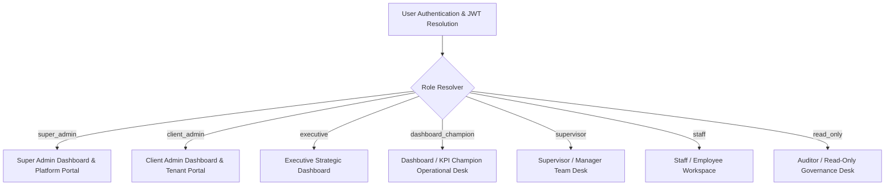

# Falcon Enterprise System — Role-Based Dashboard Navigation Specification

> **Document Version**: 1.0.0  
> **Target File**: `role_nav.md`  
> **Subsystems Integrated**: `accounts`, `tenant`, `structure`, `kpi`, `reviews`, `reportplt`, `billing`, `configs`  
> **Classification**: UX/UI Architecture & Navigation Blueprint  

---

## 1. System Overview & Role Hierarchy

The Falcon Enterprise platform enforces role-tailored dashboard experiences. Every user role receives a dedicated sidebar navigation menu, dashboard layout, quick action suite, and data visibility boundary based on their RBAC/ABAC permissions.



---

## 2. Super Admin (`super_admin`) Navigation Specification

### 2.1 Scope & Purpose
Global platform administration, multi-tenant organization management, system health, SaaS billing engine, infrastructure backups, KMS encryption security, disaster recovery, and cross-tenant auditing.

### 2.2 Navigation Menu Structure
```
├── 📊 Platform Overview                      [/admin/dashboard]
│   ├── Executive Platform Health
│   ├── Multi-Tenant Activity Map
│   └── Real-Time System Metrics
├── 🏢 Tenant & Organization Management        [/admin/tenants]
│   ├── All Tenants Directory                  [/admin/tenants/list]
│   ├── Provision New Tenant                   [/admin/tenants/create]
│   ├── Schema Isolation & Migrations          [/admin/tenants/schemas]
│   └── Resource Quota Allocations             [/admin/tenants/quotas]
├── 🔐 Security & User Directory               [/admin/security]
│   ├── Cross-Tenant User Directory            [/admin/users/all]
│   ├── Super Admin & System Roles             [/admin/roles/system]
│   ├── Global MFA Adoption & Locked Devices   [/admin/security/mfa]
│   ├── Global Active User Sessions            [/admin/security/sessions]
│   └── Security Anomaly Detection             [/admin/security/anomalies]
├── 💳 Enterprise SaaS Billing                 [/admin/billing]
│   ├── Global MRR / ARR Performance           [/admin/billing/mrr]
│   ├── Subscription Plans & Tiers             [/admin/billing/plans]
│   ├── Cross-Tenant Invoices & Tax            [/admin/billing/invoices]
│   ├── Payment Transactions & Gateways        [/admin/billing/transactions]
│   └── Dunning & Failure Recovery             [/admin/billing/dunning]
├── 🛠️ Infrastructure & System Configs          [/admin/configs]
│   ├── Registered Subsystem Applications      [/admin/configs/apps]
│   ├── Automated Backup Jobs & Storage        [/admin/configs/backups]
│   ├── Disaster Recovery Plans & Drills       [/admin/configs/dr]
│   ├── Maintenance Windows & Logs             [/admin/configs/maintenance]
│   ├── Subsystem Health Check History         [/admin/configs/health]
│   └── KMS Encryption Keys & Rotation         [/admin/configs/keys]
└── 📈 Global Reporting & Audit Vault           [/admin/reports]
    ├── Prebuilt System Templates              [/admin/reports/templates]
    ├── Unified 360 Enterprise Report          [/admin/reports/unified-360]
    ├── Scheduled Delivery Pipeline            [/admin/reports/schedules]
    └── Platform Audit Log Explorer            [/admin/audits/logs]
```

### 2.3 Default Dashboard Widgets
- **Platform Health Gauge**: Active Tenants count, Healthy Apps %, Database Uptime %.
- **Financial MRR Callout**: Total Monthly Recurring Revenue (KES), Annualized Run Rate (ARR).
- **System Security Card**: High-Risk Anomalies, Active Sessions count, Failed Login Attempts (24h).
- **Infrastructure Status Widget**: Backup Success Rate %, DR Drill Pass Rate %, Pending Maintenance Windows.

---

## 3. Client Admin (`client_admin`) Navigation Specification

### 3.1 Scope & Purpose
Tenant-level administration, organization hierarchy, workforce user roster, RBAC permissions, company-wide KPI target rules, performance review cycle configuration, custom report templates, and tenant subscription management.

### 3.2 Navigation Menu Structure
```
├── 🏠 Organization Workspace                  [/dashboard]
│   ├── Organization Command Center
│   ├── Department Health Overview
│   └── Quick Administration Actions
├── 🏗️ Structure & Org Hierarchy               [/structure]
│   ├── 4-Level Org Chart (Division->Unit)     [/structure/org-chart]
│   ├── Department Directory                   [/structure/departments]
│   ├── Position & Job Code Roster             [/structure/positions]
│   ├── Interim Manager Delegations            [/structure/interim]
│   ├── Cost Center & Budget Allocations       [/structure/cost-centers]
│   └── Physical Office Locations              [/structure/locations]
├── 👥 User & Identity Management              [/accounts]
│   ├── User Directory & Onboarding            [/accounts/users]
│   ├── Role & Permission Matrix               [/accounts/roles]
│   ├── MFA Compliance & Device Policy         [/accounts/mfa]
│   ├── Active User Sessions                   [/accounts/sessions]
│   ├── Password Hygiene & Reset Logs          [/accounts/passwords]
│   └── Security Audit Trail                   [/accounts/audit]
├── 🎯 Enterprise KPI Management               [/kpi/admin]
│   ├── Company KPI Master Library             [/kpi/library]
│   ├── Annual Target Phasing                  [/kpi/phasing]
│   ├── Target Cascade Rules & Tree            [/kpi/cascade]
│   ├── Departmental KPI Heatmap               [/kpi/heatmap]
│   ├── Red Alert & Escalation Approvals       [/kpi/escalations]
│   └── Period Locking & Data Audit            [/kpi/period-lock]
├── 📋 Performance Reviews & Appraisals         [/reviews/admin]
│   ├── Review Cycle Setup & Schedule          [/reviews/cycles]
│   ├── Competency Library & Rating Scales     [/reviews/competencies]
│   ├── 360 Feedback Cycle Tracker             [/reviews/360-cycles]
│   ├── Committee Calibration Sessions         [/reviews/calibration]
│   ├── Performance Improvement Plans (PIP)    [/reviews/pips]
│   └── Talent Health Scorecard                [/reviews/talent-health]
├── 📊 BI Dashboards & Reporting Platform       [/reporting]
│   ├── Executive Dashboards & Canvas          [/reporting/dashboards]
│   ├── Prebuilt & Custom Templates            [/reporting/templates]
│   ├── On-Demand Report Generator             [/reporting/generate]
│   ├── Automated Delivery Schedules           [/reporting/schedules]
│   ├── Analytics: Anomaly, Trend, Forecast    [/reporting/analytics]
│   └── Export Document Vault                  [/reporting/exports]
└── 💳 Tenant Billing & Subscription           [/billing]
    ├── Subscription Plan & Quota Usage        [/billing/subscription]
    ├── Invoices & Receipt Archive             [/billing/invoices]
    ├── Saved Payment Methods                  [/billing/payment-methods]
    └── Usage Quota Alert Settings             [/billing/quotas]
```

### 3.4 Primary Quick Actions
- `+ Add New User` | `+ Create KPI` | `+ Launch Review Cycle` | `+ Generate Report` | `+ Schedule Export`

---

## 4. Executive (`executive`) Navigation Specification

### 4.1 Scope & Purpose
Strategic C-Suite dashboard experience, high-level scorecards, company target execution, talent health monitoring, departmental performance heatmaps, financial summaries, and executive presentation downloads.

### 4.2 Navigation Menu Structure
```
├── 🏛️ Executive Command Center               [/executive/dashboard]
│   ├── Enterprise KPI Progress Scorecard
│   ├── Strategic Department Heatmap
│   ├── Talent Health Indicator (0-100)
│   └── Revenue & Budget Summary
├── 🎯 Strategic KPI Target Execution          [/executive/kpis]
│   ├── Company Target Cascade Tree            [/executive/kpis/tree]
│   ├── Department Performance Heatmap         [/executive/kpis/heatmap]
│   ├── High-Risk Red Alert Escalations        [/executive/kpis/red-alerts]
│   └── Annual vs Actual Variance Analysis     [/executive/kpis/variance]
├── 👥 Talent Health & Appraisal Insights       [/executive/talent]
│   ├── Bell-Curve Rating Distribution         [/executive/talent/bell-curve]
│   ├── Competency Strength Ranking            [/executive/talent/competencies]
│   ├── Calibration Adjustment Outcomes        [/executive/talent/calibration]
│   ├── PIP Recovery Rate                      [/executive/talent/pip-recovery]
│   └── Promotion-Ready Talent Roster          [/executive/talent/promotions]
├── 🏢 Org Structure & Span of Control         [/executive/structure]
│   ├── Department Headcount Rollup            [/executive/structure/headcount]
│   ├── Manager Span of Control Risk           [/executive/structure/span]
│   └── Cost Center Budget Utilization         [/executive/structure/budget]
└── 📈 Executive Reports & Forecasting         [/executive/reports]
    ├── Executive PowerPoint Deck Generator    [/executive/reports/pptx]
    ├── Predictive 3-Month Performance Forecast[/executive/reports/forecast]
    ├── Department Comparative Matrix          [/executive/reports/comparative]
    └── Scheduled C-Suite Email Summaries      [/executive/reports/schedules]
```

### 4.3 Default Dashboard Widgets
- **Enterprise KPI Progress Gauge**: Overall % progress against annual targets.
- **Departmental Heatmap Table**: Color-coded RAG status (Green/Yellow/Red) per department.
- **Talent Health Score Card**: Rating distribution (Exceeds/Meets/Needs Improvement), active PIP count.
- **Predictive Forecast Chart**: 3-month Holt-Winters target achievement trajectory.

---

## 5. Dashboard Champion / KPI Champion (`dashboard_champion`) Navigation Specification

### 5.1 Scope & Purpose
Operational monitoring of KPI actuals, target phasing, weight validations ($\sum W_i = 100\%$), evidence submission verification, review cycle tracking, custom dashboard construction, and BI widget layout management.

### 5.2 Navigation Menu Structure
```
├── 🚀 Champion Performance Desk               [/champion/dashboard]
│   ├── System-Wide KPI Execution Status
│   ├── Actuals Submission Compliance Rate
│   └── Pending Evidence Validation Queue
├── 🎯 KPI Operational Management              [/champion/kpi]
│   ├── KPI Master Catalogue                   [/champion/kpi/catalogue]
│   ├── Target Phasing & Allocations           [/champion/kpi/phasing]
│   ├── Weight Rule Sum Verifier (100%)        [/champion/kpi/weights]
│   ├── Submission & Approval Queue            [/champion/kpi/queue]
│   └── Evidence File Audit                    [/champion/kpi/evidence]
├── 📋 Appraisal & Review Operations           [/champion/reviews]
│   ├── Review Cycle Completion Tracker        [/champion/reviews/tracker]
│   ├── Competency Score Audit                 [/champion/reviews/audit]
│   ├── Calibration Session Data Prep          [/champion/reviews/calibration-prep]
│   └── PIP Action Item Tracker                [/champion/reviews/pip-actions]
├── 🎨 Custom Dashboards & Widget Engine       [/champion/dashboards]
│   ├── Interactive Dashboard Builder          [/champion/dashboards/builder]
│   ├── 18-Type Widget Component Studio        [/champion/dashboards/widgets]
│   ├── Grid Auto-Layout Engine                [/champion/dashboards/layout]
│   └── Shared Dashboard Gallery               [/champion/dashboards/gallery]
└── 🔬 Analytics & Anomaly Detection            [/champion/analytics]
    ├── KPI Anomaly Detector (Z-Score/IQR)     [/champion/analytics/anomalies]
    ├── Trend & MoM/YoY Regression Engine      [/champion/analytics/trend]
    ├── Threshold Variance Analyzer            [/champion/analytics/variance]
    └── Custom Data Extractor Center           [/champion/analytics/extract]
```

### 5.3 Primary Quick Actions
- `+ Build Custom Widget` | `+ Validate Weight Sums` | `+ Run Anomaly Detector` | `+ Publish Shared Dashboard`

---

## 6. Supervisor / Manager (`supervisor`) Navigation Specification

### 6.1 Scope & Purpose
Managing direct reports, team target allocations, reviewing and approving monthly KPI actuals, verifying evidence attachments, conducting supervisor performance appraisals, tracking team PIPs, and viewing team analytics.

### 6.2 Navigation Menu Structure
```
├── 👥 Team Management Command Desk            [/manager/dashboard]
│   ├── Team Performance Scorecard Summary
│   ├── Pending Actuals Approvals (Badge Count)
│   └── Team Review Cycle Status
├── 👨‍💼 My Direct Reports Roster               [/manager/team]
│   ├── Direct Reports & Employment Details    [/manager/team/list]
│   ├── Manager Span-of-Control View           [/manager/team/span]
│   └── Active Interim Delegations             [/manager/team/interim]
├── 🎯 Team KPI Actuals & Validation           [/manager/kpis]
│   ├── Direct Report Target Scorecards        [/manager/kpis/scorecards]
│   ├── Monthly Actuals Approval Queue         [/manager/kpis/approvals]
│   ├── Evidence Document Review               [/manager/kpis/evidence]
│   └── Rejection & Escalation Submission      [/manager/kpis/escalate]
├── 📋 Team Performance Reviews                [/manager/reviews]
│   ├── Self-Assessment Approval Queue         [/manager/reviews/self-assessments]
│   ├── Supervisor Competency Rating Form      [/manager/reviews/appraise]
│   ├── 360 Feedback Collection                [/manager/reviews/360-feedback]
│   ├── Committee Calibration Review           [/manager/reviews/calibration]
│   ├── Initiate / Manage Team PIP             [/manager/reviews/pip]
│   └── Promotion Recommendations              [/manager/reviews/promotions]
└── 📊 Team Reports & Analytics                [/manager/reports]
    ├── Team KPI Progress Heatmap              [/manager/reports/heatmap]
    ├── Team 360 Review Scorecard              [/manager/reports/scorecard]
    ├── Scheduled Team PDF Reports             [/manager/reports/schedule]
    └── Export Team Performance (PDF/XLSX)     [/manager/reports/export]
```

### 6.3 Primary Quick Actions
- `Approve Pending Actuals` | `Complete Team Appraisals` | `Review Evidence File` | `Submit Promotion Rec`

---

## 7. Staff / Employee (`staff`) Navigation Specification

### 7.1 Scope & Purpose
Self-service personal workspace, viewing assigned KPIs, entering monthly actuals, uploading evidence documentation, completing annual self-assessments, reviewing supervisor evaluation feedback, and tracking personal PIP milestones.

### 7.2 Navigation Menu Structure
```
├── 👤 My Personal Workspace                   [/my-workspace]
│   ├── My Annual KPI Progress Bar
│   ├── Next Submission Deadline Countdown
│   ├── My Pending Action Tasks
│   └── System Notifications & Alerts
├── 🎯 My KPIs & Monthly Actuals               [/my-kpis]
│   ├── My Assigned KPI Scorecard              [/my-kpis/scorecard]
│   ├── Monthly Actual Entry Form              [/my-kpis/submit-actual]
│   ├── Upload Evidence Documents              [/my-kpis/evidence]
│   └── Submission History & Status            [/my-kpis/history]
├── 📋 My Performance Reviews                  [/my-reviews]
│   ├── Annual Self-Assessment Form            [/my-reviews/self-assessment]
│   ├── View Final Appraisal Score & Feedback  [/my-reviews/final-rating]
│   ├── Request / Complete Peer 360 Reviews    [/my-reviews/360]
│   └── My Active PIP Growth Milestones        [/my-reviews/pip]
└── 📄 My Reports & Downloads                  [/my-reports]
    ├── Download My Performance PDF Scorecard  [/my-reports/scorecard-pdf]
    ├── My Historical Trend Chart              [/my-reports/trend]
    └── My Personal Dashboard View             [/my-reports/dashboard]
```

### 7.3 Primary Quick Actions
- `+ Submit Monthly Actual` | `+ Upload Evidence` | `+ Complete Self-Assessment` | `📥 Download PDF Scorecard`

---

## 8. Read-Only / Auditor (`read_only`) Navigation Specification

### 8.1 Scope & Purpose
Governance, audit, and compliance view-only access across all system entities. No create, edit, delete, or trigger capabilities.

### 8.2 Navigation Menu Structure
```
├── 🔍 Governance & Audit Portal                [/auditor/dashboard]
│   ├── System Audit Summary
│   ├── Compliance Rate Gauges
│   └── Read-Only Log Feed
├── 🏢 View Org Structure                       [/auditor/structure]
│   ├── Division & Department Tree (Read-Only) [/auditor/structure/tree]
│   ├── Position Directory (Read-Only)         [/auditor/structure/positions]
│   └── Cost Center Allocations (Read-Only)    [/auditor/structure/cost-centers]
├── 👥 View User Directory                      [/auditor/users]
│   ├── User Roster (Read-Only)                [/auditor/users/list]
│   └── Role & Permission Assignments          [/auditor/users/roles]
├── 🎯 View KPI Scorecards                      [/auditor/kpis]
│   ├── Departmental KPI Scorecards            [/auditor/kpis/scorecards]
│   └── Target Cascade Tree (Read-Only)        [/auditor/kpis/tree]
├── 📋 View Review Records                      [/auditor/reviews]
│   ├── Final Ratings Archive                  [/auditor/reviews/ratings]
│   └── PIP Records (Read-Only)                [/auditor/reviews/pips]
└── 📈 System Audit Trail Explorer             [/auditor/audit-logs]
    ├── Accounts Security Audit Log            [/auditor/audit-logs/security]
    ├── Report Access & Export Logs            [/auditor/audit-logs/exports]
    └── Export Compliance Summary Report       [/auditor/audit-logs/export-summary]
```

---

## 9. Navigation Access & Role Guarding Matrix

```
Legend:  [FULL = Full Navigation Access]   [TEAM = Team Scoped]   [SELF = Self Scoped]   [RO = Read-Only Access]   [✗ = Hidden]
```

| Sidebar Navigation Section | Super Admin | Client Admin | Executive | Champion | Supervisor | Staff | Read-Only |
| :--- | :---: | :---: | :---: | :---: | :---: | :---: | :---: |
| **Platform Tenant Management** | FULL | ✗ | ✗ | ✗ | ✗ | ✗ | ✗ |
| **Infrastructure & Backup Configs** | FULL | ✗ | ✗ | ✗ | ✗ | ✗ | ✗ |
| **Org Structure & Cost Centers** | FULL | FULL | FULL | RO | RO | ✗ | RO |
| **User Directory & Security Roster** | FULL | FULL | ✗ | ✗ | ✗ | ✗ | RO |
| **KPI Master Rules & Phasing** | FULL | FULL | RO | FULL | ✗ | ✗ | RO |
| **KPI Actuals Submission & Approval**| FULL | FULL | RO | FULL | TEAM | SELF | RO |
| **Review Cycle Config & Calibration**| FULL | FULL | RO | FULL | ✗ | ✗ | RO |
| **Supervisor Appraisal & PIPs** | FULL | FULL | RO | FULL | TEAM | SELF | RO |
| **Interactive Dashboard Builder** | FULL | FULL | FULL | FULL | Personal | Personal | ✗ |
| **Analytics (Anomaly/Forecast)** | FULL | FULL | FULL | FULL | TEAM | ✗ | RO |
| **SaaS Billing & Invoices** | FULL | FULL | RO | ✗ | ✗ | ✗ | ✗ |
| **Platform Audit Logs** | FULL | FULL | RO | ✗ | ✗ | ✗ | RO |

---
*End of Role-Based Navigation Specification (role_nav.md).*
