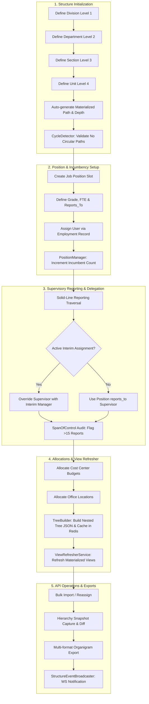
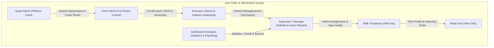

# Structure App Complete System Flow & Technical Architecture Reference

## 1. Executive Summary & App Boundaries

The `structure` app is the foundation of the Falcon platform's enterprise organization management. It models enterprise organizational hierarchies, job position specifications, employee incumbencies, supervisory reporting chains, interim leadership delegations, cost center budget allocations, physical office location management, and organigram versioning.

### Key Architectural Capabilities:
- **Materialized Tree Paths**: Fast descendant, ancestor, and LCA queries using string paths (`DIV_001/DEP_002/SEC_003`).
- **Strict 4-Tier Org Levels**: Division (Level 1) $\rightarrow$ Department (Level 2) $\rightarrow$ Section (Level 3) $\rightarrow$ Unit (Level 4), capped at depth 4.
- **Single & Multi-Incumbent Position Slots**: Single-incumbent locks, occupied/vacant tracking, FTE metrics, and grade levels (1-20).
- **Dual Supervisory Management**: Primary solid-line reporting combined with temporal date-bounded `InterimAssignment` delegation.
- **Comprehensive API Layer**: 19 DRF ViewSets/Views supporting bulk operations, multi-format organigram exports (Visio VDX, JSON, CSV, ASCII Text), administrative anomaly detection, and organigram version diffing/restoration.

---

## 2. Multi-Tenant Architecture & Data Security

```mermaid
flowchart LR
    Req[Incoming HTTP Request] --> Auth[JWT Authentication]
    Auth --> TenantCheck[Verify request.user.tenant_id]
    TenantCheck --> SchemaSwitch["SET search_path TO tenant_schema, public"]
    SchemaSwitch --> BaseQS["BaseStructureViewSet.get_queryset()"]
    BaseQS --> TenantFilter["Filter tenant_id & is_deleted=False"]
    TenantFilter --> AccessControl["HierarchyAccessEnforcer.can_view()"]
    AccessControl --> Firewall["DataFirewallService.filter_sensitive_data()"]
    Firewall --> Response[HTTP 200 / Redacted Data]
```

1. **Multi-Tenant Isolation**:
   - All structure models inherit from `BaseStructureModel` containing `tenant_id` (UUID, indexed).
   - `BaseStructureViewSet.get_queryset()` strictly scopes all database reads and writes to `request.user.tenant_id`. Soft deletion (`is_deleted=True`) is enforced globally.
2. **Security Clearance & Data Firewall (`DataFirewallService`)**:
   - Classifies user clearance (`public` $< `internal` $< `confidential` $< `restricted`).
   - Automatically redacts sensitive fields (`salary`, `ssn`, `tax_id`, `bank_account`, `personal_email`, `phone_number`) for non-clearance roles.
3. **Hierarchical Visibility Control (`HierarchyAccessEnforcer`)**:
   - Enforces 5 granular access levels: `no_access` (0), `self_only` (1), `direct_reports` (2), `subtree` (3), `full_tenant` (4).
   - HR/Admin & Executives get full tenant visibility; Managers get visibility over their direct and recursive subtree reports.

---

## 3. Comprehensive End-to-End System Flow

---

## 4. Subsystem Deep Dives & Service Logic

### A. Hierarchical Tree Building & Materialized Paths (`services/hierarchy/`)
- **`TreeBuilder`**: Constructs complete nested organigram trees (`Division` $\rightarrow$ `Department` $\rightarrow$ `Section` $\rightarrow$ `Unit`) including position slots and incumbent details. Caches tree payloads in Redis (`structure:org_tree:<tenant_id>`).
- **`LCAByIdFinder` & `LCAByPathFinder`**: Finds the Lowest Common Ancestor (LCA) between two nodes in $O(\text{depth})$ time using path splitting (`path_a.split('/')`) or parent FK ascension.
- **`CycleDetector`**: Prevents self-referential or loop parent-child assignments. Raises `HierarchyCycleError` with the explicit loop trajectory.

### B. Employment, Positions & Dual Management (`services/reporting/`)
- **`ChainService`**: Computes upward command chains (`get_chain_of_command`) and downward report trees (`get_all_reports`).
- **`InterimManagerService`**: Atomically creates date-bounded interim assignments (`effective_from` to `effective_to`), deactivates conflicting active assignments, and clears cache (`ChainService.clear_cache`).
- **`DelegationService`**: Delegates authority from a manager to a delegatee for all direct reports during a specified date range.

### C. Versioning, Snapshots & Restoration (`hierarchy_views.py`)
- **`HierarchyViewSet.capture_snapshot()`**: Generates a complete tree snapshot, computes a SHA-256 hash (`snapshot_hash`), increments `version_number`, and marks previous versions as inactive (`is_current=False`).
- **`HierarchyViewSet.compare_versions()`**: Calculates json diffs (added/removed/modified divisions) between any two historical versions.
- **`HierarchyViewSet.restore_version()`**: Restores a past snapshot as a new current version.

### D. Bulk Operations & Management Reassignments (`bulk_views.py`)
- **`BulkOperationViewSet.bulk_departments()`**: Atomic creation/update of up to 100 departments per batch.
- **`BulkOperationViewSet.reassign_manager()`**: Atomically deactivates current solid-line reporting lines for a list of employees and assigns them to a new manager.

### E. Health, SOX Audits & Anomalies (`health_views.py`)
- **`StructureHealthViewSet.admin_health()`**: Scans tenant data for structural anomalies:
  - Units missing materialized paths.
  - Orphaned units with deleted parents.
  - Users with duplicate active current employments.
  - Orphaned reporting lines.
- **`StructureHealthViewSet.services_health()`**: Verifies live operational status of `TreeBuilder`, `ChainService`, `HierarchyAccessEnforcer`, and `InterimManagerService`.

---

## 5. ViewSet API Reference & Endpoints

| ViewSet Class | URL Endpoint | Primary Actions / Endpoints | Permission Class |
|---|---|---|---|
| `OrganizationalUnitViewSet` | `/api/v1/structure/organizational-units/` | `list`, `create`, `get_by_level`, `get_by_path`, `get_subtree`, `get_root_units`, `get_stats` | `IsTenantMember`, `CanManageDepartment`, `CanViewOrgChart` |
| `DivisionViewSet` | `/api/v1/structure/divisions/` | `list`, `create`, `get_departments`, `get_stats` | `IsTenantMember`, `CanManageDepartment` |
| `DepartmentViewSet` | `/api/v1/structure/departments/` | `list`, `create`, `get_children`, `get_sections`, `get_ancestors`, `get_employments`, `move_department`, `get_root_departments`, `get_stats` | `IsTenantMember`, `CanManageDepartment` |
| `DepartmentTreeViewSet` | `/api/v1/structure/department-trees/` | `get_full_tree`, `get_branch`, `get_path`, `get_lca`, `get_subtree` | `IsTenantMember`, `CanViewOrgChart` |
| `SectionViewSet` | `/api/v1/structure/sections/` | `list`, `create`, `get_units`, `get_employments`, `get_by_code` | `IsTenantMember`, `CanManageDepartment` |
| `UnitViewSet` | `/api/v1/structure/units/` | `list`, `create`, `get_employments`, `get_by_code`, `get_stats` | `IsTenantMember`, `CanManageUnit` |
| `PositionViewSet` | `/api/v1/structure/positions/` | `list`, `create`, `get_incumbents`, `get_by_code`, `get_vacant_positions`, `get_reporting_chain`, `get_stats` | `IsTenantMember`, `CanManageDepartment` |
| `EmploymentViewSet` | `/api/v1/structure/employments/` | `list`, `create`, `get_current_employments`, `get_by_user`, `transfer_employee`, `bulk_create`, `get_stats` | `IsTenantMember`, `CanManageDepartment` |
| `InterimAssignmentViewSet` | `/api/v1/structure/interim-assignments/` | `list`, `create`, `get_by_employee`, `assign_interim`, `end_interim`, `get_expiring_soon`, `get_active_interims` | `IsTenantMember`, `CanManageReporting` |
| `HierarchyViewSet` | `/api/v1/structure/hierarchy/` | `list`, `capture_snapshot`, `restore_version`, `compare_versions`, `get_current_version`, `get_history`, `auto_capture`, `validate_hierarchy` | `IsTenantMember`, `CanManageDepartment` |
| `OrgChartViewSet` | `/api/v1/structure/org-charts/` | `export_json`, `export_csv`, `export_text`, `export_visio`, `get_tree_view`, `get_preview` | `IsTenantMember`, `CanViewOrgChart` |
| `BulkOperationViewSet` | `/api/v1/structure/bulk-operations/` | `bulk_departments`, `bulk_employments`, `reassign_manager` | `CanPerformBulkOperations` |
| `CostCenterViewSet` | `/api/v1/structure/cost-centers/` | `list`, `create`, `get_by_code`, `get_by_fiscal_year`, `get_by_org_unit`, `get_by_level`, `get_stats`, `get_children`, `get_utilization` | `IsTenantMember`, `CanManageDepartment` |
| `LocationViewSet` | `/api/v1/structure/locations/` | `list`, `create`, `get_by_code`, `get_by_country`, `get_by_org_unit`, `get_headquarters`, `get_stats`, `get_sub_locations`, `update_occupancy` | `IsTenantMember`, `CanManageDepartment` |
| `StructureDashboardViewSet` | `/api/v1/structure/dashboard/` | `get_overview`, `get_hierarchy_health`, `get_trends` | `IsTenantMember`, `CanViewOrgChart` |
| `StructureHealthViewSet` | `/api/v1/structure/health/` | `database_health`, `cache_health`, `services_health`, `admin_health`, `get_metrics` | `IsTenantMember` / `AllowAny` (health checks) |
| `ReportingLineViewSet` | `/api/v1/structure/reporting-lines/` | `by_employee`, `by_manager`, `chain`, `span_of_control`, `organization_span` | `IsTenantMember`, `CanViewOrgChart` |
| `StructureSystemSettingsView` | `/api/v1/structure/system-settings/` | `GET`, `PATCH`, `PUT` | `IsSuperAdminOrReadOnly` |
| `StructureReferenceDataView` | `/api/v1/structure/reference-data/` | `GET` (counts, org_units, users) | `IsAuthenticated`, `IsTenantMember` |

---

## 6. Real-Time Event & Redis Integration

- **Pub/Sub Channels**: Changes to org units, divisions, departments, sections, units, employments, or interim assignments publish structured JSON payloads to Redis channel `org_changes:<tenant_id>`.
- **WebSocket Broadcasting**: `StructureEventBroadcaster` broadcasts real-time events over Django Channels for live UI organigram updates.
- **Automatic Cache Invalidation**: Structural mutations automatically call `BaseStructureViewSet._invalidate_cache()`, purging `structure:org_tree:<tenant_id>` and matching cache keys.

---

## 7. Role-Based User/Actor Action Matrix & Workflow Permissions

The `structure` app enforces tenant isolation and fine-grained role-based permission scoping based on the user's assigned `role` in the `accounts.User` model (`super_admin`, `client_admin`, `executive`, `dashboard_champion`, `supervisor`, `staff`, `read_only`).

### Detailed Actor Capabilities & Workflow Matrix

#### A. Super Admin (`super_admin`)
- **System Scope**: Platform-wide / Cross-tenant access.
- **Primary Actions**:
  - Global system settings reset and system-wide policy updates (`StructureSystemSettingsResetView`).
  - Access to overall system database & Redis cache health diagnostics (`/api/v1/structure/health/database`, `/cache`, `/services`).
  - Triggering global index rebuilding, path reconstruction (`IndexRebuilder`), and cache warming across all tenants.
  - Can bypass tenant boundaries for platform maintenance and cross-tenant diagnostic audits.

#### B. Client Admin (`client_admin`)
- **System Scope**: Full Tenant Control (`HierarchyAccessEnforcer` Level 4: `full_tenant`).
- **Primary Actions**:
  - **Hierarchy Definition**: Complete CRUD authority over Divisions (Level 1), Departments (Level 2), Sections (Level 3), and Units (Level 4).
  - **Structure Moves & Reassignments**: Re-parenting departments/units (`move_department`), reassigning solid-line reporting lines (`reassign_manager`), and executing atomic bulk operations (up to 100 entities per batch via `BulkOperationViewSet`).
  - **Slot & Incumbency Management**: Creating/updating positions (`PositionViewSet`), managing grade levels, FTE allocations, single-incumbent slot locks, and employee position transfers (`transfer_employee`).
  - **Versioning & Snapshots**: Capturing hierarchy snapshots (`capture_snapshot`), comparing version diffs (`compare_versions`), and restoring historical organizational structures (`restore_version`).
  - **Cost Centers & Locations**: Full management of cost center budgets (`CostCenterViewSet`), allocation percentages, physical office locations (`LocationViewSet`), and seating capacities.
  - **Administrative Audits**: Access to tenant structural anomaly scans (`admin_health`), integrity validation (`validate_hierarchy`), and SOX compliance reporting.

#### C. Executive (`executive`)
- **System Scope**: Tenant-Wide & Subtree Leadership (`HierarchyAccessEnforcer` Level 4/3).
- **Primary Actions**:
  - **Structural Adjustments**: Create/update departments, units, and positions within their operational domain.
  - **Interim Leadership Delegation**: Approve and assign temporal date-bounded `InterimAssignment` records and approve delegation requests.
  - **Bulk Operations & Reassignments**: Execute bulk employment updates and manager reassignments.
  - **Snapshot Capture**: Trigger manual or automatic org snapshots prior to major organizational restructures.
  - **Executive Exports**: Export complete organizational charts in Visio (`.vdx`), JSON, CSV, and text tree formats.
  - **Data Access**: Unrestricted access to confidential data firewall fields (`DataFirewallService` clearance: `restricted`).

#### D. Dashboard Champion (`dashboard_champion`)
- **System Scope**: Tenant Analytics & Visualization (Read-only for structure, full access for charts/metrics).
- **Primary Actions**:
  - **Org Chart Exports**: Full permission to export organigram charts in Visio (`.vdx`), CSV, JSON, and text formats.
  - **Dashboard Metrics**: Monitor tenant dashboard overview metrics (`/dashboard/overview`), headcount trends (`/dashboard/trends`), and hierarchy health scores.
  - **Reporting & Span Metrics**: Analyze span of control distribution (`organization_span`), average report metrics, and identify overloaded/underutilized managers.
  - **Reference Data**: Access reference endpoints for reporting visualization and dashboard widgets.

#### E. Supervisor / Manager (`supervisor` / `is_manager=True`)
- **System Scope**: Recursive Subtree & Direct Reports (`HierarchyAccessEnforcer` Level 2 & 3: `direct_reports` and `subtree`).
- **Primary Actions**:
  - **Team Supervisory**: View upward command chains and downward report trees (`get_all_reports`) for all direct and indirect reports within their subtree.
  - **Interim Management**: Assign interim managers (`assign_interim`), end interim periods (`end_interim`), and delegate supervisory authority (`DelegationService`) during leaves or temporary assignments.
  - **Team Span Audits**: View span of control stats for their direct team (`span_of_control`) and monitor team capacity.
  - **Team Employments**: View employment records of subordinates (`CanViewEmployment`).
  - **Clearance Level**: Assigned `confidential` clearance level by default.

#### F. Staff / Employee (`staff`)
- **System Scope**: Self Only (`HierarchyAccessEnforcer` Level 1: `self_only`).
- **Primary Actions**:
  - **Personal Profile**: View own current employment record, position specification, FTE allocation, and grade.
  - **Command Chain**: View own upward chain of command (`/reporting-lines/by-employee/<user_id>`) to identify line managers and interim supervisors.
  - **Org Chart Preview**: View standard public org chart tree (`/org-charts/tree`) and reference data.
  - **Field Redaction**: Sensitive fields (`salary`, `ssn`, `tax_id`, `bank_account`, `personal_email`, `phone_number`) are automatically redacted by `DataFirewallService` for other employees.

#### G. Read Only (`read_only`)
- **System Scope**: Tenant Read-Only Scoped Access (`HierarchyAccessEnforcer` Level 0/1).
- **Primary Actions**:
  - **Public Org Chart View**: Browse public organizational tree and department hierarchy previews (`/org-charts/preview`).
  - **Reference Lookups**: Read basic reference data for dropdowns (`/reference-data/`).
  - **Strict Mutations Block**: All `POST`, `PUT`, `PATCH`, and `DELETE` HTTP requests are rejected by `BaseStructurePermission` and method permissions.

---

### Actor Summary Permission Matrix

| Role | Org Units CRUD | Move & Reassign | Interim Delegation | Snapshots & Restore | Org Chart Exports | Dashboard & Metrics | Data Clearance |
|---|---|---|---|---|---|---|---|
| `super_admin` | Full (Global) | Full | Full | Full | Full | Full | Unrestricted |
| `client_admin` | Full (Tenant) | Full | Full | Full | Full | Full | Restricted |
| `executive` | Create/Update | Full | Full | Capture Only | Full | Full | Restricted |
| `dashboard_champion` | Read Only | None | Read Only | None | Full | Full | Internal |
| `supervisor` | Subtree Read | Direct Subtree | Create/Assign | None | View Tree | Team Metrics | Confidential |
| `staff` | Public Read | None | Self View | None | View Tree | None | Internal / Public |
| `read_only` | Public Read | None | None | None | View Preview | None | Public |

