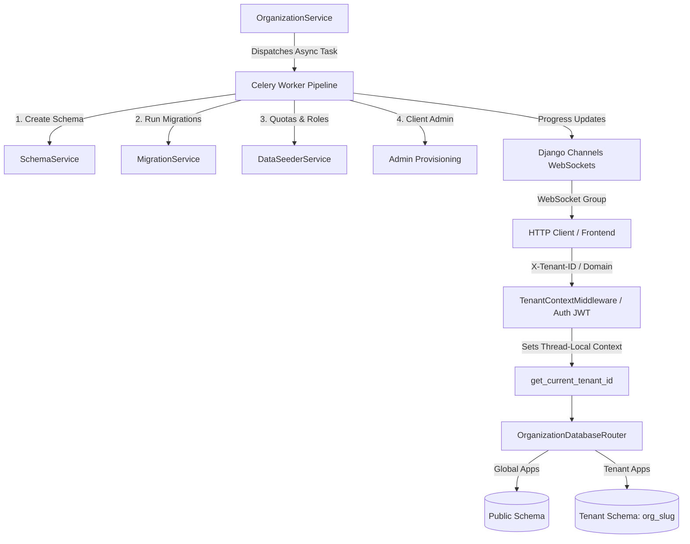
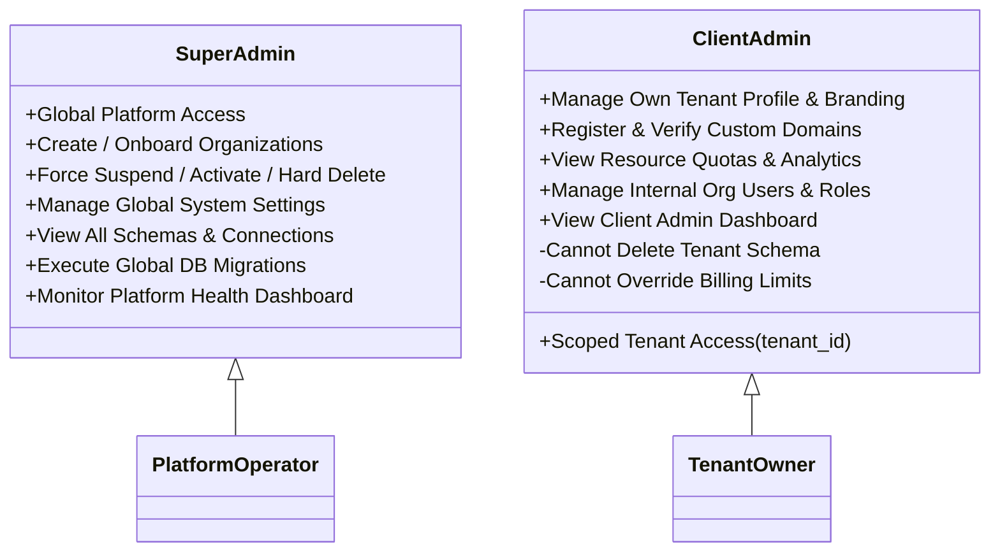
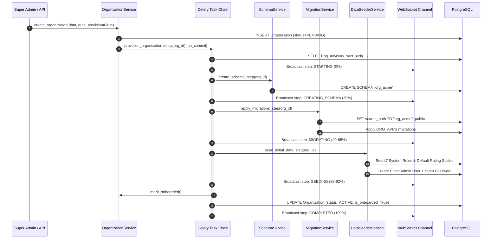
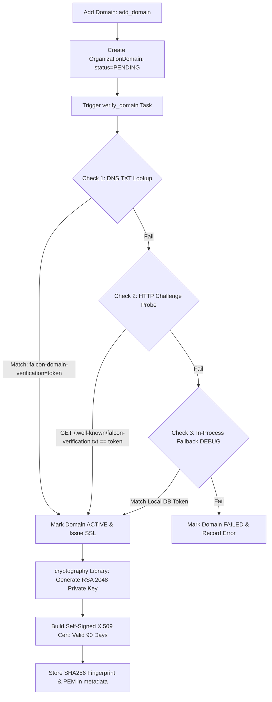
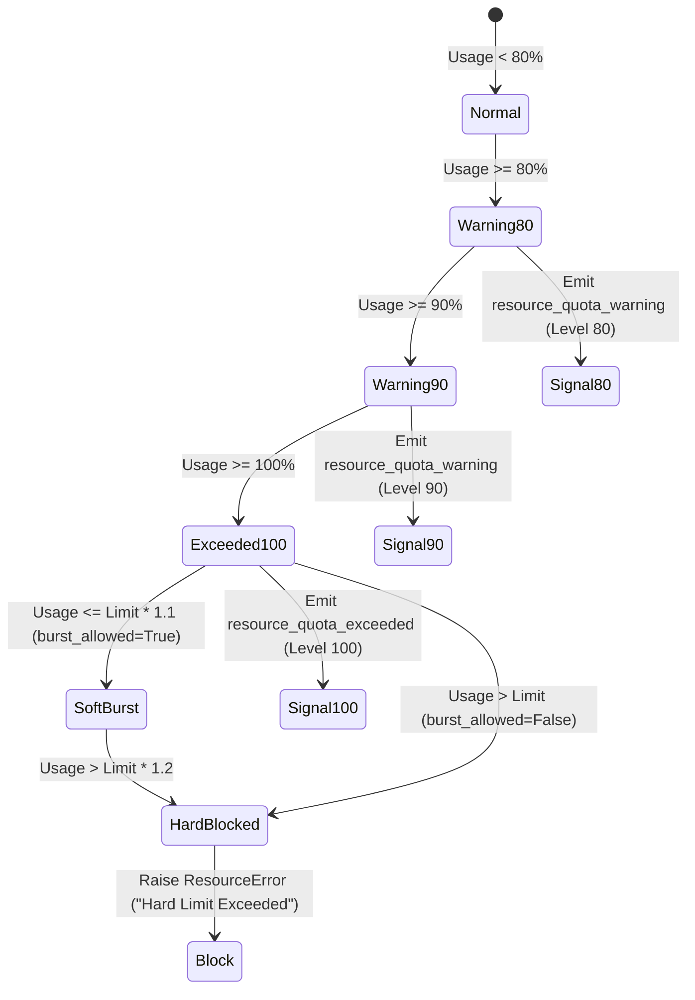

# Enterprise Multi-Tenant Architecture & System Flow Specification: Tenant App (`apps/tenant/`)

> [!IMPORTANT]
> **Production Reference Specification**: This document provides the complete end-to-end technical, architectural, and operational system flow for the **Falcon PMS Tenant Subsystem** (`apps/tenant/`). It details multi-tenant schema isolation, dynamic database routing, automated organization provisioning pipelines, custom domain verification & SSL generation, resource quota enforcement, connection pooling, and multi-tenant DB migrations.

---

## 1. Subsystem Architecture & Multi-Tenancy Design

The **Tenant App** serves as the core infrastructure backbone of the Falcon enterprise platform. It implements a **Shared Database, Schema-Per-Tenant** pattern over PostgreSQL, guaranteeing zero cross-tenant data leakage while sharing database connections and global catalog models.

### 1.1 Architecture Topology & Layer Interaction



### 1.2 Global vs. Tenant Application Classification

| Classification | Managed Applications | Database Schema Scope | Routing Behavior |
| :--- | :--- | :--- | :--- |
| **Global Apps** | `accounts`, `tenant`, `billing`, `core`, `configs`, `admin`, `auth`, `sessions` | `public` schema | Reads/writes routed strictly to `default` or `replica` DB |
| **Tenant Apps** | `kpi`, `dashboard`, `reviews`, `structure`, `reportplt`, `tasks_module` | Dedicated tenant schema (`org_{slug}`) | Dynamically routed based on thread-local `tenant_id` context |

### 1.3 Database Router & Context Resolution (`OrganizationDatabaseRouter`)

Routing decisions are made dynamically on every database query using a 3-tier priority lookup:

1. **Explicit Hint**: `organization_id` keyword argument passed directly to queryset/manager.
2. **Model Instance Attribute**: `instance.tenant_id` or `instance.organization_id`.
3. **Thread-Local Context**: Set per HTTP request by `TenantContextMiddleware` via `get_current_tenant_id()`.

```python
# PostgreSQL Search Path Resolution for Tenant Execution:
SET search_path TO "org_acme_corp", public;
```

---

## 2. Super Admin vs. Client Admin Architectural Distinction

The Tenant Subsystem establishes strict boundary isolation between **Super Admins** (Platform Operators) and **Client Admins** (Tenant Enterprise Owners).



### Distinction & Capabilities Matrix

| Architectural Dimension | Super Admin (`super_admin`) | Client Admin (`client_admin`) |
| :--- | :--- | :--- |
| **Data Visibility Scope** | Platform-Wide (All organizations, schemas, resources, users) | Scoped strictly to `request.user.tenant_id` |
| **Organization Onboarding** | Can create, provision, trigger retry, and rollback any tenant | Cannot create new tenant organizations |
| **Lifecycle Actions** | `force_suspend`, `force_activate`, `force_delete` (hard drop schema) | Can update org metadata/branding; cannot suspend/delete self |
| **Domain Management** | Can verify, set primary, and renew SSL for **any** domain | Can register, trigger verification, and view SSL status for **own** domains |
| **Database Migrations** | Can trigger, apply, preview SQL, and rollback tenant DB migrations | Read-only view of migration status for own tenant |
| **System Settings** | Full write access to global singleton `OrganizationSettings` | Read-only / Tenant Preference overrides only |
| **Rate Limiting / Throttles** | Exempt from API rate limits and throttling | Subject to Plan-Based Throttling (`OrganizationRateThrottle`) |

---

## 3. User Role & Action Mapping Matrix

The Tenant App integrates with all **7 System Roles** to enforce granular operation permissions:

| System Role | Scope Level | View Org Info | Manage Org / Branding | Domain Admin | Schema & RLS Admin | Resource Quota View | DB Migration Ops |
| :--- | :--- | :---: | :---: | :---: | :---: | :---: | :---: |
| **Super Admin** (`super_admin`) | Global (Platform) | ✅ | ✅ | ✅ | ✅ | ✅ | ✅ |
| **Client Admin** (`client_admin`) | Tenant | ✅ | ✅ | ✅ | ❌ | ✅ | ❌ |
| **Executive** (`executive`) | Tenant | ✅ | ❌ | ❌ | ❌ | ✅ | ❌ |
| **Dashboard Champion** (`dashboard_champion`) | Tenant | ✅ | ❌ | ❌ | ❌ | ✅ | ❌ |
| **Supervisor** (`supervisor`) | Department/Team | ✅ | ❌ | ❌ | ❌ | ✅ | ❌ |
| **Staff** (`staff`) | Self/Team | ✅ | ❌ | ❌ | ❌ | ❌ | ❌ |
| **Read Only** (`read_only`) | Self | ✅ (Read) | ❌ | ❌ | ❌ | ❌ | ❌ |

---

## 4. Module-by-Module Functional System Flows

### 4.1 Automated Organization Provisioning Pipeline

When an organization is created, it transitions through a formal state machine (`PENDING` $\rightarrow$ `PROVISIONING` $\rightarrow$ `ACTIVE` or `FAILED`).



> [!NOTE]
> **Idempotent Rollback Guard**: If any step in the Celery chain fails, `rollback_provisioning_task` is executed automatically: it drops the schema (`DROP SCHEMA CASCADE`), cleans up orphaned `OrganizationSchema` and `OrganizationResource` rows, and marks the organization status as `FAILED` with error details captured in `metadata['provisioning']['error']`.

---

### 4.2 Custom Domain Registration & SSL Certificate Engine

Tenant custom domain verification uses a **3-Tier Fallback Verification Architecture**:



---

### 4.3 Resource Quota Enforcement & Alerting Engine

Quota management is executed via `ResourceService` with Redis distributed locks (`resource_lock:{org}:{type}`) to prevent race conditions during high-concurrency requests.



#### Quota Resource Types & Multipliers

| Resource Code | Human Display | Default Billing Sync | Soft Multiplier | Hard Multiplier | Enforcement Mechanism |
| :--- | :--- | :---: | :---: | :---: | :--- |
| `USERS` | Max Organization Users | `max_users` | $1.10$ ($+10\%$) | $1.20$ ($+20\%$) | Checked on user registration/invite |
| `STORAGE_MB` | Storage Quota (MB) | `max_storage_mb` | $1.10$ ($+10\%$) | $1.20$ ($+20\%$) | Checked on file upload |
| `API_CALLS_PER_DAY` | Daily API Rate Limit | `max_api_calls_per_day` | $1.10$ ($+10\%$) | $1.20$ ($+20\%$) | Reset daily at midnight UTC |
| `DEPARTMENTS` | Department Count | `max_departments` | $1.10$ ($+10\%$) | $1.20$ ($+20\%$) | Checked on structure creation |
| `CONCURRENT_SESSIONS` | Active Sessions | `max_concurrent_sessions` | $1.10$ ($+10\%$) | $1.20$ ($+20\%$) | Checked on user login |
| `KPIS` | Total Active KPIs | `max_kpis` | $1.10$ ($+10\%$) | $1.20$ ($+20\%$) | Checked on KPI definition |

---

### 4.4 Multi-Tenant Database Migration Management Flow

`MigrationService` executes DB schema migrations for tenant applications independently of global migrations:

1. **Graph Building**: Constructs a topological dependency graph for all `ORG_APPS` (`kpi`, `dashboard`, `reviews`, `structure`, `reportplt`, `tasks_module`).
2. **Advisory Locking**: Acquires PostgreSQL lock `pg_advisory_xact_lock(hash(organization_id))` to serialize concurrent migrations on the same schema.
3. **Isolated Migration Execution**:
   - Executes `SET search_path TO "org_slug", public`.
   - Ensures table `"org_slug".django_migrations` exists to isolate tenant migration state from `public.django_migrations`.
   - Runs `call_command('migrate', app_name, migration_name)`.
   - Stores execution time and status in `public.organization_migrations`.
4. **Rollback Engine**: Supports rolling back a specific migration to its parent target using `call_command('migrate', app_name, target)`.

---

### 4.5 Database Connection Pool Lifecycle & Maintenance

`ConnectionService` and `ConnectionCleanupScheduler` optimize PostgreSQL connection handling:

- **Startup Prewarming**: Pre-warms active tenant DB connections during application startup (`prewarm_connections()`).
- **Idle Connection Cleanup**: A background daemon thread sweeps for connections idle over $5\text{ minutes}$ (configurable via `CONNECTION_IDLE_TIMEOUT_MINUTES`) and closes them gracefully.
- **Org Suspension Protocol**: When an organization is suspended, `_pause_connections(org_id)` immediately closes all active database pools for that tenant.
- **Graceful Shutdown Draining**: Drains all active connections within $10\text{ seconds}$ on server shutdown.

---

## 5. Complete Tenant API Endpoint Reference Map

All API endpoints are prefixed with `/api/v1/tenant/`.

### 5.1 Organization Management Endpoints (`/organizations/`)

| Method | Endpoint Path | Description | Access Permission |
| :--- | :--- | :--- | :--- |
| `GET` | `/organizations/` | List all organizations with filter/search | Super Admin |
| `POST` | `/organizations/` | Create organization & trigger async onboarding | Super Admin |
| `GET` | `/organizations/{id}/` | Retrieve detailed organization metrics | Super Admin / Client Admin |
| `PUT/PATCH` | `/organizations/{id}/` | Update organization profile & branding | Super Admin / Client Admin |
| `DELETE` | `/organizations/{id}/` | Soft delete organization | Super Admin |
| `POST` | `/organizations/{id}/onboard/` | Manually trigger full provisioning pipeline | Super Admin |
| `POST` | `/organizations/{id}/activate/` | Activate provisioned organization | Super Admin |
| `POST` | `/organizations/{id}/suspend/` | Suspend organization (pauses DB connections) | Super Admin |
| `GET` | `/organizations/{id}/usage_summary/` | Get enriched resource quota breakdown | Super Admin / Client Admin |
| `GET` | `/organizations/{id}/provisioning_status/` | Get step-by-step provisioning progress | Super Admin / Client Admin |

### 5.2 Provisioning Control Console (`/provisioning/`)

| Method | Endpoint Path | Description | Access Permission |
| :--- | :--- | :--- | :--- |
| `GET` | `/provisioning/` | List all orgs with provisioning progress | Super Admin |
| `GET` | `/provisioning/failed/` | List all organizations in FAILED state | Super Admin |
| `GET` | `/provisioning/in-progress/` | List active provisioning pipelines | Super Admin |
| `GET` | `/provisioning/{id}/status/` | Full step-level progress & error details | Super Admin |
| `POST` | `/provisioning/{id}/trigger/` | Dispatch async provisioning task | Super Admin |
| `POST` | `/provisioning/{id}/retry/` | Retry failed provisioning task | Super Admin |
| `POST` | `/provisioning/{id}/rollback/` | Force drop schema & mark org FAILED | Super Admin |

### 5.3 Custom Domains & SSL (`/domains/`)

| Method | Endpoint Path | Description | Access Permission |
| :--- | :--- | :--- | :--- |
| `GET` | `/domains/` | List registered custom domains | Client Admin / Super Admin |
| `POST` | `/domains/` | Register new custom domain | Client Admin / Super Admin |
| `POST` | `/domains/{id}/verify/` | Trigger 3-tier domain verification check | Super Admin |
| `POST` | `/domains/{id}/set_primary/` | Promote domain to primary tenant domain | Super Admin / Client Admin |
| `POST` | `/domains/{id}/renew_ssl/` | Re-issue 90-day X.509 SSL certificate | Super Admin / Client Admin |

### 5.4 Schemas & Row-Level Security (`/schemas/`)

| Method | Endpoint Path | Description | Access Permission |
| :--- | :--- | :--- | :--- |
| `GET` | `/schemas/` | List organization schemas & disk usage | Client Admin / Super Admin |
| `POST` | `/schemas/{id}/provision/` | Manually provision PostgreSQL schema | Super Admin |
| `POST` | `/schemas/{id}/enable-rls/` | Enforce PostgreSQL Row-Level Security | Super Admin |
| `POST` | `/schemas/{id}/drop/` | Drop PostgreSQL schema CASCADE | Super Admin |
| `POST` | `/schemas/{id}/update_stats/` | Refresh table count and MB size stats | Super Admin / Client Admin |

### 5.5 Quotas & Usage Analytics (`/resources/`)

| Method | Endpoint Path | Description | Access Permission |
| :--- | :--- | :--- | :--- |
| `GET` | `/resources/` | List resource quotas for tenant | View Resource Permission |
| `POST` | `/resources/{id}/increment/` | Increment resource usage counter | Super Admin |
| `POST` | `/resources/{id}/decrement/` | Decrement resource usage counter | Super Admin |
| `POST` | `/resources/{id}/reset/` | Reset single resource counter to zero | Super Admin |
| `POST` | `/resources/{id}/snapshot/` | Capture point-in-time usage snapshot | Super Admin |
| `GET` | `/resources/summary/` | Enriched quota summary with billing overlay | View Resource Permission |
| `GET` | `/resources/analytics/` | Usage trends, peak usage, and 14-day forecast | View Resource Permission |
| `POST` | `/resources/sync_from_billing/` | Force re-sync limits from subscription plan | Super Admin |
| `POST` | `/resources/bulk_increment/` | Atomic multi-resource increment | Super Admin |
| `GET` | `/resources/exceeded/` | List all resources at/past hard limits | Super Admin |
| `POST` | `/resources/reset_daily_limits/` | Global reset of API_CALLS_PER_DAY | Super Admin |

### 5.6 Database Connections & Maintenance (`/connections/`)

| Method | Endpoint Path | Description | Access Permission |
| :--- | :--- | :--- | :--- |
| `GET` | `/connections/` | List tenant connection pool statuses | Client Admin / Super Admin |
| `POST` | `/connections/{id}/close/` | Close specific connection pool | Super Admin |
| `POST` | `/connections/action/` | Execute action (`pause`, `resume`, `prewarm`, `drain`) | Super Admin |
| `GET` | `/connections/metrics/` | Detailed connection pool performance metrics | Super Admin |
| `POST` | `/connections/health_check/` | Test connection pool health | Super Admin |

### 5.7 Tenant DB Migrations (`/migrations/`)

| Method | Endpoint Path | Description | Access Permission |
| :--- | :--- | :--- | :--- |
| `GET` | `/migrations/` | List tenant DB migration history | Super Admin |
| `POST` | `/migrations/sync/` | Sync migration graph with tenant schema | Super Admin |
| `GET` | `/migrations/{id}/preview-sql/` | Preview SQL statements for migration | Super Admin |
| `POST` | `/migrations/{id}/apply/` | Apply single migration to tenant schema | Super Admin |
| `POST` | `/migrations/{id}/rollback/` | Roll back migration in tenant schema | Super Admin |
| `GET` | `/migrations/stats/` | Migration status summary for tenant | Super Admin |

### 5.8 Dashboards, Settings & Health

| Method | Endpoint Path | Description | Access Permission |
| :--- | :--- | :--- | :--- |
| `GET` | `/dashboard/super-admin/` | Platform-wide Super Admin analytics | Super Admin |
| `GET` | `/dashboard/client-admin/` | Scoped Client Admin tenant dashboard | Client Admin / Super Admin |
| `GET` | `/system-settings/` | Global singleton tenant settings | Super Admin |
| `POST` | `/system-settings/reset/` | Reset global settings to defaults | Super Admin |
| `GET` | `/health/` | Subsystem health check | Public / Health Checker |
| `GET` | `/health/organizations/` | Deep database check for all active tenants | Super Admin |

---

## 6. Production Readiness & Isolation Verification Checklist

- [x] **Schema Isolation Verification**: All tenant tables live inside `org_{slug}` schemas; global catalog tables live inside `public`.
- [x] **Advisory Lock Concurrency**: Advisory locks (`pg_advisory_xact_lock`) prevent parallel provisioning and migration collisions.
- [x] **Row-Level Security (RLS)**: Row-Level Security policies active on tenant schema tables checking `app.current_tenant_id`.
- [x] **Thread-Safe DB Routing**: `OrganizationDatabaseRouter` uses `threading.local()` to prevent cross-request tenant context pollution.
- [x] **Distributed Quota Lock**: `ResourceService` uses Redis distributed locks (`resource_lock:{org}:{type}`) with DB `select_for_update` fallback.
- [x] **Automatic Rollback**: Failed provisioning cleanups drop temporary PostgreSQL schemas completely without leaving orphaned records.
- [x] **Multi-Tenant WebSocket Broadcasting**: Real-time event broadcasting via Channels to `org_{id}_provisioning` and `org_{id}_status` groups.
- [x] **Audit Compliance**: All organization, domain, resource, and connection mutations record structured audit logs.
